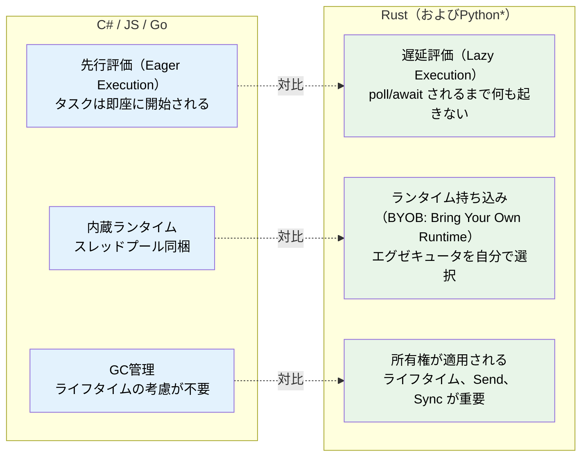
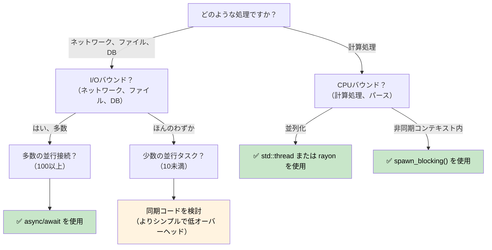

# 1. なぜRustの非同期処理は特別なのか 🟢

> **この章で学ぶこと:**
> - なぜRustには非同期ランタイムが内蔵されていないのか（そしてそれが何を意味するのか）
> - 3つの重要な特性：遅延評価、ランタイム非依存、ゼロコスト抽象化
> - 非同期処理が適しているケース（および逆に遅くなるケース）
> - RustのモデルとC#、Go、Python、JavaScriptとの比較

## 根本的な違い

`async/await` を備えたほとんどの言語では、その内部機構が隠蔽されています。C#にはCLRスレッドプールがあり、JavaScriptにはイベントループがあります。Goにはゴルーチンとスケジューラがランタイムに組み込まれており、Pythonには `asyncio` があります。

**Rustには何もありません。**

組み込みのランタイムも、スレッドプールも、イベントループも存在しません。`async` キーワードはゼロコストのコンパイル戦略に過ぎず、関数を `Future` トレイトを実装したステートマシン（状態機械）へと変換するだけです。そのステートマシンを実際に前進させるのは、別の誰か（**エグゼキュータ**）の役割です。

### Rust非同期処理の3つの重要特性



> \* PythonのコルーチンもRustのFutureと同様に遅延評価であり、awaitされるかスケジュールされるまで実行されません。ただし、PythonはGCを使用するため、所有権やライフタイムに関する配慮は不要です。

### 組み込みランタイムが存在しないこと

```rust
// これはコンパイルは通るものの、何も行いません:
async fn fetch_data() -> String {
    "hello".to_string()
}

fn main() {
    let future = fetch_data(); // Future を生成しますが、実行はされません
    // future はスタック上に置かれた単なる構造体に過ぎません
    // 出力も副作用もなく、何も起きません
    drop(future); // 暗黙のうちに破棄されます — 処理は開始すらされませんでした
}
```

C#の `Task` が先行評価（即時実行）されることと比較してみましょう：
```csharp
// C# — これは即座に実行を開始します:
async Task<string> FetchData() => "hello";

var task = FetchData(); // すでに実行中！
var result = await task; // 単に完了を待つだけ
```

### 遅延評価のFuture vs 先行評価のTask

これは、最も重要な意識の転換（メンタルシフト）です：

| | C# / JavaScript | Python | Go | Rust |
|---|---|---|---|---|
| **生成** | `Task` は即座に実行を開始 | コルーチンは**遅延評価** — オブジェクトを返すが、awaitまたはスケジュールされるまで実行されない | ゴルーチン（Goroutine）は即座に開始 | `Future` はポーリングされるまで何もしない |
| **破棄（Drop）** | デタッチされたタスクは実行を継続 | awaitされていないコルーチンはGCで回収（警告が出る） | ゴルーチンはreturnするまで実行される | Futureをドロップするとキャンセルされる |
| **ランタイム** | 言語/VMに組み込み | `asyncio` イベントループ（明示的な開始が必要） | バイナリに組み込み（M:Nスケジューラ） | 自分で選択（tokio、smolなど） |
| **スケジューリング** | 自動（スレッドプール） | イベントループ + `await` または `create_task()` | 自動（GMPスケジューラ） | 明示的（`spawn`、`block_on`） |
| **キャンセル** | `CancellationToken`（協調的） | `Task.cancel()`（協調的、`CancelledError` を送出） | `context.Context`（協調的） | Futureのドロップ（即時） |

```rust
// 実際に Future を「実行」するには、エグゼキュータが必要です:
#[tokio::main]
async fn main() {
    let result = fetch_data().await; // ここで初めて実行されます
    println!("{result}");
}
```

### 非同期処理を使うべき場面（そして使うべきでない場面）



**判断の目安（経験則）**: 非同期処理はI/Oの並行性（待機しながら多くの処理を同時に進めること）のためのものであり、CPUの並列性（1つの処理を高速化すること）のためではありません。10,000個のネットワーク接続がある場合、非同期処理は大いに威力を発揮します。一方、数値計算を行う場合は、`rayon` やOSスレッドを使用してください。

### 非同期処理の方が「遅くなる」場合

非同期処理はタダ（無料）ではありません。並行性の低いワークロードでは、同期コードの方が非同期コードよりも優れたパフォーマンスを発揮することがあります：

| コスト | 理由 |
|------|-----|
| **ステートマシンのオーバーヘッド** | 各 `.await` ごとに enum のヴァリアントが追加される。深くネストした Future は巨大で複雑なステートマシンを生成する |
| **動的ディスパッチ** | `Box<dyn Future>` は間接参照を生み出し、インライン化を阻害する |
| **コンテキストスイッチ** | 協調的スケジューリングにもコストがある — エグゼキュータはタスクキュー、Waker、I/O登録を管理しなければならない |
| **コンパイル時間** | 非同期コードはより複雑な型を生成するため、コンパイルが遅くなる |
| **デバッグの難しさ** | ステートマシンを経由するスタックトレースは読解が困難（第12章を参照） |

**ベンチマークの指針**: 同時I/O操作が10個未満の場合は、非同期化に踏み切る前にプロファイリングを実施してください。最新のLinuxであれば、接続ごとに単純に `std::thread::spawn` を呼び出すだけでも、数百スレッド程度なら問題なくスケールします。

### 演習問題: 非同期処理をいつ使うべきか？

<details>
<summary>🏋️ 演習問題（クリックして展開）</summary>

以下の各シナリオについて、非同期処理が適切かどうかを判断し、その理由を説明してください：

1. 10,000の同時WebSocket接続を処理するWebサーバー
2. 1つの大きなファイルを圧縮するCLIツール
3. 5つの異なるデータベースにクエリを投げ、結果を統合するサービス
4. 60 FPSで物理シミュレーションを実行するゲームエンジン

<details>
<summary>🔑 解答</summary>

1. **非同期（Async）** — 大規模な並行性を伴うI/Oバウンド。各接続はデータの待機に大半の時間を費やします。スレッドを使用すると10,000個ものコールスタックが必要になります。
2. **同期/スレッド（Sync/threads）** — 単一タスクのCPUバウンド。非同期処理にしてもオーバーヘッドが増加するだけで恩恵がありません。並列圧縮には `rayon` を使用します。
3. **非同期（Async）** — 5つの同時I/O待機。`tokio::join!` により、5つのクエリすべてを同時に実行できます。
4. **同期/スレッド（Sync/threads）** — レイテンシに極めて敏感なCPUバウンド。非同期処理の協調的スケジューリングはフレームのジッター（カクつき）を引き起こす可能性があります。

</details>
</details>

> **重要ポイント — なぜRustの非同期処理は特別なのか**
> - RustのFutureは**遅延評価** — エグゼキュータによってポーリングされるまで何もしない
> - **組み込みランタイムが存在しない** — 自身でランタイムを選択（または構築）する
> - 非同期処理はステートマシンを生成する**ゼロコストのコンパイル戦略**である
> - 非同期処理は**I/Oバウンドな並行処理**で真価を発揮する。CPUバウンドな処理にはスレッドやrayonを使用する

> **関連章:** これらすべてを可能にするトレイトについては [第2章 — Future トレイト](ch02-the-future-trait.md) を、ランタイムの選定については [第7章 — エグゼキュータとランタイム](ch07-executors-and-runtimes.md) を参照してください。

***
