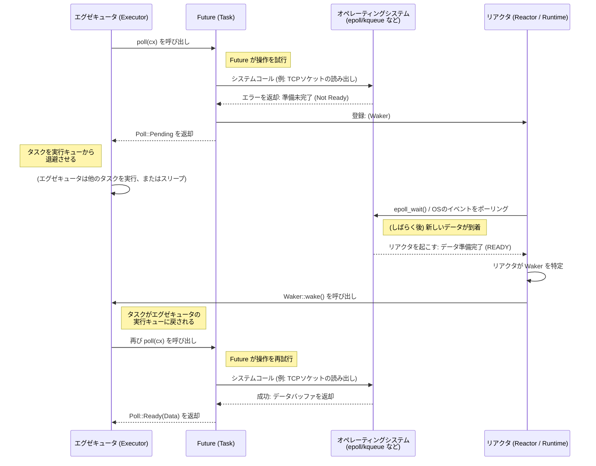

# 2. Future トレイト 🟡

> **この章で学ぶこと:**
> - `Future` トレイトの構造: `Output`、`poll()`、`Context`、`Waker`
> - Waker がエグゼキュータに「もう一度 poll して」と伝える仕組み
> - 契約事項: `wake()` を呼び忘れるとプログラムは無言でハングする
> - 実用的な Future（`Delay`）の手動実装

## Future の解剖

非同期Rustにおけるすべてのものは、最終的にこのトレイトを実装しています：

```rust
pub trait Future {
    type Output;

    fn poll(self: Pin<&mut Self>, cx: &mut Context<'_>) -> Poll<Self::Output>;
}

pub enum Poll<T> {
    Ready(T),   // Future は値 T を伴って完了した
    Pending,    // Future はまだ準備ができていない — 後でまた呼び出してほしい
}
```

これだけです。`Future` とは、**ポーリング（poll）** — 「もう終わった？」と尋ねること — が可能で、「はい、これが結果です（Ready）」または「まだです、準備ができたら起こします（Pending）」のどちらかを返すあらゆる型を指します。

### Output、poll()、Context、Waker



各構成要素を詳しく見ていきましょう：

```rust
use std::future::Future;
use std::pin::Pin;
use std::task::{Context, Poll};

// 即座に 42 を返す Future
struct Ready42;

impl Future for Ready42 {
    type Output = i32; // Future が最終的に生成する値の型

    fn poll(self: Pin<&mut Self>, _cx: &mut Context<'_>) -> Poll<i32> {
        Poll::Ready(42) // 常に準備完了 — 待機なし
    }
}
```

**構成要素**:
- **`Output`** — Futureが完了したときに生成される値の型
- **`poll()`** — エグゼキュータが進捗を確認するために呼び出すメソッド。`Ready(value)` または `Pending` を返す
- **`Pin<&mut Self>`** — Futureがメモリ上で移動されないことを保証する（なぜこれが必要かは第4章で解説）
- **`Context`** — `Waker` を保持しており、Futureが進捗可能な状態になったときにエグゼキュータへ通知できるようにする

### Waker の契約

`Waker` はコールバックの仕組みです。Futureが `Pending` を返す場合、後から `waker.wake()` が確実に呼び出されるように手配しなければなりません（**義務**）。これを怠ると、エグゼキュータはそのFutureを二度とポーリングしなくなり、プログラムは永遠にハングします。

```rust
use std::task::{Context, Poll, Waker};
use std::pin::Pin;
use std::future::Future;
use std::sync::{Arc, Mutex};
use std::thread;
use std::time::Duration;

/// 指定時間経過後に完了する Future（学習用の簡易実装）
struct Delay {
    completed: Arc<Mutex<bool>>,
    waker_stored: Arc<Mutex<Option<Waker>>>,
    duration: Duration,
    started: bool,
}

impl Delay {
    fn new(duration: Duration) -> Self {
        Delay {
            completed: Arc::new(Mutex::new(false)),
            waker_stored: Arc::new(Mutex::new(None)),
            duration,
            started: false,
        }
    }
}

impl Future for Delay {
    type Output = ();

    fn poll(mut self: Pin<&mut Self>, cx: &mut Context<'_>) -> Poll<()> {
        // Waker を保存する前に、すでに完了しているか確認
        if *self.completed.lock().unwrap() {
            return Poll::Ready(());
        }

        // Waker を保存 — エグゼキュータは poll のたびに新しい Waker を渡す可能性がある
        *self.waker_stored.lock().unwrap() = Some(cx.waker().clone());

        // 初回ポーリング時にバックグラウンドタイマーを開始
        if !self.started {
            self.started = true;
            let completed = Arc::clone(&self.completed);
            let waker = Arc::clone(&self.waker_stored);
            let duration = self.duration;

            thread::spawn(move || {
                thread::sleep(duration);
                *completed.lock().unwrap() = true;

                // 重要: エグゼキュータを起こして再度 poll させる
                if let Some(w) = waker.lock().unwrap().take() {
                    w.wake(); // 「エグゼキュータさん、準備ができました。もう一度 poll してください！」
                }
            });
        }

        // Waker 保存後にもう一度完了チェック（競合状態への対処）
        if *self.completed.lock().unwrap() {
            return Poll::Ready(());
        }

        Poll::Pending // まだ完了していない
    }
}
```

> **重要な洞察**: C# では、TaskScheduler が自動的に起床（wake）を処理します。
> 一方 Rust では、`waker.wake()` を呼び出す責任は**あなた**（または利用しているI/Oライブラリ）にあります。
> これを忘れると、プログラムは何の警告もなく停止（ハング）します。

### 演習問題: CountdownFuture の実装

<details>
<summary>🏋️ 演習問題（クリックして展開）</summary>

**課題**: N から 0 までカウントダウンし、poll されるたびに現在のカウントを出力する `CountdownFuture` を実装してください。0 に達したら `Ready("Liftoff!")` で完了します。

*ヒント*: この Future は現在のカウントを保持し、poll ごとにそれを減算する必要があります。Waker の再登録を常に行うことを忘れないでください！

<details>
<summary>🔑 解答</summary>

```rust
use std::future::Future;
use std::pin::Pin;
use std::task::{Context, Poll};

struct CountdownFuture {
    count: u32,
}

impl CountdownFuture {
    fn new(start: u32) -> Self {
        CountdownFuture { count: start }
    }
}

impl Future for CountdownFuture {
    type Output = &'static str;

    fn poll(mut self: Pin<&mut Self>, cx: &mut Context<'_>) -> Poll<Self::Output> {
        if self.count == 0 {
            println!("Liftoff!");
            Poll::Ready("Liftoff!")
        } else {
            println!("{}...", self.count);
            self.count -= 1;
            cx.waker().wake_by_ref(); // 即座に再ポーリングをスケジュール
            Poll::Pending
        }
    }
}
```

**重要ポイント**: この Future はカウントごとに1回ずつポーリングされます。`Pending` を返すたびに、自身を即座に起床させて再度ポーリングされるようにしています。なお、本番コードではこのようなビジーポーリングの代わりにタイマーを使用します。

</details>
</details>

> **重要ポイント — Future トレイト**
> - `Future::poll()` は `Poll::Ready(value)` または `Poll::Pending` を返す
> - Future は `Pending` を返す前に `Waker` を登録しなければならない — エグゼキュータはこれを使っていつ再ポーリングすべきかを知る
> - `Pin<&mut Self>` は Future がメモリ上で移動しないことを保証する（自己参照ステートマシンに必須 — 第4章を参照）
> - 非同期Rustのすべて（`async fn`、`.await`、コンビネータ）は、この単一のトレイトの上に成り立っている

> **関連章:** エグゼキュータのループについては [第3章 — Poll の仕組み](ch03-how-poll-works.md) を、より複雑な実装例については [第6章 — 手動でのFuture構築](ch06-building-futures-by-hand.md) を参照してください。

***
