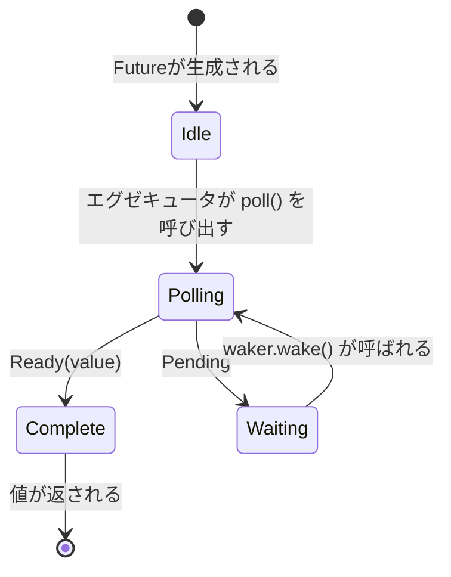

# 3. Poll の仕組み 🟡

> **この章で学ぶこと:**
> - エグゼキュータのポーリングループ: poll → pending → wake → 再度 poll
> - ゼロからの最小限のエグゼキュータの構築
> - スプリアス・ウェイク（偽の起床）のルールとその重要性
> - 便利なユーティリティ関数: `poll_fn()` と `yield_now()`

## ポーリングステートマシン

エグゼキュータは「Future を poll し、`Pending` であれば Waker が起動されるまで休止させ、その後再び poll する」というループを実行します。これは、カーネルがスケジューリングを制御する OS スレッドとは根本的に異なります。



> **重要:** *Waiting*（待機中）の状態にある間、Future は Waker を I/O ソース等に**必ず**登録していなければなりません。登録を怠れば永遠にハングします。

### 最小限のエグゼキュータ

エグゼキュータの仕組みを明らかにするために、考えられる限り最もシンプルなエグゼキュータを作ってみましょう：

```rust
use std::future::Future;
use std::pin::Pin;
use std::task::{Context, Poll, RawWaker, RawWakerVTable, Waker};

/// 最もシンプルなエグゼキュータ: Ready になるまでビジーループで poll する
fn block_on<F: Future>(mut future: F) -> F::Output {
    // Future をスタック上にピン留め（Pin）する
    // SAFETY: `future` はこの時点以降絶対にメモリ上で移動されません — 完了するまで
    // ピン留めされた参照経由でのみアクセスします。
    let mut future = unsafe { Pin::new_unchecked(&mut future) };

    // 何もしない no-op waker を作成（単にポーリングし続ける — 非効率だが構造は単純）
    fn noop_raw_waker() -> RawWaker {
        fn no_op(_: *const ()) {}
        fn clone(_: *const ()) -> RawWaker { noop_raw_waker() }
        let vtable = &RawWakerVTable::new(clone, no_op, no_op, no_op);
        RawWaker::new(std::ptr::null(), vtable)
    }

    // SAFETY: noop_raw_waker() は正しい vtable を持つ有効な RawWaker を返します。
    let waker = unsafe { Waker::from_raw(noop_raw_waker()) };
    let mut cx = Context::from_waker(&waker);

    // Future が完了するまでビジーループ
    loop {
        match future.as_mut().poll(&mut cx) {
            Poll::Ready(value) => return value,
            Poll::Pending => {
                // 本物のエグゼキュータならここでスレッドを休止（パーク）させ、
                // waker.wake() を待ちます — ここでは単にスピン（ビジーウェイト）します
                std::thread::yield_now();
            }
        }
    }
}

// 使用例:
fn main() {
    let result = block_on(async {
        println!("Hello from our mini executor!");
        42
    });
    println!("Got: {result}");
}
```

> **本番環境では絶対に使わないでください！** CPUリソースを浪費するビジーループです。本物のエグゼキュータ（tokio や smol など）は、`epoll`、`kqueue`、`io_uring` を使って I/O の準備ができるまでスレッドをスリープさせます。
> しかし、このコードは核心となる概念を示しています。エグゼキュータとは本質的に、`poll()` を呼び出すループに過ぎないのです。

### 起床（Wake-Up）通知

実用的なエグゼキュータはイベント駆動型です。すべての Future が `Pending` のとき、エグゼキュータはスリープします。Waker は割り込み機構として機能します：

```rust
// 本物のエグゼキュータのメインループの概念モデル:
fn executor_loop(tasks: &mut TaskQueue) {
    loop {
        // 1. 起床（wake）されたすべてのタスクをポーリングする
        while let Some(task) = tasks.get_woken_task() {
            match task.poll() {
                Poll::Ready(result) => task.complete(result),
                Poll::Pending => { /* タスクはキューに留まり、wake を待つ */ }
            }
        }

        // 2. 何かが起床させるまでスリープする (epoll_wait、kevent など)
        //    ここで mio/polling が重要な役割を果たします
        tasks.wait_for_events(); // I/Oイベントが発生するか waker が呼ばれるまでブロック
    }
}
```

### スプリアス・ウェイク（偽の起床）

Future は、I/O の準備が実際には整っていない場合でもポーリングされることがあります。これは**スプリアス・ウェイク（spurious wake / 偽の起床）**と呼ばれます。Future はこれを正しく処理できるように実装しなければなりません：

```rust
impl Future for MyFuture {
    type Output = Data;

    fn poll(self: Pin<&mut Self>, cx: &mut Context<'_>) -> Poll<Data> {
        // ✅ 正しい: 常に実際の条件を再確認する
        if let Some(data) = self.try_read_data() {
            Poll::Ready(data)
        } else {
            // Waker を再登録する（前回の poll から変更されている可能性がある！）
            self.register_waker(cx.waker());
            Poll::Pending
        }

        // ❌ 誤り: poll されたということはデータ準備完了だと決めつける
        // let data = self.read_data(); // ブロックするかパニックする可能性がある
        // Poll::Ready(data)
    }
}
```

**`poll()` 実装におけるルール**:
1. **絶対にブロックしない** — 準備ができていなければ即座に `Pending` を返す
2. **常に Waker を再登録する** — ポーリングとポーリングの間に Waker が変わっている可能性がある
3. **スプリアス・ウェイクを処理する** — 起床されたからといって準備完了と決めつけず、実際の条件を確認する
4. **`Ready` の後に poll しない** — 完了後の挙動は**未規定（unspecified）**（パニック、`Pending` の返却、あるいは `Ready` の繰り返しが発生し得る）。安全な完了後ポーリングを保証するのは `FusedFuture` のみ

<details>
<summary><strong>🏋️ 演習問題: スプリアス・ウェイクに安全な FlagFuture</strong>（クリックして展開）</summary>

**課題**: 共有された `Arc<AtomicBool>` フラグをラップする `FlagFuture` を実装してください。ポーリング時、フラグが `true` かどうかを確認します。もしそうなら `Ready(())` で完了します。そうでなければ、Waker を保存して `Pending` を返します。ここでのポイントは、Future が**スプリアス・ウェイク**を正しく処理しなければならない点です — 起床されたからといってフラグがセットされたと思い込まず、poll ごとに必ずフラグを再確認してください。

*ヒント*: 外部のスレッドがフラグをセットして Future を起床できるように、`Arc<Mutex<Option<Waker>>>`（または類似の構造）が必要になります。より簡潔な別解として `poll_fn` を使うこともできます。

<details>
<summary>🔑 解答</summary>

```rust
use std::future::Future;
use std::pin::Pin;
use std::sync::{Arc, Mutex};
use std::sync::atomic::{AtomicBool, Ordering};
use std::task::{Context, Poll, Waker};

struct FlagFuture {
    flag: Arc<AtomicBool>,
    waker_slot: Arc<Mutex<Option<Waker>>>,
}

impl FlagFuture {
    fn new(flag: Arc<AtomicBool>, waker_slot: Arc<Mutex<Option<Waker>>>) -> Self {
        FlagFuture { flag, waker_slot }
    }
}

impl Future for FlagFuture {
    type Output = ();

    fn poll(self: Pin<&mut Self>, cx: &mut Context<'_>) -> Poll<Self::Output> {
        // 常に実際の条件を再確認する — wake の通知だけを鵜呑みにしてはいけない
        if self.flag.load(Ordering::Acquire) {
            return Poll::Ready(());
        }

        // 通知を受け取れるように Waker を保存/更新する
        let mut slot = self.waker_slot.lock().unwrap();
        *slot = Some(cx.waker().clone());

        // Waker 保存後に再度チェックして競合を防ぐ:
        // 最初のチェックと Waker 保存の間に
        // フラグが true にセットされた可能性がある
        if self.flag.load(Ordering::Acquire) {
            Poll::Ready(())
        } else {
            Poll::Pending
        }
    }
}

// フラグをセットする側（例: 別のスレッドやタスク）:
fn set_flag(flag: &AtomicBool, waker_slot: &Mutex<Option<Waker>>) {
    flag.store(true, Ordering::Release);
    if let Some(waker) = waker_slot.lock().unwrap().take() {
        waker.wake();
    }
}

// poll_fn を使った等価な実装:
// async fn wait_for_flag(flag: Arc<AtomicBool>, waker_slot: Arc<Mutex<Option<Waker>>>) {
//     std::future::poll_fn(|cx| {
//         if flag.load(Ordering::Acquire) {
//             return Poll::Ready(());
//         }
//         *waker_slot.lock().unwrap() = Some(cx.waker().clone());
//         if flag.load(Ordering::Acquire) { Poll::Ready(()) } else { Poll::Pending }
//     }).await
// }
```

**重要ポイント**: ダブルチェックパターン（確認 → Waker 保存 → 再確認）は、条件の変更と Waker の登録の間における競合状態（レースコンディション）を避けるために不可欠です。これはすべての I/O 関連 Future が内部で利用している実践的なパターンであり、なぜスプリアス・ウェイクの処理が重要であるかを示しています。

</details>
</details>

### 便利なユーティリティ: `poll_fn` と `yield_now`

完全な `Future` 実装を書く手間を省くための、標準ライブラリと tokio の2つのユーティリティ：

```rust
use std::future::poll_fn;
use std::task::Poll;

// poll_fn: クロージャから使い捨ての Future を生成
let value = poll_fn(|cx| {
    // cx.waker() を使って何らかの処理を行い、Ready または Pending を返す
    Poll::Ready(42)
}).await;

// 実践的な利用法: コールバックベースのAPIを非同期にブリッジする
async fn read_when_ready(source: &MySource) -> Data {
    poll_fn(|cx| source.poll_read(cx)).await
}
```

```rust
// yield_now: エグゼキュータに自発的に制御を譲る
// 他のタスクが飢餓状態（starvation）に陥らないよう、CPU負荷の高い非同期ループ内で有用
async fn cpu_heavy_work(items: &[Item]) {
    for (i, item) in items.iter().enumerate() {
        process(item); // CPU負荷の高い処理

        // 100アイテムごとに処理を譲り、他のタスクを実行させる
        if i % 100 == 0 {
            tokio::task::yield_now().await;
        }
    }
}
```

> **`yield_now()` を使うべき場面**: 非同期関数が `.await` ポイントなしにループ内で CPU 処理を実行し続けると、エグゼキュータのスレッドを占有してしまいます。定期的に `yield_now().await` を挟むことで、協調的マルチタスクを実現できます。

> **重要ポイント — Poll の仕組み**
> - エグゼキュータは、起床された Future に対して繰り返し `poll()` を呼び出す
> - Future は**スプリアス・ウェイク**を処理しなければならない — 常に実際の条件を再確認する
> - `poll_fn()` を使うと、クロージャから ad-hoc な Future を作成できる
> - `yield_now()` は CPU 負荷の高い非同期コードのための協調的スケジューリングの脱出口である

> **関連章:** トレイトの定義については [第2章 — Future トレイト](ch02-the-future-trait.md) を、コンパイラが何を生成するかについては [第5章 — ステートマシンの全貌](ch05-the-state-machine-reveal.md) を参照してください。

***
