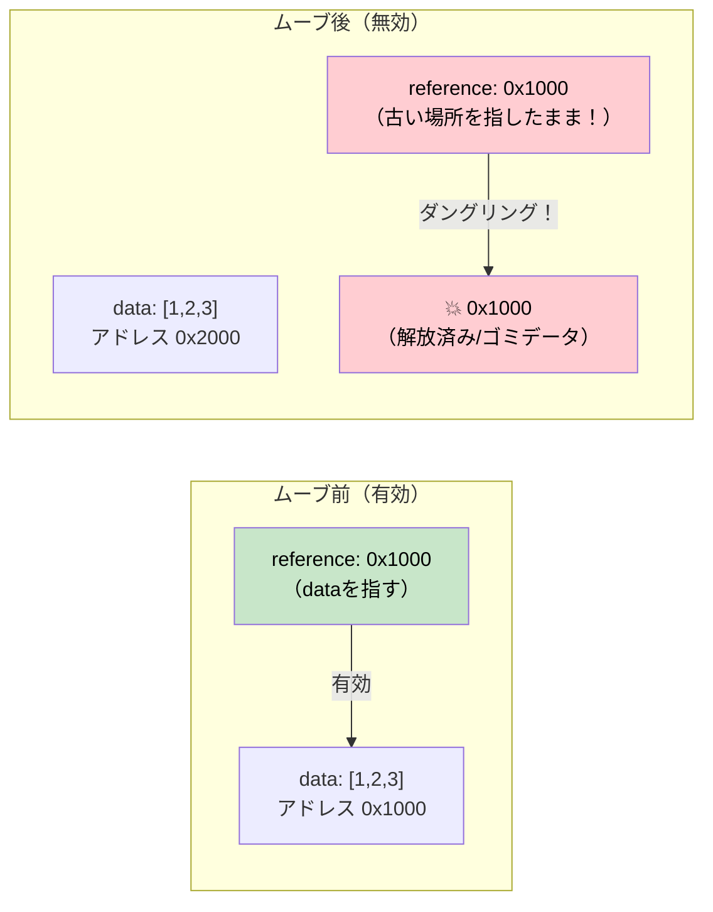

# 4. Pin と Unpin 🔴

> **この章で学ぶこと:**
> - 自己参照構造体がメモリ上でムーブされたときになぜ壊れるのか
> - `Pin<P>` が何を保証し、どのようにムーブを防ぐのか
> - 実践的な3つのピニングパターン: `Box::pin()`, `tokio::pin!()`, `Pin::new()`
> - `Unpin` がどのような場合に抜け道（脱出口）を提供するのか

## なぜ Pin が存在するのか

これは非同期Rust（async Rust）において最も混乱しやすい概念です。直感を一歩ずつ組み立てていきましょう。

### 問題点: 自己参照構造体

コンパイラが `async fn` を状態機械（ステートマシン）に変換するとき、その状態機械は自身のフィールドへの参照を含むことがあります。これにより *自己参照構造体*（self-referential struct）が生成されます。そして、それをメモリ上でムーブすると、それらの内部参照が無効化されてしまいます。

```rust
// 以下のコードに対してコンパイラが生成するもの（簡略化版）:
// async fn example() {
//     let data = vec![1, 2, 3];
//     let reference = &data;       // 上の data を指す
//     use_ref(reference).await;
// }

// おおよそ次のようになります:
enum ExampleStateMachine {
    State0 {
        data: Vec<i32>,
        // reference: &Vec<i32>,  // 問題: 上の `data` を指している
        //                        // もしこの構造体がムーブされると、ポインタはダングリングになる！
    },
    State1 {
        data: Vec<i32>,
        reference: *const Vec<i32>, // data フィールドへの内部ポインタ
    },
    Complete,
}
```



### 自己参照構造体の具体例

これは単なる学術的な懸念ではありません。`.await` ポイントをまたいで参照を保持するすべての `async fn` は、自己参照的な状態機械を作成します：

```rust
async fn problematic() {
    let data = String::from("hello");
    let slice = &data[..]; // slice は data を借用する
    
    some_io().await; // <-- .await ポイント: 状態機械は data と slice の両方を保持する
    
    println!("{slice}"); // await の後に参照を使用する
}
// 生成された状態機械は `data: String` と `slice: &str` を持ち、
// ここで slice は data の内部を指します。状態機械をムーブすること = ダングリングポインタの発生です。
```

### 実践における Pin

`Pin<P>` は、ポインタの背後にある値がムーブされるのを防ぐラッパーです：

```rust
use std::pin::Pin;

let mut data = String::from("hello");

// ピン留め（Pin）する — これでムーブできなくなる
let pinned: Pin<&mut String> = Pin::new(&mut data);

// 引き続き使用可能:
println!("{}", pinned.as_ref().get_ref()); // "hello"

// しかし、&mut String を取り出すことはできない（取り出せると mem::swap が可能になってしまうため）:
// let mutable: &mut String = Pin::into_inner(pinned); // String: Unpin の場合のみ可能
// String は Unpin なので、実際には String に対しては機能します。
// しかし、自己参照状態機械（!Unpin）の場合はブロックされます。
```

実際のコードでは、Pin を目にするのは主に次の3箇所です：

```rust
// 1. poll() のシグネチャ — すべての Future は Pin 経由でポーリングされる
fn poll(self: Pin<&mut Self>, cx: &mut Context<'_>) -> Poll<Output>;

// 2. Box::pin() — ヒープ上に割り当てて Future をピン留めする
let future: Pin<Box<dyn Future<Output = i32>>> = Box::pin(async { 42 });

// 3. tokio::pin!() — スタック上で Future をピン留めする
tokio::pin!(my_future);
// これで my_future は Pin<&mut impl Future> になる
```

### Unpin という脱出口

Rust のほとんどの型は `Unpin` です。これらは自己参照を含まないため、ピン留めしても何ら特別な制約はありません（実質的に no-op となります）。コンパイラが生成する状態機械（`async fn` から生成されるもの）のみが `!Unpin` になります。

```rust
// これらはすべて Unpin — ピン留めしても特別なことは起きない:
// i32, String, Vec<T>, HashMap<K,V>, Box<T>, &T, &mut T

// これらは !Unpin — ポーリングする前に必ずピン留めしなければならない:
// `async fn` や `async {}` によって生成された状態機械

// 実践的な意味:
// 手動で Future を実装し、自己参照を持たない場合は、
// 扱いやすくするために Unpin を実装する:
impl Unpin for MySimpleFuture {} // 「ムーブしても安全です、信じてください」
```

### クイックリファレンス

| 対象・目的 | 使用場面 | 方法 |
|------|------|-----|
| ヒープ上で Future をピン留め | コレクションへの保存、関数からの返却 | `Box::pin(future)` |
| スタック上で Future をピン留め | `select!` 内でのローカル利用や手動ポーリング | `std::pin::pin!(future)` または `tokio::pin!(future)` |
| 関数シグネチャでの Pin | ピン留めされた Future を受け取る | `future: Pin<&mut F>` |
| Unpin の要求 | 作成後に Future をムーブする必要がある場合 | `F: Future + Unpin` |

<details>
<summary><strong>🏋️ 演習: Pin とムーブ</strong> (クリックして展開)</summary>

**課題**: 以下のコードスニペットのうち、コンパイルが通るものはどれでしょうか？ コンパイルエラーになるものについては理由を説明し、修正してください。

```rust
// スニペット A
let fut = async { 42 };
let pinned = Box::pin(fut);
let moved = pinned; // Box をムーブ
let result = moved.await;

// スニペット B
let fut = async { 42 };
tokio::pin!(fut);
let moved = fut; // ピン留めされた Future をムーブ
let result = moved.await;

// スニペット C
use std::pin::Pin;
let mut fut = async { 42 };
let pinned = Pin::new(&mut fut);
```

<details>
<summary>🔑 解答</summary>

**スニペット A**: ✅ **コンパイル可能。** `Box::pin()` は Future をヒープに配置します。`Box` をムーブすると *ポインタ* はムーブされますが、Future 自体はムーブされません。Future はヒープ上の位置にピン留めされたままです。

**スニペット B**: ✅ **コンパイル可能。** `tokio::pin!` は Future をスタックにピン留めし、`fut` を `Pin<&mut ...>` として再束縛します。`let moved = fut` は背後にある Future ではなく、**`Pin` ラッパー**（ポインタ）をムーブします。Future 自体はスタックにピン留めされたままです。これは `Box::pin` と同様で、`Box` をムーブしてもヒープ割り当て自体はムーブされません。ただし、`fut` はムーブによって消費されるため、その後 `fut` を使用することはできず、`moved` のみ使用できます：
```rust
let fut = async { 42 };
tokio::pin!(fut);
let moved = fut;        // Pin<&mut> ラッパーをムーブ — OK
// fut.await;           // ❌ エラー: fut はムーブ済み
let result = moved.await; // ✅ 代わりに moved を使用
```

**スニペット C**: ❌ **コンパイルエラー。** `Pin::new()` は `T: Unpin` を要求します。async ブロックは `!Unpin` な型を生成します。**修正方法**: `Box::pin()` または `unsafe Pin::new_unchecked()` を使用します：
```rust
let fut = async { 42 };
let pinned = Box::pin(fut); // ヒープにピン留め — !Unpin でも動作する
```

**重要なポイント**: `Box::pin()` は `!Unpin` な Future をピン留めするための安全で簡単な方法です。`tokio::pin!()` はスタック上でピン留めします — `Pin<&mut>` ラッパー（ただのポインタ）はムーブできますが、背後にある Future はその場に留まります。`Pin::new()` は `Unpin` な型でのみ動作します。

</details>
</details>

> **要点まとめ — Pin と Unpin**
> - `Pin<P>` は、**ポインタが指す対象がムーブされるのを防ぐ**ラッパーであり、自己参照状態機械にとって不可欠です
> - `Box::pin()` は、ヒープ上で Future をピン留めするための安全で使いやすいデフォルトの方法です
> - `tokio::pin!()` はスタック上でピン留めします — `Pin<&mut>` ラッパーはムーブできますが、背後にある Future はその場に留まります
> - `Unpin` はオプトアウト用の自動トレイト（auto-trait）です。`Unpin` を実装する型は、ピン留めされている場合でもムーブできます（ほとんどの型は `Unpin` ですが、async ブロックはそうではありません）

> **参照:** poll における `Pin<&mut Self>` については [第2章 — Futureトレイト](ch02-the-future-trait.md)、async 状態機械がなぜ自己参照になるのかについては [第5章 — 状態機械の正体](ch05-the-state-machine-reveal.md) を参照してください。

***
