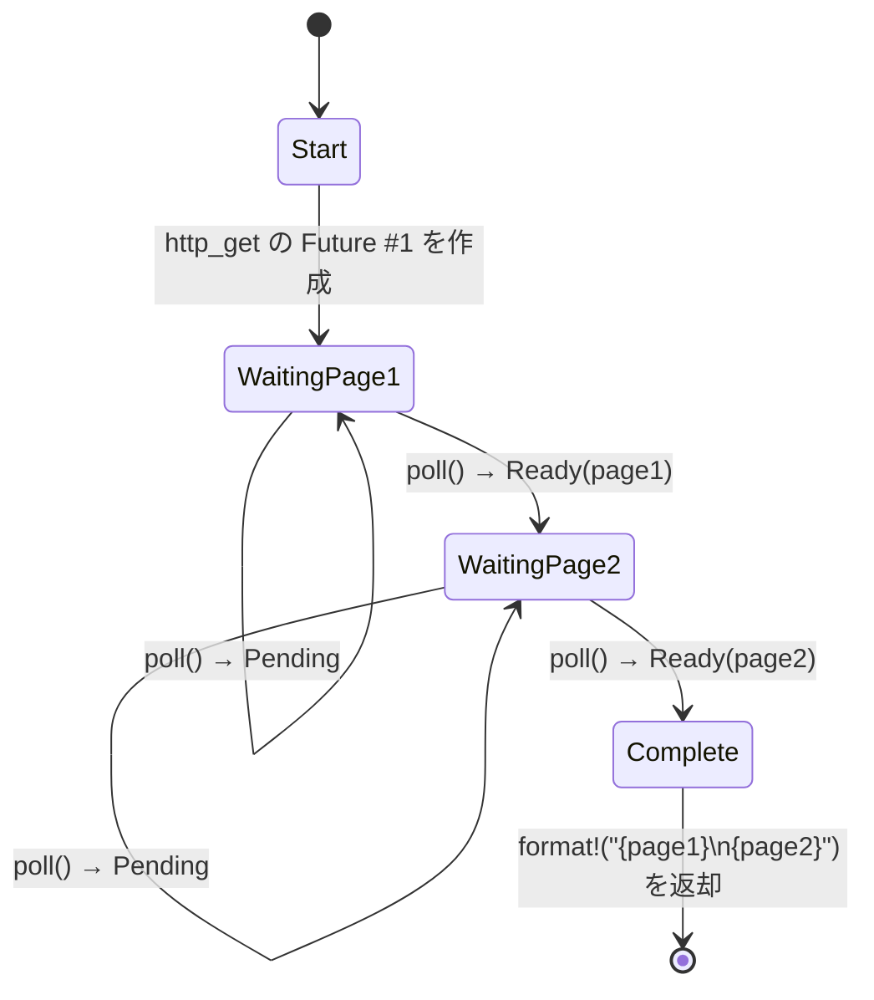

# 5. 状態機械（ステートマシン）の正体 🟢

> **この章で学ぶこと:**
> - コンパイラがどのように `async fn` を enum ベースの状態機械に変換するか
> - ソースコードと生成された状態の対比（Side-by-side）
> - `async fn` 内での大きなスタック割り当てが Future のサイズを肥大化させる理由
> - ドロップ最適化: 不要になった値は即座にドロップされる

## コンパイラが実際に生成するもの

`async fn` を書くと、コンパイラは一見逐次的に見えるコードを、enum ベースの状態機械（ステートマシン）に変換します。この変換を理解することは、非同期 Rust のパフォーマンス特性や多くの癖を理解するための鍵となります。

### 対比: async fn vs 状態機械

```rust
// 私たちが書くコード:
async fn fetch_two_pages() -> String {
    let page1 = http_get("https://example.com/a").await;
    let page2 = http_get("https://example.com/b").await;
    format!("{page1}\n{page2}")
}
```

コンパイラは概念的に以下のようなコードを生成します：

```rust
enum FetchTwoPagesStateMachine {
    // 状態 0: page1 のための http_get を呼び出す直前
    Start,

    // 状態 1: page1 を待機中、Future を保持
    WaitingPage1 {
        fut1: HttpGetFuture,
    },

    // 状態 2: page1 を取得済み、page2 を待機中
    WaitingPage2 {
        page1: String,
        fut2: HttpGetFuture,
    },

    // 終了状態
    Complete,
}

impl Future for FetchTwoPagesStateMachine {
    type Output = String;

    fn poll(mut self: Pin<&mut Self>, cx: &mut Context<'_>) -> Poll<String> {
        loop {
            match self.as_mut().get_mut() {
                Self::Start => {
                    let fut1 = http_get("https://example.com/a");
                    *self.as_mut().get_mut() = Self::WaitingPage1 { fut1 };
                }
                Self::WaitingPage1 { fut1 } => {
                    let page1 = match Pin::new(fut1).poll(cx) {
                        Poll::Ready(v) => v,
                        Poll::Pending => return Poll::Pending,
                    };
                    let fut2 = http_get("https://example.com/b");
                    *self.as_mut().get_mut() = Self::WaitingPage2 { page1, fut2 };
                }
                Self::WaitingPage2 { page1, fut2 } => {
                    let page2 = match Pin::new(fut2).poll(cx) {
                        Poll::Ready(v) => v,
                        Poll::Pending => return Poll::Pending,
                    };
                    let result = format!("{page1}\n{page2}");
                    *self.as_mut().get_mut() = Self::Complete;
                    return Poll::Ready(result);
                }
                Self::Complete => panic!("完了後にポーリングされました"),
            }
        }
    }
}
```

> **注意**: この糖衣構文の解除（脱糖、desugaring）は *概念的なもの* です。実際のコンパイラの出力では `unsafe` な Pin 射影（pin projection）が使用されます。ここで示されている `get_mut()` の呼び出しには `Unpin` が必要ですが、async 状態機械は `!Unpin` です。ここでの目的は、コンパイル可能なコードを提示することではなく、状態遷移を説明することです。



> **状態が保持する内容:**
> - **WaitingPage1** — `fut1: HttpGetFuture` を保持（page2 はまだ割り当てられていない）
> - **WaitingPage2** — `page1: String`, `fut2: HttpGetFuture` を保持（fut1 はドロップ済み）

### パフォーマンスにおいてこれが重要である理由

**ゼロコスト**: 状態機械はスタック上に割り当てられる enum です。明示的に `Box::pin()` を使用しない限り、Future ごとのヒープ割り当てやガベージコレクタ、ボクシングは一切発生しません。

**サイズ**: enum のサイズは、そのすべてのヴァリアントの最大サイズになります。各 `.await` ポイントが新しいヴァリアントを作成します。これは以下のことを意味します：

```rust
async fn small() {
    let a: u8 = 0;
    yield_now().await;
    let b: u8 = 0;
    yield_now().await;
}
// サイズ ≈ max(size_of(u8), size_of(u8)) + 判別子（discriminant） + 内部 Future のサイズ
//      ≈ 小さい！

async fn big() {
    let buf: [u8; 1_000_000] = [0; 1_000_000]; // スタック上に 1MB！
    some_io().await;
    process(&buf);
}
// サイズ ≈ 1MB + 内部 Future のサイズ
// ⚠️ async 関数内で巨大なバッファをスタック割り当てしてはいけません！
// 代わりに Vec<u8> や Box<[u8]> を使用してください。
```

**ドロップ最適化**: 状態機械が遷移するとき、不要になった値はドロップされます。上の例では、`WaitingPage1` から `WaitingPage2` に遷移する際に `fut1` がドロップされます — コンパイラがこのドロップ処理を自動的に挿入します。

> **実践的なルール**: `async fn` 内での大きなスタック割り当ては、Future のサイズを急激に肥大化させます。非同期コードでスタックオーバーフローが発生した場合は、大きな配列や深くネストした Future がないか確認してください。必要に応じて、`Box::pin()` を使用してサブ Future をヒープに割り当ててください。

### 演習: 状態機械を予測する

<details>
<summary>🏋️ 演習 (クリックして展開)</summary>

**課題**: 次の async 関数が与えられたとき、コンパイラが生成する状態機械をスケッチしてください。状態（enum ヴァリアント）はいくつありますか？ それぞれにどのような値が格納されますか？

```rust
async fn pipeline(url: &str) -> Result<usize, Error> {
    let response = fetch(url).await?;
    let body = response.text().await?;
    let parsed = parse(body).await?;
    Ok(parsed.len())
}
```

<details>
<summary>🔑 解答</summary>

5つの状態:

1. **Start** — `url` を保持
2. **WaitingFetch** — `url`, `fetch` の Future を保持
3. **WaitingText** — `response`, `text()` の Future を保持
4. **WaitingParse** — `body`, `parse` の Future を保持
5. **Done** — `Ok(parsed.len())` を返却

各 `.await` が中断ポイント（yield point）= 新しい enum ヴァリアントを作成します。`?` は早期リターン用のパスを追加しますが、余分な状態は追加しません — 単に `Poll::Ready` の値に対する `match` を行うだけです。

</details>
</details>

> **要点まとめ — 状態機械の正体**
> - `async fn` は、`.await` ポイントごとに1つのヴァリアントを持つ enum にコンパイルされる
> - Future の**サイズ** = すべてのヴァリアントサイズの最大値 — 大きなスタック値はサイズを肥大化させる
> - コンパイラは状態遷移時に**ドロップ**処理を自動的に挿入する
> - Future のサイズが問題になる場合は、`Box::pin()` やヒープ割り当てを使用する

> **参照:** 生成された enum になぜピニングが必要なのかについては [第4章 — Pin と Unpin](ch04-pin-and-unpin.md)、これらの状態機械をご自身で手動構築する方法については [第6章 — 手作業での Future 構築](ch06-building-futures-by-hand.md) を参照してください。

***
