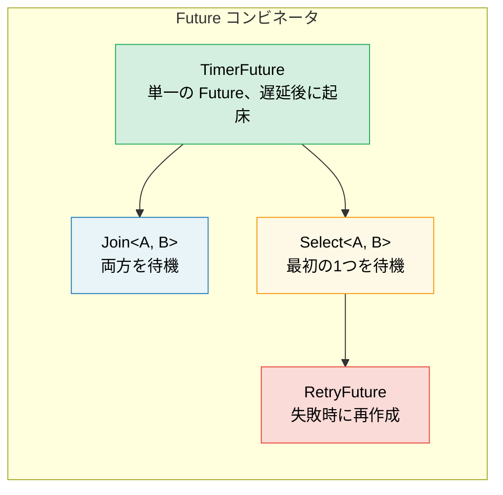

# 6. 手作業での Future 構築 🟡

> **この章で学ぶこと:**
> - スレッドベースの起床（waking）を用いた `TimerFuture` の実装
> - `Join` コンビネータの構築: 2つの Future を並行して実行
> - `Select` コンビネータの構築: 2つの Future を競合（race）させる
> - コンビネータの合成方法 — すべてが Future で構成される仕組み

## シンプルな Timer Future

それでは、実際に役立つ Future をゼロから構築してみましょう。これにより、第2章〜第5章までの理論を定着させることができます。

### TimerFuture: 完全な実装例

```rust
use std::future::Future;
use std::pin::Pin;
use std::sync::{Arc, Mutex};
use std::task::{Context, Poll, Waker};
use std::thread;
use std::time::{Duration, Instant};

pub struct TimerFuture {
    shared_state: Arc<Mutex<SharedState>>,
}

struct SharedState {
    completed: bool,
    waker: Option<Waker>,
}

impl TimerFuture {
    pub fn new(duration: Duration) -> Self {
        let shared_state = Arc::new(Mutex::new(SharedState {
            completed: false,
            waker: None,
        }));

        // 指定時間が経過した後に completed=true を設定するスレッドを生成
        let thread_shared_state = Arc::clone(&shared_state);
        thread::spawn(move || {
            thread::sleep(duration);
            let mut state = thread_shared_state.lock().unwrap();
            state.completed = true;
            if let Some(waker) = state.waker.take() {
                waker.wake(); // エグゼキュータに通知
            }
        });

        TimerFuture { shared_state }
    }
}

impl Future for TimerFuture {
    type Output = ();

    fn poll(self: Pin<&mut Self>, cx: &mut Context<'_>) -> Poll<()> {
        let mut state = self.shared_state.lock().unwrap();
        if state.completed {
            Poll::Ready(())
        } else {
            // タイマースレッドが自分を起こせるように waker を保存
            // 重要: 常に waker を更新すること — エグゼキュータは
            // ポーリングの間に waker を変更する可能性があるため
            state.waker = Some(cx.waker().clone());
            Poll::Pending
        }
    }
}

// 使用例:
// async fn example() {
//     println!("タイマーを開始します...");
//     TimerFuture::new(Duration::from_secs(2)).await;
//     println!("タイマーが完了しました！");
// }
//
// ⚠️ このコードはタイマーごとに OS スレッドを生成します — 学習目的には適していますが、
// 本番環境では共有タイマーホイールによってバックアップされ、追加のスレッドを
// 必要としない `tokio::time::sleep` を使用してください。
```

### Join: 2つの Future を並行して実行する

`Join` は2つの Future をポーリングし、*両方* が完了したときに完了します。これは `tokio::join!` が内部で行っている動作と同じです：

```rust
use std::future::Future;
use std::pin::Pin;
use std::task::{Context, Poll};

/// 2つの Future を並行にポーリングし、両方の結果をタプルとして返す
pub struct Join<A, B>
where
    A: Future,
    B: Future,
{
    a: MaybeDone<A>,
    b: MaybeDone<B>,
}

enum MaybeDone<F: Future> {
    Pending(F),
    Done(F::Output),
    Taken, // 出力はすでに取得済み
}

// MaybeDone<F> は F::Output を保持するが、F: Unpin であっても
// コンパイラはそれが Unpin であることを証明できない。ここでは Unpin な
// Future とともに Join のみを使用し、フィールドへの Pin 射影を行わないため、
// 手動で Unpin を実装することは安全であり、poll() 内で self.get_mut() を呼び出せるようになる。
impl<A: Future + Unpin, B: Future + Unpin> Unpin for Join<A, B> {}

impl<A, B> Join<A, B>
where
    A: Future,
    B: Future,
{
    pub fn new(a: A, b: B) -> Self {
        Join {
            a: MaybeDone::Pending(a),
            b: MaybeDone::Pending(b),
        }
    }
}

impl<A, B> Future for Join<A, B>
where
    A: Future + Unpin,
    B: Future + Unpin,
{
    type Output = (A::Output, B::Output);

    fn poll(self: Pin<&mut Self>, cx: &mut Context<'_>) -> Poll<Self::Output> {
        let this = self.get_mut();

        // 完了していなければ A をポーリング
        if let MaybeDone::Pending(ref mut fut) = this.a {
            if let Poll::Ready(val) = Pin::new(fut).poll(cx) {
                this.a = MaybeDone::Done(val);
            }
        }

        // 完了していなければ B をポーリング
        if let MaybeDone::Pending(ref mut fut) = this.b {
            if let Poll::Ready(val) = Pin::new(fut).poll(cx) {
                this.b = MaybeDone::Done(val);
            }
        }

        // 両方とも完了したか？
        match (&this.a, &this.b) {
            (MaybeDone::Done(_), MaybeDone::Done(_)) => {
                // 両方の出力を取り出す
                let a_val = match std::mem::replace(&mut this.a, MaybeDone::Taken) {
                    MaybeDone::Done(v) => v,
                    _ => unreachable!(),
                };
                let b_val = match std::mem::replace(&mut this.b, MaybeDone::Taken) {
                    MaybeDone::Done(v) => v,
                    _ => unreachable!(),
                };
                Poll::Ready((a_val, b_val))
            }
            _ => Poll::Pending, // 少なくとも一方がまだ Pending
        }
    }
}

// 使用例（async ブロックは !Unpin なので Box::pin でラップする）:
// let (page1, page2) = Join::new(
//     Box::pin(http_get("https://example.com/a")),
//     Box::pin(http_get("https://example.com/b")),
// ).await;
// 両方のリクエストが並行して実行される！
```

> **重要な洞察**: ここでの「並行（Concurrent）」とは、*同一スレッド上でインターリーブ（交互に実行）される* ことを意味します。
> Join はスレッドを生成しません — 同一の `poll()` 呼び出しの中で両方の Future をポーリングします。
> これは協調的並行性（cooperative concurrency）であり、並列性（parallelism）ではありません。



### Select: 2つの Future を競合させる

`Select` は、*どちらか一方* の Future が先に完了したときに完了します（もう一方はドロップされます）：

```rust
use std::future::Future;
use std::pin::Pin;
use std::task::{Context, Poll};

pub enum Either<A, B> {
    Left(A),
    Right(B),
}

/// 先に完了した方の Future の結果を返す。もう一方はドロップされる
pub struct Select<A, B> {
    a: A,
    b: B,
}

impl<A, B> Select<A, B>
where
    A: Future + Unpin,
    B: Future + Unpin,
{
    pub fn new(a: A, b: B) -> Self {
        Select { a, b }
    }
}

impl<A, B> Future for Select<A, B>
where
    A: Future + Unpin,
    B: Future + Unpin,
{
    type Output = Either<A::Output, B::Output>;

    fn poll(mut self: Pin<&mut Self>, cx: &mut Context<'_>) -> Poll<Self::Output> {
        // まず A をポーリング
        if let Poll::Ready(val) = Pin::new(&mut self.a).poll(cx) {
            return Poll::Ready(Either::Left(val));
        }

        // 次に B をポーリング
        if let Poll::Ready(val) = Pin::new(&mut self.b).poll(cx) {
            return Poll::Ready(Either::Right(val));
        }

        Poll::Pending
    }
}

// タイムアウト付きの使用例:
// match Select::new(http_get(url), TimerFuture::new(timeout)).await {
//     Either::Left(response) => println!("レスポンスを受信: {}", response),
//     Either::Right(()) => println!("リクエストがタイムアウトしました！"),
// }
```

> **公平性に関する注意**: この `Select` は常に A を先にポーリングします — もし両方が準備完了（Ready）している場合、常に A が勝ちます。Tokio の `select!` マクロは公平性を保つためにポーリング順序をランダム化します。

<details>
<summary><strong>🏋️ 演習: RetryFuture を構築する</strong> (クリックして展開)</summary>

**課題**: クロージャ `F: Fn() -> Fut` を受け取り、内部の Future が `Err` を返した際に最大 N 回リトライする `RetryFuture<F, Fut>` を構築してください。最初に得られた `Ok` の結果、または最後の `Err` を返す必要があります。

*ヒント*: 「試行実行中」と「すべての試行を使い果たした」状態が必要になります。

<details>
<summary>🔑 解答</summary>

```rust
use std::future::Future;
use std::pin::Pin;
use std::task::{Context, Poll};

pub struct RetryFuture<F, Fut, T, E>
where
    F: Fn() -> Fut,
    Fut: Future<Output = Result<T, E>>,
{
    factory: F,
    current: Option<Pin<Box<Fut>>>,
    remaining: usize,
    last_error: Option<E>,
}

impl<F, Fut, T, E> RetryFuture<F, Fut, T, E>
where
    F: Fn() -> Fut,
    Fut: Future<Output = Result<T, E>>,
{
    pub fn new(max_attempts: usize, factory: F) -> Self {
        let current = Some(Box::pin((factory)()));
        RetryFuture {
            factory,
            current,
            remaining: max_attempts.saturating_sub(1),
            last_error: None,
        }
    }
}

impl<F, Fut, T, E> Future for RetryFuture<F, Fut, T, E>
where
    F: Fn() -> Fut + Unpin,
    Fut: Future<Output = Result<T, E>>,
    E: Unpin,
{
    type Output = Result<T, E>;

    fn poll(mut self: Pin<&mut Self>, cx: &mut Context<'_>) -> Poll<Self::Output> {
        // Pin<Box<Fut>> は常に Unpin であるため、F と E が Unpin であればこの構造体も Unpin になる。
        // これにより、unsafe コードを一切使わずに get_mut() を安全に使用できる。
        loop {
            if let Some(ref mut fut) = self.current {
                match fut.as_mut().poll(cx) {
                    Poll::Ready(Ok(val)) => return Poll::Ready(Ok(val)),
                    Poll::Ready(Err(e)) => {
                        self.last_error = Some(e);
                        if self.remaining > 0 {
                            self.remaining -= 1;
                            self.current = Some(Box::pin((self.factory)()));
                            // 新しい Future を即座にポーリングするためにループする
                        } else {
                            return Poll::Ready(Err(self.last_error.take().unwrap()));
                        }
                    }
                    Poll::Pending => return Poll::Pending,
                }
            } else {
                return Poll::Ready(Err(self.last_error.take().unwrap()));
            }
        }
    }
}

// 使用例:
// let result = RetryFuture::new(3, || async {
//     http_get("https://flaky-server.com/api").await
// }).await;
```

**重要なポイント**: このリトライ Future 自体が状態機械です。現在の試行を保持し、失敗時に新しい内部 Future を作成します。内部 Future を `Pin<Box<Fut>>` でラップすることで `Fut: Unpin` の境界が不要になります — `Pin<Box<T>>` は常に `Unpin` であるため、任意の Future 型をサポートしながら、構造体自体を扱いやすい状態に保つことができます。このようにしてコンビネータは合成されます — すべてが Future の階層構造（futures all the way down）なのです。

</details>
</details>

> **要点まとめ — 手作業での Future 構築**
> - Future には3つの要素が必要: 状態（state）、`poll()` の実装、そして Waker の登録
> - `Join` は両方のサブ Future をポーリングし、`Select` は先に完了した方を返す
> - コンビネータ自体も他の Future をラップする Future である（すべては入れ子になった Future で構成される）
> - 手作業での Future 構築は深い洞察を与えてくれるが、本番環境では `tokio::join!` / `select!` を使用する

> **参照:** トレイトの定義については [第2章 — Futureトレイト](ch02-the-future-trait.md)、本番水準の実装については [第8章 — Tokio詳細](ch08-tokio-deep-dive.md) を参照してください。

***
