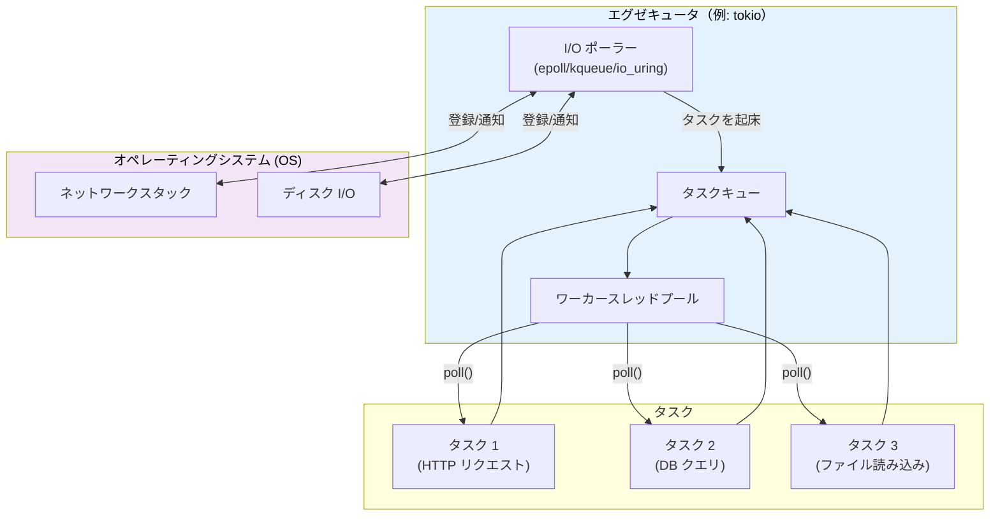
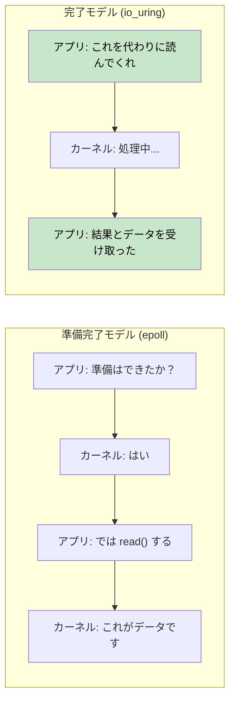
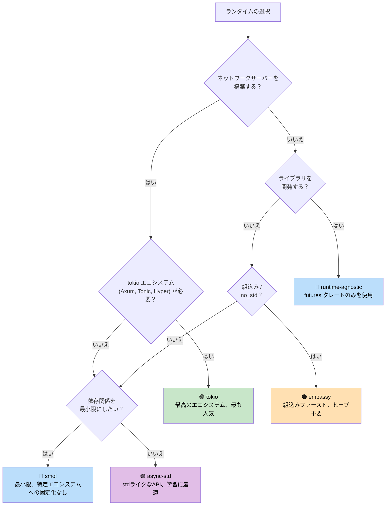

# 7. エグゼキュータとランタイム 🟡

> **この章で学ぶこと:**
> - エグゼキュータの役割: ポーリングと効率的なスリープ
> - 主要な6つのランタイム: mio, io_uring, tokio, async-std, smol, embassy
> - 適切なランタイムを選択するための決定木（ディシジョンツリー）
> - ランタイムに依存しない（runtime-agnostic）ライブラリ設計が重要な理由

## エグゼキュータの役割

エグゼキュータには2つの役割があります：
1. 進捗を生み出せる準備ができた Future を**ポーリングする**
2. 準備ができている Future がないときに（OS の I/O 通知 API を使用して）**効率的にスリープする**



### mio: 基盤レイヤー

[mio](https://github.com/tokio-rs/mio)（Metal I/O）はエグゼキュータではなく、最下層のクロスプラットフォーム I/O 通知ライブラリです。Linux の `epoll`、macOS/BSD の `kqueue`、Windows の IOCP をラップしています。

```rust
// mio の概念的な使用例（簡略化版）:
use mio::{Events, Interest, Poll, Token};
use mio::net::TcpListener;

let mut poll = Poll::new()?;
let mut events = Events::with_capacity(128);

let mut server = TcpListener::bind("0.0.0.0:8080")?;
poll.registry().register(&mut server, Token(0), Interest::READABLE)?;

// イベントループ — 何かが発生するまでブロックする
loop {
    poll.poll(&mut events, None)?; // I/O イベントが発生するまでスリープ
    for event in events.iter() {
        match event.token() {
            Token(0) => { /* サーバーに新しい接続が届いた */ }
            _ => { /* その他の I/O の準備完了 */ }
        }
    }
}
```

ほとんどの開発者が mio を直接触ることはありません — tokio や smol がその上に構築されています。

### io_uring: 完了ベースの未来

Linux の `io_uring`（カーネル 5.1+）は、mio や epoll が使用する「準備完了通知（readiness-based）」I/O モデルからの根本的な転換を表しています：

```text
準備完了通知ベース（epoll / mio / tokio）:
  1. 問い合わせ: 「このソケットは読み取り可能か？」 → epoll_wait()
  2. カーネル:   「はい、準備完了です」           → EPOLLIN イベント
  3. アプリ:     read(fd, buf)                   → まだわずかにブロックする可能性あり！

完了通知ベース（io_uring）:
  1. 発行:       「このソケットからこのバッファに読み取ってくれ」 → SQE
  2. カーネル:   非同期に読み取りを実行
  3. アプリ:     データが含まれる完了結果を受け取る              → CQE
```



**所有権の課題**: io_uring では、操作が完了するまでカーネルがバッファを所有する必要があります。これは、バッファを借用する Rust の標準的な `AsyncRead` トレイトと衝突します。そのため、`tokio-uring` では異なる I/O トレイトが採用されています：

```rust
// 標準の tokio（準備完了ベース） — バッファを借用する:
let n = stream.read(&mut buf).await?;  // buf は借用される

// tokio-uring（完了ベース） — バッファの所有権を移転する:
let (result, buf) = stream.read(buf).await;  // buf がムーブされ、完了後に返却される
let n = result?;
```

```rust
// Cargo.toml: tokio-uring = "0.5"
// 注意: Linux 専用、カーネル 5.1 以上が必要

fn main() {
    tokio_uring::start(async {
        let file = tokio_uring::fs::File::open("data.bin").await.unwrap();
        let buf = vec![0u8; 4096];
        let (result, buf) = file.read_at(buf, 0).await;
        let bytes_read = result.unwrap();
        println!("読み込んだバイト数: {}, 内容: {:?}", bytes_read, &buf[..bytes_read]);
    });
}
```

| 観点 | epoll (tokio) | io_uring (tokio-uring) |
|--------|--------------|----------------------|
| **モデル** | 準備完了通知（Readiness） | 完了通知（Completion） |
| **システムコール** | epoll_wait + read/write | バッチ処理される SQE/CQE リング |
| **バッファの所有権** | アプリが保持（&mut buf） | 所有権の移転（buf をムーブ） |
| **プラットフォーム** | Linux, macOS (kqueue), Windows (IOCP) | Linux 5.1+ のみ |
| **ゼロコピー** | 不可（ユーザースペースでのコピー） | 可能（登録済みバッファ） |
| **成熟度** | 本番稼働可能（Production-ready） | 実験的（Experimental） |

> **io_uring を使用すべき場合**: システムコールのオーバーヘッドがボトルネックとなる高スループットのファイル I/O やネットワーク（データベース、ストレージエンジン、10万以上の接続を処理するプロキシなど）。ほとんどのアプリケーションでは、epoll を使用した標準の tokio が適切な選択肢です。

### tokio: オールインワン（Batteries-Included）ランタイム

Rust エコシステムにおいて最も支配的な非同期ランタイムです。Axum、Hyper、Tonic、そしてほとんどの本番環境の Rust サーバーで使用されています。

```rust
// Cargo.toml:
// [dependencies]
// tokio = { version = "1", features = ["full"] }

#[tokio::main]
async fn main() {
    // ワークスティーリングスケジューラを備えたマルチスレッドランタイムを起動
    let handle = tokio::spawn(async {
        tokio::time::sleep(std::time::Duration::from_secs(1)).await;
        "完了"
    });

    let result = handle.await.unwrap();
    println!("{result}");
}
```

**tokio の機能**: タイマー、I/O、TCP/UDP、Unix ドメインソケット、シグナルハンドリング、同期プリミティブ（Mutex, RwLock, Semaphore, チャネル）、fs、プロセス、tracing との統合。

### async-std: 標準ライブラリの鏡像

`std` の API を非同期版としてミラーリングしています。tokio ほど人気はありませんが、初心者にとってはシンプルです。

```rust
// Cargo.toml:
// [dependencies]
// async-std = { version = "1", features = ["attributes"] }

#[async_std::main]
async fn main() {
    use async_std::fs;
    let content = fs::read_to_string("hello.txt").await.unwrap();
    println!("{content}");
}
```

### smol: ミニマリストなランタイム

小型で依存関係のない非同期ランタイムです。tokio を引き込みたくないライブラリに最適です。

```rust
// Cargo.toml:
// [dependencies]
// smol = "2"

fn main() {
    smol::block_on(async {
        let result = smol::unblock(|| {
            // ブロッキングコードをスレッドプール上で実行
            std::fs::read_to_string("hello.txt")
        }).await.unwrap();
        println!("{result}");
    });
}
```

### embassy: 組込み向け非同期ランタイム（no_std）

組込みシステム向けの非同期ランタイムです。ヒープ割り当ては不要で、`std` も必要ありません。

```rust
// マイクロコントローラ（例: STM32, nRF52, RP2040）上で動作
#[embassy_executor::main]
async fn main(spawner: embassy_executor::Spawner) {
    // async/await で LED を点滅 — RTOS は不要！
    let mut led = Output::new(p.PA5, Level::Low, Speed::Low);
    loop {
        led.set_high();
        Timer::after(Duration::from_millis(500)).await;
        led.set_low();
        Timer::after(Duration::from_millis(500)).await;
    }
}
```

### ランタイム決定木（ディシジョンツリー）



### ランタイム比較表

| 機能・特徴 | tokio | async-std | smol | embassy |
|---------|-------|-----------|------|---------|
| **エコシステム** | 圧倒的 | 小規模 | 最小限 | 組込み |
| **マルチスレッド** | ✅ ワークスティーリング | ✅ | ✅ | ❌（シングルコア） |
| **no_std** | ❌ | ❌ | ❌ | ✅ |
| **タイマー** | ✅ 組み込み | ✅ 組み込み | `async-io` 経由 | ✅ HAL ベース |
| **I/O** | ✅ 独自の抽象化 | ✅ std のミラー | `async-io` 経由 | ✅ HAL ドライバ |
| **チャネル** | ✅ 豊富な種類 | ✅ | `async-channel` 経由 | ✅ |
| **学習曲線** | 中程度 | 緩やか | 緩やか | 急峻（ハードウェア知識） |
| **バイナリサイズ** | 大きい | 中程度 | 小さい | 極小 |

<details>
<summary><strong>🏋️ 演習: ランタイムの比較</strong> (クリックして展開)</summary>

**課題**: 3つの異なるランタイム（tokio、smol、async-std）を使用して同じプログラムを記述してください。プログラムの要件：
1. URL を取得する（スリープでシミュレート）
2. ファイルを読み込む（スリープでシミュレート）
3. 両方の結果を出力する

この演習を通じて、async/await のコード自体は同一であり、ランタイムのセットアップのみが異なることを確認します。

<details>
<summary>🔑 解答</summary>

```rust
// ----- tokio 版 -----
// Cargo.toml: tokio = { version = "1", features = ["full"] }
#[tokio::main]
async fn main() {
    let (url_result, file_result) = tokio::join!(
        async {
            tokio::time::sleep(std::time::Duration::from_millis(100)).await;
            "URL からのレスポンス"
        },
        async {
            tokio::time::sleep(std::time::Duration::from_millis(50)).await;
            "ファイルの内容"
        },
    );
    println!("URL: {url_result}, File: {file_result}");
}

// ----- smol 版 -----
// Cargo.toml: smol = "2", futures-lite = "2"
fn main() {
    smol::block_on(async {
        let (url_result, file_result) = futures_lite::future::zip(
            async {
                smol::Timer::after(std::time::Duration::from_millis(100)).await;
                "URL からのレスポンス"
            },
            async {
                smol::Timer::after(std::time::Duration::from_millis(50)).await;
                "ファイルの内容"
            },
        ).await;
        println!("URL: {url_result}, File: {file_result}");
    });
}

// ----- async-std 版 -----
// Cargo.toml: async-std = { version = "1", features = ["attributes"] }
#[async_std::main]
async fn main() {
    let (url_result, file_result) = futures::future::join(
        async {
            async_std::task::sleep(std::time::Duration::from_millis(100)).await;
            "URL からのレスポンス"
        },
        async {
            async_std::task::sleep(std::time::Duration::from_millis(50)).await;
            "ファイルの内容"
        },
    ).await;
    println!("URL: {url_result}, File: {file_result}");
}
```

**重要なポイント**: 非同期のビジネスロジックはランタイム間で完全に同一です。異なるのはエントリーポイントとタイマー / I/O の API のみです。だからこそ、（`std::future::Future` のみを使用した）ランタイム非依存のライブラリを書くことには大きな価値があります。

</details>
</details>

> **要点まとめ — エグゼキュータとランタイム**
> - エグゼキュータの役割: 起床された Future をポーリングし、OS の I/O API を利用して効率的にスリープすること
> - サーバーには **tokio** が標準的、フットプリントを最小化したい場合は **smol**、組込みには **embassy**
> - ビジネスロジックは特定のランタイムではなく `std::future::Future` に依存させるべきである
> - io_uring（Linux 5.1+）は高パフォーマンス I/O の未来であるが、エコシステムはまだ成熟途上にある

> **参照:** tokio 固有の詳細については [第8章 — Tokio詳細](ch08-tokio-deep-dive.md)、他の選択肢については [第9章 — Tokioが適さない場合](ch09-when-tokio-isnt-the-right-fit.md) を参照してください。

***
