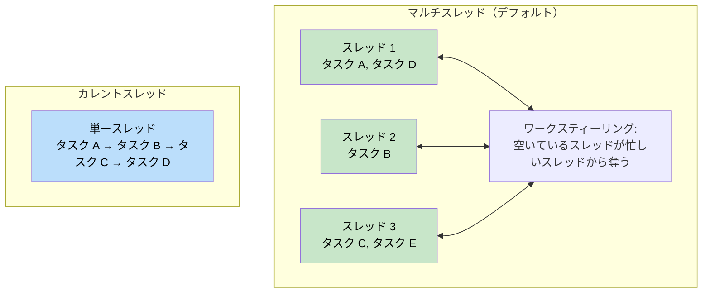
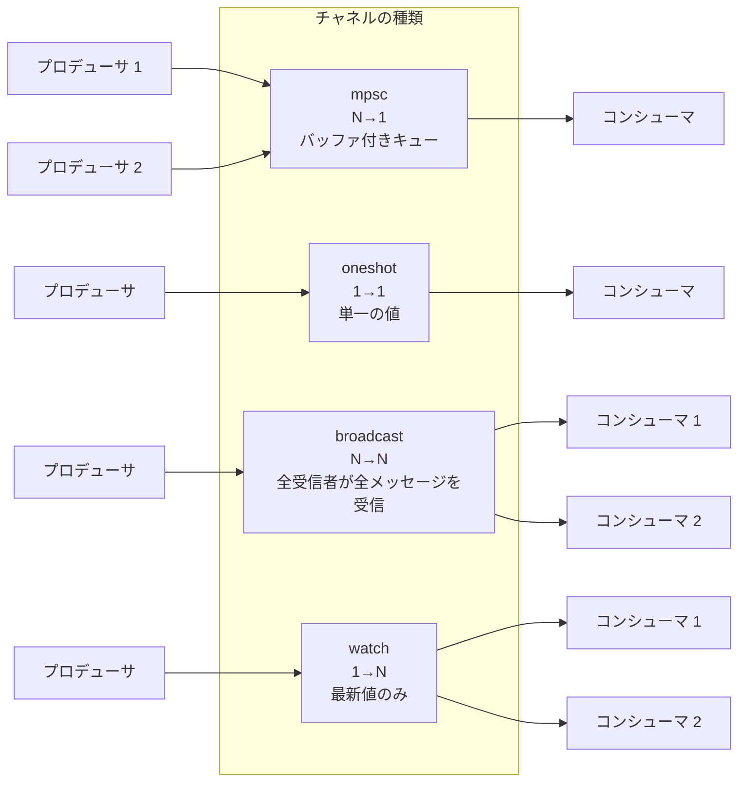
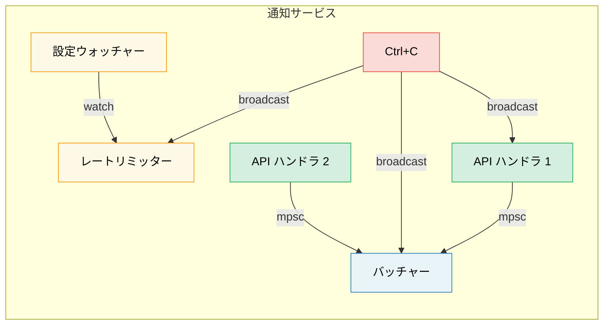

# 8. Tokio ディープダイブ 🟡

> **学習内容:**
> - ランタイムフレーバー：マルチスレッド vs カレントスレッド とそれぞれの使い分け
> - `tokio::spawn`、`'static` 要件、および `JoinHandle`
> - タスクのキャンセルセマンティクス（ドロップ時のキャンセル動作）
> - 同期プリミティブ：Mutex、RwLock、Semaphore、および4種類のチャネル

## ランタイムフレーバー：マルチスレッド vs カレントスレッド

Tokio は2つのランタイム構成を提供しています：

```rust
// マルチスレッド（#[tokio::main] のデフォルト）
// ワークスティーリングスレッドプールを使用 — タスクはスレッド間を移動可能
#[tokio::main]
async fn main() {
    // N個のワーカースレッド（デフォルト = CPUコア数）
    // タスクは Send + 'static である必要がある
}

// カレントスレッド — すべて単一スレッド上で実行される
#[tokio::main(flavor = "current_thread")]
async fn main() {
    // シングルスレッド — タスクが Send である必要はない
    // より軽量であり、シンプルなCLIツールや WASM に適している
}

// 手動でのランタイム構築:
let rt = tokio::runtime::Builder::new_multi_thread()
    .worker_threads(4)
    .enable_all()
    .build()
    .unwrap();

rt.block_on(async {
    println!("カスタムランタイムで実行中");
});
```



### tokio::spawn と 'static 要件

`tokio::spawn` は Future をランタイムのタスクキューに投入します。*任意*のワーカースレッド上で*いつでも*実行される可能性があるため、Future は `Send + 'static` でなければなりません：

```rust
use tokio::task;

async fn example() {
    let data = String::from("hello");

    // ✅ 動作する: 所有権をタスク内にムーブする
    let handle = task::spawn(async move {
        println!("{data}");
        data.len()
    });

    let len = handle.await.unwrap();
    println!("Length: {len}");
}

async fn problem() {
    let data = String::from("hello");

    // ❌ 失敗: data は借用されており、'static ではない
    // task::spawn(async {
    //     println!("{data}"); // `data` を借用している — 'static ではない
    // });

    // ❌ 失敗: Rc は Send ではない
    // let rc = std::rc::Rc::new(42);
    // task::spawn(async move {
    //     println!("{rc}"); // Rc は !Send — スレッド境界を越えられない
    // });
}
```

**なぜ `'static` なのか？** spawn されたタスクは独立して実行されるため、それを生成したスコープよりも長く生存する可能性があります。コンパイラは参照が有効であり続けることを証明できないため、所有権を持つデータであることが要求されます。

**なぜ `Send` なのか？** タスクは中断されたスレッドとは異なるスレッドで再開される可能性があります。`.await` ポイントをまたいで保持されるすべてのデータは、スレッド間で安全に送信（Send）できなければなりません。

```rust
// よくあるパターン: 共有データのクローンをタスク内に渡す
let shared = Arc::new(config);

for i in 0..10 {
    let shared = Arc::clone(&shared); // データをクローンするのではなく Arc をクローンする
    tokio::spawn(async move {
        process_item(i, &shared).await;
    });
}
```

### JoinHandle とタスクのキャンセル

```rust
use tokio::task::JoinHandle;
use tokio::time::{sleep, Duration};

async fn cancellation_example() {
    let handle: JoinHandle<String> = tokio::spawn(async {
        sleep(Duration::from_secs(10)).await;
        "completed".to_string()
    });

    // ハンドルをドロップしてタスクをキャンセルできるか？ 答えは「いいえ」— タスクは実行を継続します！
    // drop(handle); // タスクはバックグラウンドで継続する

    // 実際にキャンセルするには abort() を呼び出します:
    handle.abort();

    // 中止されたタスクを await すると JoinError が返される
    match handle.await {
        Ok(val) => println!("取得: {val}"),
        Err(e) if e.is_cancelled() => println!("タスクはキャンセルされました"),
        Err(e) => println!("タスクがパニックしました: {e}"),
    }
}
```

> **重要**: Tokio では、`JoinHandle` をドロップしてもタスクはキャンセル**されません**。
> タスクは*デタッチ（detached）*状態となり、実行を継続します。キャンセルするには、明示的に
> `.abort()` を呼び出す必要があります。これは、基盤となる計算をキャンセル（ドロップ）する
> `Future` 自体の直接のドロップとは異なります。

### Tokio の同期プリミティブ

Tokio は非同期に対応した同期プリミティブを提供しています。重要な原則は、**`.await` ポイントをまたいで `std::sync::Mutex` を使用しない**ことです。

```rust
use tokio::sync::{Mutex, RwLock, Semaphore, mpsc, oneshot, broadcast, watch};

// --- Mutex ---
// 非同期 Mutex: lock() メソッドは非同期であり、スレッドをブロックしません
let data = Arc::new(Mutex::new(vec![1, 2, 3]));
{
    let mut guard = data.lock().await; // ノンブロッキングなロック
    guard.push(4);
} // ガードはここでドロップされ、ロックが解放される

// --- チャネル ---
// mpsc: 複数プロデューサ、単一コンシューマ
let (tx, mut rx) = mpsc::channel::<String>(100); // バッファ付き（有界）キュー

tokio::spawn(async move {
    tx.send("hello".into()).await.unwrap();
});

let msg = rx.recv().await.unwrap();

// oneshot: 単一の値、単一コンシューマ
let (tx, rx) = oneshot::channel::<i32>();
tx.send(42).unwrap(); // await 不要 — 送信が成功するか失敗するかのいずれか
let val = rx.await.unwrap();

// broadcast: 複数プロデューサ、複数コンシューマ（すべての受信者がすべてのメッセージを受信）
let (tx, _) = broadcast::channel::<String>(100);
let mut rx1 = tx.subscribe();
let mut rx2 = tx.subscribe();

// watch: 単一の値、複数コンシューマ（最新値のみ保持）
let (tx, rx) = watch::channel(0u64);
tx.send(42).unwrap();
println!("最新値: {}", *rx.borrow());
```

> **注意:** これらチャネルの例では簡潔さのために `.unwrap()` を使用しています。
> 本番環境では、送受信エラーを適切に処理してください。`.send()` の失敗は受信側がドロップされたことを意味し、
> `.recv()` の失敗はチャネルが閉じられたことを意味します。



## ケーススタディ：通知サービスに適したチャネルの選定

次のような通知サービスを構築するとします：
- 複数の API ハンドラがイベントを生成する
- 単一のバックグラウンドタスクがそれらをバッチ処理して送信する
- 設定ウォッチャー（Config Watcher）が実行時にレートリミットを更新する
- シャットダウンシグナルがすべてのコンポーネントに到達する必要がある

**それぞれどのチャネルを使うべきか？**

| 要件 | チャネル | 理由 |
|-------------|---------|-----|
| API ハンドラ → バッチャー | `mpsc`（バッファ付き） | N個のプロデューサ、1個のコンシューマ。バックプレッシャーのためのバッファ制限（有界） — バッチャーの処理が遅れた場合、OOM（メモリ不足）にならずに API ハンドラ側の処理を減速させる |
| 設定ウォッチャー → レートリミッター | `watch` | 最新の設定のみが重要。複数のリーダー（各ワーカー）が現在の値を参照する |
| シャットダウンシグナル → 全コンポーネント | `broadcast` | すべてのコンポーネントがシャットダウン通知を独立して受信する必要がある |
| 単一のヘルスチェック応答 | `oneshot` | リクエスト/レスポンスパターン — 1つの値を返して完了 |



<details>
<summary><strong>🏋️ 演習: タスクプールの構築</strong> (クリックして展開)</summary>

**課題**: 非同期クロージャのリストと並行数制限（concurrency limit）を受け取り、同時に最大 N 個のタスクを実行する関数 `run_with_limit` を作成してください。`tokio::sync::Semaphore` を使用します。

<details>
<summary>🔑 解答例</summary>

```rust
use std::future::Future;
use std::sync::Arc;
use tokio::sync::Semaphore;

async fn run_with_limit<F, Fut, T>(tasks: Vec<F>, limit: usize) -> Vec<T>
where
    F: FnOnce() -> Fut + Send + 'static,
    Fut: Future<Output = T> + Send + 'static,
    T: Send + 'static,
{
    let semaphore = Arc::new(Semaphore::new(limit));
    let mut handles = Vec::new();

    for task in tasks {
        let permit = Arc::clone(&semaphore);
        let handle = tokio::spawn(async move {
            let _permit = permit.acquire().await.unwrap();
            // タスクの実行中にパーミットが保持され、完了後にドロップされる
            task().await
        });
        handles.push(handle);
    }

    let mut results = Vec::new();
    for handle in handles {
        results.push(handle.await.unwrap());
    }
    results
}

// 使い方:
// let tasks: Vec<_> = urls.into_iter().map(|url| {
//     move || async move { fetch(url).await }
// }).collect();
// let results = run_with_limit(tasks, 10).await; // 最大10並行
```

**重要なポイント**: `Semaphore` は Tokio で並行数を制限するための標準的な方法です。各タスクは処理を開始する前にパーミットを取得します。セマフォがいっぱいになると、新しいタスクはスロットが空くまで非同期（ノンブロッキング）で待機します。

</details>
</details>

> **重要ポイント — Tokio ディープダイブ**
> - サーバーには `multi_thread`（デフォルト）を使用し、CLI ツール、テスト、または `!Send` な型には `current_thread` を使用する
> - `tokio::spawn` には `'static` な Future が必要 — データの共有には `Arc` やチャネルを使用する
> - `JoinHandle` をドロップしてもタスクはキャンセル**されない** — 明示的に `.abort()` を呼び出す
> - ニーズに応じて同期プリミティブを選択する: 共有状態には `Mutex`、並行数制限には `Semaphore`、通信には `mpsc`/`oneshot`/`broadcast`/`watch`

> **参照:** spawn の代替手段については [第9章 — Tokio が適さないケース](ch09-when-tokio-isnt-the-right-fit.md)、await をまたぐ MutexGuard のバグについては [第12章 — よくある落とし穴](ch12-common-pitfalls.md) を参照してください。

***
