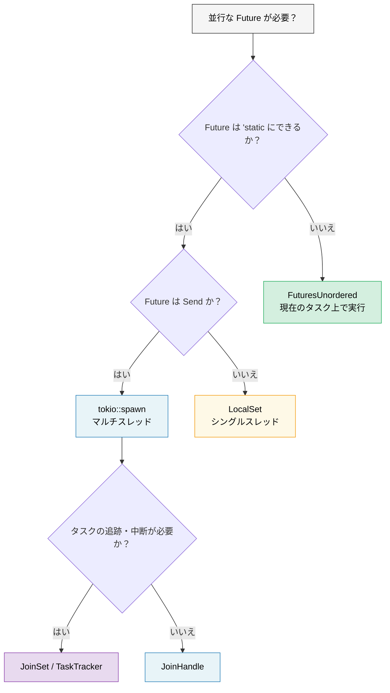

# 9. Tokio が適さないケース 🟡

> **学習内容:**
> - `'static` の問題点：`tokio::spawn` によって至る所で `Arc` の使用を余儀なくされる場合
> - `!Send` な Future のための `LocalSet`
> - 借用しやすい並行処理を実現する `FuturesUnordered`（spawn 不要）
> - マネージドなタスクグループのための `JoinSet`
> - ランタイム非依存（runtime-agnostic）なライブラリの作成



## 'static Future の問題点

Tokio の `spawn` は `'static` な Future を要求します。これは、spawn されたタスク内でローカルデータを借用できないことを意味します：

```rust
async fn process_items(items: &[String]) {
    // ❌ これは不可 — items は借用されており、'static ではない
    // for item in items {
    //     tokio::spawn(async {
    //         process(item).await;
    //     });
    // }

    // 😐 回避策 1: すべてをクローンする
    for item in items {
        let item = item.clone();
        tokio::spawn(async move {
            process(&item).await;
        });
    }

    // 😐 回避策 2: Arc を使用する
    let items = Arc::new(items.to_vec());
    for i in 0..items.len() {
        let items = Arc::clone(&items);
        tokio::spawn(async move {
            process(&items[i]).await;
        });
    }
}
```

これは少し厄介に感じるかもしれません！Go 言語であれば、クロージャを使って単に `go func() { use(item) }` と書くことができます。しかし Rust では、所有権システムによって「誰が何を所有しているのか」「それらがどれだけ長く生存するのか」を常に意識させられます。

### `tokio::spawn` の代替手段

すべての問題に `spawn` が必要なわけではありません。ここでは、それぞれ*異なる*制約を解決する3つのツールを紹介します：

```rust
// 1. FuturesUnordered — 'static を完全に回避（spawn 不要！）
use futures::stream::{FuturesUnordered, StreamExt};

async fn process_items(items: &[String]) {
    let futures: FuturesUnordered<_> = items
        .iter()
        .map(|item| async move {
            // ✅ item を借用可能 — spawn も 'static も不要！
            process(item).await
        })
        .collect();

    // すべての Future を完了まで駆動する
    futures.for_each(|result| async move {
        println!("結果: {result:?}");
    }).await;
}

// 2. tokio::task::LocalSet — カレントスレッド上で !Send な Future を実行する
//    ⚠️  依然として 'static が必要 — 解決するのは Send であり、'static ではない
use tokio::task::LocalSet;

let local_set = LocalSet::new();
local_set.run_until(async {
    tokio::task::spawn_local(async {
        // ここでは Rc, Cell などの !Send な型を使用可能
        let rc = std::rc::Rc::new(42);
        println!("{rc}");
    }).await.unwrap();
}).await;

// 3. tokio JoinSet (tokio 1.21+) — spawn されたタスクのマネージドなセット
//    ⚠️  依然として 'static + Send が必要 — 解決するのはタスクの*管理*であり、
//    'static の問題ではない。タスクの動的グループの追跡、中断、
//    join に便利。
use tokio::task::JoinSet;

async fn with_joinset() {
    let mut set = JoinSet::new();

    for i in 0..10 {
        // i は Copy でありクロージャにムーブされるため、すでに 'static。
        // 借用データに対しては依然として Arc や clone が必要。
        set.spawn(async move {
            tokio::time::sleep(Duration::from_millis(100)).await;
            i * 2
        });
    }

    while let Some(result) = set.join_next().await {
        println!("タスク完了: {:?}", result.unwrap());
    }
}
```

> **どのツールがどの問題を解決するのか？**
>
> | 直面している制約 | ツール | `'static` を回避できるか？ | `Send` を回避できるか？ |
> |---|---|---|---|
> | Future を `'static` にできない | `FuturesUnordered` | ✅ はい | ✅ はい |
> | Future が `'static` だが `!Send` である | `LocalSet` | ❌ いいえ | ✅ はい |
> | spawn されたタスクを追跡 / 中断したい | `JoinSet` | ❌ いいえ | ❌ いいえ |

### ライブラリにおける軽量ランタイムの選択

ライブラリを作成する場合、利用者に Tokio の使用を強制するべきではありません：

```rust
// ❌ 良くない例: ライブラリが利用者に Tokio を強制している
pub async fn my_lib_function() {
    tokio::time::sleep(Duration::from_secs(1)).await;
    // これにより、利用者は Tokio を必ず使わなければならなくなる
}

// ✅ 良い例: ライブラリがランタイム非依存になっている
pub async fn my_lib_function() {
    // std::future および futures クレートの型のみを使用する
    do_computation().await;
}

// ✅ 良い例: I/O 操作に対してジェネリックな Future を受け取る
pub async fn fetch_with_retry<F, Fut, T, E>(
    operation: F,
    max_retries: usize,
) -> Result<T, E>
where
    F: Fn() -> Fut,
    Fut: Future<Output = Result<T, E>>,
{
    for attempt in 0..max_retries {
        match operation().await {
            Ok(val) => return Ok(val),
            Err(e) if attempt == max_retries - 1 => return Err(e),
            Err(_) => continue,
        }
    }
    unreachable!()
}
```

> **経験則**: ライブラリは `tokio` ではなく `futures` クレートに依存するべきです。
> アプリケーション側が `tokio`（または選択した他のランタイム）に依存します。
> これにより、エコシステムのコンポーザビリティ（組み合わせやすさ）が維持されます。

<details>
<summary><strong>🏋️ 演習: FuturesUnordered vs Spawn</strong> (クリックして展開)</summary>

**課題**: 同じ関数を2つの方法で実装してください。1つは `tokio::spawn` を使用する方法（`'static` が必要）、もう1つは `FuturesUnordered` を使用する方法（データを借用）です。関数は `&[String]` を受け取り、非同期検索をシミュレートした後に各文字列の長さを返します。

比較してみてください：どちらのアプローチで `.clone()` が必要になりますか？入力スライスを借用できるのはどちらでしょうか？

<details>
<summary>🔑 解答例</summary>

```rust
use futures::stream::{FuturesUnordered, StreamExt};
use tokio::time::{sleep, Duration};

// バージョン 1: tokio::spawn — 'static が必要であり、クローンが必須
async fn lengths_with_spawn(items: &[String]) -> Vec<usize> {
    let mut handles = Vec::new();
    for item in items {
        let owned = item.clone(); // クローンが必要 — spawn には 'static が求められる
        handles.push(tokio::spawn(async move {
            sleep(Duration::from_millis(10)).await;
            owned.len()
        }));
    }

    let mut results = Vec::new();
    for handle in handles {
        results.push(handle.await.unwrap());
    }
    results
}

// バージョン 2: FuturesUnordered — データを借用し、クローン不要
async fn lengths_without_spawn(items: &[String]) -> Vec<usize> {
    let futures: FuturesUnordered<_> = items
        .iter()
        .map(|item| async move {
            sleep(Duration::from_millis(10)).await;
            item.len() // ✅ item を借用 — クローン不要！
        })
        .collect();

    futures.collect().await
}

#[tokio::test]
async fn test_both_versions() {
    let items = vec!["hello".into(), "world".into(), "rust".into()];

    let v1 = lengths_with_spawn(&items).await;
    // 注意: v1 は挿入順序を保持する（順次 join）

    let mut v2 = lengths_without_spawn(&items).await;
    v2.sort(); // FuturesUnordered は完了順に結果を返す

    assert_eq!(v1, vec![5, 5, 4]);
    assert_eq!(v2, vec![4, 5, 5]);
}
```

**重要なポイント**: `FuturesUnordered` は、すべての Future を現在のタスク上で実行する（スレッド間の移動がない）ことで `'static` 要件を回避します。トレードオフとして、すべての Future が1つのタスクを共有するため、1つがブロックすると他の Future も停滞します。別スレッドで実行すべき CPU 負荷の高い処理には `spawn` を使用してください。

</details>
</details>

> **重要ポイント — Tokio が適さないケース**
> - `FuturesUnordered` は現在のタスク上で複数の Future を並行実行する — `'static` 要件がない
> - `LocalSet` はシングルスレッドのエグゼキュータ上で `!Send` な Future を実行できるようにする
> - `JoinSet` (Tokio 1.21+) は自動クリーンアップを伴うマネージドなタスクグループを提供する
> - ライブラリを作成する場合: Tokio に直接依存せず、`std::future::Future` + `futures` クレートのみに依存する

> **参照:** spawn が適切なツールとなるケースについては [第8章 — Tokio ディープダイブ](ch08-tokio-deep-dive.md)、もう一つの並行数制限手法である `buffer_unordered()` については [第11章 — ストリーム](ch11-streams-and-asynciterator.md) を参照してください。

***
