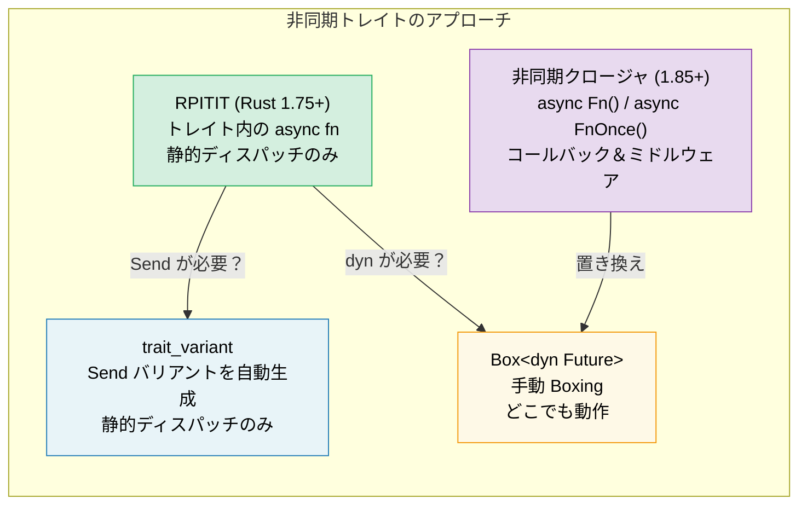

# 10. 非同期トレイト 🟡

> **学習内容:**
> - トレイト内の非同期メソッドの安定化になぜ何年もかかったのか
> - RPITIT：ネイティブな非同期トレイトメソッド（Rust 1.75+）
> - dyn ディスパッチの課題と `trait_variant` による `Send` 境界
> - 非同期クロージャ（Rust 1.85+）：`async Fn()` と `async FnOnce()`



## 歴史的経緯：なぜこれほど時間がかかったのか

トレイト内での非同期メソッドのサポートは、長年にわたり Rust コミュニティで最も要望の多かった機能でした。その問題点は次の通りです：

```rust
// これは Rust 1.75 (2023年12月) までコンパイルできませんでした:
trait DataStore {
    async fn get(&self, key: &str) -> Option<String>;
}
// なぜでしょうか？ async fn は `impl Future<Output = T>` を返しますが、
// トレイトの戻り値位置における `impl Trait` がサポートされていなかったためです。
```

根本的な課題は、トレイトメソッドが `impl Future` を返す場合、各実装者が*異なる具体的な型*を返すという点にありました。コンパイラは戻り値の型のサイズを知る必要がありますが、トレイトメソッドは動的にディスパッチされる可能性もあります。

### RPITIT: トレイトの戻り値位置における Impl Trait

Rust 1.75 以降、静的ディスパッチであればそのまま動作するようになりました：

```rust
trait DataStore {
    async fn get(&self, key: &str) -> Option<String>;
    // 糖衣構文を展開（脱糖）すると次のようになります:
    // fn get(&self, key: &str) -> impl Future<Output = Option<String>>;
}

struct InMemoryStore {
    data: std::collections::HashMap<String, String>,
}

impl DataStore for InMemoryStore {
    async fn get(&self, key: &str) -> Option<String> {
        self.data.get(key).cloned()
    }
}

// ✅ ジェネリクス（静的ディスパッチ）で正常に動作します:
async fn lookup<S: DataStore>(store: &S, key: &str) {
    if let Some(val) = store.get(key).await {
        println!("{key} = {val}");
    }
}
```

### dyn ディスパッチと Send 境界

制限事項として、コンパイラが返される Future のサイズを把握できないため、`dyn DataStore` を直接使用することはできません：

```rust
// ❌ 動作しません:
// async fn lookup_dyn(store: &dyn DataStore, key: &str) { ... }
// エラー: メソッド `get` が `async` であるため、
//        トレイト `DataStore` は dyn 互換（dyn-compatible）ではありません

// ✅ 回避策: Box 化された Future を返す
trait DynDataStore {
    fn get(&self, key: &str) -> Pin<Box<dyn Future<Output = Option<String>> + Send + '_>>;
}
```

**Send の問題**: マルチスレッドランタイムでは、spawn されるタスクは `Send` でなければなりません。しかし、非同期トレイトメソッドは自動的には `Send` 境界を付与しません：

```rust
trait Worker {
    async fn run(self); // Future は Send であるかもしれないし、そうでないかもしれない
}

struct MyWorker;

impl Worker for MyWorker {
    async fn run(self) {
        // ここで !Send な型を使用している場合、Future 全体が !Send になる
        let rc = std::rc::Rc::new(42);
        some_work().await;
        println!("{rc}");
    }
}

// ❌ Future が !Send（Rc が !Send）であるためコンパイルに失敗する:
// tokio::spawn(worker.run()); // Send + 'static が要求される
//
// 注意: ここで `self`（所有権）を使用しているのは、tokio::spawn が
// 'static も要求するためです — &self を借用する Future は 'static になれません。
// Rc がなくても、`async fn run(&self)` は spawn できません。
```

### trait_variant クレート

`trait_variant` クレート（Rust async ワーキンググループ提供）は、`Send` バリアントを自動的に生成してくれます：

```rust
// Cargo.toml: trait-variant = "0.1"

#[trait_variant::make(SendDataStore: Send)]
trait DataStore {
    async fn get(&self, key: &str) -> Option<String>;
    async fn set(&self, key: &str, value: String);
}

// これにより、2つのトレイトが用意されます:
// - DataStore: Future に Send 境界がない
// - SendDataStore: すべての Future が Send
// 両者は同じメソッドを持ち、実装者は DataStore を実装するだけで、
// その Future が Send であれば自動的に SendDataStore も実装されます。

// タスクを spawn する必要がある場合は SendDataStore を使用します:
async fn spawn_lookup<S: SendDataStore + 'static>(store: Arc<S>) {
    tokio::spawn(async move {
        store.get("key").await;
    });
}

// ⚠️ 注意: trait_variant は dyn ディスパッチを可能にするものではありません。
// 生成されたトレイトも依然として `impl Future` を使用しているため、
// `dyn SendDataStore` は dyn 互換ではありません。dyn ディスパッチを行うには、
// 依然として手動での Box 化（上記の Box::pin アプローチ参照）または
// `async-trait` クレートが必要です。
```

### クイックリファレンス：非同期トレイト

| アプローチ | 静的ディスパッチ | 動的ディスパッチ | Send | 構文のオーバーヘッド |
|----------|:---:|:---:|:---:|---|
| トレイト内のネイティブ `async fn` | ✅ | ❌ | 暗黙的 | なし |
| `trait_variant` | ✅ | ❌ | 明示的 | `#[trait_variant::make]` |
| 手動の `Box::pin` | ✅ | ✅ | 明示的 | 高 |
| `async-trait` クレート | ✅ | ✅ | `#[async_trait]` | 中（手続き型マクロ） |

> **推奨事項**: 新規コード（Rust 1.75+）では、ネイティブの非同期トレイトを使用してください。タスクを spawn するために `Send` 境界が必要な場合は `trait_variant` を追加します。`dyn` ディスパッチが必要な場合は、手動の `Box::pin` または `async-trait` クレートを使用します。ネイティブのアプローチは静的ディスパッチにおいてゼロコストです。

### 非同期クロージャ（Rust 1.85+）

Rust 1.85 以降、環境をキャプチャして Future を返すクロージャである「非同期クロージャ（async closures）」が安定化されました：

```rust
// 1.85 より前: 扱いにくい回避策が必要だった
let urls = vec!["https://a.com", "https://b.com"];
let fetchers: Vec<_> = urls.iter().map(|url| {
    let url = url.to_string();
    // 非同期ブロックを返す非同期ではないクロージャを返す
    move || async move { reqwest::get(&url).await }
}).collect();

// 1.85 以降: 非同期クロージャがそのまま動作する
let fetchers: Vec<_> = urls.iter().map(|url| {
    async move || { reqwest::get(url).await }
    // ↑ これが非同期クロージャ — url をキャプチャし、Future を返す
}).collect();
```

非同期クロージャは、`Fn`、`FnMut`、`FnOnce` に対応する新しい `AsyncFn`、`AsyncFnMut`、`AsyncFnOnce` トレイトを実装しています：

```rust
// 非同期クロージャを受け取るジェネリック関数
async fn retry<F>(max: usize, f: F) -> Result<String, Error>
where
    F: AsyncFn() -> Result<String, Error>,
{
    for _ in 0..max {
        if let Ok(val) = f().await {
            return Ok(val);
        }
    }
    f().await
}
```

> **移行のヒント**: `Fn() -> impl Future<Output = T>` を使用しているコードがある場合は、よりクリーンなシグネチャのために `AsyncFn() -> T` への切り替えを検討してください。

<details>
<summary><strong>🏋️ 演習: 非同期サービストレイトの設計</strong> (クリックして展開)</summary>

**課題**: 非同期の `get` メソッドと `set` メソッドを持つ `Cache` トレイトを設計してください。これを2通りの方法で実装します。1つは `HashMap` を使用したインメモリ実装、もう1つは擬似的な Redis バックエンド（ネットワークレイテンシをシミュレートするために `tokio::time::sleep` を使用）です。両方で動作するジェネリック関数を作成してください。

<details>
<summary>🔑 解答例</summary>

```rust
use std::collections::HashMap;
use std::sync::Arc;
use tokio::sync::Mutex;
use tokio::time::{sleep, Duration};

trait Cache {
    async fn get(&self, key: &str) -> Option<String>;
    async fn set(&self, key: &str, value: String);
}

// --- インメモリ実装 ---
struct MemoryCache {
    store: Mutex<HashMap<String, String>>,
}

impl MemoryCache {
    fn new() -> Self {
        MemoryCache {
            store: Mutex::new(HashMap::new()),
        }
    }
}

impl Cache for MemoryCache {
    async fn get(&self, key: &str) -> Option<String> {
        self.store.lock().await.get(key).cloned()
    }

    async fn set(&self, key: &str, value: String) {
        self.store.lock().await.insert(key.to_string(), value);
    }
}

// --- 擬似 Redis 実装 ---
struct RedisCache {
    store: Mutex<HashMap<String, String>>,
    latency: Duration,
}

impl RedisCache {
    fn new(latency_ms: u64) -> Self {
        RedisCache {
            store: Mutex::new(HashMap::new()),
            latency: Duration::from_millis(latency_ms),
        }
    }
}

impl Cache for RedisCache {
    async fn get(&self, key: &str) -> Option<String> {
        sleep(self.latency).await; // ネットワークのラウンドトリップをシミュレート
        self.store.lock().await.get(key).cloned()
    }

    async fn set(&self, key: &str, value: String) {
        sleep(self.latency).await;
        self.store.lock().await.insert(key.to_string(), value);
    }
}

// --- 任意の Cache で動作するジェネリック関数 ---
async fn cache_demo<C: Cache>(cache: &C, label: &str) {
    cache.set("greeting", "Hello, async!".into()).await;
    let val = cache.get("greeting").await;
    println!("[{label}] greeting = {val:?}");
}

#[tokio::main]
async fn main() {
    let mem = MemoryCache::new();
    cache_demo(&mem, "memory").await;

    let redis = RedisCache::new(50);
    cache_demo(&redis, "redis").await;
}
```

**重要なポイント**: 同じジェネリック関数が、静的ディスパッチを介して両方の実装で動作します。Boxing もアロケーションのオーバーヘッドもありません。マルチスレッドランタイム上でこれらの Future を spawn する必要がある場合は、`trait_variant::make(SendCache: Send)` を追加して `Send` 境界を取得してください。動的ディスパッチが必要な場合は、手動の `Box::pin` または `async-trait` クレートを使用します。

</details>
</details>

> **重要ポイント — 非同期トレイト**
> - Rust 1.75 以降、トレイト内に直接 `async fn` を記述できる（`#[async_trait]` クレートは不要）
> - `trait_variant::make` はタスクを spawn するための `Send` バリアントを自動生成する（静的ディスパッチのみ）
> - 非同期クロージャ（`async Fn()`）は 1.85 で安定化 — コールバックやミドルウェアに使用する
> - パフォーマンスが重視されるコードでは、`dyn` よりも静的ディスパッチ（`<S: Service>`）を優先する

> **参照:** Tower の `Service` トレイトについては [第13章 — 本番運用のパターン](ch13-production-patterns.md)、手動でのトレイト実装については [第6章 — 手動での Future 実装](ch06-building-futures-by-hand.md) を参照してください。

***
