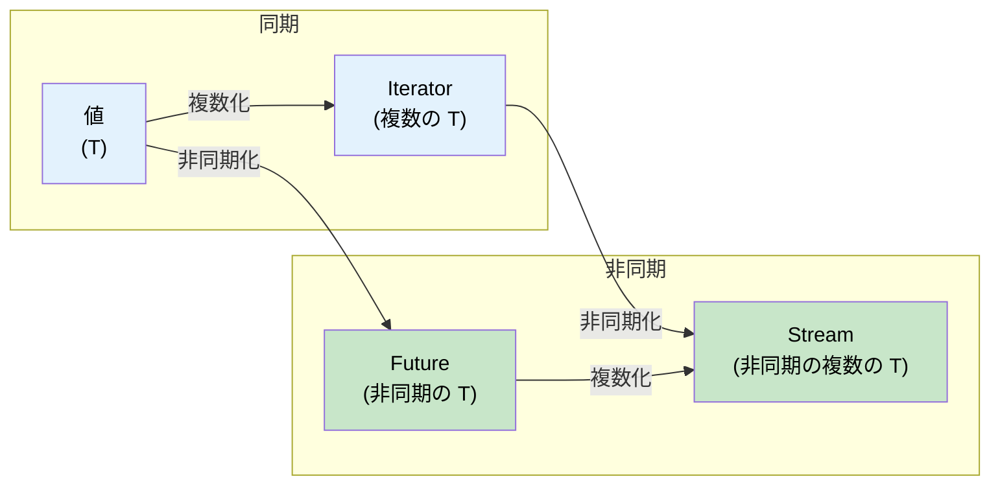

# 11. ストリームと AsyncIterator 🟡

> **学習内容:**
> - `Stream` トレイト：複数の値にまたがる非同期イテレーション
> - ストリームの生成：`stream::iter`、`async_stream`、`unfold`
> - ストリームコンビネータ：`map`、`filter`、`buffer_unordered`、`fold`
> - 非同期 I/O トレイト：`AsyncRead`、`AsyncWrite`、`AsyncBufRead`

## Stream トレイトの概要

`Future` が単一の値に対するものであるのと同様に、`Stream` は `Iterator` に対する非同期版にあたります — つまり、複数の値を非同期に生成（yield）します：

```rust
// std::iter::Iterator (同期、複数の値)
trait Iterator {
    type Item;
    fn next(&mut self) -> Option<Self::Item>;
}

// futures::Stream (非同期、複数の値)
trait Stream {
    type Item;
    fn poll_next(self: Pin<&mut Self>, cx: &mut Context<'_>) -> Poll<Option<Self::Item>>;
}
```



### ストリームの生成

```rust
use futures::stream::{self, StreamExt};
use tokio::time::{interval, Duration};
use tokio_stream::wrappers::IntervalStream;

// 1. イテレータから生成
let s = stream::iter(vec![1, 2, 3]);

// 2. 非同期ジェネレータから生成（async_stream クレートを使用）
// Cargo.toml: async-stream = "0.3"
use async_stream::stream;

fn countdown(from: u32) -> impl futures::Stream<Item = u32> {
    stream! {
        for i in (0..=from).rev() {
            tokio::time::sleep(Duration::from_millis(500)).await;
            yield i;
        }
    }
}

// 3. Tokio のインターバルから生成
let tick_stream = IntervalStream::new(interval(Duration::from_secs(1)));

// 4. チャネルの受信側から生成 (tokio_stream::wrappers)
let (tx, rx) = tokio::sync::mpsc::channel::<String>(100);
let rx_stream = tokio_stream::wrappers::ReceiverStream::new(rx);

// 5. unfold から生成（非同期状態から生成）
let s = stream::unfold(0u32, |state| async move {
    if state >= 5 {
        None // ストリーム終了
    } else {
        let next = state + 1;
        Some((state, next)) // `state` を yield し、新しい状態は `next`
    }
});
```

### ストリームの消費

```rust
use futures::stream::{self, StreamExt};

async fn stream_examples() {
    let s = stream::iter(vec![1, 2, 3, 4, 5]);

    // for_each — 各要素を処理する
    s.for_each(|x| async move {
        println!("{x}");
    }).await;

    // map + collect
    let doubled: Vec<i32> = stream::iter(vec![1, 2, 3])
        .map(|x| x * 2)
        .collect()
        .await;

    // filter
    let evens: Vec<i32> = stream::iter(1..=10)
        .filter(|x| futures::future::ready(x % 2 == 0))
        .collect()
        .await;

    // buffer_unordered — N 個の要素を並行処理する
    let results: Vec<_> = stream::iter(vec!["url1", "url2", "url3"])
        .map(|url| async move {
            // HTTP リクエストをシミュレート
            tokio::time::sleep(Duration::from_millis(100)).await;
            format!("{url} からのレスポンス")
        })
        .buffer_unordered(10) // 最大10並行でフェッチ
        .collect()
        .await;

    // take, skip, zip, chain — Iterator と同様に使用可能
    let first_three: Vec<i32> = stream::iter(1..=100)
        .take(3)
        .collect()
        .await;
}
```

### C# の IAsyncEnumerable との比較

| 機能 | Rust `Stream` | C# `IAsyncEnumerable<T>` |
|---------|--------------|--------------------------|
| **構文** | `stream! { yield x; }` | `await foreach` / `yield return` |
| **キャンセル** | ストリームのドロップ | `CancellationToken` |
| **バックプレッシャー** | コンシューマがポーリングレートを制御 | コンシューマが `MoveNextAsync` を制御 |
| **標準組み込み** | いいえ（`futures` クレート等が必要） | はい（C# 8.0 以降） |
| **コンビネータ** | `.map()`, `.filter()`, `.buffer_unordered()` | LINQ + `System.Linq.Async` |
| **エラー処理** | `Stream<Item = Result<T, E>>` | 非同期イテレータ内でスロー |

```rust
// Rust: データベース行のストリーム
// 注意: 本文内で ? を使用する場合は (stream! ではなく) try_stream! が必要です。
// stream! はエラーを伝播しません — try_stream! は Err(e) を yield して終了します。
fn get_users(db: &Database) -> impl Stream<Item = Result<User, DbError>> + '_ {
    try_stream! {
        let mut cursor = db.query("SELECT * FROM users").await?;
        while let Some(row) = cursor.next().await {
            yield User::from_row(row?);
        }
    }
}

// 消費側:
let mut users = pin!(get_users(&db));
while let Some(result) = users.next().await {
    match result {
        Ok(user) => println!("{}", user.name),
        Err(e) => eprintln!("Error: {e}"),
    }
}
```

```csharp
// C# での同等のコード:
async IAsyncEnumerable<User> GetUsers() {
    await using var reader = await db.QueryAsync("SELECT * FROM users");
    while (await reader.ReadAsync()) {
        yield return User.FromRow(reader);
    }
}

// 消費側:
await foreach (var user in GetUsers()) {
    Console.WriteLine(user.Name);
}
```

<details>
<summary><strong>🏋️ 演習: 非同期統計アグリゲータの構築</strong> (クリックして展開)</summary>

**課題**: センサー測定値のストリーム `Stream<Item = f64>` が与えられたとき、そのストリームを消費して `(count, min, max, average)` を返す非同期関数を作成してください。単に Vec に収集するのではなく、`StreamExt` のコンビネータを使用してください。

*ヒント*: ストリーム全体の状態を累積するために `.fold()` を使用します。

<details>
<summary>🔑 解答例</summary>

```rust
use futures::stream::{self, StreamExt};

#[derive(Debug)]
struct Stats {
    count: usize,
    min: f64,
    max: f64,
    sum: f64,
}

impl Stats {
    fn average(&self) -> f64 {
        if self.count == 0 { 0.0 } else { self.sum / self.count as f64 }
    }
}

async fn compute_stats<S: futures::Stream<Item = f64>>(stream: S) -> Stats {
    stream
        .fold(
            Stats { count: 0, min: f64::INFINITY, max: f64::NEG_INFINITY, sum: 0.0 },
            |mut acc, value| async move {
                acc.count += 1;
                acc.min = acc.min.min(value);
                acc.max = acc.max.max(value);
                acc.sum += value;
                acc
            },
        )
        .await
}

#[tokio::test]
async fn test_stats() {
    let readings = stream::iter(vec![23.5, 24.1, 22.8, 25.0, 23.9]);
    let stats = compute_stats(readings).await;

    assert_eq!(stats.count, 5);
    assert!((stats.min - 22.8).abs() < f64::EPSILON);
    assert!((stats.max - 25.0).abs() < f64::EPSILON);
    assert!((stats.average() - 23.86).abs() < 0.01);
}
```

**重要なポイント**: `.fold()` のようなストリームコンビネータは、要素をメモリ上に一度に集約することなく1つずつ処理します — これは、大規模または際限のない（アンバウンデッドな）データストリームを処理する上で極めて重要です。

</details>
</details>

### 非同期 I/O トレイト：AsyncRead、AsyncWrite、AsyncBufRead

`std::io::Read`/`Write` が同期 I/O の基盤であるのと同様に、それらの非同期版は非同期 I/O の基盤となります。これらのトレイトは `tokio::io`（またはランタイム非依存のコード向けには `futures::io`）によって提供されています：

```rust
// tokio::io — std::io トレイトの非同期版

/// ソースからバイト列を非同期に読み取る
pub trait AsyncRead {
    fn poll_read(
        self: Pin<&mut Self>,
        cx: &mut Context<'_>,
        buf: &mut ReadBuf<'_>,  // 未初期化メモリを安全に扱うための Tokio のラッパー
    ) -> Poll<io::Result<()>>;
}

/// シンクにバイト列を非同期に書き込む
pub trait AsyncWrite {
    fn poll_write(
        self: Pin<&mut Self>,
        cx: &mut Context<'_>,
        buf: &[u8],
    ) -> Poll<io::Result<usize>>;

    fn poll_flush(self: Pin<&mut Self>, cx: &mut Context<'_>) -> Poll<io::Result<()>>;
    fn poll_shutdown(self: Pin<&mut Self>, cx: &mut Context<'_>) -> Poll<io::Result<()>>;
}

/// 行単位のサポートを備えたバッファ付き読み取り
pub trait AsyncBufRead: AsyncRead {
    fn poll_fill_buf(self: Pin<&mut Self>, cx: &mut Context<'_>) -> Poll<io::Result<&[u8]>>;
    fn consume(self: Pin<&mut Self>, amt: usize);
}
```

**実際の実装では**、これらの `poll_*` メソッドを直接呼び出すことは稀です。代わりに、`.await` しやすいヘルパーメソッドを提供する拡張トレイト `AsyncReadExt` や `AsyncWriteExt` を使用します：

```rust
use tokio::io::{AsyncReadExt, AsyncWriteExt, AsyncBufReadExt};
use tokio::net::TcpStream;
use tokio::io::BufReader;

async fn io_examples() -> tokio::io::Result<()> {
    let mut stream = TcpStream::connect("127.0.0.1:8080").await?;

    // AsyncWriteExt: write_all, write_u32, write_buf など
    stream.write_all(b"GET / HTTP/1.0\r\n\r\n").await?;

    // AsyncReadExt: read, read_exact, read_to_end, read_to_string
    let mut response = Vec::new();
    stream.read_to_end(&mut response).await?;

    // AsyncBufReadExt: read_line, lines(), split()
    let file = tokio::fs::File::open("config.txt").await?;
    let reader = BufReader::new(file);
    let mut lines = reader.lines();
    while let Some(line) = lines.next_line().await? {
        println!("{line}");
    }

    Ok(())
}
```

**カスタム非同期 I/O の実装** — 生の TCP 上にプロトコルをラップする例：

```rust
use tokio::io::{AsyncRead, AsyncWrite, ReadBuf};
use std::pin::Pin;
use std::task::{Context, Poll};

/// 長さプレフィックス付きプロトコル: [u32 長さ][ペイロードのバイト列]
struct FramedStream<T> {
    inner: T,
}

impl<T: AsyncRead + AsyncReadExt + Unpin> FramedStream<T> {
    /// 1つの完全なフレームを読み取る
    async fn read_frame(&mut self) -> tokio::io::Result<Vec<u8>>
    {
        // 4バイトの長さプレフィックスを読み取る
        let len = self.inner.read_u32().await? as usize;

        // 正確にそのバイト数分だけ読み取る
        let mut payload = vec![0u8; len];
        self.inner.read_exact(&mut payload).await?;
        Ok(payload)
    }
}

impl<T: AsyncWrite + AsyncWriteExt + Unpin> FramedStream<T> {
    /// 1つの完全なフレームを書き込む
    async fn write_frame(&mut self, data: &[u8]) -> tokio::io::Result<()>
    {
        self.inner.write_u32(data.len() as u32).await?;
        self.inner.write_all(data).await?;
        self.inner.flush().await?;
        Ok(())
    }
}
```

| 同期トレイト | 非同期トレイト (tokio) | 非同期トレイト (futures) | 拡張トレイト |
|-----------|--------------------|-----------------------|----------------|
| `std::io::Read` | `tokio::io::AsyncRead` | `futures::io::AsyncRead` | `AsyncReadExt` |
| `std::io::Write` | `tokio::io::AsyncWrite` | `futures::io::AsyncWrite` | `AsyncWriteExt` |
| `std::io::BufRead` | `tokio::io::AsyncBufRead` | `futures::io::AsyncBufRead` | `AsyncBufReadExt` |
| `std::io::Seek` | `tokio::io::AsyncSeek` | `futures::io::AsyncSeek` | `AsyncSeekExt` |

> **tokio vs futures の I/O トレイト**: 両者は類似していますが同一ではありません — Tokio の `AsyncRead` は `ReadBuf`（未初期化メモリを安全に扱う）を使用しますが、`futures::AsyncRead` は `&mut [u8]` を使用します。これらを相互変換するには `tokio_util::compat` を使用してください。

> **コピー用ユーティリティ**: `tokio::io::copy(&mut reader, &mut writer)` は `std::io::copy` の非同期版であり、プロキシサーバーやファイル転送に便利です。`tokio::io::copy_bidirectional` は双方向を並行してコピーします。

<details>
<summary><strong>🏋️ 演習: 非同期行カウンタの構築</strong> (クリックして展開)</summary>

**課題**: 任意の `AsyncBufRead` ソースを受け取り、空でない行の数を返す非同期関数を作成してください。ファイル、TCP ストリーム、または任意のバッファリーダーで動作する必要があります。

*ヒント*: `AsyncBufReadExt::lines()` を使用し、`!line.is_empty()` となる行をカウントします。

<details>
<summary>🔑 解答例</summary>

```rust
use tokio::io::AsyncBufReadExt;

async fn count_non_empty_lines<R: tokio::io::AsyncBufRead + Unpin>(
    reader: R,
) -> tokio::io::Result<usize> {
    let mut lines = reader.lines();
    let mut count = 0;
    while let Some(line) = lines.next_line().await? {
        if !line.is_empty() {
            count += 1;
        }
    }
    Ok(count)
}

// 任意の AsyncBufRead で動作:
// let file = tokio::io::BufReader::new(tokio::fs::File::open("data.txt").await?);
// let count = count_non_empty_lines(file).await?;
//
// let tcp = tokio::io::BufReader::new(TcpStream::connect("...").await?);
// let count = count_non_empty_lines(tcp).await?;
```

**重要なポイント**: 具体的な型ではなく `AsyncBufRead` に対してプログラミングすることで、I/O コードをファイル、ソケット、パイプ、さらにはインメモリバッファ（`tokio::io::BufReader::new(std::io::Cursor::new(data))`）の間で再利用できるようになります。

</details>
</details>

> **重要ポイント — ストリームと AsyncIterator**
> - `Stream` は `Iterator` の非同期版 — `Poll::Ready(Some(item))` または `Poll::Ready(None)` を yield する
> - `.buffer_unordered(N)` は N 個のストリーム要素を並行処理する — ストリームにおける重要な並行処理ツール
> - `async_stream::stream!` はカスタムストリームを作成する最も簡単な方法（`yield` を使用）
> - `AsyncRead`/`AsyncBufRead` により、ファイル、ソケット、パイプにまたがるジェネリックで再利用可能な I/O コードが実現する

> **参照:** `FuturesUnordered`（関連パターン）については [第9章 — Tokio が適さないケース](ch09-when-tokio-isnt-the-right-fit.md)、有界チャネルによるバックプレッシャーについては [第13章 — 本番運用のパターン](ch13-production-patterns.md) を参照してください。

***
