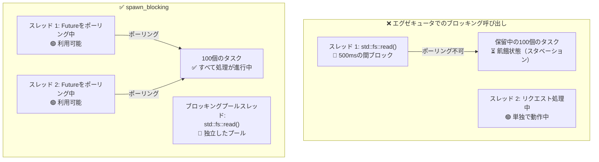

# 12. よくある落とし穴 🔴

> **学習内容:**
> - 非同期Rustにおける9つの典型的なバグとその解決策
> - エグゼキュータのブロックが最大の過ちである理由（および `spawn_blocking` による解決法）
> - キャンセルの危険性：Futureがawaitの途中でドロップされたときに何が起きるか
> - デバッグ：`tokio-console`、`tracing`、`#[instrument]`
> - テスト：`#[tokio::test]`、`time::pause()`、トレイトに基づくモック化

## エグゼキュータのブロック

非同期Rustにおける最大の過ちは、非同期エグゼキュータのスレッド上でブロッキングコードを実行することです。これにより他のタスクが飢餓状態（スタベーション）に陥ります。

```rust
// ❌ 誤り: エグゼキュータスレッド全体をブロックしてしまう
async fn bad_handler() -> String {
    let data = std::fs::read_to_string("big_file.txt").unwrap(); // ブロックする！
    process(&data)
}

// ✅ 正しい: ブロッキング処理を専用スレッドプールにオフロードする
async fn good_handler() -> String {
    let data = tokio::task::spawn_blocking(|| {
        std::fs::read_to_string("big_file.txt").unwrap()
    }).await.unwrap();
    process(&data)
}

// ✅ こちらも正しい: tokioの非同期fsを使用する
async fn also_good_handler() -> String {
    let data = tokio::fs::read_to_string("big_file.txt").await.unwrap();
    process(&data)
}
```



### std::thread::sleep 対 tokio::time::sleep

```rust
// ❌ 誤り: エグゼキュータスレッドを5秒間ブロックする
async fn bad_delay() {
    std::thread::sleep(Duration::from_secs(5)); // スレッドは他のタスクをポーリングできない！
}

// ✅ 正しい: エグゼキュータに制御を戻し（yield）、他のタスクが実行可能
async fn good_delay() {
    tokio::time::sleep(Duration::from_secs(5)).await; // ノンブロッキング！
}
```

### .await を跨いだ MutexGuard の保持

```rust
use std::sync::Mutex; // std Mutex — 非同期非対応

// ⚠️ 危険: MutexGuard を .await を跨いで保持している
async fn bad_mutex(data: &Mutex<Vec<String>>) {
    let mut guard = data.lock().unwrap();
    guard.push("item".into());
    some_io().await; // ここでガードが保持されている — 他のスレッドのロック取得をブロックする！
    guard.push("another".into());
}
// 注意: これはコンパイルが通ります！std::sync::MutexGuard は !Send ですが、
// コンパイラは Future を Send が要求される場所（例: tokio::spawn）に渡すまで Send 境界を強制しません。
// bad_mutex(...).await を直接呼び出す場合は正常にコンパイルされます。
// ただし、tokio::spawn(bad_mutex(data)) は Send 境界エラーでコンパイルに失敗します。
```

**なぜこれが通常問題となるのか（常に問題とは限らない理由）**:

`std::sync::Mutex` を `.await` を跨いで保持すると、I/O処理の間 **OSスレッド** をブロックし、エグゼキュータがそのスレッドで他のタスクをポーリングできなくなります。短いクリティカルセクションであれば無駄が生じる程度ですが、長時間のI/Oではパフォーマンス上の致命的な罠となります。

**ただし**、データベースのトランザクションが読み取りからコミットまでの間ロックを保持するのと同様に、`.await` を跨いでロックを保持しなければならない正当なケースも存在します。ロックを一度ドロップして再取得すると、**TOCTOU（time-of-check to time-of-use）競合** が生じます。2つのクリティカルセクションの間に別のタスクがデータを変更できてしまうためです。適切な修正方法はユースケースによって異なります：

```rust
// 選択肢1: ガードのスコープを絞る — 各操作が独立している場合に有効
async fn scoped_mutex(data: &Mutex<Vec<String>>) {
    {
        let mut guard = data.lock().unwrap();
        guard.push("item".into());
    } // ガードはここでドロップされる
    some_io().await; // ロックは解放済み — 他のタスクが処理を進められる
    {
        let mut guard = data.lock().unwrap();
        guard.push("another".into());
    }
}
// ⚠️ 注意: 2つのセクションの間に別のタスクがロックを取得してVecを変更する可能性があります。
//    2回のpushが互いに独立していれば問題ありませんが、"another" が "item" によって
//    設定された状態に依存している場合はバグになります。

// 選択肢2: tokio::sync::Mutex を使用する — OSスレッドをブロックすることなく
//           .await を跨いでロックを保持できる。awaitポイントを跨ぐ
//           トランザクション的なリード・モディファイ・ライトが必要な場合に最適。
use tokio::sync::Mutex as AsyncMutex;

async fn async_mutex(data: &AsyncMutex<Vec<String>>) {
    let mut guard = data.lock().await; // 非同期ロック — スレッドをブロックしない
    guard.push("item".into());
    some_io().await; // OK — tokioのMutexガードはSendを満たす
    guard.push("another".into());
    // ガードはずっと保持される — TOCTOU競合も起きず、スレッドもブロックされない
}
```

> **どのMutexを使うべきか**:
> - `std::sync::Mutex`: 内部に `.await` のない短いクリティカルセクション
> - `tokio::sync::Mutex`: `.await` ポイントを跨いでロックを保持する必要がある場合（トランザクションセマンティクス、TOCTOU競合の回避）
> - `parking_lot::Mutex`: `std` のドロップイン代替。より高速でコンパクトだが、依然として `.await` は不可
>
> **経験則**: `.await` の前後でクリティカルセクションを盲目的に分割してはいけません。2つの処理が本当に独立しているかを自問してください。独立していない（後半が前半の状態に依存している）場合は、`tokio::sync::Mutex` を使用するか、データフローを再設計してください。

### キャンセルの危険性（Cancellation Hazards）

Futureをドロップするとそのタスクはキャンセルされますが、これにより状態の不整合が発生する可能性があります：

```rust
// ❌ 危険: キャンセル時のリソースリーク・不整合
async fn transfer(from: &Account, to: &Account, amount: u64) {
    from.debit(amount).await;  // もしここでキャンセルされると...
    to.credit(amount).await;   // ...お金が消失してしまう！
}

// ✅ 安全: 操作をアトミックにするか補償トランザクションを使用する
async fn safe_transfer(from: &Account, to: &Account, amount: u64) -> Result<(), Error> {
    // データベーストランザクションを使用（all-or-nothing）
    let tx = db.begin_transaction().await?;
    tx.debit(from, amount).await?;
    tx.credit(to, amount).await?;
    tx.commit().await?; // すべて成功した場合のみコミット
    Ok(())
}

// ✅ こちらも安全: キャンセルを考慮した tokio::select! を使用する
tokio::select! {
    result = transfer(from, to, amount) => {
        // 送金完了
    }
    _ = shutdown_signal() => {
        // 送金の途中でキャンセルせず、完了させる
        // または明示的にロールバックする
    }
}
```

### 非同期Dropの不在

Rustの `Drop` トレイトは同期処理です。`drop()` の中で `.await` を呼び出すことは**できません**。これはよく混乱の原因となります：

```rust
struct DbConnection { /* ... */ }

impl Drop for DbConnection {
    fn drop(&mut self) {
        // ❌ これは不可能 — drop() は同期関数！
        // self.connection.shutdown().await;

        // ✅ 回避策1: クリーンアップタスクをスポーンする（fire-and-forget）
        let conn = self.connection.take();
        tokio::spawn(async move {
            let _ = conn.shutdown().await;
        });

        // ✅ 回避策2: 同期クローズを使用する
        // self.connection.blocking_close();
    }
}
```

**ベストプラクティス**: 明示的な `async fn close(self)` メソッドを提供し、呼び出し元がそれを使うようドキュメントに記載します。`Drop` は主要なクリーンアップ手段としてではなく、最後のセーフティネットとしてのみ利用してください。

### select! の公平性と飢餓（Starvation）

```rust
use tokio::sync::mpsc;

// ❌ 不公平: busy_stream が常に優先され、slow_stream が飢餓状態に陥る
async fn unfair(mut fast: mpsc::Receiver<i32>, mut slow: mpsc::Receiver<i32>) {
    loop {
        tokio::select! {
            Some(v) = fast.recv() => println!("fast: {v}"),
            Some(v) = slow.recv() => println!("slow: {v}"),
            // 両方が準備完了の場合、tokioはランダムにいずれかを選択する。
            // しかし `fast` が常に準備完了状態だと、`slow` がポーリングされる機会は極めて稀になる。
        }
    }
}

// ✅ 公平: biased select を使用するかバッチで排出する
async fn fair(mut fast: mpsc::Receiver<i32>, mut slow: mpsc::Receiver<i32>) {
    loop {
        tokio::select! {
            biased; // 常に記述された順序でチェック — 明示的な優先順位付け

            Some(v) = slow.recv() => println!("slow: {v}"),  // 優先！
            Some(v) = fast.recv() => println!("fast: {v}"),
        }
    }
}
```

### 意図しない順次（シーケンシャル）実行

```rust
// ❌ 順次実行: 合計で2秒かかる
async fn slow() {
    let a = fetch("url_a").await; // 1秒
    let b = fetch("url_b").await; // 1秒（aが完了するのを待ってから開始！）
}

// ✅ 並行実行: 合計で1秒しかかからない
async fn fast() {
    let (a, b) = tokio::join!(
        fetch("url_a"), // 両方が即座に開始
        fetch("url_b"),
    );
}

// ✅ こちらも並行実行: let と join の組み合わせ
async fn also_fast() {
    let fut_a = fetch("url_a"); // Futureを作成（遅延評価 — まだ開始されない）
    let fut_b = fetch("url_b"); // Futureを作成
    let (a, b) = tokio::join!(fut_a, fut_b); // ここで両方が並行に実行される
}
```

> **落とし穴**: `let a = fetch(url).await; let b = fetch(url).await;` は順次実行です！
> 2つ目の `.await` は1つ目が完了するまで開始されません。並行性を得るには `join!` や `spawn` を使用してください。

## ケーススタディ: 本番環境でハングしたサービスのデバッグ

実際のシナリオ：サービスが最初の10分間は正常にリクエストを処理していたものの、突然応答しなくなりました。ログにエラーはなく、CPU使用率は0%です。

**診断手順:**

1. **`tokio-console` をアタッチ** — 200個以上のタスクが `Pending` 状態で停止していることが判明
2. **タスクの詳細を確認** — すべて同じ `Mutex::lock().await` を待機している
3. **根本原因** — あるタスクが `.await` を跨いで `std::sync::MutexGuard` を保持したままパニックを起こし、ミューテックスをポイズニング（毒化）していた。他の全タスクが `lock().unwrap()` で失敗するようになった

**修正方法:**

| 修正前（問題あり） | 修正後（解決済み） |
|-------------------|-------------------|
| `std::sync::Mutex` | `tokio::sync::Mutex` |
| `.await` を跨いだ `.lock().unwrap()` | `.await` の前にロックのスコープを閉じる |
| ロック取得のタイムアウトなし | `tokio::time::timeout(dur, mutex.lock())` |
| ポイズニングされたミューテックスの復旧機構なし | `tokio::sync::Mutex` はポイズニングを起こさない |

**予防チェックリスト:**
- [ ] ガードが `.await` を跨ぐ場合は `tokio::sync::Mutex` を使用する
- [ ] スパン追跡のために非同期関数に `#[tracing::instrument]` を付与する
- [ ] ハングしたタスクを早期に検知するため、ステージング環境で `tokio-console` を実行する
- [ ] タスクの応答性を検証するヘルスチェックエンドポイントを追加する

<details>
<summary><strong>🏋️ 演習: バグを見つけよう</strong>（クリックして展開）</summary>

**課題**: 以下のコードに含まれる非同期処理の落とし穴をすべて見つけ、修正してください。

```rust
use std::sync::Mutex;

async fn process_requests(urls: Vec<String>) -> Vec<String> {
    let results = Mutex::new(Vec::new());
    
    for url in &urls {
        let response = reqwest::get(url).await.unwrap().text().await.unwrap();
        std::thread::sleep(std::time::Duration::from_millis(100)); // レート制限
        let mut guard = results.lock().unwrap();
        guard.push(response);
        expensive_parse(&guard).await; // これまでの全結果をパース
    }
    
    results.into_inner().unwrap()
}
```

<details>
<summary>🔑 解答</summary>

**見つかったバグ:**

1. **順次フェッチ** — URLが並行ではなく1つずつ順にフェッチされている
2. **`std::thread::sleep`** — エグゼキュータスレッドをブロックしている
3. **`.await` を跨いだ MutexGuard の保持** — `expensive_parse` の await 中に `guard` が生存している
4. **並行性の欠如** — `join!` や `FuturesUnordered` を使用すべき

```rust
use tokio::sync::Mutex;
use std::sync::Arc;
use futures::stream::{self, StreamExt};

async fn process_requests(urls: Vec<String>) -> Vec<String> {
    // 修正 4: buffer_unordered でURLを並行処理
    let results: Vec<String> = stream::iter(urls)
        .map(|url| async move {
            let response = reqwest::get(&url).await.unwrap().text().await.unwrap();
            // 修正 2: std::thread::sleep の代わりに tokio::time::sleep を使用
            tokio::time::sleep(std::time::Duration::from_millis(100)).await;
            response
        })
        .buffer_unordered(10) // 最大10件のリクエストを並行実行
        .collect()
        .await;

    // 修正 3: 収集後にパースを実行 — ミューテックスは一切不要！
    for result in &results {
        expensive_parse(result).await;
    }

    results
}
```

**重要な教訓**: 多くの場合、非同期コードをリファクタリングすることでミューテックスを完全に排除できます。ストリームや `join` で結果を収集してから処理します。よりシンプルで、高速であり、デッドロックの危険もありません。

</details>
</details>

---

### 非同期コードのデバッグ

非同期のスタックトレースは極めて難解なことで知られています。論理的な呼び出しチェーンではなく、エグゼキュータのポーリングループが表示されるためです。ここでは必須のデバッグツールを紹介します。

#### tokio-console: リアルタイムタスクインスペクタ

[tokio-console](https://github.com/tokio-rs/console) は、スポーンされたすべてのタスクの状態、ポーリング時間、Wakerの挙動、リソース使用状況を `htop` のようなインターフェースで可視化してくれます。

```toml
# Cargo.toml
[dependencies]
console-subscriber = "0.4"
tokio = { version = "1", features = ["full", "tracing"] }
```

```rust
#[tokio::main]
async fn main() {
    console_subscriber::init(); // デフォルトの tracing サブスクライバを置き換える
    // ... アプリケーションの残りの処理
}
```

続いて別のターミナルで実行します：

```bash
$ RUSTFLAGS="--cfg tokio_unstable" cargo run   # コンパイル時フラグが必須
$ tokio-console                                # 127.0.0.1:6669 に接続
```

#### tracing + #[instrument]: 非同期のための構造化ロギング

[`tracing`](https://docs.rs/tracing) クレートは `Future` のライフタイムを認識します。スパンは `.await` ポイントを跨いでオープンな状態を維持するため、基盤となるOSスレッドが別の処理に移った後でも論理的なコールスタックを追跡できます：

```rust
use tracing::{info, instrument};

#[instrument(skip(db_pool), fields(user_id = %user_id))]
async fn handle_request(user_id: u64, db_pool: &Pool) -> Result<Response> {
    info!("looking up user");
    let user = db_pool.get_user(user_id).await?;  // スパンは .await を跨いでも開いたまま
    info!(email = %user.email, "found user");
    let orders = fetch_orders(user_id).await?;     // 引き続き同じスパン内
    Ok(build_response(user, orders))
}
```

出力結果（`tracing_subscriber::fmt::json()` 使用時）：

```json
{"timestamp":"...","level":"INFO","span":{"name":"handle_request","user_id":"42"},"message":"looking up user"}
{"timestamp":"...","level":"INFO","span":{"name":"handle_request","user_id":"42"},"fields":{"email":"a@b.com"},"message":"found user"}
```

#### デバッグチェックリスト

| 症状 | 考えられる原因 | ツール |
|------|----------------|--------|
| タスクが永久にハングする | `.await` の抜け漏れ、または `Mutex` のデッドロック | `tokio-console` タスクビュー |
| スループットが低い | 非同期スレッド上でのブロッキング呼び出し | `tokio-console` ポーリング時間ヒストグラム |
| `Future is not Send` | 非Send型を `.await` を跨いで保持している | コンパイラエラー ＋ 箇所特定のための `#[instrument]` |
| 不可解なキャンセル | 親の `select!` がブランチをドロップした | `tracing` スパンライフサイクルイベント |

> **ヒント**: tokio-console でタスクレベルのメトリクスを取得するには、`RUSTFLAGS="--cfg tokio_unstable"` を有効にしてください。これはランタイムフラグではなくコンパイル時フラグです。

### 非同期コードのテスト

非同期コードのテストには特有の課題が伴います。ランタイムの用意、時間の制御、並行動作を検証するための戦略が必要になります。

`#[tokio::test]` を使用した**基本的な非同期テスト**:

```rust
// Cargo.toml
// [dev-dependencies]
// tokio = { version = "1", features = ["full", "test-util"] }

#[tokio::test]
async fn test_basic_async() {
    let result = fetch_data().await;
    assert_eq!(result, "expected");
}

// シングルスレッドテスト（!Send 型のテストに有用）:
#[tokio::test(flavor = "current_thread")]
async fn test_single_threaded() {
    let rc = std::rc::Rc::new(42);
    let val = async { *rc }.await;
    assert_eq!(val, 42);
}

// 明示的なワーカースレッド数を指定したマルチスレッドテスト:
#[tokio::test(flavor = "multi_thread", worker_threads = 2)]
async fn test_concurrent_behavior() {
    // 実際の並行性を用いて競合状態をテスト
    let counter = std::sync::Arc::new(std::sync::atomic::AtomicU32::new(0));
    let c1 = counter.clone();
    let c2 = counter.clone();
    let (a, b) = tokio::join!(
        tokio::spawn(async move { c1.fetch_add(1, std::sync::atomic::Ordering::SeqCst) }),
        tokio::spawn(async move { c2.fetch_add(1, std::sync::atomic::Ordering::SeqCst) }),
    );
    a.unwrap();
    b.unwrap();
    assert_eq!(counter.load(std::sync::atomic::Ordering::SeqCst), 2);
}
```

**時間の操作** — 実際に待機することなくタイムアウトをテストする：

```rust
use tokio::time::{self, Duration, Instant};

#[tokio::test]
async fn test_timeout_behavior() {
    // 時間を一時停止 — sleep() は即座に進み、実際の現実時間の遅延は生じない
    time::pause();

    let start = Instant::now();
    time::sleep(Duration::from_secs(3600)).await; // 1時間「待機」— 所要時間は0ms
    assert!(start.elapsed() >= Duration::from_secs(3600));
    // テストは1時間ではなく数ミリ秒で完了！
}

#[tokio::test]
async fn test_retry_timing() {
    time::pause();

    // リトライロジックが想定通りの時間待機するかテスト
    let start = Instant::now();
    let result = retry_with_backoff(|| async {
        Err::<(), _>("simulated failure")
    }, 3, Duration::from_secs(1))
    .await;

    assert!(result.is_err());
    // 1秒 + 2秒 + 4秒 = 7秒のバックオフ（指数関数的）
    assert!(start.elapsed() >= Duration::from_secs(7));
}

#[tokio::test]
async fn test_deadline_exceeded() {
    time::pause();

    let result = tokio::time::timeout(
        Duration::from_secs(5),
        async {
            // 時間のかかる処理をシミュレート
            time::sleep(Duration::from_secs(10)).await;
            "done"
        }
    ).await;

    assert!(result.is_err()); // タイムアウト
}
```

**非同期依存関係のモック化** — トレイトオブジェクトまたはジェネリクスを使用：

```rust
// 依存関係を表すトレイトを定義:
trait Storage {
    async fn get(&self, key: &str) -> Option<String>;
    async fn set(&self, key: &str, value: String);
}

// 本番用の実装:
struct RedisStorage { /* ... */ }
impl Storage for RedisStorage {
    async fn get(&self, key: &str) -> Option<String> {
        // 実際のRedis呼び出し
        todo!()
    }
    async fn set(&self, key: &str, value: String) {
        todo!()
    }
}

// テスト用モック:
struct MockStorage {
    data: std::sync::Mutex<std::collections::HashMap<String, String>>,
}

impl MockStorage {
    fn new() -> Self {
        MockStorage { data: std::sync::Mutex::new(std::collections::HashMap::new()) }
    }
}

impl Storage for MockStorage {
    async fn get(&self, key: &str) -> Option<String> {
        self.data.lock().unwrap().get(key).cloned()
    }
    async fn set(&self, key: &str, value: String) {
        self.data.lock().unwrap().insert(key.to_string(), value);
    }
}

// テスト対象の関数は Storage に対してジェネリック:
async fn cache_lookup<S: Storage>(store: &S, key: &str) -> String {
    match store.get(key).await {
        Some(val) => val,
        None => {
            let val = "computed".to_string();
            store.set(key, val.clone()).await;
            val
        }
    }
}

#[tokio::test]
async fn test_cache_miss_then_hit() {
    let mock = MockStorage::new();

    // 1回目の呼び出し: キャッシュミス → 計算して保存
    let val = cache_lookup(&mock, "key1").await;
    assert_eq!(val, "computed");

    // 2回目の呼び出し: キャッシュヒット → 保存された値を返す
    let val = cache_lookup(&mock, "key1").await;
    assert_eq!(val, "computed");
    assert!(mock.data.lock().unwrap().contains_key("key1"));
}
```

**チャネルとタスク間通信のテスト**:

```rust
#[tokio::test]
async fn test_producer_consumer() {
    let (tx, mut rx) = tokio::sync::mpsc::channel(10);

    tokio::spawn(async move {
        for i in 0..5 {
            tx.send(i).await.unwrap();
        }
        // tx はここでドロップされる — チャネルがクローズする
    });

    let mut received = Vec::new();
    while let Some(val) = rx.recv().await {
        received.push(val);
    }

    assert_eq!(received, vec![0, 1, 2, 3, 4]);
}
```

| テストパターン | 使用場面 | 主なツール |
|----------------|----------|------------|
| `#[tokio::test]` | すべての非同期テスト | `tokio = { features = ["macros", "rt"] }` |
| `time::pause()` | タイムアウト、リトライ、周期的タスクのテスト | `tokio::time::pause()` |
| トレイトモック | I/Oを伴わないビジネスロジックのテスト | ジェネリック `<S: Storage>` |
| `current_thread` フレーバー | `!Send` 型のテストや決定論的なスケジューリング | `#[tokio::test(flavor = "current_thread")]` |
| `multi_thread` フレーバー | 競合状態のテスト | `#[tokio::test(flavor = "multi_thread")]` |

> **重要なポイント — よくある落とし穴**
> - エグゼキュータを決してブロックしない — CPU処理や同期処理には `spawn_blocking` を使用する
> - `.await` を跨いで `MutexGuard` を保持しない — ロックのスコープを厳密に狭めるか、`tokio::sync::Mutex` を使用する
> - キャンセルはFutureを即座にドロップする — 部分的な操作には「キャンセル安全（cancel-safe）」なパターンを使用する
> - 非同期コードのデバッグには `tokio-console` と `#[tracing::instrument]` を活用する
> - 決定論的なタイミングで非同期コードをテストするには、`#[tokio::test]` と `time::pause()` を使用する

> **関連情報:** 同期プリミティブについては [第8章 — Tokio詳細](ch08-tokio-deep-dive.md) を、グレースフルシャットダウンと構造化並行性については [第13章 — 本番環境のパターン](ch13-production-patterns.md) を参照してください。

---
