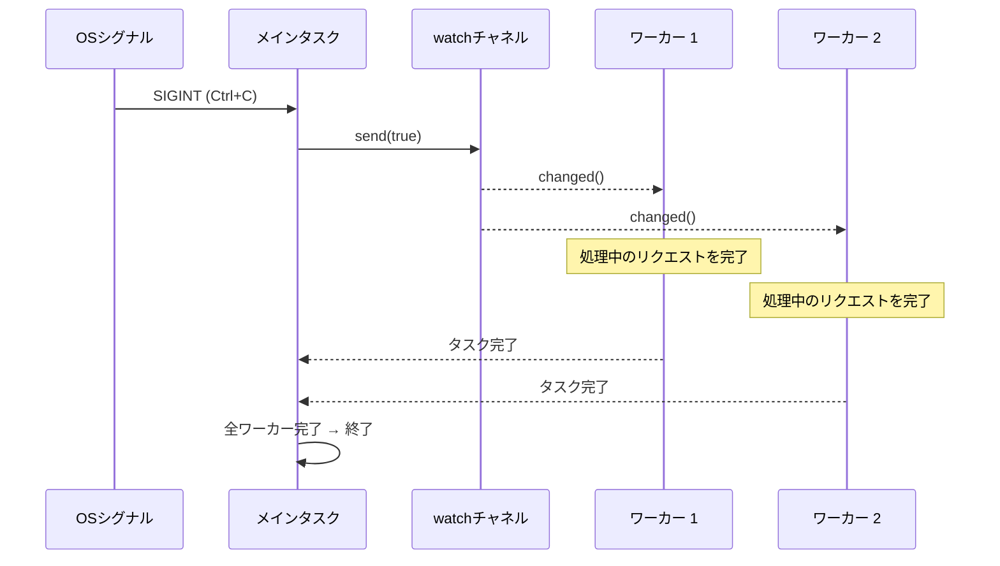

# 13. 本番環境のパターン 🔴

> **学習内容:**
> - `watch` チャネルと `select!` を用いたグレースフルシャットダウン
> - バックプレッシャー：バッファ付きチャネルによる OOM（メモリ枯渇）の防止
> - 構造化並行性：`JoinSet` と `TaskTracker`
> - タイムアウト、リトライ、指数関数的バックオフ
> - エラー処理：`thiserror` 対 `anyhow`、二重 `?` パターン
> - Tower：axum、tonic、hyper で使われるミドルウェアパターン

## グレースフルシャットダウン

本番環境のサーバーは正常に終了（シャットダウン）できなければなりません。処理中のリクエストを完了させ、バッファをフラッシュし、接続を閉じます：

```rust
use tokio::signal;
use tokio::sync::watch;

async fn main_server() {
    // シャットダウンシグナルチャネルを作成
    let (shutdown_tx, shutdown_rx) = watch::channel(false);

    // サーバーをスポーン
    let server_handle = tokio::spawn(run_server(shutdown_rx.clone()));

    // Ctrl+C を待機
    signal::ctrl_c().await.expect("Ctrl+Cの監視に失敗しました");
    println!("シャットダウンシグナルを受信しました。処理中のリクエストを完了させています...");

    // 全タスクにシャットダウンを通知
    // 注意: 簡潔さのため .unwrap() を使用しています。本番コードでは
    // すべての受信側がドロップされたケースを適切に処理してください。
    shutdown_tx.send(true).unwrap();

    // サーバーの完了を待機（タイムアウト付き）
    match tokio::time::timeout(
        std::time::Duration::from_secs(30),
        server_handle,
    ).await {
        Ok(Ok(())) => println!("サーバーは正常に終了しました"),
        Ok(Err(e)) => eprintln!("サーバーエラー: {e}"),
        Err(_) => eprintln!("サーバーのシャットダウンがタイムアウトしました — 強制終了します"),
    }
}

async fn run_server(mut shutdown: watch::Receiver<bool>) {
    loop {
        tokio::select! {
            // 新規接続の受け入れ
            conn = accept_connection() => {
                let shutdown = shutdown.clone();
                tokio::spawn(handle_connection(conn, shutdown));
            }
            // シャットダウンシグナル
            _ = shutdown.changed() => {
                if *shutdown.borrow() {
                    println!("新規接続の受け入れを停止します");
                    break;
                }
            }
        }
    }
    // 処理中の接続は自身の shutdown_rx クローンを持っているため、
    // 自律して完了します
}

async fn handle_connection(conn: Connection, mut shutdown: watch::Receiver<bool>) {
    loop {
        tokio::select! {
            request = conn.next_request() => {
                // リクエストを完全に処理 — 途中で放棄しない
                process_request(request).await;
            }
            _ = shutdown.changed() => {
                if *shutdown.borrow() {
                    // 現在のリクエストを完了してから終了
                    break;
                }
            }
        }
    }
}
```



### バッファ付きチャネルによるバックプレッシャー

容量無制限のチャネル（unbounded channel）は、プロデューサーがコンシューマーより高速な場合に OOM（メモリ枯渇）を引き起こす可能性があります。本番環境では常にバッファ付きチャネル（bounded channel）を使用してください：

```rust
use tokio::sync::mpsc;

async fn backpressure_example() {
    // バッファ付きチャネル: 最大100個のアイテムをバッファリング
    let (tx, mut rx) = mpsc::channel::<WorkItem>(100);

    // プロデューサー: バッファが満杯になると自然に減速する
    let producer = tokio::spawn(async move {
        for i in 0..1_000_000 {
            // send() は非同期 — バッファが満杯の場合は待機する
            // これにより自然なバックプレッシャーが生まれる！
            tx.send(WorkItem { id: i }).await.unwrap();
        }
    });

    // コンシューマー: 自身のペースでアイテムを処理する
    let consumer = tokio::spawn(async move {
        while let Some(item) = rx.recv().await {
            process(item).await; // 処理が遅くてもOK — プロデューサーが待機する
        }
    });

    let _ = tokio::join!(producer, consumer);
}

// 容量無制限の場合との比較 — 危険:
// let (tx, rx) = mpsc::unbounded_channel(); // バックプレッシャーなし！
// プロデューサーがメモリを無制限に消費する可能性がある
```

### 構造化並行性: JoinSet と TaskTracker

`JoinSet` は関連するタスクをグループ化し、それらがすべて完了することを保証します：

```rust
use tokio::task::JoinSet;
use tokio::time::{sleep, Duration};

async fn structured_concurrency() {
    let mut set = JoinSet::new();

    // タスクのバッチをスポーン
    for url in get_urls() {
        set.spawn(async move {
            fetch_and_process(url).await
        });
    }

    // すべての結果を収集（順序は保証されない）
    let mut results = Vec::new();
    while let Some(result) = set.join_next().await {
        match result {
            Ok(Ok(data)) => results.push(data),
            Ok(Err(e)) => eprintln!("タスクエラー: {e}"),
            Err(e) => eprintln!("タスクがパニックしました: {e}"),
        }
    }

    // すべてのタスクがここで完了 — 宙に浮いたバックグラウンド処理は残らない
    println!("{} 個のアイテムを処理しました", results.len());
}

// TaskTracker (tokio-util 0.7.9+) — スポーンされた全タスクの完了を待機
use tokio_util::task::TaskTracker;

async fn with_tracker() {
    let tracker = TaskTracker::new();

    for i in 0..10 {
        tracker.spawn(async move {
            sleep(Duration::from_millis(100 * i)).await;
            println!("タスク {i} 完了");
        });
    }

    tracker.close(); // これ以上のタスクは追加されない
    tracker.wait().await; // 追跡対象の全タスクの完了を待機
    println!("すべてのタスクが終了しました");
}
```

### タイムアウトとリトライ

```rust
use tokio::time::{timeout, sleep, Duration};

// 単純なタイムアウト
async fn with_timeout() -> Result<Response, Error> {
    match timeout(Duration::from_secs(5), fetch_data()).await {
        Ok(Ok(response)) => Ok(response),
        Ok(Err(e)) => Err(Error::Fetch(e)),
        Err(_) => Err(Error::Timeout),
    }
}

// 指数関数的バックオフによるリトライ
async fn retry_with_backoff<F, Fut, T, E>(
    max_attempts: u32,
    base_delay_ms: u64,
    operation: F,
) -> Result<T, E>
where
    F: Fn() -> Fut,
    Fut: std::future::Future<Output = Result<T, E>>,
    E: std::fmt::Display,
{
    let mut delay = Duration::from_millis(base_delay_ms);

    for attempt in 1..=max_attempts {
        match operation().await {
            Ok(result) => return Ok(result),
            Err(e) => {
                if attempt == max_attempts {
                    eprintln!("最終試行 {attempt} が失敗しました: {e}");
                    return Err(e);
                }
                eprintln!("試行 {attempt} が失敗しました: {e}。{delay:?} 後に再試行します");
                sleep(delay).await;
                delay *= 2; // 指数関数的バックオフ
            }
        }
    }
    unreachable!()
}

// 使用例:
// let result = retry_with_backoff(3, 100, || async {
//     reqwest::get("https://api.example.com/data").await
// }).await?;
```

> **本番運用のヒント — ジッター（揺らぎ）の追加**: 上記の関数は純粋な指数関数的バックオフを使用していますが、本番環境では多数のクライアントが同時に失敗した場合に全員が同じ間隔でリトライしてしまいます（サンダリングハード問題）。ランダムな「ジッター（jitter）」— 例えば `sleep(delay + rand_jitter)`（`rand_jitter` は `0..delay/4` の範囲など）— を追加して、リトライのタイミングを時間的に分散させてください。

### 非同期コードにおけるエラー処理

非同期処理では固有のエラー伝播の課題が生じます。スポーンされたタスクがエラー境界を形成し、タイムアウトエラーが内部エラーをラップし、Futureがタスク境界を跨ぐ際に `?` の挙動が変化するためです。

**`thiserror` 対 `anyhow`** — 適切なツールの選択：

```rust
// thiserror: ライブラリやパブリックAPI向けの型付きエラーを定義
// 各バリアントが明示的 — 呼び出し元が特定のエラーに対してマッチ可能
use thiserror::Error;

#[derive(Error, Debug)]
enum DiagError {
    #[error("IPMI command failed: {0}")]
    Ipmi(#[from] IpmiError),

    #[error("Sensor {sensor} out of range: {value}°C (max {max}°C)")]
    OverTemp { sensor: String, value: f64, max: f64 },

    #[error("Operation timed out after {0:?}")]
    Timeout(std::time::Duration),

    #[error("Task panicked: {0}")]
    TaskPanic(#[from] tokio::task::JoinError),
}

// anyhow: アプリケーションやプロトタイプ向けの迅速なエラー処理
// 任意のエラーをラップ可能 — ケースごとに型を定義する必要がない
use anyhow::{Context, Result};

async fn run_diagnostics() -> Result<()> {
    let config = load_config()
        .await
        .context("診断設定の読み込みに失敗しました")?;  // コンテキストの追加

    let result = run_gpu_test(&config)
        .await
        .context("GPU診断に失敗しました")?;              // コンテキストの連鎖

    Ok(())
}
// anyhow の出力例: "GPU診断に失敗しました: IPMI command failed: timeout"
```

| クレート | 使用場面 | エラー型 | マッチング |
|---------|----------|----------|------------|
| `thiserror` | ライブラリコード、パブリックAPI | `enum MyError { ... }` | `match err { MyError::Timeout => ... }` |
| `anyhow` | アプリケーション、CLIツール、スクリプト | `anyhow::Error`（型消去済み） | `err.downcast_ref::<MyError>()` |
| 両方の併用 | ライブラリが `thiserror` を公開し、アプリが `anyhow` でラップ | 両方のメリットを享受 | ライブラリのエラーは型付けされ、アプリ側は気にせず扱える |

**`tokio::spawn` における二重 `?` パターン**:

```rust
use thiserror::Error;
use tokio::task::JoinError;

#[derive(Error, Debug)]
enum AppError {
    #[error("HTTP error: {0}")]
    Http(#[from] reqwest::Error),

    #[error("Task panicked: {0}")]
    TaskPanic(#[from] JoinError),
}

async fn spawn_with_errors() -> Result<String, AppError> {
    let handle = tokio::spawn(async {
        let resp = reqwest::get("https://example.com").await?;
        Ok::<_, reqwest::Error>(resp.text().await?)
    });

    // 二重 ?: 1つ目の ? は JoinError（タスクのパニック）を展開し、2つ目の ? は内部の Result を展開する
    let result = handle.await??;
    Ok(result)
}
```

**エラー境界問題** — `tokio::spawn` によるコンテキストの消失：

```rust
// ❌ スポーンの境界を越えるとエラーコンテキストが失われる:
async fn bad_error_handling() -> Result<()> {
    let handle = tokio::spawn(async {
        some_fallible_work().await  // Result<T, SomeError> を返す
    });

    // handle.await は Result<Result<T, SomeError>, JoinError> を返す
    // 内部エラーには、どのタスクが失敗したのかというコンテキストが含まれない
    let result = handle.await??;
    Ok(())
}

// ✅ スポーン境界でコンテキストを追加する:
async fn good_error_handling() -> Result<()> {
    let handle = tokio::spawn(async {
        some_fallible_work()
            .await
            .context("ワーカタスクが失敗しました")  // 境界を越える前にコンテキストを付与
    });

    let result = handle.await
        .context("ワーカタスクがパニックしました")??;  // JoinError にもコンテキストを付与
    Ok(())
}
```

**タイムアウトエラー** — ラップするか置き換えるか：

```rust
use tokio::time::{timeout, Duration};

async fn with_timeout_context() -> Result<String, DiagError> {
    let dur = Duration::from_secs(30);
    match timeout(dur, fetch_sensor_data()).await {
        Ok(Ok(data)) => Ok(data),
        Ok(Err(e)) => Err(e),                      // 内部エラーを維持
        Err(_) => Err(DiagError::Timeout(dur)),     // タイムアウト → 型付きエラーに変換
    }
}
```

### Tower: ミドルウェアパターン

[Tower](https://docs.rs/tower) クレートは、合成可能な `Service` トレイトを定義しています。これはRustの非同期ミドルウェア（`axum`、`tonic`、`hyper` など）の基盤となっています：

```rust
// Towerのコアートレイト（簡略版）:
pub trait Service<Request> {
    type Response;
    type Error;
    type Future: Future<Output = Result<Self::Response, Self::Error>>;

    fn poll_ready(&mut self, cx: &mut Context<'_>) -> Poll<Result<(), Self::Error>>;
    fn call(&mut self, req: Request) -> Self::Future;
}
```

ミドルウェアは `Service` をラップして、内部のビジネスロジックを変更することなく、ロギング、タイムアウト、レート制限などの横断的関心事（cross-cutting concerns）を追加します：

```rust
use tower::{ServiceBuilder, timeout::TimeoutLayer, limit::RateLimitLayer};
use std::time::Duration;

let service = ServiceBuilder::new()
    .layer(TimeoutLayer::new(Duration::from_secs(10)))       // 最外層: タイムアウト
    .layer(RateLimitLayer::new(100, Duration::from_secs(1))) // 次層: レート制限
    .service(my_handler);                                     // 最内層: 独自のハンドラ
```

**これが重要な理由**: ASP.NET のミドルウェアや Express.js のミドルウェアを使ったことがあれば、Tower はまさにそれらに相当するRustの仕組みです。本番環境のRustサービスにおいて、コードの重複なしに横断的関心事を組み込む標準的な方法となっています。

### 演習: ワーカープールによるグレースフルシャットダウン

<details>
<summary>🏋️ 演習（クリックして展開）</summary>

**課題**: チャネルベースの作業キュー、N個のワーカタスク、およびCtrl+Cによるグレースフルシャットダウンを備えたタスクプロセッサを構築してください。ワーカーは終了する前に処理中の作業を完了させる必要があります。

<details>
<summary>🔑 解答</summary>

```rust
use tokio::sync::{mpsc, watch};
use tokio::time::{sleep, Duration};

struct WorkItem { id: u64, payload: String }

#[tokio::main]
async fn main() {
    let (work_tx, work_rx) = mpsc::channel::<WorkItem>(100);
    let (shutdown_tx, shutdown_rx) = watch::channel(false);
    let work_rx = std::sync::Arc::new(tokio::sync::Mutex::new(work_rx));

    let mut handles = Vec::new();
    for id in 0..4 {
        let rx = work_rx.clone();
        let mut shutdown = shutdown_rx.clone();
        handles.push(tokio::spawn(async move {
            loop {
                let item = {
                    let mut rx = rx.lock().await;
                    tokio::select! {
                        item = rx.recv() => item,
                        _ = shutdown.changed() => {
                            if *shutdown.borrow() { None } else { continue }
                        }
                    }
                };
                match item {
                    Some(work) => {
                        println!("ワーカー {id}: {} を処理中", work.id);
                        sleep(Duration::from_millis(200)).await;
                    }
                    None => break,
                }
            }
        }));
    }

    // 作業の投入
    for i in 0..20 {
        let _ = work_tx.send(WorkItem { id: i, payload: format!("task-{i}") }).await;
        sleep(Duration::from_millis(50)).await;
    }

    // Ctrl+C 受信時: シャットダウンを合図し、ワーカーを待機
    // 注意: 簡潔さのため .unwrap() を使用 — 本番環境ではエラーを適切に処理してください。
    tokio::signal::ctrl_c().await.unwrap();
    shutdown_tx.send(true).unwrap();
    for h in handles { let _ = h.await; }
    println!("正常に終了しました。");
}
```

</details>
</details>

> **重要なポイント — 本番環境のパターン**
> - 連携したグレースフルシャットダウンには `watch` チャネル ＋ `select!` を使用する
> - バッファ付きチャネル（`mpsc::channel(N)`）は**バックプレッシャー**を提供する — バッファが満杯のとき送信側がブロックされる
> - `JoinSet` と `TaskTracker` は**構造化並行性**を提供する：タスクグループの追跡、中断、待機を行う
> - ネットワーク操作には常にタイムアウトを設定する — `tokio::time::timeout(dur, fut)`
> - Tower の `Service` トレイトは、本番用Rustサービスにおける標準的なミドルウェアパターンである

> **関連情報:** チャネルと同期プリミティブについては [第8章 — Tokio詳細](ch08-tokio-deep-dive.md) を、シャットダウン中のキャンセルの危険性については [第12章 — よくある落とし穴](ch12-common-pitfalls.md) を参照してください。

---
