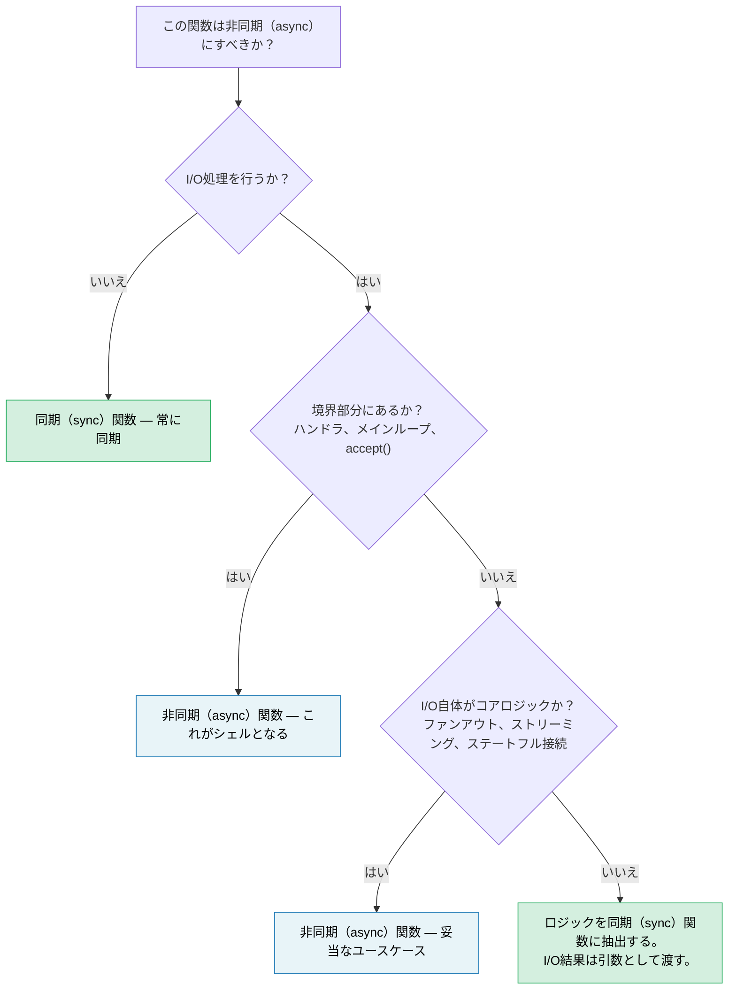

# 14. 非同期は最適化であり、アーキテクチャではない 🔴

> **学習内容:**
> - なぜ非同期はコードベース全体を侵食しがちなのか — そしてそれが機能（feature）ではなく設計上の欠陥（flaw）である理由
> - ほとんどのコードをテスト可能かつデバッグ可能に保つ「同期コア、非同期シェル（sync core, async shell）」パターン
> - 難しいケースの扱い方：I/Oも必要とするビジネスロジック
> - `spawn_blocking` が適切な解決策である場合と、設計問題の兆候である場合
> - 非同期がコアロジックに真に属するケースとは
> - なぜ非同期優先のライブラリよりも同期優先のライブラリの方が合成しやすいのか

ここまで13章にわたり非同期Rustを学んできました。ここで、本書がこれまで語ってこなかった最も重要な事実をお伝えします：**あなたの書くコードの大部分は、非同期であるべきではありません。**

## 関数の色分け問題（The Function Coloring Problem）

Bob Nystrom の名著 ["What Color is Your Function?"](https://journal.stuffwithstuff.com/2015/02/01/what-color-is-your-function/) は、この根本的な問題を指摘しています。非同期関数は同期関数を呼び出せますが、同期関数は非同期関数を呼び出せません。ひとたび1つの関数が非同期になると、コールチェーンの上流にあるすべての関数もそれに従わざるを得なくなります。

Rustにおいてはこの問題がC#やJavaScriptよりもさらに**深刻**です。なぜなら、非同期は関数のシグネチャだけでなく「型」までも汚染するからです：

| 同期コード | 非同期の相当物 | 違いの理由 |
|---|---|---|
| `fn process(&self)` | `async fn process(&self)` | 呼び出し元もすべて非同期にする必要がある |
| `&mut T` | `Arc<Mutex<T>>` | スポーンされたタスクには `'static + Send` が必要 |
| `std::sync::Mutex` | `tokio::sync::Mutex` | `.await` を跨いで保持する場合、異なる型が必要 |
| `impl Trait` 戻り値 | `impl Future<Output = T> + Send` | RPITIT（Rust 1.75、第10章）以降シンプルになったが、依然として色分けされる |
| `#[test]` | `#[tokio::test]` | テストにランタイムが必要になる |
| スタックトレース: 5フレーム | スタックトレース: 25フレーム | 半分がランタイム内部の処理で埋まる |

すべての行は、誰かが判断を下し、正しく実装し、保守し続けなければならない決定事項です。そして、そのいずれもビジネスロジックとは何の関係もありません。業界はこのアプローチから*離れつつ*あります。JavaのProject Loom（仮想スレッド）やGoのgoroutineは、ランタイムが低コストで多重化してくれる「同期のように見えるコード」を書けるようにしています。Rustはゼロコストの精密な制御のために明示的な非同期を選択しましたが、その制御には複雑さという代償が伴います。この代償は、デフォルトとして漫然と支払うのではなく、意識的に支払うべきものです。

## 「しかしスレッドはコストが高いのでは？」

反射的な反論としてよくあるのが、「スレッドは高コストだから非同期が必要だ」という意見です。しかし、多くのチームが扱う現実の規模において、この認識は大抵間違っています。

- **スタックメモリ:** 各OSスレッドは8MBの仮想アドレス空間（Linuxのデフォルト）を予約しますが、OSは実際にアクセスされたページのみを物理メモリにコミットします。ほぼアイドル状態のスレッドが消費する物理メモリは20〜80KB程度に過ぎません。
- **コンテキストスイッチ:** 現代のハードウェアでは約1〜5µsです。同時リクエストが50程度であれば、これは測定誤差（ノイズ）レベルです。秒間10万回のスイッチが発生して初めて測定可能な影響が出ます。
- **生成コスト:** Linux上で1スレッドあたり約10〜30µsです。スレッドプール（rayon、`std::thread::scope`）を使えば、このコストは実質ゼロに償却されます。

非同期がその複雑さに見合う価値を発揮する真の境界線は、およそ **1,000〜10,000の同時接続（大半がアイドル状態）** です。これは epoll / io_uring のスイートスポットであり、接続ごとのスタック確保が真のコストとなり始める領域です。それ以下の規模であれば、スレッドプールの方がシンプルで、デバッグが容易であり、十分な速度を発揮します。これを超える規模になって初めて、非同期が勝利します。そして世の中の大半のサービスは、この境界線の「下」に位置しています。

## 難しい例：I/Oも必要とするロジック

`fn add(a: i32, b: i32) -> i32` のような単純な純粋関数が非同期を必要としないのは自明です。それでは教訓になりません。興味深いのは、ビジネスロジックの処理の途中でI/Oが必要に見えるケースです。在庫を確認するバリデーション、為替レートを照会する価格計算、顧客情報を参照する注文パイプラインなどがこれに当たります。

注文処理サービスを考えてみましょう。「どこでも非同期（async-everywhere）」で書かれたコードは一見自然に見えます：

### バージョンA: コアまで非同期が侵食したコード

```rust
// orders.rs — どこまでも非同期が続く構造

pub async fn process_order(order: Order) -> Result<Receipt, OrderError> {
    // ステップ 1: 検証 — 純粋なビジネスルール、I/Oなし
    validate_items(&order)?;
    validate_quantities(&order)?;

    // ステップ 2: 在庫確認 — データベース呼び出しが必要
    let stock = inventory_client.check(&order.items).await?;
    if !stock.all_available() {
        return Err(OrderError::OutOfStock(stock.missing()));
    }

    // ステップ 3: 価格計算 — 純粋な計算だが、非同期関数内にあるため巻き込まれる
    let pricing = calculate_pricing(&order, &stock);

    // ステップ 4: 割引適用 — 外部サービスの呼び出しが必要
    let discount = discount_service.lookup(order.customer_id).await?;
    let final_price = pricing.apply_discount(discount);

    // ステップ 5: レシート作成 — 純粋な処理
    Ok(Receipt::new(order, final_price))
}
```

これは一見*妥当*な非同期コードに見えます。`Arc<Mutex>` を乱用しているわけでもなく、単に順次 await しているだけです。多くの開発者はこのように書いて先に進むでしょう。しかし、何が起きているかを見てください。`validate_items`、`validate_quantities`、`calculate_pricing`、`Receipt::new` はすべて純粋関数であるにもかかわらず、ステップ2と4がI/Oを必要とするという理由だけで非同期コンテキストに巻き込まれています。関数全体を `async` にしなければならず、そのテストにはランタイムが必要となり、コールチェーンの上流にあるすべての呼び出し元が「色分け」されてしまいます。

### バージョンB: 同期コア、非同期シェル（Sync Core, Async Shell）

別のアプローチをとってみましょう。「**何を決定するか**」と「**どのようにフェッチするか**」を分離するのです：

```rust
// core.rs — 純粋なビジネスロジック、非同期依存ゼロ、tokio依存ゼロ

pub fn validate_order(order: &Order) -> Result<ValidatedOrder, OrderError> {
    validate_items(order)?;
    validate_quantities(order)?;
    Ok(ValidatedOrder::from(order))
}

pub fn check_stock(
    order: &ValidatedOrder,
    stock: &StockResult,
) -> Result<StockedOrder, OrderError> {
    if !stock.all_available() {
        return Err(OrderError::OutOfStock(stock.missing()));
    }
    Ok(StockedOrder::from(order, stock))
}

pub fn finalize(
    order: &StockedOrder,
    discount: Discount,
) -> Receipt {
    let pricing = calculate_pricing(order);
    let final_price = pricing.apply_discount(discount);
    Receipt::new(order, final_price)
}
```

```rust
// shell.rs — 薄い非同期オーケストレータ
//
// 注意: ネットワーク呼び出しでの `?` には `impl From<reqwest::Error> for OrderError`
// （または統一されたエラー列挙型）が必要です。非同期エラー処理パターンについては第12章を参照してください。

use crate::core;

pub async fn process_order(order: Order) -> Result<Receipt, OrderError> {
    // 同期: 検証
    let validated = core::validate_order(&order)?;

    // 非同期: 在庫取得（これはシェルの責務）
    let stock = inventory_client.check(&validated.items).await?;

    // 同期: 取得したデータにビジネスルールを適用
    let stocked = core::check_stock(&validated, &stock)?;

    // 非同期: 割引情報の取得
    let discount = discount_service.lookup(order.customer_id).await?;

    // 同期: 確定処理
    Ok(core::finalize(&stocked, discount))
}
```

非同期シェルは、**「フェッチ → 決定 → フェッチ → 決定」のパイプライン**になります。各「決定」ステップは、外部に自分からアクセスするのではなく、I/Oの結果を入力引数として受け取る純粋な同期関数です。

### テストの違い

同期コアであれば、ランタイムやモックを一切使わずにすべてのビジネスルールをテストできます：

```rust
#[test]
fn out_of_stock_rejects_order() {
    let order = validated_order(vec![item("widget", 10)]);
    let stock = stock_result(vec![("widget", 3)]); // 3個しか在庫がない

    let result = core::check_stock(&order, &stock);
    assert_eq!(result.unwrap_err(), OrderError::OutOfStock(vec!["widget"]));
}

#[test]
fn discount_applied_correctly() {
    let order = stocked_order(100_00); // セント単位の価格
    let receipt = core::finalize(&order, Discount::Percent(15));
    assert_eq!(receipt.final_price, 85_00);
}
```

非同期シェルには、ロジックではなく配線（連携）を検証するための薄い*統合テスト*を1つ用意するだけで済みます：

```rust
#[tokio::test]
async fn process_order_integration() {
    let mock_inventory = mock_service(/* 在庫を返す */);
    let mock_discounts = mock_service(/* 10%割引を返す */);
    let receipt = process_order(sample_order()).await.unwrap();
    assert!(receipt.final_price > 0);
    // ロジックの正確性はすでに上記のコアテストで証明されている
}
```

### なぜこれが重要なのか

| 観点 | コアまで非同期 | 同期コア ＋ 非同期シェル |
|---|---|---|
| ランタイムなしでビジネスルールをテスト可能か | 不可 | **可能** |
| `#[tokio::test]` が必要な単体テストの数 | すべて | **統合テストのみ** |
| I/O障害とロジックエラーの混在 | 混在（両方に1つのResult型を使用） | **分離**（同期はロジックエラーを返し、シェルがI/Oエラーを処理） |
| CLI / WASM / バッチ処理での `validate_order` 再利用 | 不可（tokioを推移的に引き込む） | **可能**（純粋な `fn`） |
| ビジネスロジックを通るスタックトレース | ランタイムのフレームと混ざる | **クリーン** |
| 将来HTTPクライアントをgRPCに差し替える場合 | コア関数の変更が必要 | **シェルのみの変更で済む** |

重要な洞察は、**ステップ2とステップ4のI/O呼び出しは、ビジネスロジックの内部に存在する必要がまったくない**ということです。それらはビジネスロジックに対する**入力データ**に過ぎません。同期コアは `StockResult` や `Discount` を引数として受け取ります。それらの値がどこから取得されたのか（HTTP、gRPC、テストフィクスチャ、キャッシュなど）は、シェルの関心事です。

## `spawn_blocking` の悪臭（Code Smell）

第12章では、エグゼキュータを誤ってブロックしてしまう問題の対処療法として `spawn_blocking` を紹介しました。これは、`std::fs::read`、圧縮ライブラリ、レガシーなFFI関数など、単発のブロッキング呼び出しがある場合には適切な対処法です。

しかし、コードの大部分を `spawn_blocking` で囲んでいる自分に気づいたとしたら：

```rust
async fn handler(req: Request) -> Response {
    // もしこのようなコードベースになっているなら、境界線の設定場所が間違っている
    tokio::task::spawn_blocking(move || {
        let validated = validate(&req);       // 同期
        let enriched = enrich(validated);      // 同期
        let result = process(enriched);        // 同期
        let output = format_response(result);  // 同期
        output
    }).await.unwrap()
}
```

……それはコードベースがあなたに「**このロジックは最初から非同期である必要などなかった**」と警告しているサインです。あなたに必要なのは `spawn_blocking` ではなく、非同期ハンドラから直接呼び出せる同期モジュールです：

```rust
async fn handler(req: Request) -> Response {
    // validate → enrich → process → format はすべて同期関数。
    // spawn_blocking は不要 — 高速かつCPU負荷も極めて小さい。
    let response = my_core::handle(req);
    response
}
```

`spawn_blocking` は、実行時間が実際にエグゼキュータを飢餓状態に陥らせるほど重い、真のCPU負荷の高い処理（巨大なペイロードのパース、画像処理、圧縮など）のために取っておくべきです。マイクロ秒単位で完了する通常のビジネスロジックであれば、直接の同期呼び出しを行う方がシンプルであり、かつ正しい設計です。

## ライブラリの設計: 同期を基本とし、非同期ラッパーはオプションにする

境界線の問題は、ライブラリの作者にとってさらに大きな影響を持ちます。同期ライブラリは、同期と非同期のどちらの呼び出し元からも使用できます：

```rust
// 同期ライブラリ — どこからでも利用可能
let report = my_lib::analyze(&data);

// 呼び出し元 A: 同期CLI
fn main() {
    let report = my_lib::analyze(&data);
    println!("{report}");
}

// 呼び出し元 B: 非同期ハンドラ（問題なく動作）
async fn handler() -> Json<Report> {
    let report = my_lib::analyze(&data); // 非同期コンテキスト内での同期呼び出し — 問題なし
    Json(report)
}

// 呼び出し元 C: 重い解析処理 — 呼び出し元がオフロードを判断
async fn handler_heavy() -> Json<Report> {
    let data = data.clone();
    let report = tokio::task::spawn_blocking(move || {
        my_lib::analyze(&data) // 呼び出し元が非同期境界をコントロール
    }).await.unwrap();
    Json(report)
}
```

一方、非同期ライブラリは、**すべての**呼び出し元にランタイムの使用を強制します：

```rust
// 非同期ライブラリ — 非同期コンテキストからしか使用できない
let report = my_lib::analyze(&data).await; // 呼び出し元は必ず async でなければならない

// 同期の呼び出し元の場合: block_on を使う羽目になり、ネストしたランタイムがないことを祈るしかない
let report = tokio::runtime::Runtime::new().unwrap().block_on(
    my_lib::analyze(&data)
); // 壊れやすく、すでにランタイム内にいる場合はパニックを起こす
```

**デフォルトでは同期APIを提供してください。** ライブラリが行うのが純粋な計算、データ変換、パース処理であるなら、それを非同期にする理由はまったくありません。もしI/Oを伴うのであれば、同期コアを提供し、フィーチャーフラグの背後にオプションとして非同期の利便性レイヤーを提供する形を検討してください。境界をどうするかという決定権を、呼び出し側に委ねるのです。

## 非同期がコアに属するケース

あらゆるものを綺麗に分離できるわけではありません。以下のようなケースでは、非同期がコアロジックに真に属します：

- **ファンアウト / ファンインそのものがロジックである場合。** ビジネスルールが「5つの価格情報サービスに並行して問い合わせを行い、最安値を返す」というものであれば、その並行性*こそ*がロジックであり、単なる配線ではありません。これを同期 ＋ スレッドで無理に実現しようとするのは、劣化版の非同期機構を車輪の再発明しているだけです。

- **ストリーミングそのものがロジックである場合。** バックプレッシャーを伴う連続的なイベントストリームの処理 — ストリーム管理自体が重要なビジネスロジックであり、単なるI/Oラッパーではありません。

- **長寿命なステートフル接続。** WebSocketハンドラ、gRPC双方向ストリーム、プロトコル状態機械などは、状態遷移が本質的にI/Oイベントと結びついています。[第17章](ch17-capstone-project.md) の総合演習プロジェクト（非同期チャットサーバー）はまさにこのケースに該当します。並行接続、ルームごとのファンアウト、グレースフルシャットダウンは、根本的に非同期な処理です。

**判断基準:** 関数から `async` を取り除こうとしたとき、それをスレッド、チャネル、または手動のポーリングに置き換える必要があるなら、非同期はその役割を十分に果たしています。もし `async` キーワードを削除するだけで、他のコードを一切変更せずに済むのであれば、その関数は最初から非同期にする必要がなかったということです。

## 決定フロー



> **経験則:** まずは同期から始めましょう。非同期は最外層のI/O境界にのみ追加します。複雑さというコストに見合う「並行I/O操作」を明確に言語化できる場合にのみ、非同期を内側に引き込んでください。

---

<details>
<summary><strong>🏋️ 演習: 同期コアの抽出</strong>（クリックして展開）</summary>

以下の axum ハンドラは非同期に汚染されており、ビジネスロジックとI/Oが混ざり合っています。これを同期コアモジュールと薄い非同期シェルにリファクタリングしてください。

```rust
use axum::{Json, extract::Path};

async fn get_device_report(Path(device_id): Path<String>) -> Result<Json<Report>, AppError> {
    // HTTP経由でデバイスから生テレメトリを取得
    let raw = reqwest::get(format!("http://bmc-{device_id}/telemetry"))
        .await?
        .json::<RawTelemetry>()
        .await?;

    // ビジネスロジック: 生のセンサー読み取り値を校正済み（calibrated）値に変換
    let mut readings = Vec::new();
    for sensor in &raw.sensors {
        let calibrated = (sensor.raw_value as f64) * sensor.scale + sensor.offset;
        if calibrated < sensor.min_valid || calibrated > sensor.max_valid {
            return Err(AppError::SensorOutOfRange {
                name: sensor.name.clone(),
                value: calibrated,
            });
        }
        readings.push(CalibratedReading {
            name: sensor.name.clone(),
            value: calibrated,
            unit: sensor.unit.clone(),
        });
    }

    // ビジネスロジック: デバイスの健全性（health）を分類
    let critical_count = readings.iter()
        .filter(|r| r.value > 90.0)
        .count();
    let health = if critical_count > 2 { Health::Critical }
                 else if critical_count > 0 { Health::Warning }
                 else { Health::Ok };

    // インベントリサービスからデバイスのメタデータを取得
    let meta = reqwest::get(format!("http://inventory/devices/{device_id}"))
        .await?
        .json::<DeviceMetadata>()
        .await?;

    Ok(Json(Report {
        device_id,
        device_name: meta.name,
        health,
        readings,
        timestamp: chrono::Utc::now(),
    }))
}
```

**達成目標:**

1. 同期関数 `calibrate_sensors`、`classify_health`、`build_report` を持つ `core.rs` を作成する
2. データをフェッチしてから同期コアを呼び出す薄い非同期ハンドラを持つ `shell.rs` を作成する
3. センサーの範囲外エラー、健全性分類のしきい値、および通常レポートの検証を行う `#[test]`（`#[tokio::test]` ではない）を書く

**ヒント:**
- 同期コアは `RawTelemetry` と `DeviceMetadata` を入力として受け取るべきです。それらがHTTP経由で取得されたことを知る必要は一切ありません。
- テストフィクスチャを構築する小さなテストヘルパー関数（例: `raw_telemetry()`、`sensor()`、`reading()`、`device_meta()`）を定義する必要があります。それらのシグネチャは使用箇所から自明なものになります。

<details>
<summary>🔑 解答</summary>

```rust
// core.rs — 非同期への依存ゼロ

pub fn calibrate_sensors(raw: &RawTelemetry) -> Result<Vec<CalibratedReading>, AppError> {
    raw.sensors.iter().map(|sensor| {
        let calibrated = (sensor.raw_value as f64) * sensor.scale + sensor.offset;
        if calibrated < sensor.min_valid || calibrated > sensor.max_valid {
            return Err(AppError::SensorOutOfRange {
                name: sensor.name.clone(),
                value: calibrated,
            });
        }
        Ok(CalibratedReading {
            name: sensor.name.clone(),
            value: calibrated,
            unit: sensor.unit.clone(),
        })
    }).collect()
}

pub fn classify_health(readings: &[CalibratedReading]) -> Health {
    let critical_count = readings.iter()
        .filter(|r| r.value > 90.0)
        .count();
    if critical_count > 2 { Health::Critical }
    else if critical_count > 0 { Health::Warning }
    else { Health::Ok }
}

pub fn build_report(
    device_id: String,
    readings: Vec<CalibratedReading>,
    meta: &DeviceMetadata,
) -> Report {
    Report {
        device_id,
        device_name: meta.name.clone(),
        health: classify_health(&readings),
        readings,
        timestamp: chrono::Utc::now(),
    }
}
```

```rust
// shell.rs — 非同期境界のみを担当

pub async fn get_device_report(
    Path(device_id): Path<String>,
) -> Result<Json<Report>, AppError> {
    let raw = reqwest::get(format!("http://bmc-{device_id}/telemetry"))
        .await?
        .json::<RawTelemetry>()
        .await?;

    let readings = core::calibrate_sensors(&raw)?;

    let meta = reqwest::get(format!("http://inventory/devices/{device_id}"))
        .await?
        .json::<DeviceMetadata>()
        .await?;

    Ok(Json(core::build_report(device_id, readings, &meta)))
}
```

```rust
// core_tests.rs — ランタイム不要

// テストフィクスチャヘルパー — I/Oなしでデータを構築
fn sensor(name: &str, raw_value: f64, valid_range: std::ops::Range<f64>) -> RawSensor {
    RawSensor {
        name: name.into(),
        raw_value,
        scale: 1.0,
        offset: 0.0,
        min_valid: valid_range.start,
        max_valid: valid_range.end,
        unit: "unit".into(),
    }
}

fn raw_telemetry(sensors: Vec<RawSensor>) -> RawTelemetry {
    RawTelemetry { sensors }
}

fn reading(name: &str, value: f64) -> CalibratedReading {
    CalibratedReading { name: name.into(), value, unit: "unit".into() }
}

fn device_meta(name: &str) -> DeviceMetadata {
    DeviceMetadata { name: name.into() }
}

#[test]
fn sensor_out_of_range_rejected() {
    let raw = raw_telemetry(vec![sensor("gpu_temp", 105.0, 0.0..100.0)]);
    let result = core::calibrate_sensors(&raw);
    assert!(matches!(result, Err(AppError::SensorOutOfRange { .. })));
}

#[test]
fn health_classification() {
    let readings = vec![
        reading("a", 50.0),  // ok
        reading("b", 95.0),  // critical
        reading("c", 91.0),  // critical
        reading("d", 92.0),  // critical
    ];
    assert_eq!(core::classify_health(&readings), Health::Critical);
}

#[test]
fn normal_report() {
    let raw = raw_telemetry(vec![sensor("fan_rpm", 3000.0, 0.0..10000.0)]);
    let readings = core::calibrate_sensors(&raw).unwrap();
    let meta = device_meta("gpu-node-42");
    let report = core::build_report("dev-1".into(), readings, &meta);
    assert_eq!(report.health, Health::Ok);
    assert_eq!(report.readings.len(), 1);
}
```

**何が変わったか:** 非同期ハンドラは、ロジックとI/Oが混ざり合った30行のコードから、純粋なオーケストレーションを行う8行のコードになりました。ビジネスルール（校正の計算、範囲の検証、健全性のしきい値判定）は `#[test]` でテスト可能になり、実行時間はミリ秒単位となり、tokio、reqwest、あるいはHTTPモックサーバーへの依存が完全にゼロになりました。

</details>
</details>

---

> **重要なポイント:**
>
> 1. 非同期は **I/O多重化のための最適化** であり、アプリケーションのアーキテクチャではありません。ビジネスロジックの大半は同期処理です。
> 2. **同期コア、非同期シェル:** ビジネスルールは、I/Oの結果を引数として受け取る純粋な同期関数に保持します。非同期シェルはフェッチを調整し、コアを呼び出します。
> 3. 大きなブロックを `spawn_blocking` で囲んでいるなら、**境界線の位置が間違っています** — 代わりにそのロジックを同期モジュールにリファクタリングしてください。
> 4. **ライブラリはデフォルトで同期APIを提供すべきです。** 非同期ライブラリはすべての呼び出し元にランタイムを強制しますが、同期ライブラリであれば呼び出し元が非同期境界をコントロールできます。
> 5. 非同期が真価を発揮するのは、**ファンアウト/ファンイン、ストリーミング、ステートフル接続** です — 並行性*そのもの*がビジネスロジックであるケースです。
>
> **関連情報:** [第12章 — よくある落とし穴](ch12-common-pitfalls.md)（戦術的な修正としての spawn_blocking） · [第13章 — 本番環境のパターン](ch13-production-patterns.md)（バックプレッシャー、構造化並行性） · [第17章 — 総合演習: 非同期チャットサーバー](ch17-capstone-project.md)（非同期が適切なアーキテクチャである実例）
