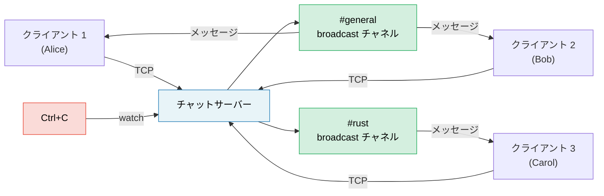

# 総合演習プロジェクト: 非同期チャットサーバー

このプロジェクトでは、本書全体で学んだパターンを統合し、実践的な本番スタイルの単一アプリケーションを構築します。tokio、チャネル、ストリーム、グレースフルシャットダウン、適切なエラー処理を活用して、**マルチルーム非同期チャットサーバー**を構築します。

**標準所要時間**: 4〜6時間 | **難易度**: ★★★

> **演習で実践する内容:**
> - `tokio::spawn` と `'static` 境界の要件（第8章）
> - チャネル：メッセージ用の `mpsc`、ルーム用の `broadcast`、シャットダウン用の `watch`（第8章）
> - ストリーム：TCP接続からの行の読み取り（第11章）
> - よくある落とし穴：キャンセル安全性、`.await` を跨いだ MutexGuard（第12章）
> - 本番環境のパターン：グレースフルシャットダウン、バックプレッシャー（第13章）
> - プラガブルなバックエンドのための非同期トレイト（第10章）

## 課題の概要

以下の仕様を満たす TCP チャットサーバーを構築してください：

1. **クライアント** は TCP 経由で接続し、名前付きルームに参加する
2. **メッセージ** は同じルーム内のすべてのクライアントにブロードキャストされる
3. **コマンド**: `/join <room>`、`/nick <name>`、`/rooms`、`/quit`
4. サーバーは Ctrl+C で正常に終了（グレースフルシャットダウン）し、処理中のメッセージを完了させる



## ステップ 1: 基本的な TCP Accept ループ

まずは接続を受け入れ、受信した行を送り返す（エコーする）サーバーから始めます：

```rust
use tokio::io::{AsyncBufReadExt, AsyncWriteExt, BufReader};
use tokio::net::TcpListener;

#[tokio::main]
async fn main() -> anyhow::Result<()> {
    let listener = TcpListener::bind("127.0.0.1:8080").await?;
    println!("チャットサーバーが :8080 でリッスン中");

    loop {
        let (socket, addr) = listener.accept().await?;
        println!("[{addr}] 接続されました");

        tokio::spawn(async move {
            let (reader, mut writer) = socket.into_split();
            let mut reader = BufReader::new(reader);
            let mut line = String::new();

            loop {
                line.clear();
                match reader.read_line(&mut line).await {
                    Ok(0) | Err(_) => break,
                    Ok(_) => {
                        let _ = writer.write_all(line.as_bytes()).await;
                    }
                }
            }
            println!("[{addr}] 切断されました");
        });
    }
}
```

**課題**: これがコンパイルでき、`telnet localhost 8080`（または `nc localhost 8080`）で動作することを確認してください。

## ステップ 2: Broadcast チャネルによるルーム状態の管理

各ルームは `broadcast::Sender` です。ルーム内のすべてのクライアントがサブスクライブ（購読）してメッセージを受信します。

```rust
use std::collections::HashMap;
use std::sync::Arc;
use tokio::sync::{broadcast, RwLock};

type RoomMap = Arc<RwLock<HashMap<String, broadcast::Sender<String>>>>;

fn get_or_create_room(rooms: &mut HashMap<String, broadcast::Sender<String>>, name: &str) -> broadcast::Sender<String> {
    rooms.entry(name.to_string())
        .or_insert_with(|| {
            let (tx, _) = broadcast::channel(100); // 100件のメッセージバッファ
            tx
        })
        .clone()
}
```

**課題**: 以下の仕様を満たすようにルーム状態を実装してください：
- クライアントは最初に `#general` に参加する
- `/join <room>` でルームを切り替える（古いルームからアンサブスクライブし、新しいルームをサブスクライブする）
- メッセージは送信者の現在のルームにいるすべてのクライアントにブロードキャストされる

<details>
<summary>💡 ヒント — クライアントタスクの構造</summary>

各クライアントタスクには、並行して動作する2つのループが必要です：
1. **TCP からの読み取り** → コマンドをパースするか、ルームへブロードキャストする
2. **broadcast レシーバーからの読み取り** → TCP へ書き込む

`tokio::select!` を使って両方を同時に実行します：

```rust
loop {
    tokio::select! {
        // クライアントから行を受信
        result = reader.read_line(&mut line) => {
            match result {
                Ok(0) | Err(_) => break,
                Ok(_) => {
                    // コマンドのパース、またはメッセージのブロードキャスト
                }
            }
        }
        // ルームのブロードキャストを受信
        result = room_rx.recv() => {
            match result {
                Ok(msg) => {
                    let _ = writer.write_all(msg.as_bytes()).await;
                }
                Err(_) => break,
            }
        }
    }
}
```

</details>

## ステップ 3: コマンドの実装

コマンドプロトコルを実装します：

| コマンド | 動作 |
|---------|------|
| `/join <room>` | 現在のルームを退出して新しいルームに参加し、両方のルームに通知する |
| `/nick <name>` | 表示名を変更する |
| `/rooms` | すべてのアクティブなルームと参加者数を一覧表示する |
| `/quit` | 正常に切断する |
| それ以外 | チャットメッセージとしてブロードキャストする |

**課題**: 入力行からコマンドをパースしてください。`/rooms` については `RoomMap` から読み取る必要があります。他のクライアントの処理をブロックしないよう `RwLock::read()` を使用してください。

## ステップ 4: グレースフルシャットダウン

以下の動作を行うよう、Ctrl+C のハンドリングを追加してください：
1. 新規接続の受け入れを停止する
2. すべてのルームに "Server shutting down..." を送信する
3. 処理中のメッセージが排出（ドレイン）されるのを待つ
4. 正常に終了する

```rust
use tokio::sync::watch;

let (shutdown_tx, shutdown_rx) = watch::channel(false);

// accept ループ内:
loop {
    tokio::select! {
        result = listener.accept() => {
            let (socket, addr) = result?;
            // shutdown_rx.clone() とともにクライアントタスクをスポーン
        }
        _ = tokio::signal::ctrl_c() => {
            println!("シャットダウンシグナルを受信しました");
            shutdown_tx.send(true)?;
            break;
        }
    }
}
```

**課題**: 各クライアントの `select!` ループに `shutdown_rx.changed()` を追加し、シャットダウンが通知されたときにクライアントが終了するようにしてください。

## ステップ 5: エラー処理とエッジケース

サーバーを本番向けに堅牢化します：

1. **遅延レシーバー（Lagging receivers）**: 受信が遅いクライアントがメッセージを取りこぼした場合、`broadcast::recv()` は `RecvError::Lagged(n)` を返します。クラッシュさせずに適切に処理してください（ログを出力して処理を続行）。
2. **ニックネームの検証**: 空のニックネームや長すぎるニックネームを拒否します。
3. **バックプレッシャー**: broadcast チャネルのバッファは有限（100）です。処理が追いつかないクライアントは `Lagged` エラーを受け取ります。
4. **タイムアウト**: 5分以上アイドルのクライアントを切断します。

```rust
use tokio::time::{timeout, Duration};

// 読み取りをタイムアウトでラップ:
match timeout(Duration::from_secs(300), reader.read_line(&mut line)).await {
    Ok(Ok(0)) | Ok(Err(_)) | Err(_) => break, // EOF、エラー、またはタイムアウト
    Ok(Ok(_)) => { /* 行を処理 */ }
}
```

## ステップ 6: 統合テスト

サーバーを起動し、2つのクライアントを接続してメッセージの配信を検証するテストを作成してください：

```rust
#[tokio::test]
async fn two_clients_can_chat() {
    // バックグラウンドでサーバーを起動
    let server = tokio::spawn(run_server("127.0.0.1:0")); // ポート0 = OSが自動選択

    // 2つのクライアントを接続
    let mut client1 = TcpStream::connect(addr).await.unwrap();
    let mut client2 = TcpStream::connect(addr).await.unwrap();

    // クライアント1がメッセージを送信
    client1.write_all(b"Hello from client 1\n").await.unwrap();

    // クライアント2がそれを受信することを確認
    let mut buf = vec![0u8; 1024];
    let n = client2.read(&mut buf).await.unwrap();
    let msg = String::from_utf8_lossy(&buf[..n]);
    assert!(msg.contains("Hello from client 1"));
}
```

## 評価基準

| 項目 | 目標 |
|------|------|
| 並行性 | ブロッキングすることなく、複数ルームの複数クライアントを並行処理できること |
| 正確性 | メッセージが同じルーム内のクライアントにのみ届くこと |
| グレースフルシャットダウン | Ctrl+C でメッセージを排出して正常終了すること |
| エラー処理 | 遅延レシーバー、切断、タイムアウトが適切に処理されていること |
| コード構成 | accept ループ、クライアントタスク、ルーム状態がきれいに分離されていること |
| テスト | 少なくとも2つの統合テストがあること |

## 発展課題のアイデア

基本的なチャットサーバーが完成したら、以下の拡張に挑戦してみましょう：

1. **メッセージ履歴の永続化**: 各ルームの最新N件のメッセージを保存し、新しく参加したメンバーに再送する
2. **WebSocket対応**: `tokio-tungstenite` を使用して、TCP と WebSocket の両方のクライアントを受け入れる
3. **レート制限**: `tokio::time::Interval` を使用して、クライアントごとの秒間メッセージ数を制限する
4. **メトリクス**: `prometheus` クレートを使用して、接続クライアント数、秒間メッセージ数、ルーム数を追跡する
5. **TLS対応**: 暗号化接続のために `tokio-rustls` を導入する

---
