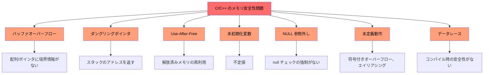
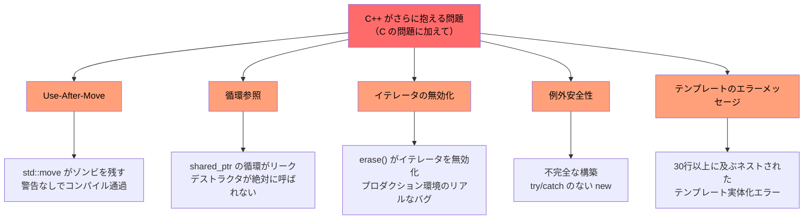
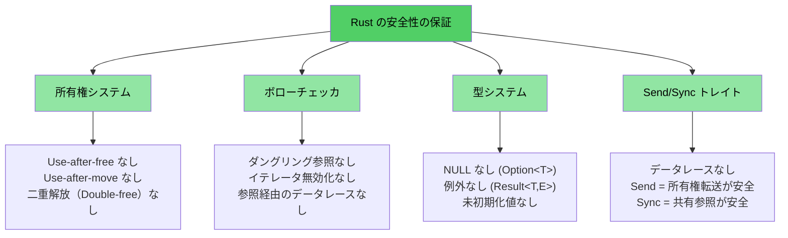

# なぜC/C++開発者にRustが必要なのか

> **ここで学ぶこと:**
> - Rust が排除する問題の全容 — メモリ安全性、未定義動作、データレースなど
> - なぜ `shared_ptr`、`unique_ptr` などの C++ の緩和策が「根本的解決」ではなく「対症療法（絆創膏）」にすぎないのか
> - セーフ Rust（safe Rust）では構造上発生し得ない、具体的な C および C++ の脆弱性の例

> **すぐにコードを見たいですか？** [コードを見てみよう](ch02-getting-started.md#enough-talk-already-show-me-some-code) へジャンプしてください。

## Rust が排除する問題 — 完全リスト

具体例に入る前に、要約を示します。セーフ Rust（safe Rust）は、プログラマの規律や静的解析ツール、コードレビューに頼ることなく、型システムとコンパイラによって以下のリストのすべての問題を**構造的に防止**します。

| **排除される問題** | **C** | **C++** | **Rust がどのように防止するか** |
|-------------------|:---:|:---:|---------------------------------|
| バッファオーバーフロー / アンダーフロー | ✅ | ✅ | すべての配列、スライス、文字列は境界情報を保持し、インデックスアクセスは実行時に境界チェックされます |
| メモリリーク（GC 不要） | ✅ | ✅ | `Drop` トレイト = 洗練された RAII。自動クリーンアップにより Rule of Five は不要 |
| ダングリングポインタ | ✅ | ✅ | ライフタイムシステムにより、参照が参照先の生存期間を超えないことをコンパイル時に証明します |
| Use-after-free | ✅ | ✅ | 所有権システムによりコンパイルエラーとして検出されます |
| Use-after-move | — | ✅ | ムーブは**破壊的**です — 元のバインディング（変数）は消滅します |
| 未初期化変数 | ✅ | ✅ | すべての変数は使用前に初期化が必須であり、コンパイラがこれを強制します |
| 整数オーバーフロー / アンダーフローによる未定義動作 | ✅ | ✅ | デバッグビルドではオーバーフロー時にパニックし、リリースビルドではラップします（どちらも定義された動作です） |
| NULL ポインタの参照外し / SEGV | ✅ | ✅ | null ポインタは存在しません。`Option<T>` により明示的なハンドリングが強制されます |
| データレース | ✅ | ✅ | `Send`/`Sync` トレイトとボローチェッカにより、データレースはコンパイルエラーになります |
| 制御不能な副作用 | ✅ | ✅ | デフォルトで不変（イミュータブル）です。変更には明示的な `mut` が必要です |
| 継承の排除（保守性の向上） | — | ✅ | クラス継承の代わりにトレイトと合成（コンポジション）を採用。密結合を避けつつ再利用性を高めます |
| 例外の排除による予測可能な制御フロー | — | ✅ | エラーは値（`Result<T, E>`）です。無視することはできず、隠れた `throw` パスもありません |
| イテレータの無効化 | — | ✅ | ボローチェッカにより、反復処理中のコレクションの変更は禁止されます |
| 循環参照 / ファイナライザのリーク | — | ✅ | 所有権はツリー構造を成します。`Rc` の循環は明示的な選択肢であり、`Weak` で検知・回避できます |
| Mutex のアンロック忘れ | ✅ | ✅ | `Mutex<T>` はデータを包み込みます。ロックガード経由でのみアクセス可能です |
| 未定義動作（全般） | ✅ | ✅ | セーフ Rust には未定義動作が**一切ありません**。`unsafe` ブロックは明示的かつ監査可能です |

> **要点:** これらはコーディング規約によって強制される単なる努力目標ではありません。**コンパイル時の保証**です。コードがコンパイルを通るなら、これらのバグは存在し得ません。

---

## C と C++ に共通する問題

> **例をスキップしたいですか？** [Rust はこれらにどう対処するか](#how-rust-addresses-all-of-this) へ進むか、直接 [コードを見てみよう](ch02-getting-started.md#enough-talk-already-show-me-some-code) へジャンプしてください。

両言語とも、CVE（共通脆弱性識別子）の70%以上の根本原因となっている共通のメモリ安全性問題を抱えています。

### バッファオーバーフロー

C の配列、ポインタ、文字列には本質的な境界情報がありません。そのため、境界を超えることは極めて容易です：

```c
#include <stdlib.h>
#include <string.h>

void buffer_dangers() {
    char buffer[10];
    strcpy(buffer, "This string is way too long!");  // バッファオーバーフロー

    int arr[5] = {1, 2, 3, 4, 5};
    int *ptr = arr;           // サイズ情報が失われる
    ptr[10] = 42;             // 境界チェックなし — 未定義動作
}
```

C++ でも、`std::vector::operator[]` は依然として境界チェックを行いません。チェックを行うのは `.at()` だけですが、その例外を誰がキャッチしているでしょうか？

### ダングリングポインタと Use-After-Free

```c
int *bar() {
    int i = 42;
    return &i;    // スタック変数のアドレスを返している — ダングリング！
}

void use_after_free() {
    char *p = (char *)malloc(20);
    free(p);
    *p = '\0';   // 解放後メモリの使用（Use-after-free）— 未定義動作
}
```

### 未初期化変数と未定義動作

C と C++ はどちらも未初期化変数を許容します。その結果得られる値は不定（indeterminate）であり、それを読み取ることは未定義動作です：

```c
int x;               // 未初期化
if (x > 0) { ... }  // 未定義動作 — x は何が入っているか分からない
```

整数のオーバーフローは、C では符号なし型については**定義済み**ですが、符号付き型では**未定義動作**です。C++ でも符号付きオーバーフローは未定義動作です。どちらのコンパイラも、この未定義動作を利用して「最適化」を行い、予期せぬ形でプログラムを破壊することがあります。

### NULL ポインタの参照外し

```c
int *ptr = NULL;
*ptr = 42;           // SEGV（セグメンテーション違反）— しかしコンパイラは止めてくれない
```

C++ では `std::optional<T>` が助けになりますが、記述が冗長であり、例外を投げる `.value()` で安易にバイパスされてしまうことが多々あります。

### 視覚化: 共通の問題



---

## C++ がさらに抱える問題

> **C 言語の読者へ**: C++ を使用しない場合は、[Rust はこれらにどう対処するか](#how-rust-addresses-all-of-this) までスキップして構いません。
>
> **すぐにコードを見たいですか？** [コードを見てみよう](ch02-getting-started.md#enough-talk-already-show-me-some-code) へジャンプしてください。

C++ は C の問題に対処するために、スマートポインタ、RAII、ムーブセマンティクス、例外を導入しました。しかし、これらは**根本的な解決ではなく対症療法（絆創膏）** にすぎません。障害モードを「実行時のクラッシュ」から「実行時のより発見困難なバグ」へとずらしただけです。

### `unique_ptr` と `shared_ptr` — 対症療法であり、解決策ではない

C++ のスマートポインタは生の `malloc`/`free` に比べて大幅な進歩ですが、根本的な問題を解決していません：

| C++ の緩和策 | 解決すること | **解決しない**こと |
|--------------|-------------|-------------------|
| `std::unique_ptr` | RAII によるリーク防止 | **Use-after-move** は依然コンパイルが通り、ゾンビ nullptr を残す |
| `std::shared_ptr` | 共有所有権 | **循環参照** は静かにリークする。`weak_ptr` の運用は手動規律に依存 |
| `std::optional` | 一部の null 使用を置換 | 空の場合、`.value()` は**例外をスロー**する（隠れた制御フロー） |
| `std::string_view` | コピーの回避 | 元の文字列が解放されると**ダングリング**する（ライフタイム検査なし） |
| ムーブセマンティクス | 効率的な所有権移動 | ムーブ元オブジェクトは**「有効だが未規定の状態」**になり、未定義動作の温床となる |
| RAII | 自動クリーンアップ | 正しく機能させるには **Rule of Five** の遵守が必要。1つのミスですべてが破綻する |

```cpp
// unique_ptr: use-after-move が正常にコンパイルを通ってしまう
std::unique_ptr<int> ptr = std::make_unique<int>(42);
std::unique_ptr<int> ptr2 = std::move(ptr);
std::cout << *ptr;  // コンパイルが通ってしまう！実行時に未定義動作。
                     // Rust ではコンパイルエラー: "value used after move"
```

```cpp
// shared_ptr: 循環参照が静かにリークする
struct Node {
    std::shared_ptr<Node> next;
    std::shared_ptr<Node> parent;  // 循環！デストラクタが絶対に呼ばれない。
};
auto a = std::make_shared<Node>();
auto b = std::make_shared<Node>();
a->next = b;
b->parent = a;  // メモリリーク — 参照カウントが 0 にならない
                 // Rust では Rc<T> + Weak<T> により循環参照を明示的かつ解消可能にする
```

### Use-after-move — 静かな暗殺者

C++ の `std::move` はムーブではなく、単なるキャストです。元のオブジェクトは「有効だが未規定の状態」のまま残ります。コンパイラはそれを使用し続けることを許容します：

```cpp
auto vec = std::make_unique<std::vector<int>>({1, 2, 3});
auto vec2 = std::move(vec);
vec->size();  // コンパイルが通る！しかし nullptr を参照外しして実行時クラッシュ
```

Rust では、ムーブは**破壊的**です。元のバインディングは消滅します：

```rust
let vec = vec![1, 2, 3];
let vec2 = vec;           // ムーブ — vec は消費される
// vec.len();             // コンパイルエラー: ムーブされた値の使用
```

### イテレータの無効化 — 実世界の C++ プロダクションコードに見られるバグ

これらは架空の例ではありません。大規模な C++ コードベースで実際に見つかった**リアルなバグパターン**です：

```cpp
// バグ 1: イテレータの再代入なしの erase（未定義動作）
while (it != pending_faults.end()) {
    if (*it != nullptr && (*it)->GetId() == fault->GetId()) {
        pending_faults.erase(it);   // ← イテレータが無効化される！
        removed_count++;            //   次のループでダングリングイテレータが使われる
    } else {
        ++it;
    }
}
// 修正: it = pending_faults.erase(it);
```

```cpp
// バグ 2: インデックスベースの erase が要素をスキップする
for (auto i = 0; i < entries.size(); i++) {
    if (config_status == ConfigDisable::Status::Disabled) {
        entries.erase(entries.begin() + i);  // ← 要素が前にシフトする
    }                                         //   i++ によりシフトした要素がスキップされる
}
```

```cpp
// バグ 3: 一方の erase パスのみ正しく、もう一方が誤り
while (it != incomplete_ids.end()) {
    if (current_action == nullptr) {
        incomplete_ids.erase(it);  // ← バグ: イテレータが再代入されていない
        continue;
    }
    it = incomplete_ids.erase(it); // ← 正しいパス
}
```

**これらは警告すら出ずにコンパイルが通ります。** Rust では、ボローチェッカによってこれら3つすべてがコンパイルエラーになります。コレクションの反復処理中にそのコレクションを変更することは、一切許可されません。

### 例外安全性と `dynamic_cast`/`new` パターン

モダン C++ のコードベースであっても、コンパイル時の安全性が全くないパターンに依然として大きく依存しています：

```cpp
// 典型的な C++ ファクトリパターン — すべての分岐が潜在的なバグ
DriverBase* driver = nullptr;
if (dynamic_cast<ModelA*>(device)) {
    driver = new DriverForModelA(framework);
} else if (dynamic_cast<ModelB*>(device)) {
    driver = new DriverForModelB(framework);
}
// driver が依然として nullptr だったら？ new が例外を投げたら？ driver の所有者は誰か？
```

典型的な10万行規模の C++ コードベースでは、何百もの `dynamic_cast` 呼び出し（それぞれが潜在的な実行時障害）、何百もの生 `new` 呼び出し（それぞれが潜在的なリーク）、そして何百もの `virtual`/`override` メソッド（いたるところにある vtable のオーバーヘッド）が見受けられます。

### ダングリング参照とラムダのキャプチャ

```cpp
int& get_reference() {
    int x = 42;
    return x;  // ダングリング参照 — コンパイルは通るが実行時に未定義動作
}

auto make_closure() {
    int local = 42;
    return [&local]() { return local; };  // ダングリングキャプチャ！
}
```

### 視覚化: C++ がさらに抱える問題



---

## Rust はこれらにどう対処するか

上記に挙げた問題（C と C++ の両方）のすべてが、Rust のコンパイル時保証によって防止されます：

| 問題 | Rust による解決策 |
|------|------------------|
| バッファオーバーフロー | スライスが長さを保持し、インデックスアクセスは境界チェックされる |
| ダングリングポインタ / Use-after-free | ライフタイムシステムが参照の有効性をコンパイル時に証明する |
| Use-after-move | ムーブは破壊的であり、コンパイラが元の変数へのアクセスを拒絶する |
| メモリリーク | `Drop` トレイト = Rule of Five なしの RAII。自動的かつ正確なクリーンアップ |
| 循環参照 | 所有権はツリー構造を成す。`Rc` + `Weak` で循環を明示化する |
| イテレータの無効化 | ボローチェッカが、コレクションの借用中の変更を禁止する |
| NULL ポインタ | null は存在しない。`Option<T>` がパターンマッチングによる明示的ハンドリングを強制する |
| データレース | `Send`/`Sync` トレイトがデータレースをコンパイルエラーにする |
| 未初期化変数 | すべての変数は初期化が必須であり、コンパイラが強制する |
| 整数オーバーフローによる未定義動作 | デバッグではオーバーフロー時にパニック、リリースではラップ（どちらも定義された動作） |
| 例外 | 例外なし。`Result<T, E>` が型のシグネチャに現れ、`?` で伝播される |
| 継承の複雑さ | トレイト + 合成。菱形継承問題や vtable の脆弱性がない |
| Mutex のアンロック忘れ | `Mutex<T>` がデータを包み込む。ロックガードのみが唯一のアクセス経路 |

```rust
fn rust_prevents_everything() {
    // ✅ バッファオーバーフローなし — 境界チェック
    let arr = [1, 2, 3, 4, 5];
    // arr[10];  // 実行時にパニック（未定義動作には絶対にならない）

    // ✅ Use-after-move なし — コンパイルエラー
    let data = vec![1, 2, 3];
    let moved = data;
    // data.len();  // エラー: ムーブされた値の使用

    // ✅ ダングリングポインタなし — ライフタイムエラー
    // let r;
    // { let x = 5; r = &x; }  // エラー: x の生存期間が不十分

    // ✅ null なし — Option による処理の強制
    let maybe: Option<i32> = None;
    // maybe.unwrap();  // パニックするが、通常は match や if let を使用する

    // ✅ データレースなし — コンパイルエラー
    // let mut shared = vec![1, 2, 3];
    // std::thread::spawn(|| shared.push(4));  // エラー: クロージャが借用した値より長く生存する可能性がある
    // shared.push(5);
}
```

### Rust の安全モデル — 全体像



## クイックリファレンス: C vs C++ vs Rust

| **概念** | **C** | **C++** | **Rust** | **主な違い** |
|---|---|---|---|---|
| メモリ管理 | `malloc()/free()` | `unique_ptr`, `shared_ptr` | `Box<T>`, `Rc<T>`, `Arc<T>` | 自動管理、循環参照なし、ゾンビなし |
| 配列 | `int arr[10]` | `std::vector<T>`, `std::array<T>` | `Vec<T>`, `[T; N]` | デフォルトで境界チェックあり |
| 文字列 | `\0` 終端の `char*` | `std::string`, `string_view` | `String`, `&str` | UTF-8 保証、ライフタイム検証 |
| 参照 | `int*` (生ポインタ) | `T&`, `T&&` (ムーブ) | `&T`, `&mut T` | ライフタイム + ボローチェック |
| ポリモーフィズム | 関数ポインタ | 仮想関数、継承 | トレイト、トレイトオブジェクト | 継承よりも合成（コンポジション）を優先 |
| ジェネリクス | マクロ / `void*` | テンプレート | ジェネリクス + トレイト境界 | 明確で分かりやすいエラーメッセージ |
| エラー処理 | リターンコード, `errno` | 例外, `std::optional` | `Result<T, E>`, `Option<T>` | 隠れた制御フローなし |
| NULL 安全性 | `ptr == NULL` | `nullptr`, `std::optional<T>` | `Option<T>` | null チェックの強制 |
| スレッド安全性 | 手動 (pthreads) | 手動 (`std::mutex` など) | コンパイル時の `Send`/`Sync` | データレースが原理的に発生不可能 |
| ビルドシステム | Make, CMake | CMake, Make など | Cargo | 統合ツールチェーン |
| 未定義動作 | 蔓延 | 検出困難（符号付きオーバーフロー、エイリアシング） | セーフコード内ではゼロ | 安全性を保証 |

***
