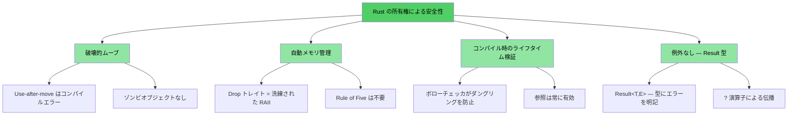
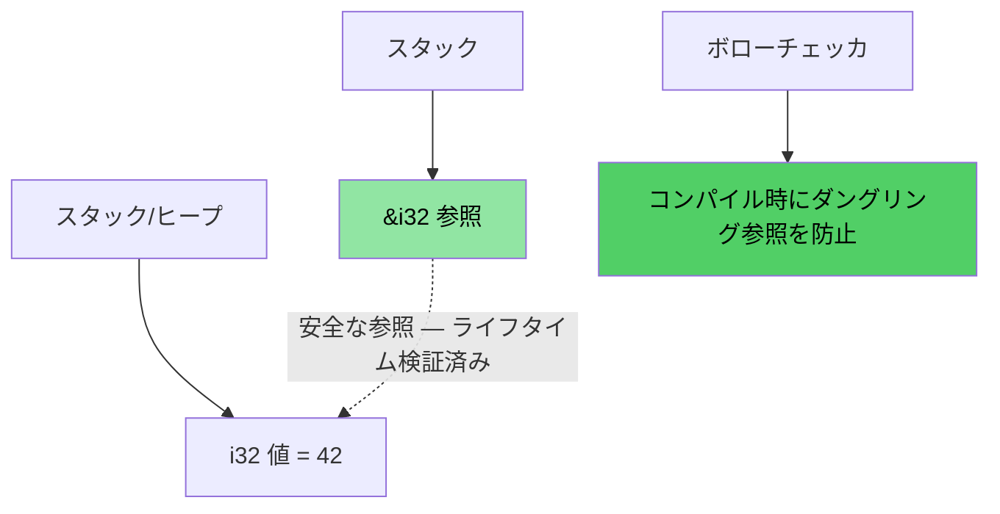
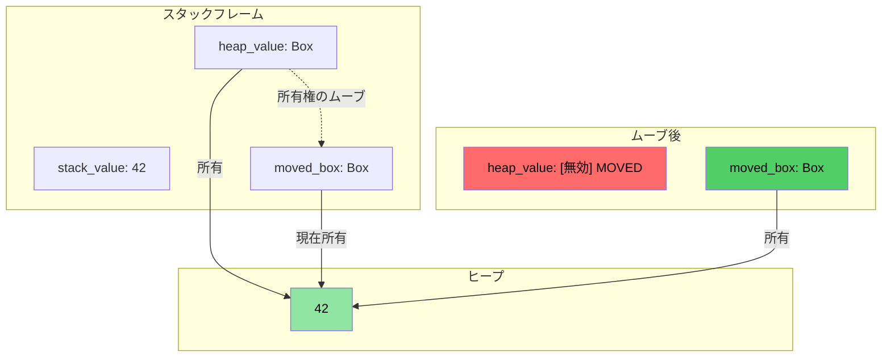
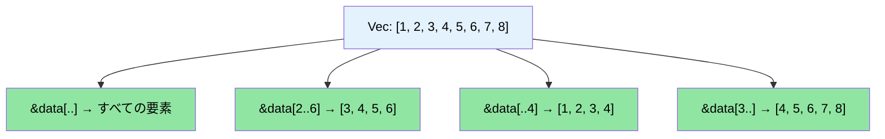

# 講師紹介とアプローチ

> **ここで学ぶこと:** コースの構成、双方向形式の進め方、そして使い慣れた C/C++ の概念がどのように Rust の対応物にマッピングされるかについて学びます。本章では、前提事項を明確にし、本書のロードマップを提示します。

- 講師紹介
    - Microsoft SCHIE（Silicon and Cloud Hardware Infrastructure Engineering）チーム所属のプリンシパルファームウェアアーキテクト
    - セキュリティ、システムプログラミング（ファームウェア、オペレーティングシステム、ハイパーバイザ）、CPUおよびプラットフォームアーキテクチャ、C++システムを専門とする業界のエキスパート
    - 2017年にAWS EC2でRustプログラミングを開始して以来、Rustの魅力に魅了され続けている
- 本コースはできる限り双方向的な形式（インタラクティブ）で進めることを意図しています
    - 前提知識: C、C++、またはその両方の知識があること
    - 慣れ親しんだ概念をRustの同等の機能に対応づけられるよう、例題を意図的に設計しています
    - **いつでも遠慮なく質問してください**
- チームとの継続的な交流と議論を楽しみにしています

# Rust を採用する動機
> **すぐにコードを見たいですか？** [コードを見てみよう](ch02-getting-started.md#enough-talk-already-show-me-some-code) へジャンプしてください。

C と C++ のどちらの出身であっても、根本的な課題は共通しています。コンパイルは正常に通るものの、実行時にクラッシュ、メモリ破壊、メモリリークを引き起こすメモリ安全性バグです。

- **CVE（共通脆弱性識別子）の70%以上** はメモリ安全性の問題（バッファオーバーフロー、ダングリングポインタ、Use-After-Free など）が原因です
- C++ の `shared_ptr`、`unique_ptr`、RAII、ムーブセマンティクスは正しい方向への一歩ですが、**根本的な治療法ではなく対症療法（絆創膏）** にすぎません。Use-After-Move、循環参照、イテレータの無効化、例外安全性の隙間は依然として放置されています
- Rust は C/C++ と同等の信頼できる高パフォーマンスを提供しながら、**コンパイル時の保証** による安全性を実現します

> **📖 詳細解説:** 具体的な脆弱性の例、Rust が排除する問題の完全リスト、なぜ C++ のスマートポインタでは不十分なのかについては、[なぜC/C++開発者にRustが必要なのか](ch01-1-why-c-cpp-developers-need-rust.md) を参照してください。

----

# Rust はこれらの問題にどう対処するか？

## バッファオーバーフローと境界外アクセス
- すべての Rust の配列、スライス、文字列には明示的な境界情報が紐づいています。境界違反が発生した場合は、未定義動作（Undefined Behavior）ではなく、必ず**実行時クラッシュ**（Rust では「パニック」と呼びます）となるようコンパイラがチェックコードを挿入します

## ダングリングポインタとダングリング参照
- Rust はライフタイムとボローチェック（借用チェック）を導入し、**コンパイル時** にダングリング参照を排除します
- ダングリングポインタも Use-After-Free も発生しません。コンパイラがそもそもそのようなコードのコンパイルを拒否します

## Use-after-move
- Rust の所有権システムでは、ムーブは**破壊的（destructive）** です。値を一度ムーブすると、コンパイラは元の変数へのアクセスを**拒否**します。ゾンビオブジェクトや「有効だが未規定の状態（valid but unspecified state）」は存在しません

## リソース管理
- Rust の `Drop` トレイトは正しく洗練された RAII です。変数がスコープを抜けた際にコンパイラが自動的にリソースを解放し、C++ の RAII では防げない **Use-After-Move も防止**します
- 「Rule of Five（5ルール）」の定義は不要です（コピーコンストラクタ、ムーブコンストラクタ、コピー代入演算子、ムーブ代入演算子、デストラクタを個別定義する必要がありません）

## エラー処理
- Rust には例外がありません。すべてのエラーは値（`Result<T, E>`）として表現され、エラー処理が明示的になり、型のシグネチャ上に可視化されます

## イテレータの無効化
- Rust のボローチェッカは、**コレクションの反復処理中にそのコレクションを変更することを禁止**します。C++ のコードベースを悩ませてきたバグをそもそも書くことができません：
```rust
// イテレーション中の削除に対応する Rust の方法: retain()
pending_faults.retain(|f| f.id != fault_to_remove.id);

// または、新しい Vec に収集（関数型スタイル）
let remaining: Vec<_> = pending_faults
    .into_iter()
    .filter(|f| f.id != fault_to_remove.id)
    .collect();
```

## データレース
- 型システムが `Send` トレイトと `Sync` トレイトを通じて、**コンパイル時** にデータレースを防止します

## メモリ安全性の視覚化

### Rust の所有権 — 設計による安全性

```rust
fn safe_rust_ownership() {
    // ムーブは破壊的: 元の変数は無効化される
    let data = vec![1, 2, 3];
    let data2 = data;           // ムーブが発生
    // data.len();              // コンパイルエラー: ムーブされた値の使用
    
    // 借用: 安全な共有アクセス
    let owned = String::from("Hello, World!");
    let slice: &str = &owned;  // 借用 — アロケーションなし
    println!("{}", slice);     // 常に安全
    
    // ダングリング参照は発生不可能
    /*
    let dangling_ref;
    {
        let temp = String::from("temporary");
        dangling_ref = &temp;  // コンパイルエラー: temp の生存期間が不十分
    }
    */
}
```



## メモリレイアウト: Rust の参照



### `Box<T>` によるヒープ割り当ての視覚化

```rust
fn box_allocation_example() {
    // スタック割り当て
    let stack_value = 42;
    
    // Box によるヒープ割り当て
    let heap_value = Box::new(42);
    
    // 所有権のムーブ
    let moved_box = heap_value;
    // heap_value にはもうアクセスできない
}
```



## スライス操作の視覚化

```rust
fn slice_operations() {
    let data = vec![1, 2, 3, 4, 5, 6, 7, 8];
    
    let full_slice = &data[..];        // [1,2,3,4,5,6,7,8]
    let partial_slice = &data[2..6];   // [3,4,5,6]
    let from_start = &data[..4];       // [1,2,3,4]
    let to_end = &data[3..];           // [4,5,6,7,8]
}
```



# Rust のその他の特長と強み
- スレッド間のデータレースなし（コンパイル時の `Send`/`Sync` チェック）
- Use-After-Move なし（ゾンビオブジェクトを残す C++ の `std::move` とは異なります）
- 未初期化変数なし
    - すべての変数は使用前に初期化が必須
- ささいな不注意によるメモリリークなし
    - `Drop` トレイト = 正しく機能する RAII、Rule of Five は不要
    - スコープを抜けた際にコンパイラが自動的にメモリを解放
- Mutex のロック解除忘れなし
    - ロックガードがデータへアクセスする*唯一*の方法（`Mutex<T>` はアクセスではなくデータ自体をラップします）
- 例外処理の複雑さなし
    - エラーは値（`Result<T, E>`）であり、関数のシグネチャに明示され、`?` 演算子で伝播可能
- 型推論、列挙型、パターンマッチング、ゼロコスト抽象化の強力なサポート
- 依存関係管理、ビルド、テスト、フォーマット、リントを標準でサポート
    - `cargo` が make/CMake + リンター + テストフレームワークをまとめて代替

# クイックリファレンス: Rust vs C/C++

| **概念** | **C** | **C++** | **Rust** | **主な違い** |
|---|---|---|---|---|
| メモリ管理 | `malloc()/free()` | `unique_ptr`, `shared_ptr` | `Box<T>`, `Rc<T>`, `Arc<T>` | 自動管理、循環参照の防止 |
| 配列 | `int arr[10]` | `std::vector<T>`, `std::array<T>` | `Vec<T>`, `[T; N]` | デフォルトで境界チェックあり |
| 文字列 | `\0` 終端の `char*` | `std::string`, `string_view` | `String`, `&str` | UTF-8 保証、ライフタイム検証 |
| 参照 | `int* ptr` | `T&`, `T&&` (ムーブ) | `&T`, `&mut T` | ボローチェック、ライフタイム |
| ポリモーフィズム | 関数ポインタ | 仮想関数、継承 | トレイト、トレイトオブジェクト | 継承よりも合成（コンポジション）を優先 |
| ジェネリックプログラミング | マクロ (`void*`) | テンプレート | ジェネリクス + トレイト境界 | 優れたエラーメッセージ |
| エラー処理 | リターンコード, `errno` | 例外, `std::optional` | `Result<T, E>`, `Option<T>` | 隠れた制御フローなし |
| NULL / null 安全性 | `ptr == NULL` | `nullptr`, `std::optional<T>` | `Option<T>` | null チェックの強制 |
| スレッド安全性 | 手動 (pthreads) | 手動同期 | コンパイル時の保証 | データレースが原理的に発生不可能 |
| ビルドシステム | Make, CMake | CMake, Make など | Cargo | 統合ツールチェーン |
| 未定義動作 | 実行時クラッシュ | 検出困難な未定義動作（符号付きオーバーフロー、エイリアシング） | コンパイルエラー | 安全性を保証 |
