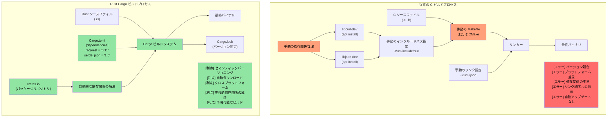
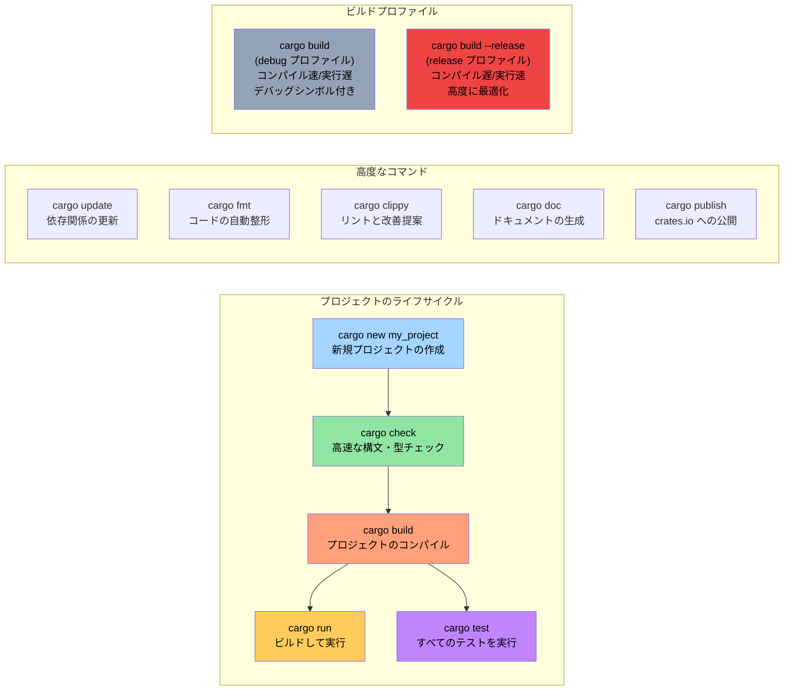

# 講釈は十分: コードを見てみよう

> **ここで学ぶこと:** 初めての Rust プログラム — `fn main()`、`println!()`、そして Rust のマクロが C/C++ のプリプロセッサマクロと根本的にどのように異なるかについて学びます。本章を終えると、シンプルな Rust プログラムを作成、コンパイル、実行できるようになります。

```rust
fn main() {
    println!("Hello world from Rust");
}
```
- 上記の構文は、C系の言語に親しみのある方なら馴染み深いものに見えるはずです
    - Rust のすべての関数は ```fn``` キーワードで始まります
    - 実行可能バイナリのデフォルトのエントリポイントは ```main()``` です
    - ```println!``` は一見関数のように見えますが、実際には**マクロ**です。Rust のマクロは C/C++ のプリプロセッサマクロとは全く異なります — 衛生的（hygienic）で型安全であり、単純なテキスト置換ではなく構文木（AST）に対して動作します
- Rust のコードスニペットを手軽に試す2つの優れた方法:
    - **オンライン**: [Rust Playground](https://play.rust-lang.org/) — コードを貼り付けて「Run」を押すだけで結果が得られ、共有も可能。インストール不要です
    - **ローカル REPL**: 対話的な Rust REPL 環境である [`evcxr_repl`](https://github.com/evcxr/evcxr) をインストールします（Python の REPL のようなものを Rust で実現します）:
```bash
cargo install --locked evcxr_repl
evcxr   # REPL を起動し、対話的に Rust の式を入力できます
```

### Rust のローカル環境インストール
- Rust は以下の方法でローカルにインストールできます
    - Windows: https://static.rust-lang.org/rustup/dist/x86_64-pc-windows-msvc/rustup-init.exe
    - Linux / WSL: ```curl --proto '=https' --tlsv1.2 -sSf https://sh.rustup.rs | sh```
- Rust エコシステムは以下のコンポーネントで構成されています
    - ```rustc``` は単体コンパイラですが、直接呼び出すことはほとんどありません
    - 推奨されるツールである ```cargo``` はスイスアーミーナイフ（万能ツール）であり、依存関係の管理、ビルド、テスト、フォーマット、リントなどに使用されます
    - Rust ツールチェーンには ```stable```、```beta```、```nightly```（実験用）の各チャネルがありますが、基本的には ```stable``` を使用します。6週間ごとにリリースされる最新の ```stable``` にアップグレードするには ```rustup update``` コマンドを実行します
- VSCode 向けの ```rust-analyzer``` 拡張機能もインストールします

# Rust パッケージ（クレート）
- Rust のバイナリはパッケージ（以降「クレート（crate）」と呼びます）を使用して作成されます
    - クレートは単独で完結する場合もあれば、他のクレートに依存する場合もあります。依存先のクレートはローカルでもリモートでも構いません。サードパーティ製クレートは通常、```crates.io``` と呼ばれる中央リポジトリからダウンロードされます
    - ```cargo``` ツールは、クレートとその依存関係のダウンロードを自動的に処理します。これは概念的には C ライブラリのリンクに相当します
    - クレートの依存関係は ```Cargo.toml``` という名前のファイルに記述します。また、クレートのターゲット種別（スタンドアロンの実行ファイル、静的ライブラリ、動的ライブラリ（一般的ではない））も定義します
    - リファレンス: https://doc.rust-lang.org/cargo/reference/cargo-targets.html

## Cargo と従来の C ビルドシステムの比較

### 依存関係管理の比較



### Cargo プロジェクト構造

```text
my_project/
|-- Cargo.toml          # プロジェクト設定（package.json のようなもの）
|-- Cargo.lock          # 依存関係の正確なバージョン（自動生成）
|-- src/
|   |-- main.rs         # バイナリのメインエントリポイント
|   |-- lib.rs          # ライブラリのルート（ライブラリを作成する場合）
|   `-- bin/            # 追加のバイナリターゲット
|-- tests/              # 統合テスト
|-- examples/           # サンプルコード
|-- benches/            # ベンチマーク
`-- target/             # ビルド成果物（C の build/ や obj/ に相当）
    |-- debug/          # デバッグビルド（コンパイルが速く、実行速度は遅い）
    `-- release/        # リリースビルド（コンパイルが遅く、実行速度が速い）
```

### よく使う Cargo コマンド



# 例: cargo とクレート
- この例では、他の依存関係を持たないスタンドアロンの実行可能クレートを作成します
- 以下のコマンドを使用して、```helloworld``` という新しいクレートを作成します
```bash
cargo new helloworld
cd helloworld
cat Cargo.toml
```
- デフォルトでは、```cargo run``` はクレートの ```debug```（未最適化）バージョンをコンパイルして実行します。```release``` バージョンを実行するには、```cargo run --release``` を使用します
- 実際のバイナリファイルは、```target``` ディレクトリ配下の ```debug``` または ```release``` ディレクトリ内に配置されます
- ソースと同じディレクトリに ```Cargo.lock``` というファイルが生成されていることにも気づくかもしれません。これは自動生成されるファイルであり、手動で変更してはいけません
    - ```Cargo.lock``` の具体的な目的については、後ほど改めて詳しく説明します
