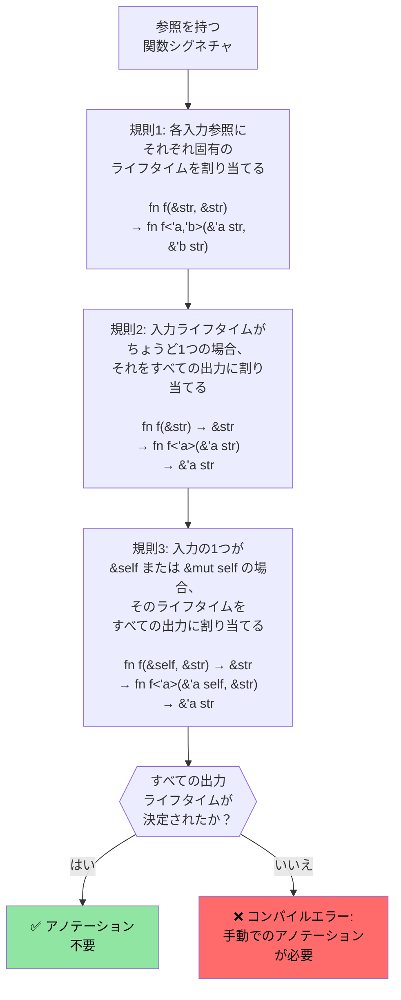

# Rustのライフタイムと借用

> **学習目標:** 暗黙的なライフタイムから明示的なアノテーション、そして大半のコードでアノテーションを不要にする3つの省略規則に至るまで、Rustのライフタイムシステムが参照のダングリング（未解決な参照）をどのように防ぐかを学びます。ここでライフタイムを理解することは、次のセクションのスマートポインタに進む前に不可欠です。

- Rustは単一の可変参照、または任意の数の不変参照を強制します
    - すべての参照のライフタイムは、元の所有者のライフタイム以上でなければなりません。これらは暗黙的なライフタイムであり、コンパイラによって推論されます（https://doc.rust-lang.org/nomicon/lifetime-elision.html を参照）
```rust
fn borrow_mut(x: &mut u32) {
    *x = 43;
}
fn main() {
    let mut x = 42;
    let y = &mut x;
    borrow_mut(y);
    let _z = &x; // yが以降で使用されないことをコンパイラが把握しているため許可される
    //println!("{y}"); // このコメントを解除するとコンパイルエラーになる
    borrow_mut(&mut x); // _zが使用されていないため許可される 
    let z = &x; // OK -- xの可変借用はborrow_mut()の終了時に終了している
    println!("{z}");
}
```

# Rustのライフタイムアノテーション
- 複数のライフタイムを扱う場合、明示的なライフタイムアノテーションが必要です
    - ライフタイムは `'` で表記され、任意の識別子を使用できます（`'a`, `'b`, `'static` など）
    - 参照がどのくらい長く生存すべきかをコンパイラが判断できない場合、支援が必要です
- **よくあるシナリオ**: 関数が参照を返す際、その参照がどの入力に由来するか？
```rust
#[derive(Debug)]
struct Point {x: u32, y: u32}

// ライフタイムアノテーションがない場合、これはコンパイルされません:
// fn left_or_right(pick_left: bool, left: &Point, right: &Point) -> &Point

// ライフタイムアノテーションあり - すべての参照が同じライフタイム 'a を共有
fn left_or_right<'a>(pick_left: bool, left: &'a Point, right: &'a Point) -> &'a Point {
    if pick_left { left } else { right }
}

// より複雑な例: 入力ごとに異なるライフタイム
fn get_x_coordinate<'a, 'b>(p1: &'a Point, _p2: &'b Point) -> &'a u32 {
    &p1.x  // 戻り値のライフタイムはp2ではなくp1に結び付けられる
}

fn main() {
    let p1 = Point {x: 20, y: 30};
    let result;
    {
        let p2 = Point {x: 42, y: 50};
        result = left_or_right(true, &p1, &p2);
        // p2がスコープを抜ける前にresultを使用しているため、これは動作します
        println!("選択された値: {result:?}");
    }
    // これは動作しません - resultが参照しているp2はすでに破棄されています:
    // println!("スコープ外: {result:?}");
}
```

# Rustのライフタイムアノテーション
- データ構造内に参照を保持する場合にもライフタイムアノテーションが必要です
```rust
use std::collections::HashMap;
#[derive(Debug)]
struct Point {x: u32, y: u32}
struct Lookup<'a> {
    map: HashMap<u32, &'a Point>,
}
fn main() {
    let p = Point{x: 42, y: 42};
    let p1 = Point{x: 50, y: 60};
    let mut m = Lookup {map : HashMap::new()};
    m.map.insert(0, &p);
    m.map.insert(1, &p1);
    {
        let p3 = Point{x: 60, y:70};
        //m.map.insert(3, &p3); // コンパイルエラー
        // p3はここでドロップされますが、mはそれより長く生存します
    }
    for (k, v) in m.map {
        println!("{v:?}");
    }
    // mはここでドロップされます
    // p1、pの順にここでドロップされます
} 
```

# 演習: ライフタイムを用いた最初の単語の抽出

🟢 **初級** — ライフタイム省略規則の実践

文字列から最初の空白区切りの単語を返す関数 `fn first_word(s: &str) -> &str` を記述してください。明示的なライフタイムアノテーションなしでなぜコンパイルできるのかを考えてみましょう（ヒント: 省略規則1と2）。

<details><summary>解答例（クリックして展開）</summary>

```rust
fn first_word(s: &str) -> &str {
    // コンパイラは省略規則を適用します:
    // 規則1: 入力の &str にライフタイム 'a が割り当てられる → fn first_word(s: &'a str) -> &str
    // 規則2: 入力のライフタイムが1つだけの場合、出力も同じになる → fn first_word(s: &'a str) -> &'a str
    match s.find(' ') {
        Some(pos) => &s[..pos],
        None => s,
    }
}

fn main() {
    let text = "hello world foo";
    let word = first_word(text);
    println!("最初の単語: {word}");  // "hello"
    
    let single = "onlyone";
    println!("最初の単語: {}", first_word(single));  // "onlyone"
}
```

</details>

# 演習: ライフタイムを用いたスライスの格納

🟡 **中級** — ライフタイムアノテーションの実践
- `&str` のスライスへの参照を格納する構造体を作成します
    - 長い `&str` を作成し、そのスライスへの参照を構造体内に格納します
    - 構造体を受け取り、格納されているスライスを返す関数を作成します
```rust
// TODO: スライスへの参照を格納する構造体を作成
struct SliceStore {

}
fn main() {
    let s = "This is long string";
    let s1 = &s[0..];
    let s2 = &s[1..2];
    // let slice = struct SliceStore {...};
    // let slice2 = struct SliceStore {...};
}
```

<details><summary>解答例（クリックして展開）</summary>

```rust
struct SliceStore<'a> {
    slice: &'a str,
}

impl<'a> SliceStore<'a> {
    fn new(slice: &'a str) -> Self {
        SliceStore { slice }
    }

    fn get_slice(&self) -> &'a str {
        self.slice
    }
}

fn main() {
    let s = "This is a long string";
    let store1 = SliceStore::new(&s[0..4]);   // "This"
    let store2 = SliceStore::new(&s[5..7]);   // "is"
    println!("store1: {}", store1.get_slice());
    println!("store2: {}", store2.get_slice());
}
// 出力:
// store1: This
// store2: is
```

</details>

---

## ライフタイム省略規則の深掘り

Cプログラマはよく「ライフタイムがそれほど重要なら、なぜほとんどのRust関数には `'a` アノテーションが付いていないのか？」と疑問に思います。その答えは**ライフタイムの省略（Lifetime Elision）**にあります。コンパイラは3つの決定論的な規則を適用して、ライフタイムを自動的に推論します。

### 3つの省略規則

Rustコンパイラは、関数のシグネチャに対してこれらの規則を**順番に**適用します。規則を適用した結果、すべての出力ライフタイムが決定された場合、アノテーションは不要です。



### 規則ごとの具体例

**規則1** — 各入力参照にそれぞれ固有のライフタイムパラメータが割り当てられる:
```rust
// 記述するコード:
fn first_word(s: &str) -> &str { ... }

// 規則1適用後にコンパイラが認識するシグネチャ:
fn first_word<'a>(s: &'a str) -> &str { ... }
// 入力ライフタイムが1つだけ → 規則2が適用される
```

**規則2** — 単一の入力ライフタイムがすべての出力に伝播する:
```rust
// 規則2適用後:
fn first_word<'a>(s: &'a str) -> &'a str { ... }
// ✅ すべての出力ライフタイムが決定 — アノテーションは不要！
```

**規則3** — `&self` のライフタイムが出力に伝播する:
```rust
// 記述するコード:
impl SliceStore<'_> {
    fn get_slice(&self) -> &str { self.slice }
}

// 規則1および規則3適用後にコンパイラが認識するシグネチャ:
impl SliceStore<'_> {
    fn get_slice<'a>(&'a self) -> &'a str { self.slice }
}
// ✅ アノテーションは不要 — &self のライフタイムが出力に使用される
```

**省略規則で解決できない場合** — アノテーションが必要:
```rust
// 入力参照が2つあり、&self はない → 規則2も規則3も適用されない
// fn longest(a: &str, b: &str) -> &str  ← コンパイルエラー

// 修正: 出力がどの入力から借用しているかをコンパイラに伝える
fn longest<'a>(a: &'a str, b: &'a str) -> &'a str {
    if a.len() >= b.len() { a } else { b }
}
```

### Cプログラマ向けのメンタルモデル

C言語では、すべてのポインタは独立しており、各ポインタがどのメモリ割り当てを指しているかをプログラマが頭の中で追跡し、コンパイラはプログラマを完全に信用します。Rustでは、ライフタイムによってこの追跡が**明示的になり、コンパイラによって検証**されます。

| C | Rust | 何が起きるか |
|---|------|-------------|
| `char* get_name(struct User* u)` | `fn get_name(&self) -> &str` | 規則3により省略: 出力は `self` から借用 |
| `char* concat(char* a, char* b)` | `fn concat<'a>(a: &'a str, b: &'a str) -> &'a str` | 2つの入力があるためアノテーション必須 |
| `void process(char* in, char* out)` | `fn process(input: &str, output: &mut String)` | 出力参照がないためライフタイム不要 |
| `char* buf; /* who owns this? */` | ライフタイムが不正な場合はコンパイルエラー | コンパイラがダングリングポインタを検出 |

### `'static` ライフタイム

`'static` は、参照が**プログラムの全実行期間**にわたって有効であることを意味します。これはC言語におけるグローバル変数や文字列リテラルに相当します。

```rust
// 文字列リテラルは常に 'static — バイナリの読み取り専用セクションに配置される
let s: &'static str = "hello";  // C言語の static const char* s = "hello"; と同等

// 定数も 'static
static GREETING: &str = "hello";

// スレッド生成時のトレイト境界でよく使用される:
fn spawn<F: FnOnce() + Send + 'static>(f: F) { /* ... */ }
// ここでの 'static は「クロージャがローカル変数を借用してはならない」ことを意味する
// （クロージャ内にムーブするか、'static データのみを使用する）
```

### 演習: ライフタイム省略の予測

🟡 **中級**

以下の各関数シグネチャについて、コンパイラがライフタイムを省略できるかどうかを予測してください。省略できない場合は、必要なアノテーションを追加してください:

```rust
// 1. コンパイラは省略できるか？
fn trim_prefix(s: &str) -> &str { &s[1..] }

// 2. コンパイラは省略できるか？
fn pick(flag: bool, a: &str, b: &str) -> &str {
    if flag { a } else { b }
}

// 3. コンパイラは省略できるか？
struct Parser { data: String }
impl Parser {
    fn next_token(&self) -> &str { &self.data[..5] }
}

// 4. コンパイラは省略できるか？
fn split_at(s: &str, pos: usize) -> (&str, &str) {
    (&s[..pos], &s[pos..])
}
```

<details><summary>解答例（クリックして展開）</summary>

```rust,ignore
// 1. 省略可能 — 規則1により s に 'a が割り当てられ、規則2により出力に伝播する
fn trim_prefix(s: &str) -> &str { &s[1..] }

// 2. 省略不可 — 2つの入力参照があり、&self はない。アノテーションが必要:
fn pick<'a>(flag: bool, a: &'a str, b: &'a str) -> &'a str {
    if flag { a } else { b }
}

// 3. 省略可能 — 規則1により &self に 'a が割り当てられ、規則3により出力に伝播する
impl Parser {
    fn next_token(&self) -> &str { &self.data[..5] }
}

// 4. 省略可能 — 規則1により s に 'a が割り当てられ（入力参照は1つのみ）、
//    規則2により両方の出力に伝播する。両方のスライスが s から借用する。
fn split_at(s: &str, pos: usize) -> (&str, &str) {
    (&s[..pos], &s[pos..])
}
```

</details>
