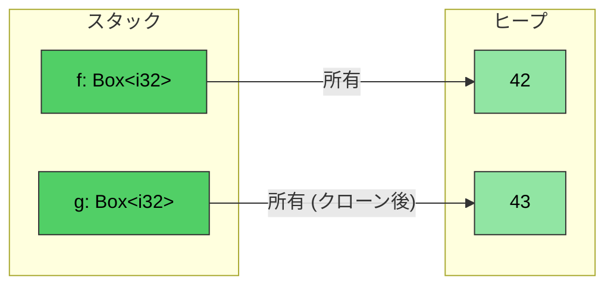
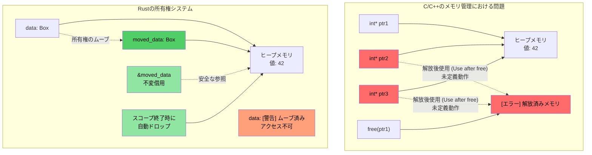
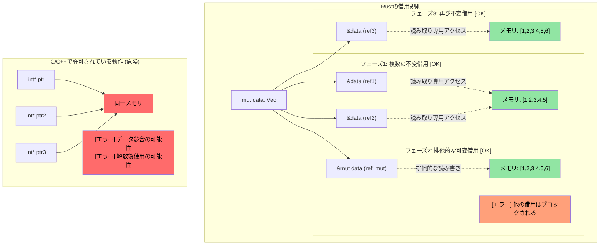

# Rustの `Box<T>`

> **学習目標:** ヒープ割り当てを行う `Box<T>`、共有所有権を実現する `Rc<T>`、内部可変性を提供する `Cell<T>`/`RefCell<T>` など、Rustのスマートポインタ型を学びます。これらは前のセクションで学んだ所有権とライフタイムの概念に基づいています。また、循環参照を解消するための `Weak<T>` についても簡単に紹介します。

**なぜ `Box<T>` を使うのか？** C言語では、ヒープ割り当てに `malloc`/`free` を使用します。C++では、`std::unique_ptr<T>` が `new`/`delete` をラップします。Rustの `Box<T>` はこれらに相当するものであり、ヒープに割り当てられた単一所有権を持つポインタで、スコープを抜けると自動的に解放されます。`malloc` とは異なり解放（free）忘れが発生せず、`unique_ptr` とは異なりムーブ後の使用（use-after-move）もコンパイラによって完全に防止されます。

**スタック割り当てではなく `Box` を使用すべき場面:**
- 格納する型が大きく、スタック上でのコピーを避けたい場合
- 再帰的な型を定義する必要がある場合（例: 自身を含む連結リストのノード）
- トレイトオブジェクトが必要な場合（`Box<dyn Trait>`）

- `Box<T>` を使用すると、ヒープ上に割り当てられた型へのポインタを作成できます。このポインタは、`<T>` の型に関係なく常に固定サイズです
```rust
fn main() {
    // ヒープ上に作成された整数（値: 42）へのポインタを作成
    let f = Box::new(42);
    println!("{} {}", *f, f);
    // Boxをクローンすると、新しいヒープ領域が割り当てられる
    let mut g = f.clone();
    *g = 43;
    println!("{f} {g}");
    // g と f はここでスコープを抜け、自動的にメモリが解放される
}
```


## 所有権と借用の可視化

### C/C++ vs Rust: ポインタと所有権の管理

```c
// C - 手動のメモリ管理と潜在的な問題
void c_pointer_problems() {
    int* ptr1 = malloc(sizeof(int));
    *ptr1 = 42;
    
    int* ptr2 = ptr1;  // 両方が同じメモリを指す
    int* ptr3 = ptr1;  // 3つのポインタが同じメモリを指す
    
    free(ptr1);        // メモリを解放
    
    *ptr2 = 43;        // 解放後使用（Use after free） - 未定義動作！
    *ptr3 = 44;        // 解放後使用（Use after free） - 未定義動作！
}
```

> **C++開発者向け:** スマートポインタは役立ちますが、すべての問題を防げるわけではありません:
>
> ```cpp
> // C++ - スマートポインタは役立ちますが、すべての問題を防げるわけではありません
> void cpp_pointer_issues() {
>     auto ptr1 = std::make_unique<int>(42);
>     
>     // auto ptr2 = ptr1;  // コンパイルエラー: unique_ptrはコピー不可
>     auto ptr2 = std::move(ptr1);  // OK: 所有権が移動
>     
>     // しかしC++ではムーブ後の使用が依然として可能です:
>     // std::cout << *ptr1;  // コンパイルは通る！しかし未定義動作！
>     
>     // shared_ptrのエイリアシング:
>     auto shared1 = std::make_shared<int>(42);
>     auto shared2 = shared1;  // 両方がデータを所有
>     // 誰が「真に」所有しているのか？どちらでもない。至る所で参照カウントのオーバーヘッドが発生する。
> }
> ```

```rust
// Rust - 所有権システムがこれらの問題を防止
fn rust_ownership_safety() {
    let data = Box::new(42);  // dataがヒープ割り当てを所有
    
    let moved_data = data;    // 所有権がmoved_dataに移転（ムーブ）
    // dataにはアクセスできなくなる - 使用するとコンパイルエラー
    
    let borrowed = &moved_data;  // 不変借用
    println!("{}", borrowed);    // 安全に使用可能
    
    // moved_dataがスコープを抜けると自動的に解放される
}
```



### 借用規則の可視化

```rust
fn borrowing_rules_example() {
    let mut data = vec![1, 2, 3, 4, 5];
    
    // 複数の不変借用 - OK
    let ref1 = &data;
    let ref2 = &data;
    println!("{:?} {:?}", ref1, ref2);  // 両方とも使用可能
    
    // 可変借用 - 排他的アクセス
    let ref_mut = &mut data;
    ref_mut.push(6);
    // ref_mutがアクティブな間はref1とref2は使用できない
    
    // ref_mutが終了した後、不変借用が再び利用可能になる
    let ref3 = &data;
    println!("{:?}", ref3);
}
```



---

## 内部可変性: `Cell<T>` と `RefCell<T>`

Rustではデフォルトで変数が不変（イミュータブル）であることを思い出してください。しかし、型の大半のフィールドを読み取り専用にしつつ、特定の1つのフィールドだけに書き込みアクセスを許可したい場合があります。

```rust
struct Employee {
    employee_id : u64,   // これは不変である必要がある
    on_vacation: bool,   // employee_idを不変にしたまま、このフィールドへの書き込みアクセスを許可したい場合はどうすればよいか？
}
```

- Rustでは、変数に対して*単一の可変*参照、または任意の数の*不変*参照のみが許可され、これが*コンパイル時*に強制されることを思い出してください
- 従業員の*不変*ベクタを渡しつつ、`employee_id` は絶対に変更できないように保証した上で、`on_vacation` フィールドの更新だけを許可したい場合はどうすればよいでしょうか？

### `Cell<T>` — Copy型向けの内部可変性

- `Cell<T>` は**内部可変性（interior mutability）**を提供します。つまり、本来読み取り専用である参照の特定要素に対する書き込みアクセスを可能にします
- 値を出し入れしてコピーすることで機能します（`.get()` には `T: Copy` が必要です）

### `RefCell<T>` — 実行時借用チェックを伴う内部可変性

- `RefCell<T>` は参照を扱えるバリエーションを提供します
    - コンパイル時ではなく**実行時**にRustの借用チェックを強制します
    - 単一の*可変*借用を許可しますが、他にアクティブな参照が存在する場合は**パニック**します
    - 不変アクセスには `.borrow()` を、可変アクセスには `.borrow_mut()` を使用します

### `Cell` と `RefCell` の使い分け

| 基準 | `Cell<T>` | `RefCell<T>` |
|-----------|-----------|-------------|
| 対象となる型 | `Copy` 型（整数、bool、浮動小数点数など） | 任意の型（`String`, `Vec`, 構造体など） |
| アクセスパターン | 値をコピーして出し入れ（`.get()`, `.set()`） | その場で参照を借用（`.borrow()`, `.borrow_mut()`） |
| 失敗時の挙動 | 失敗しない（実行時チェックなし） | 別の借用がアクティブな状態で可変借用すると**パニック**する |
| オーバーヘッド | ゼロ（単なるバイトのコピー） | 小（実行時に借用状態を追跡） |
| 使用する場面 | 不変な構造体の中で、可変フラグ、カウンタ、小さな値が必要な場合 | 不変な構造体の中で、`String`、`Vec`、または複雑な型を変更する必要がある場合 |

---

## 共有所有権: `Rc<T>`

`Rc<T>` は、参照カウント方式によって*不変*データの共有所有権を可能にします。同じ `Employee` をコピーせずに複数の場所に保持したい場合はどうすればよいでしょうか？

```rust
#[derive(Debug)]
struct Employee {
    employee_id: u64,
}
fn main() {
    let mut us_employees = vec![];
    let mut all_global_employees = Vec::<Employee>::new();
    let employee = Employee { employee_id: 42 };
    us_employees.push(employee);
    // コンパイルエラー — employeeはすでにムーブされている
    //all_global_employees.push(employee);
}
```

`Rc<T>` は、共有された*不変*アクセスを許可することでこの問題を解決します:
- 格納されている型は自動的に参照外し（dereference）されます
- 参照カウントが0になると型がドロップされます

```rust
use std::rc::Rc;
#[derive(Debug)]
struct Employee {employee_id: u64}
fn main() {
    let mut us_employees = vec![];
    let mut all_global_employees = vec![];
    let employee = Employee { employee_id: 42 };
    let employee_rc = Rc::new(employee);
    us_employees.push(employee_rc.clone());
    all_global_employees.push(employee_rc.clone());
    let employee_one = all_global_employees.get(0); // 共有された不変参照
    for e in us_employees {
        println!("{}", e.employee_id);  // 共有された不変参照
    }
    println!("{employee_one:?}");
}
```

> **C++開発者向け: スマートポインタの対応関係**
>
> | C++ スマートポインタ | Rust 相当 | 主な相違点 |
> |---|---|---|
> | `std::unique_ptr<T>` | `Box<T>` | Rust版がデフォルト — ムーブはオプトインではなく言語レベルの基本動作 |
> | `std::shared_ptr<T>` | `Rc<T>`（シングルスレッド） / `Arc<T>`（マルチスレッド） | `Rc` にはアトミック操作のオーバーヘッドなし。スレッド間で共有する場合にのみ `Arc` を使用 |
> | `std::weak_ptr<T>` | `Weak<T>`（`Rc::downgrade()` または `Arc::downgrade()` から取得） | 目的は同じ: 循環参照の解消 |
>
> **重要な違い**: C++では、スマートポインタをあえて*選んで*使用します。Rustでは、所有された値（`T`）と借用（`&T`）がほとんどのユースケースをカバーします。ヒープ割り当てや共有所有権がどうしても必要な場合にのみ `Box`/`Rc`/`Arc` を検討してください。

### `Weak<T>` による循環参照の解消

`Rc<T>` は参照カウントを使用するため、2つの `Rc` 値が互いを参照し合うと、どちらもドロップされなくなります（循環参照）。`Weak<T>` はこれを解決します:

```rust
use std::rc::{Rc, Weak};

struct Node {
    value: i32,
    parent: Option<Weak<Node>>,  // 弱参照（Weak reference） — ドロップを妨げない
}

fn main() {
    let parent = Rc::new(Node { value: 1, parent: None });
    let child = Rc::new(Node {
        value: 2,
        parent: Some(Rc::downgrade(&parent)),  // 親への弱参照
    });

    // Weakを使用するには upgrade() を試行する — Option<Rc<T>> が返される
    if let Some(parent_rc) = child.parent.as_ref().unwrap().upgrade() {
        println!("親の値: {}", parent_rc.value);
    }
    println!("親の強参照カウント: {}", Rc::strong_count(&parent)); // 2ではなく1
}
```

> `Weak<T>` の詳細については、[過度なclone()の回避](ch17-1-avoiding-excessive-clone.md) で詳しく説明します。現時点での要点は次のとおりです: **ツリーやグラフ構造の「親や逆方向への参照」には `Weak` を使用してメモリリークを防ぎます。**

---

## `Rc` と内部可変性の組み合わせ

`Rc<T>`（共有所有権）と `Cell<T>` または `RefCell<T>`（内部可変性）を組み合わせることで、真の力が発揮されます。これにより、複数の所有者が共有データを**読み取りおよび変更**できるようになります:

| パターン | ユースケース |
|---------|----------|
| `Rc<RefCell<T>>` | 共有可能で可変なデータ（シングルスレッド） |
| `Arc<Mutex<T>>` | 共有可能で可変なデータ（マルチスレッド — [第13章](ch13-concurrency.md) 参照） |
| `Rc<Cell<T>>` | 共有可能で可変な Copy 型（単純なフラグ、カウンタなど） |

---

# 演習: 共有所有権と内部可変性

🟡 **中級**

- **パート1 (Rc)**: `employee_id: u64` と `name: String` を持つ `Employee` 構造体を作成します。それを `Rc<Employee>` に格納し、2つの独立した `Vec`（`us_employees` と `global_employees`）にクローンします。両方のベクタから出力して、同じデータを共有していることを確認します。
- **パート2 (Cell)**: `Employee` に `on_vacation: Cell<bool>` フィールドを追加します。不変な `&Employee` 参照を関数に渡し、参照を可変にすることなく、その関数内から `on_vacation` を切り替えます。
- **パート3 (RefCell)**: `name: String` を `name: RefCell<String>` に置き換え、`&Employee`（不変参照）を介して従業員の名前の末尾にサフィックスを追加する関数を作成します。

**スターターコード:**
```rust
use std::cell::{Cell, RefCell};
use std::rc::Rc;

#[derive(Debug)]
struct Employee {
    employee_id: u64,
    name: RefCell<String>,
    on_vacation: Cell<bool>,
}

fn toggle_vacation(emp: &Employee) {
    // TODO: Cell::set() を使用して on_vacation を反転させる
}

fn append_title(emp: &Employee, title: &str) {
    // TODO: RefCell を介して name を可変借用し、push_str で title を追加する
}

fn main() {
    // TODO: 従業員を作成し、Rcでラップして2つのVecにクローンする。
    // toggle_vacation と append_title を呼び出し、結果を出力する
}
```

<details><summary>解答例（クリックして展開）</summary>

```rust
use std::cell::{Cell, RefCell};
use std::rc::Rc;

#[derive(Debug)]
struct Employee {
    employee_id: u64,
    name: RefCell<String>,
    on_vacation: Cell<bool>,
}

fn toggle_vacation(emp: &Employee) {
    emp.on_vacation.set(!emp.on_vacation.get());
}

fn append_title(emp: &Employee, title: &str) {
    emp.name.borrow_mut().push_str(title);
}

fn main() {
    let emp = Rc::new(Employee {
        employee_id: 42,
        name: RefCell::new("Alice".to_string()),
        on_vacation: Cell::new(false),
    });

    let mut us_employees = vec![];
    let mut global_employees = vec![];
    us_employees.push(Rc::clone(&emp));
    global_employees.push(Rc::clone(&emp));

    // 不変参照を介して休暇状態を切り替える
    toggle_vacation(&emp);
    println!("休暇中: {}", emp.on_vacation.get()); // true

    // 不変参照を介して肩書きを追加する
    append_title(&emp, ", Sr. Engineer");
    println!("名前: {}", emp.name.borrow()); // "Alice, Sr. Engineer"

    // 両方のVecが同じデータを参照している（Rcが所有権を共有）
    println!("US: {:?}", us_employees[0].name.borrow());
    println!("Global: {:?}", global_employees[0].name.borrow());
    println!("Rcの強参照カウント: {}", Rc::strong_count(&emp));
}
// 出力:
// 休暇中: true
// 名前: Alice, Sr. Engineer
// US: "Alice, Sr. Engineer"
// Global: "Alice, Sr. Engineer"
// Rcの強参照カウント: 3
```

</details>
