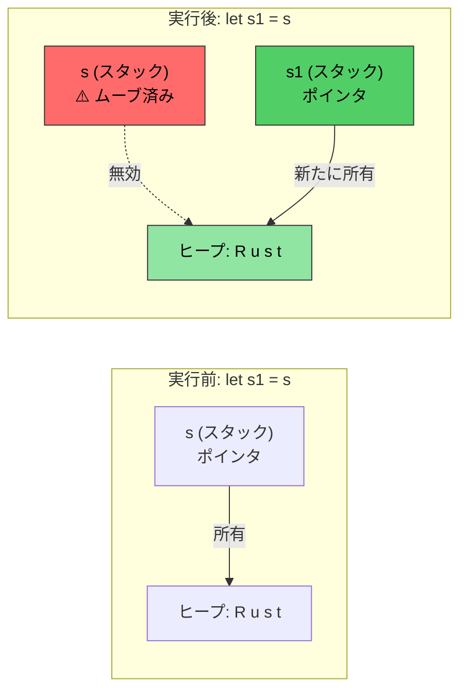
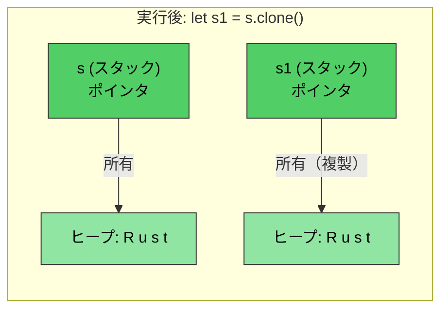

# Rustのメモリ管理

> **学習目標:** Rustの所有権（ownership）システム — この言語において最も重要な単一の概念を学びます。本章を終えると、ムーブセマンティクス、借用規則、そして `Drop` トレイトを理解できるようになります。この章を理解できれば、Rustのそれ以外の部分は自然と身につきます。もし難しく感じても、読み直してみてください — 多くのC/C++開発者にとって、所有権は2回目の復習で腑に落ちるものです。

- C/C++におけるメモリ管理はバグの温床です：
    - C言語: メモリは `malloc()` で確保され、`free()` で解放されます。ダングリングポインタ、解放後使用（use-after-free）、二重解放（double-free）に対するチェックはありません
    - C++: RAII（Resource Acquisition Is Initialization）やスマートポインタが役立ちますが、`std::move(ptr)` はムーブ後であってもコンパイルが通ってしまい、ムーブ後の使用（use-after-move）は未定義動作（UB）になります
- RustはRAIIを**完全確実（foolproof）**なものにします：
    - ムーブは**破壊的（destructive）**です — コンパイラはムーブ元の変数に触れることを拒否します
    - Rule of Five は不要です（コピーコンストラクタ、ムーブコンストラクタ、コピー代入、ムーブ代入、デストラクタの管理が不要）
    - Rustはメモリ確保の完全な制御を提供しつつ、**コンパイル時**に安全性を強制します
    - これは所有権、借用、可変性、ライフタイムなどのメカニズムの組み合わせによって実現されます
    - Rustの実行時のメモリ確保は、スタックとヒープの両方で行われます

> **C++開発者向け — スマートポインタの対応表:**
>
> | **C++** | **Rust** | **安全性の大幅な向上** |
> |---------|----------|----------------------|
> | `std::unique_ptr<T>` | `Box<T>` | ムーブ後の使用（use-after-move）が原理的に不可能 |
> | `std::shared_ptr<T>` | `Rc<T>`（シングルスレッド用） | デフォルトで循環参照を防止 |
> | `std::shared_ptr<T>`（スレッドセーフ） | `Arc<T>` | 明示的なスレッド安全性 |
> | `std::weak_ptr<T>` | `Weak<T>` | 有効性の確認を強制 |
> | 生ポインタ | `*const T` / `*mut T` | `unsafe` ブロック内でのみ使用可能 |
>
> C開発者向け: `Box<T>` は `malloc`/`free` のペアを置き換えます。`Rc<T>` は手動の参照カウントを置き換えます。生ポインタは存在しますが、`unsafe` ブロック内に限定されます。

# Rustの所有権、借用、ライフタイム
- Rustが変数に対して許可するのは、単一の可変参照、または複数の読み取り専用（不変）参照のいずれか一方のみであることを思い出してください
    - 変数の最初の宣言によって**所有権（ownership）**が確立されます
    - その後の参照は、元の所有者から**借用（borrow）**します。規則として、借用のスコープが所有者のスコープを超えることは決してできません。言い換えれば、借用の**ライフタイム（lifetime）**が所有者のライフタイムを超えることはできません
```rust
fn main() {
    let a = 42; // 所有者
    let b = &a; // 最初の借用
    {
        let aa = 42;
        let c = &a; // 2回目の借用; aは依然としてスコープ内
        // OK: c はここでスコープを抜ける
        // aa はここでスコープを抜ける
    }
    // let d = &aa; // aa を外部スコープに移動しない限りコンパイルエラー
    // b は a より前に暗黙的にスコープを抜ける
    // a が最後にスコープを抜ける
}
```

- Rustはいくつかの異なるメカニズムを使ってメソッドへパラメータを渡すことができます
    - 値渡し（コピー）: 通常、自明にコピー可能な型（例: u8, u32, i8, i32）
    - 参照渡し: これは実際の値へのポインタを渡すことに相当します。これは一般に借用としても知られ、参照は不変（`&`）または可変（`&mut`）にできます
    - ムーブ渡し: これは値の「所有権」を関数へ移動します。呼び出し元は元の値を参照できなくなります
```rust
fn foo(x: &u32) {
    println!("{x}");
}
fn bar(x: u32) {
    println!("{x}");
}
fn main() {
    let a = 42;
    foo(&a);    // 参照渡し（借用）
    bar(a);     // 値渡し（コピー）
}
```

- Rustはメソッドからのダングリング参照の返却を禁止しています
    - メソッドによって返される参照は、呼び出し後も有効なスコープ内になければなりません
    - Rustは参照がスコープを抜けた際に自動的に破棄（`drop`）します。
```rust
fn no_dangling() -> &u32 {
    // a のライフタイムがここで開始
    let a = 42;
    // コンパイル不可。a のライフタイムがここで終了するため
    &a
}

fn ok_reference(a: &u32) -> &u32 {
    // a のライフタイムは常に ok_reference() を超えるためOK
    a
}
fn main() {
    let a = 42;     // a のライフタイムがここで開始
    let b = ok_reference(&a);
    // b のライフタイムがここで終了
    // a のライフタイムがここで終了
}
```

# Rustのムーブセマンティクス
- デフォルトでは、Rustの代入は所有権を移動（ムーブ）させます
```rust
fn main() {
    let s = String::from("Rust");    // ヒープから文字列を確保
    let s1 = s; // 所有権を s1 に移動。この時点で s は無効
    println!("{s1}");
    // これはコンパイルエラーになります
    //println!("{s}");
    // s1 がここでスコープを抜け、メモリが解放されます
    // s もここでスコープを抜けますが、何も所有していないため何も起こりません
}
```

*`let s1 = s` の後、所有権は `s1` に移動します。ヒープ上のデータは移動せず、スタック上のポインタのみが移動します。`s` は無効になります。*

----
# Rustのムーブセマンティクスと借用
```rust
fn foo(s : String) {
    println!("{s}");
    // s が指すヒープメモリはここで解放されます
}
fn bar(s : &String) {
    println!("{s}");
    // 何も起こりません -- s は借用されているだけです
}
fn main() {
    let s = String::from("Rust string move example");    // ヒープから文字列を確保
    foo(s); // 所有権を移動; s はこの後無効
    // println!("{s}");  // コンパイル不可
    let t = String::from("Rust string borrow example");
    bar(&t);    // t は所有権を保持し続ける
    println!("{t}"); 
}
```

# Rustのムーブセマンティクスと所有権
- ムーブによって所有権を移動させることができます
    - ムーブ完了後に、未解決の古い参照を使用することは不正です
    - ムーブが望ましくない場合は借用を検討してください
```rust
struct Point {
    x: u32,
    y: u32,
}
fn consume_point(p: Point) {
    println!("{} {}", p.x, p.y);
}
fn borrow_point(p: &Point) {
    println!("{} {}", p.x, p.y);
}
fn main() {
    let p = Point {x: 10, y: 20};
    // 以下の2行を入れ替えてみてください
    borrow_point(&p);
    consume_point(p);
}
```

# Rustの Clone
- `clone()` メソッドを使用すると、元のメモリを複製できます。元の参照も引き続き有効です（デメリットは、メモリ確保が2倍になることです）
```rust
fn main() {
    let s = String::from("Rust");    // ヒープから文字列を確保
    let s1 = s.clone(); // 文字列を複製; ヒープ上に新しい割り当てを作成
    println!("{s1}");  
    println!("{s}");
    // s1 がここでスコープを抜け、メモリが解放されます
    // s がここでスコープを抜け、メモリが解放されます
}
```

*`clone()` は**独立した**ヒープ領域を確保します。`s` と `s1` の両方が有効であり、それぞれが自身のコピーを所有します。*

# Rustの Copy トレイト
- Rustは、組み込み型に対して `Copy` トレイトを使用したコピーセマンティクスを実装しています
    - 例として u8, u32, i8, i32 などが挙げられます。コピーセマンティクスは「値渡し」を使用します
    - ユーザー定義のデータ型は、`derive` マクロを使用して `Copy` トレイトを自動実装することで、任意でコピーセマンティクスを選択できます
    - コンパイラは、新たな代入の際にコピー用の領域を確保します
```rust
// 以下の derive をコメントアウトして、後述の let p1 = p; の挙動の変化を確認してみてください
#[derive(Copy, Clone, Debug)]   // これについては後で詳しく説明します
struct Point{x: u32, y:u32}
fn main() {
    let p = Point {x: 42, y: 40};
    let p1 = p;     // ムーブではなくコピーが実行されるようになります
    println!("p: {p:?}");
    println!("p1: {p:?}");
    let p2 = p1.clone();    // コピーと意味的に同等です
}
```

# Rustの Drop トレイト

- Rustはスコープの終わりに自動的に `drop()` メソッドを呼び出します
    - `drop` は `Drop` と呼ばれるジェネリックトレイトの一部です。コンパイラはすべての型に対して空操作（NOP）のデフォルト実装を提供しますが、個々の型でオーバーライドできます。例えば、`String` 型はヒープ確保されたメモリを解放するためにこれをオーバーライドしています
    - Cプログラマ向け: これにより手動で `free()` を呼び出す必要がなくなります — スコープを抜けた際にリソースが自動的に解放されます（RAII）
- **安全性の要点:** `.drop()` を直接呼び出すことはできません（コンパイラが禁止しています）。代わりに `drop(obj)` を使用します。これは値を関数にムーブし、そのデストラクタを実行し、以降の使用を防止します — これにより二重解放のバグが根絶されます

> **C++開発者向け:** `Drop` はC++のデストラクタ（`~ClassName()`）に直接対応します：
>
> | | **C++デストラクタ** | **Rust `Drop`** |
> |---|---|---|
> | **構文** | `~MyClass() { ... }` | `impl Drop for MyType { fn drop(&mut self) { ... } }` |
> | **呼び出し契機** | スコープ終了時（RAII） | スコープ終了時（同様） |
> | **ムーブ時の呼び出し** | 移動元は「有効だが未規定」の状態で残る — 移動元のオブジェクトに対してもデストラクタが実行される | 移動元は**消滅** — ムーブされた値に対してデストラクタは呼び出されない |
> | **手動呼び出し** | `obj.~MyClass()`（危険、滅多に使われない） | `drop(obj)`（安全 — 所有権を取得し、`drop` を呼び出し、以降の使用を防止） |
> | **順序** | 宣言の逆順 | 宣言の逆順（同様） |
> | **Rule of Five** | コピーコンストラクタ、ムーブコンストラクタ、コピー代入、ムーブ代入、デストラクタの管理が必要 | `Drop` のみ — コンパイラがムーブセマンティクスを処理し、`Clone` は明示的な選択制 |
> | **仮想デストラクタは必要？** | 基底ポインタ経由で削除する場合は必要 | 不要 — 継承がないためスライス問題（object slicing）が発生しない |

```rust
struct Point {x: u32, y:u32}

// 以下と同等: ~Point() { printf("Goodbye point x:%u, y:%u\n", x, y); }
impl Drop for Point {
    fn drop(&mut self) {
        println!("さようなら point x:{}, y:{}", self.x, self.y);
    }
}
fn main() {
    let p = Point{x: 42, y: 42};
    {
        let p1 = Point{x:43, y: 43};
        println!("内部ブロックを終了します");
        // ここで p1.drop() が呼ばれる — C++のスコープ終了時のデストラクタと同様
    }
    println!("main を終了します");
    // ここで p.drop() が呼ばれる
}
```

# 演習: Move, Copy および Drop

🟡 **中級課題** — 自由に対象コードを試してみてください。コンパイラがエラー時に案内してくれます
- 下記の `Point` において、`#[derive(Debug)]` に `Copy` を含める場合と含めない場合の両方で実験し、その違いを理解してください。目的はムーブとコピーの動作をしっかりと把握することです。疑問点があれば確認しましょう
- `Point` に対して、`drop` 内で x と y を 0 に設定するカスタム `Drop` を実装してください。これは例えばロックやその他のリソースを解放する際に役立つパターンです
```rust
struct Point{x: u32, y: u32}
fn main() {
    // Point を作成し、別の変数に代入し、新しいスコープを作成し、
    // point を関数に渡すなどの操作を行ってみてください。
}
```

<details><summary>解答（クリックして展開）</summary>

```rust
#[derive(Debug)]
struct Point { x: u32, y: u32 }

impl Drop for Point {
    fn drop(&mut self) {
        println!("Dropping Point({}, {})", self.x, self.y);
        self.x = 0;
        self.y = 0;
        // 注: drop 内で 0 に設定するのはパターンの実演ですが、
        // drop の完了後にこれらの値を観察することはできません
    }
}

fn consume(p: Point) {
    println!("消費中: {:?}", p);
    // p はここでドロップされる
}

fn main() {
    let p1 = Point { x: 10, y: 20 };
    let p2 = p1;  // ムーブ — p1 はこれ以降無効
    // println!("{:?}", p1);  // コンパイル不可: p1 はムーブ済み

    {
        let p3 = Point { x: 30, y: 40 };
        println!("内部スコープの p3: {:?}", p3);
        // p3 はここでドロップされる（スコープの終了）
    }

    consume(p2);  // p2 は consume にムーブされ、そこでドロップされる
    // println!("{:?}", p2);  // コンパイル不可: p2 はムーブ済み

    // ここで次の実験をしてみましょう: Point に #[derive(Copy, Clone)] を追加し（Drop 実装は削除する）、
    // let p2 = p1; の後も p1 が有効なままであることを観察してください
}
// 出力:
// 内部スコープの p3: Point { x: 30, y: 40 }
// Dropping Point(30, 40)
// 消費中: Point { x: 10, y: 20 }
// Dropping Point(10, 20)
```

</details>
