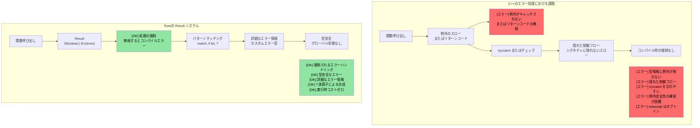
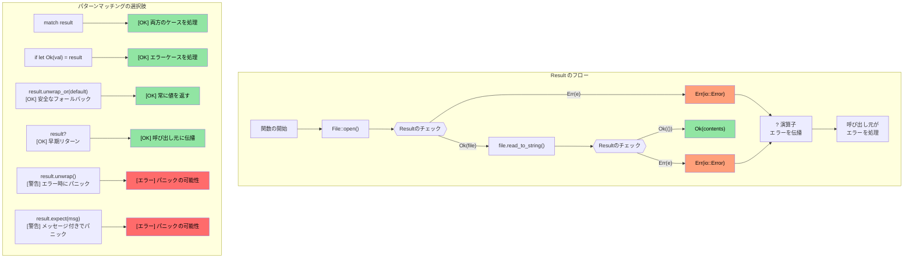

## 列挙型と Option / Result の関係

> **学習目標:** Rustがヌルポインタを `Option<T>` に、例外を `Result<T, E>` に置き換える仕組みと、`?` 演算子によってエラーの伝播がいかに簡潔になるかを学びます。これはRustの最も特徴的なパターンであり、エラーは隠れた制御フローではなく「値」として扱われます。

- 前節で学んだ `enum`（列挙型）を覚えているでしょうか？ Rustの `Option` と `Result` は、標準ライブラリで定義されている単純な列挙型にすぎません:
```rust
// これは標準ライブラリにおける Option の文字通りの定義です:
enum Option<T> {
    Some(T),  // 値を含む
    None,     // 値なし
}

// そして Result:
enum Result<T, E> {
    Ok(T),    // 成功（値を持つ）
    Err(E),   // エラー（詳細情報を持つ）
}
```
- つまり、`match` によるパターンマッチングについて学んだ知識はすべて、`Option` や `Result` に対してそのまま利用できます
- Rustには**ヌルポインタが存在しません** — `Option<T>` がその代替であり、コンパイラによって `None` の場合の処理が強制されます

### C++との比較: 例外 vs Result
| **C++のパターン** | **Rustでの対応** | **利点** |
|----------------|--------------------|--------------|
| `throw std::runtime_error(msg)` | `Err(MyError::Runtime(msg))` | 戻り値の型にエラーが含まれる — 処理忘れが起きない |
| `try { } catch (...) { }` | `match result { Ok(v) => ..., Err(e) => ... }` | 隠れた制御フローが存在しない |
| `std::optional<T>` | `Option<T>` | 網羅的なマッチが必須 — None の見落としを防ぐ |
| `noexcept` アノテーション | デフォルト — すべてのRust関数が「noexcept」 | 例外そのものが存在しない |
| `errno` / 戻り値コード | `Result<T, E>` | 型安全で、無視することができない |

# Rustの Option 型
- Rustの `Option` 型は、`Some<T>` と `None` の2つのバリアントのみを持つ `enum` です
    - これは `nullable` な型を表現するものであり、その型の有効な値を含む（`Some<T>`）か、有効な値を持たない（`None`）かのいずれかです
    - `Option` 型は、操作の結果が成功して有効な値を返すか、失敗するか（ただし特定のエラーの詳細は重要ではない）のいずれかとなるAPIで使用されます。例えば、文字列から整数値を検索する場合などを考えてみてください
```rust
fn main() {
    // Option<usize> を返す
    let a = "1234".find("1");
    match a {
        Some(a) => println!("インデックス {a} で 1 が見つかりました"),
        None => println!("1 が見つかりませんでした")
    }
}
```

# Rustの Option 型の操作
- Rustの `Option` はさまざまな方法で処理できます
    - `unwrap()` は `Option<T>` が `None` の場合にパニックし、それ以外の場合は `T` を返します。これは最も推奨されないアプローチです
    - `or()` を使用して代替の値を返すことができます
    - `if let` を使用して `Some<T>` であるかをテストできます

> **実践的なパターン**: 本番環境のRustコードにおける実際の例については、[unwrap_or による安全な値の抽出](ch17-2-avoiding-unchecked-indexing.md#safe-value-extraction-with-unwrap_or) および [関数型変換: map, map_err, find_map](ch17-2-avoiding-unchecked-indexing.md#functional-transforms-map-map_err-find_map) を参照してください。
```rust
fn main() {
  // Option<usize> を返す
  let a = "1234".find("1");
  println!("{a:?} {}", a.unwrap());
  let a = "1234".find("5").or(Some(42));
  println!("{a:?}");
  if let Some(a) = "1234".find("1") {
      println!("{a}");
  } else {
    println!("文字列内に見つかりませんでした");
  }
  // これはパニックする
  // "1234".find("5").unwrap();
}
```

# Rustの Result 型
- Result は `Option` に似た `enum` 型であり、`Ok<T>` または `Err<E>` の2つのバリアントを持ちます
    - `Result` は、失敗する可能性のあるRust APIで広く使用されています。成功時には `Ok<T>` を返し、エラー時には特定のエラー `Err<T>` を返します
```rust
  use std::num::ParseIntError;
  fn main() {
  let a : Result<i32, ParseIntError>  = "1234z".parse();
  match a {
      Ok(n) => println!("パース成功: {n}"),
      Err(e) => println!("パース失敗: {e:?}"),
  }
  let a : Result<i32, ParseIntError>  = "1234z".parse().or(Ok(-1));
  println!("{a:?}");
  if let Ok(a) = "1234".parse::<i32>() {
    println!("Let OK {a}");  
  }
  // これはパニックする
  //"1234z".parse().unwrap();
}
```

## Option と Result: 表裏一体の関係

`Option` と `Result` は密接に関連しています — `Option<T>` は本質的に `Result<T, ()>`（エラー情報を持たない Result）と同じです:

| `Option<T>` | `Result<T, E>` | 意味 |
|-------------|---------------|---------|
| `Some(value)` | `Ok(value)` | 成功 — 値が存在する |
| `None` | `Err(error)` | 失敗 — 値が存在しない（Option）、またはエラー詳細あり（Result） |

**相互変換:**

```rust
fn main() {
    let opt: Option<i32> = Some(42);
    let res: Result<i32, &str> = opt.ok_or("value was None");  // Option → Result
    
    let res: Result<i32, &str> = Ok(42);
    let opt: Option<i32> = res.ok();  // Result → Option（エラーを破棄）
    
    // 多くの共通メソッドを共有:
    // .map(), .and_then(), .unwrap_or(), .unwrap_or_else(), .is_some()/is_ok()
}
```

> **判断基準の目安**: 値が存在しないことが通常の動作である場合（キーの検索など）は `Option` を使用します。失敗の理由を説明する必要がある場合（ファイルI/O、パースなど）は `Result` を使用します。

# 演習: Option を用いた log() 関数の実装

🟢 **初級**

- `Option<&str>` パラメータを受け取る `log()` 関数を実装します。パラメータが `None` の場合、デフォルトの文字列を出力します
- 関数は成功とエラーの両方で `()` を持つ `Result` を返す必要があります（この場合、エラーが発生することはありません）

<details><summary>解答例（クリックして展開）</summary>

```rust
fn log(message: Option<&str>) -> Result<(), ()> {
    match message {
        Some(msg) => println!("LOG: {msg}"),
        None => println!("LOG: (no message provided)"),
    }
    Ok(())
}

fn main() {
    let _ = log(Some("System initialized"));
    let _ = log(None);
    
    // unwrap_or を使用した別の方法:
    let msg: Option<&str> = None;
    println!("LOG: {}", msg.unwrap_or("(default message)"));
}
// 出力:
// LOG: System initialized
// LOG: (no message provided)
// LOG: (default message)
```

</details>

----
# Rustのエラー処理
 - Rustのエラーには、回復不能なエラー（致命的）と回復可能なエラーがあります。致命的なエラーは `panic` を引き起こします
    - 一般に、`panic` を引き起こす状況は避けるべきです。`panic` は、配列の境界外アクセスや `Option<None>` に対する `unwrap()` の呼び出しなど、プログラムのバグによって引き起こされます
    - 起こり得ないはずの条件に対して明示的な `panic` を発生させることは許容されます。健全性チェックには `panic!` や `assert!` マクロを使用できます
```rust
fn main() {
   let x : Option<u32> = None;
   // println!("{x}", x.unwrap()); // パニックする
   println!("{}", x.unwrap_or(0));  // OK -- 0 を出力
   let x = 41;
   //assert!(x == 42); // パニックする
   //panic!("Something went wrong"); // 無条件のパニック
   let _a = vec![0, 1];
   // println!("{}", a[2]); // 境界外パニック。Option<T> を返す a.get(2) を使用する
}
```

## エラー処理: C++ vs Rust

### C++の例外ベースのエラー処理における問題点

```cpp
// C++のエラー処理 - 例外が隠れた制御フローを生み出す
#include <fstream>
#include <stdexcept>

std::string read_config(const std::string& path) {
    std::ifstream file(path);
    if (!file.is_open()) {
        throw std::runtime_error("Cannot open: " + path);
    }
    std::string content;
    // getline が例外を投げたらどうなるか？ファイルは適切に閉じられるか？
    // RAIIがあれば閉じられるが、他のリソースはどうだろうか？
    std::getline(file, content);
    return content;  // 呼び出し元が try/catch していなかったらどうなるか？
}

int main() {
    // エラー: try/catch で囲むのを忘れている！
    auto config = read_config("nonexistent.txt");
    // 例外が暗黙のうちに伝播し、プログラムがクラッシュする
    // 関数のシグネチャからは何一つ警告されない
    return 0;
}
```



### `Result<T, E>` の可視化

```rust
// Rustのエラー処理 - 包括的かつ強制
use std::fs::File;
use std::io::Read;

fn read_file_content(filename: &str) -> Result<String, std::io::Error> {
    let mut file = File::open(filename)?;  // ? が自動的にエラーを伝播する
    let mut contents = String::new();
    file.read_to_string(&mut contents)?;
    Ok(contents)  // 成功時
}

fn main() {
    match read_file_content("example.txt") {
        Ok(content) => println!("ファイルの内容: {}", content),
        Err(error) => println!("ファイルの読み込みに失敗: {}", error),
        // コンパイラが両方のケースの処理を強制する！
    }
}
```



# Result による回復可能なエラー処理
- Rustは回復可能なエラー処理に `enum Result<T, E>` を使用します
    - `Ok<T>` バリアントは成功時の結果を保持し、`Err<E>` はエラーを保持します
```rust
fn main() {
    let x = "1234x".parse::<u32>();
    match x {
        Ok(x) => println!("パースされた数値: {x}"),
        Err(e) => println!("パースエラー: {e:?}"),
    }
    let x  = "1234".parse::<u32>();
    // 上記と同じだが、有効な数値を指定した場合
    if let Ok(x) = &x {
        println!("パースされた数値: {x}")
    } else if let Err(e) = &x {
        println!("エラー: {e:?}");
    }
}
```

# ? 演算子によるエラー伝播
- try演算子 `?` は、`match` の `Ok` / `Err` パターンの便利な省略記法です
    - `?` を使用できるようにするには、そのメソッドが `Result<T, E>` を返す必要があることに注意してください
    - `Result<T, E>` の型は変更できます。以下の例では、`str::parse()` が返すのと同じエラー型（`std::num::ParseIntError`）を返しています
```rust
fn double_string_number(s : &str) -> Result<u32, std::num::ParseIntError> {
   let x = s.parse::<u32>()?; // エラー時には直ちにリターンする
   Ok(x*2)
}
fn main() {
    let result = double_string_number("1234");
    println!("{result:?}");
    let result = double_string_number("1234x");
    println!("{result:?}");
}
```

# エラーの変換とデフォルト値
- エラーは他の型にマッピングしたり、デフォルト値に置き換えたりすることができます (https://doc.rust-lang.org/std/result/enum.Result.html#method.unwrap_or_default)
```rust
// エラー時のエラー型を () に変更
fn double_string_number(s : &str) -> Result<u32, ()> {
   let x = s.parse::<u32>().map_err(|_|())?; // エラー時には直ちにリターンする
   Ok(x*2)
}
```
```rust
fn double_string_number(s : &str) -> Result<u32, ()> {
   let x = s.parse::<u32>().unwrap_or_default(); // パースエラー時にはデフォルト値（0）になる
   Ok(x*2)
}
```
```rust
fn double_optional_number(x : Option<u32>) -> Result<u32, ()> {
    // 以下の ok_or は Option<None> を Result<u32, ()> に変換する
    x.ok_or(()).map(|x|x*2) // .map() は Ok(u32) に対してのみ適用される
}
```

# 演習: エラー処理

🟡 **中級**
- 単一の `u32` パラメータを受け取る `log()` 関数を実装します。パラメータが 42 ではない場合はエラーを返します。成功とエラーの型の `Result<>` はともに `()` とします
- `log()` 関数を呼び出し、`log()` がエラーを返した場合は同じ `Result<>` 型で直ちに終了する関数を作成します。それ以外の場合は、log が正常に呼び出されたことを示すメッセージを出力します

```rust
fn log(x: u32) -> ?? {

}

fn call_log(x: u32) -> ?? {
    // log(x) を呼び出し、エラーが返された場合は直ちに終了する
    println!("log was successfully called");
}

fn main() {
    call_log(42);
    call_log(43);
}
``` 

<details><summary>解答例（クリックして展開）</summary>

```rust
fn log(x: u32) -> Result<(), ()> {
    if x == 42 {
        Ok(())
    } else {
        Err(())
    }
}

fn call_log(x: u32) -> Result<(), ()> {
    log(x)?;  // log() がエラーを返した場合は直ちに終了
    println!("log が値 {x} で正常に呼び出されました");
    Ok(())
}

fn main() {
    let _ = call_log(42);  // 出力: log が値 42 で正常に呼び出されました
    let _ = call_log(43);  // Err(()) を返し、何も出力されない
}
// 出力:
// log が値 42 で正常に呼び出されました
```

</details>
