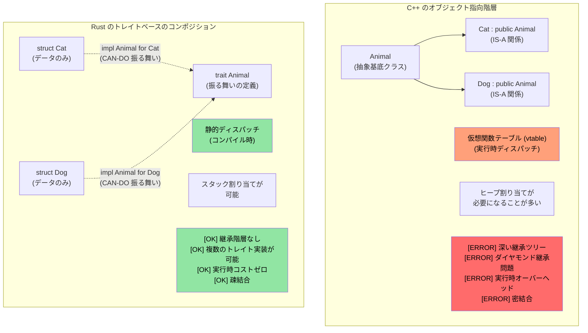
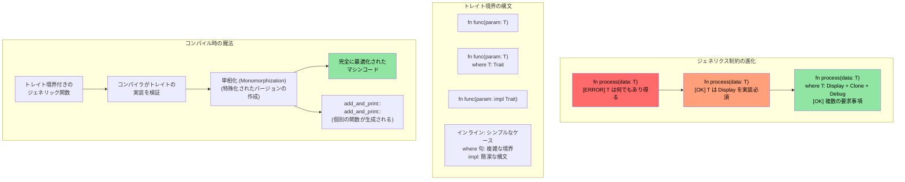

# Rust のトレイト

> **学べること:** トレイト — インターフェース、抽象基底クラス、演算子オーバーロードに対する Rust の回答です。トレイトの定義方法、独自型への実装方法、動的ディスパッチ（`dyn Trait`）と静的ディスパッチ（ジェネリクス）の使い分けを学びます。C++ 開発者向けには、トレイトが仮想関数、CRTP、コンセプトをどのように置き換えるかを解説します。C 開発者向けには、トレイトが Rust における構造化されたポリモーフィズムの実現方法であることを解説します。

- Rust のトレイトは、他の言語におけるインターフェースに似ています
    - トレイトは、そのトレイトを実装する型が定義しなければならないメソッドを規定します。
```rust
fn main() {
    trait Pet {
        fn speak(&self);
    }
    struct Cat;
    struct Dog;
    impl Pet for Cat {
        fn speak(&self) {
            println!("Meow");
        }
    }
    impl Pet for Dog {
        fn speak(&self) {
            println!("Woof!")
        }
    }
    let c = Cat{};
    let d = Dog{};
    c.speak();  // Cat と Dog の間に "is a"（〜は〜の一種である）の関係はありません
    d.speak(); // Cat と Dog の間に "is a"（〜は〜の一種である）の関係はありません
}
```

## トレイト vs C++ のコンセプトとインターフェース

### 従来の C++ 継承 vs Rust のトレイト

```cpp
// C++ - 継承ベースのポリモーフィズム
class Animal {
public:
    virtual void speak() = 0;  // 純粋仮想関数
    virtual ~Animal() = default;
};

class Cat : public Animal {  // "Cat IS-A Animal (Cat は Animal である)"
public:
    void speak() override {
        std::cout << "Meow" << std::endl;
    }
};

void make_sound(Animal* animal) {  // 実行時ポリモーフィズム
    animal->speak();  // 仮想関数の呼び出し
}
```

```rust
// Rust - トレイトによる「継承よりコンポジション（合成）」
trait Animal {
    fn speak(&self);
}

struct Cat;  // Cat は Animal ではないが、Animal の振る舞いを「実装」している

impl Animal for Cat {  // "Cat は Animal の振る舞いが「できる (CAN-DO)」"
    fn speak(&self) {
        println!("Meow");
    }
}

fn make_sound<T: Animal>(animal: &T) {  // 静的ポリモーフィズム
    animal.speak();  // 直接関数呼び出し（ゼロコスト）
}
```



### トレイト境界とジェネリクス制約

```rust
use std::fmt::Display;
use std::ops::Add;

// C++ のテンプレートに相当（制約が緩い）
// template<typename T>
// T add_and_print(T a, T b) {
//     // T が + や出力をサポートしている保証がない
//     return a + b;  // コンパイルエラーになる可能性がある
// }

// Rust - 明示的なトレイト境界
fn add_and_print<T>(a: T, b: T) -> T 
where 
    T: Display + Add<Output = T> + Copy,
{
    println!("Adding {} + {}", a, b);  // Display トレイト
    a + b  // Add トレイト
}
```



### C++ の演算子オーバーロード → Rust の `std::ops` トレイト

C++ では、特別な名前のフリー関数やメンバ関数（`operator+`、`operator<<`、`operator[]` など）を書くことで演算子をオーバーロードします。Rust では、すべての演算子が `std::ops`（出力用は `std::fmt`）のトレイトに対応しています。特別な名前の関数を書くのではなく、**トレイトを実装**します。

#### 比較: `+` 演算子

```cpp
// C++: メンバ関数またはフリー関数としての演算子オーバーロード
struct Vec2 {
    double x, y;
    Vec2 operator+(const Vec2& rhs) const {
        return {x + rhs.x, y + rhs.y};
    }
};

Vec2 a{1.0, 2.0}, b{3.0, 4.0};
Vec2 c = a + b;  // a.operator+(b) を呼び出し
```

```rust
use std::ops::Add;

#[derive(Debug, Clone, Copy)]
struct Vec2 { x: f64, y: f64 }

impl Add for Vec2 {
    type Output = Vec2;                     // 関連型 — + の演算結果の型
    fn add(self, rhs: Vec2) -> Vec2 {
        Vec2 { x: self.x + rhs.x, y: self.y + rhs.y }
    }
}

let a = Vec2 { x: 1.0, y: 2.0 };
let b = Vec2 { x: 3.0, y: 4.0 };
let c = a + b;  // <Vec2 as Add>::add(a, b) を呼び出し
println!("{c:?}"); // Vec2 { x: 4.0, y: 6.0 }
```

#### C++ との主な相違点

| 観点 | C++ | Rust |
|--------|-----|------|
| **仕組み** | 特別な関数名 (`operator+`) | トレイトの実装 (`impl Add for T`) |
| **発見しやすさ** | `operator+` で grep するかヘッダーを読む | トレイト実装を確認 — IDE サポートが極めて優れている |
| **戻り値の型** | 自由に選択可能 | `Output` 関連型によって固定される |
| **レシーバ** | 通常 `const T&` を受け取る（借用） | デフォルトで `self` を値として受け取る（ムーブ！） |
| **対称性** | `impl operator+(int, Vec2)` を記述可能 | `impl Add<Vec2> for i32` を追加する必要がある（孤児ルールが適用される） |
| **出力用の `<<`** | `operator<<(ostream&, T)` — *任意* のストリームに対してオーバーロード | `impl fmt::Display for T` — 単一の標準的な `to_string` 表現 |

#### `self` の値渡し（ムーブ）による注意点

Rust では、`Add::add(self, rhs)` は `self` を **値として** 受け取ります。`Copy` 型（上記の `Copy` を derive している `Vec2` など）では、コンパイラがコピーするため問題ありません。しかし、非 `Copy` 型の場合、`+` はオペランドを **消費（ムーブ）** します：

```rust
let s1 = String::from("hello ");
let s2 = String::from("world");
let s3 = s1 + &s2;  // s1 は s3 にムーブされる！
// println!("{s1}");  // ❌ コンパイルエラー: ムーブ後の値の使用
println!("{s2}");     // ✅ s2 は借用されただけ (&s2)
```

これが `String + &str` は動作するのに `&str + &str` は動作しない理由です — `Add` は `String + &str` に対してのみ実装されており、左辺の `String` を消費してそのバッファを再利用します。これに対応する C++ の仕組みはありません。`std::string::operator+` は常に新しい文字列を作成します。

#### 完全対応表: C++ 演算子 → Rust トレイト

| C++ 演算子 | Rust トレイト | 備考 |
|-------------|-----------|-------|
| `operator+` | `std::ops::Add` | 関連型 `Output` |
| `operator-` | `std::ops::Sub` | |
| `operator*` | `std::ops::Mul` | ポインタの間接参照ではない — それは `Deref` |
| `operator/` | `std::ops::Div` | |
| `operator%` | `std::ops::Rem` | |
| `operator-` (単項) | `std::ops::Neg` | |
| `operator!` / `operator~` | `std::ops::Not` | Rust は論理否定とビット否定の両方に `!` を使用（`~` 演算子は存在しない） |
| `operator&`, `\|`, `^` | `BitAnd`, `BitOr`, `BitXor` | |
| `operator<<`, `>>` (シフト) | `Shl`, `Shr` | ストリーム I/O ではない！ |
| `operator+=` | `std::ops::AddAssign` | `&mut self` を受け取る（`self` ではない） |
| `operator[]` | `std::ops::Index` / `IndexMut` | `&Output` / `&mut Output` を返す |
| `operator()` | `Fn` / `FnMut` / `FnOnce` | クロージャがこれらを実装。直接 `impl Fn` することは不可 |
| `operator==` | `PartialEq` (+ `Eq`) | `std::ops` ではなく `std::cmp` に存在 |
| `operator<` | `PartialOrd` (+ `Ord`) | `std::cmp` に存在 |
| `operator<<` (ストリーム) | `fmt::Display` | `println!("{}", x)` |
| `operator<<` (デバッグ) | `fmt::Debug` | `println!("{:?}", x)` |
| `operator bool` | 直接の対応物なし | `impl From<T> for bool` や `.is_empty()` などの名前付きメソッドを使用 |
| `operator T()` (暗黙の変換) | 暗黙の型変換なし | `From`/`Into` トレイトを使用（明示的） |

#### ガードレール: Rust が防ぐこと

1. **暗黙の型変換がない**: C++ の `operator int()` は、意図しない暗黙のキャストを引き起こす可能性があります。Rust には暗黙の型変換演算子はありません — `From`/`Into` を使用し、明示的に `.into()` を呼び出します。
2. **`&&` や `||` のオーバーロード禁止**: C++ はこれを許可しています（短絡評価セマンティクスが壊れます！）。Rust では許可されていません。
3. **`=` のオーバーロード禁止**: 代入は常にムーブまたはコピーであり、ユーザー定義にすることはできません。複合代入（`+=` など）は `AddAssign` 等を通じてオーバーロード「可能」です。
4. **`,`（カンマ演算子）のオーバーロード禁止**: C++ では `operator,()` が許可されており、これは最も悪名高い落とし穴の 1 つです。Rust では許可されていません。
5. **`&`（アドレス演算子）のオーバーロード禁止**: これも C++ の落とし穴の 1 つです（これを回避するために `std::addressof` が存在します）。Rust の `&` は常に「借用」を意味します。
6. **コヒーレンス規則（孤児ルール）**: 自作の型に対する `Add<Foreign>`、または外部の型に対する `Add<YourType>` のみ実装できます。外部の型に対する `Add<Foreign>` を実装することはできません。これにより、クレート間での演算子定義の衝突が防止されます。

> **結論**: C++ における演算子オーバーロードは強力ですが、ほぼ野放し状態です — カンマやアドレス演算子を含むほぼすべての演算子をオーバーロードでき、暗黙の型変換が意図せず発生する可能性があります。Rust はトレイトを通じて算術演算子や比較演算子に同等の表現力を提供しますが、**歴史的に危険とされてきたオーバーロードを遮断し**、すべての型変換を明示的なものに強制します。

----
# Rust のトレイト
- Rust では、この例の `u32` のような組み込み型に対しても、ユーザー定義のトレイトを実装することが許可されています。ただし、トレイトまたは型のいずれかがそのクレートに属している必要があります
```rust
trait IsSecret {
  fn is_secret(&self);
}
// IsSecret トレイトはこのクレートに属しているため問題ありません
impl IsSecret for u32 {
  fn is_secret(&self) {
      if *self == 42 {
          println!("Is secret of life");
      }
  }
}

fn main() {
  42u32.is_secret();
  43u32.is_secret();
}
```


# Rust のトレイト
- トレイトはインターフェースの継承とデフォルト実装をサポートしています
```rust
trait Animal {
  // デフォルト実装
  fn is_mammal(&self) -> bool {
    true
  }
}
trait Feline : Animal {
  // デフォルト実装
  fn is_feline(&self) -> bool {
    true
  }
}

struct Cat;
// デフォルト実装を使用。スーパートレイトのすべてのトレイトを個別に実装する必要があることに注意
impl Feline for Cat {}
impl Animal for Cat {}
fn main() {
  let c = Cat{};
  println!("{} {}", c.is_mammal(), c.is_feline());
}
```
----
# 演習: Logger トレイトの実装

🟡 **中級**

- `u64` を受け取る `log()` という単一のメソッドを持つ `Log` トレイトを実装してください
    - `Log` トレイトを実装する 2 つの異なるロガー `SimpleLogger` と `ComplexLogger` を実装してください。一方は `u64` とともに "Simple logger" と出力し、もう一方は `u64` とともに "Complex logger" と出力する必要があります 

<details><summary>解答（クリックして展開）</summary>

```rust
trait Log {
    fn log(&self, value: u64);
}

struct SimpleLogger;
struct ComplexLogger;

impl Log for SimpleLogger {
    fn log(&self, value: u64) {
        println!("Simple logger: {value}");
    }
}

impl Log for ComplexLogger {
    fn log(&self, value: u64) {
        println!("Complex logger: {value} (hex: 0x{value:x}, binary: {value:b})");
    }
}

fn main() {
    let simple = SimpleLogger;
    let complex = ComplexLogger;
    simple.log(42);
    complex.log(42);
}
// 出力:
// Simple logger: 42
// Complex logger: 42 (hex: 0x2a, binary: 101010)
```

</details>

----
# Rust トレイトの関連型
```rust
#[derive(Debug)]
struct Small(u32);
#[derive(Debug)]
struct Big(u32);
trait Double {
    type T;
    fn double(&self) -> Self::T;
}

impl Double for Small {
    type T = Big;
    fn double(&self) -> Self::T {
        Big(self.0 * 2)
    }
}
fn main() {
    let a = Small(42);
    println!("{:?}", a.double());
}
```

# Rust トレイトの実装 (impl Trait)
- `impl` をトレイトとともに使用して、そのトレイトを実装する任意の型を受け取ることができます
```rust
trait Pet {
    fn speak(&self);
}
struct Dog {}
struct Cat {}
impl Pet for Dog {
    fn speak(&self) {println!("Woof!")}
}
impl Pet for Cat {
    fn speak(&self) {println!("Meow")}
}
fn pet_speak(p: &impl Pet) {
    p.speak();
}
fn main() {
    let c = Cat {};
    let d = Dog {};
    pet_speak(&c);
    pet_speak(&d);
}
```

# Rust トレイトの実装 (impl Trait)
- `impl` は戻り値の型としても使用できます
```rust
trait Pet {}
struct Dog;
struct Cat;
impl Pet for Cat {}
impl Pet for Dog {}
fn cat_as_pet() -> impl Pet {
    let c = Cat {};
    c
}
fn dog_as_pet() -> impl Pet {
    let d = Dog {};
    d
}
fn main() {
    let p = cat_as_pet();
    let d = dog_as_pet();
}
```
----
# Rust の動的トレイト (dyn Trait)
- 動的トレイトを使用すると、基底の具体的な型を知らなくてもトレイトの機能を呼び出すことができます。これは `型消去 (type erasure)` として知られています 
```rust
trait Pet {
    fn speak(&self);
}
struct Dog {}
struct Cat {x: u32}
impl Pet for Dog {
    fn speak(&self) {println!("Woof!")}
}
impl Pet for Cat {
    fn speak(&self) {println!("Meow")}
}
fn pet_speak(p: &dyn Pet) {
    p.speak();
}
fn main() {
    let c = Cat {x: 42};
    let d = Dog {};
    pet_speak(&c);
    pet_speak(&d);
}
```
----

## `impl Trait`、`dyn Trait`、enum の使い分け

これら 3 つのアプローチはいずれもポリモーフィズムを実現しますが、トレードオフが異なります：

| アプローチ | ディスパッチ | パフォーマンス | 異種コレクションの可否 | 使いどころ |
|----------|----------|-------------|---------------------------|-------------|
| `impl Trait` / ジェネリクス | 静的（単相化） | ゼロコスト — コンパイル時にインライン化 | 不可 — 各スロットは単一の具象型を持つ | デフォルトの選択肢。関数の引数、戻り値の型 |
| `dyn Trait` | 動的（vtable） | 呼び出しごとにわずかなオーバーヘッド（約 1 回のポインタ間接参照） | 可能 — `Vec<Box<dyn Trait>>` | コレクション内で異なる型を混在させる必要がある場合や、プラグイン形式の拡張性が必要な場合 |
| `enum` | パターンマッチ | ゼロコスト — コンパイル時に既知のバリアント | 可能 — ただし既知のバリアントのみ | バリアントの集合が **閉じており**、コンパイル時に既知である場合 |

```rust
trait Shape {
    fn area(&self) -> f64;
}
struct Circle { radius: f64 }
struct Rect { w: f64, h: f64 }
impl Shape for Circle { fn area(&self) -> f64 { std::f64::consts::PI * self.radius * self.radius } }
impl Shape for Rect   { fn area(&self) -> f64 { self.w * self.h } }

// 静的ディスパッチ — コンパイラが型ごとに個別のコードを生成
fn print_area(s: &impl Shape) { println!("{}", s.area()); }

// 動的ディスパッチ — 単一の関数で、ポインタの背後にある任意の Shape を扱える
fn print_area_dyn(s: &dyn Shape) { println!("{}", s.area()); }

// enum — 閉じた集合、トレイトは不要
enum ShapeEnum { Circle(f64), Rect(f64, f64) }
impl ShapeEnum {
    fn area(&self) -> f64 {
        match self {
            ShapeEnum::Circle(r) => std::f64::consts::PI * r * r,
            ShapeEnum::Rect(w, h) => w * h,
        }
    }
}
```

> **C++ 開発者向け:** `impl Trait` は C++ のテンプレートに似ています（単相化、ゼロコスト）。`dyn Trait` は C++ の仮想関数に似ています（vtable ディスパッチ）。Rust の enum と `match` は `std::variant` と `std::visit` の組み合わせに似ていますが、網羅的なマッチングがコンパイラによって強制されます。

> **目安となるルール**: まずは `impl Trait`（静的ディスパッチ）から始めてください。異種コレクションが必要な場合や、コンパイル時に具象型が判明しない場合にのみ `dyn Trait` を検討します。すべてのバリアントを自身で管理できる場合は `enum` を使用してください。
