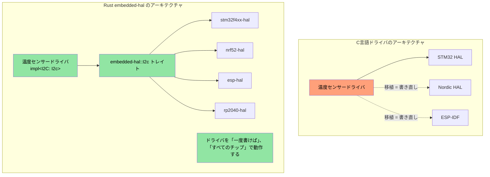
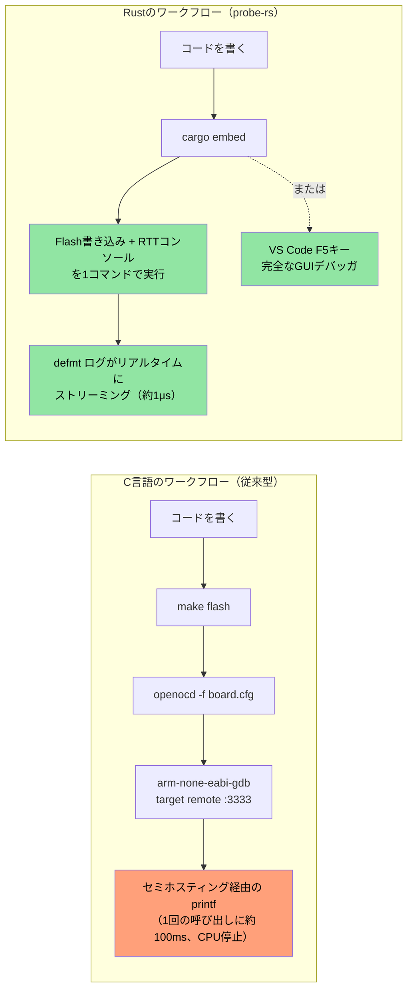

## MMIO と Volatile レジスタアクセス

> **学習目標:** 組み込みRustにおける型安全なハードウェアレジスタアクセス — volatile MMIOパターン、レジスタ抽象化クレート、そしてC言語の `volatile` キーワードでは表現できないレジスタ権限をRustの型システムでエンコードする方法を学びます。

C言語のファームウェアでは、特定のアドレスへの `volatile` ポインタを介してハードウェアレジスタにアクセスします。Rustにも同等のメカニズムが存在しますが、型安全性が保証されています。

### C言語の volatile vs Rustの volatile

```c
// C言語 — 典型的なMMIOレジスタアクセス
#define GPIO_BASE     0x40020000
#define GPIO_MODER    (*(volatile uint32_t*)(GPIO_BASE + 0x00))
#define GPIO_ODR      (*(volatile uint32_t*)(GPIO_BASE + 0x14))

void toggle_led(void) {
    GPIO_ODR ^= (1 << 5);  // ピン5をトグル
}
```

```rust
// Rust — 生の volatile（低レイヤであり、直接使用されることは稀）
use core::ptr;

const GPIO_BASE: usize = 0x4002_0000;
const GPIO_ODR: *mut u32 = (GPIO_BASE + 0x14) as *mut u32;

/// # Safety
/// 呼び出し側は GPIO_BASE が有効にマップされたペリフェラルアドレスであることを保証しなければならない。
unsafe fn toggle_led() {
    // SAFETY: GPIO_ODR は有効なメモリマップトレジスタのアドレスである。
    let current = unsafe { ptr::read_volatile(GPIO_ODR) };
    unsafe { ptr::write_volatile(GPIO_ODR, current ^ (1 << 5)) };
}
```

### svd2rust — 型安全なレジスタアクセス（Rustの流儀）

実際の実装では、生の volatile ポインタを書くことは**ほぼありません**。代わりに、チップの SVD ファイル（IDE のデバッグビューで使われるのと同じ XML ファイル）から `svd2rust` を使用して **ペリフェラルアクセスクレート（PAC: Peripheral Access Crate）** を自動生成します：

```rust
// 生成されたPACコード（手動で書く必要はありません — svd2rust が生成します）
// PACにより、無効なレジスタアクセスはコンパイルエラーになります

// PACを使用した例:
use stm32f4::stm32f401;  // お使いのチップ用 PAC クレート

fn configure_gpio(dp: stm32f401::Peripherals) {
    // GPIOA クロックを有効化 — 型安全、マジックナンバー不要
    dp.RCC.ahb1enr.modify(|_, w| w.gpioaen().enabled());

    // ピン5を出力に設定 — 読み取り専用フィールドへの誤った書き込みは不可能
    dp.GPIOA.moder.modify(|_, w| w.moder5().output());

    // ピン5をトグル — 型検査されたフィールドアクセス
    dp.GPIOA.odr.modify(|r, w| {
        // SAFETY: 有効なレジスタフィールド内の単一ビットをトグルしている。
        unsafe { w.bits(r.bits() ^ (1 << 5)) }
    });
}
```

| C言語でのレジスタアクセス | Rust PAC での同等処理 |
|-------------------|---------------------|
| `#define REG (*(volatile uint32_t*)ADDR)` | `svd2rust` で生成された PAC クレート |
| `REG |= BITMASK;` | `periph.reg.modify(\|_, w\| w.field().variant())` |
| `value = REG;` | `let val = periph.reg.read().field().bits()` |
| 誤ったレジスタフィールド → 気づかぬ未定義動作（UB） | コンパイルエラー — フィールドが存在しない |
| 誤ったレジスタ幅 → 気づかぬ未定義動作（UB） | 型検査 — u8 vs u16 vs u32 |

## 割り込み処理とクリティカルセクション

C言語ファームウェアでは、`__disable_irq()` / `__enable_irq()` や `void` シグネチャの ISR 関数を使用します。Rustではこれらに対して型安全な代替手段を提供します。

### C言語 vs Rust の割り込みパターン

```c
// C言語 — 従来の割り込みハンドラ
volatile uint32_t tick_count = 0;

void SysTick_Handler(void) {   // 命名規則が極めて重要 — 間違えると HardFault が発生する
    tick_count++;
}

uint32_t get_ticks(void) {
    __disable_irq();
    uint32_t t = tick_count;   // クリティカルセクション内で読み出し
    __enable_irq();
    return t;
}
```

```rust
// Rust — cortex-m とクリティカルセクションを使用
use core::cell::Cell;
use cortex_m::interrupt::{self, Mutex};

// クリティカルセクション用 Mutex で保護された共有状態
static TICK_COUNT: Mutex<Cell<u32>> = Mutex::new(Cell::new(0));

#[cortex_m_rt::exception]     // 属性によりベクタテーブルへの正確な配置を保証
fn SysTick() {                // 名前が有効な例外と一致しない場合はコンパイルエラー
    interrupt::free(|cs| {    // cs = クリティカルセクショントークン（割り込みが無効化されている証明）
        let count = TICK_COUNT.borrow(cs).get();
        TICK_COUNT.borrow(cs).set(count + 1);
    });
}

fn get_ticks() -> u32 {
    interrupt::free(|cs| TICK_COUNT.borrow(cs).get())
}
```

### RTIC — リアルタイム割り込み駆動型並行性（RTIC）

複数の割り込み優先度を持つ複雑なファームウェア向けに、RTIC（旧RTFM）は**ゼロオーバーヘッドでのコンパイル時タスクスケジューリング**を提供します：

```rust
#[rtic::app(device = stm32f4xx_hal::pac, dispatchers = [USART1])]
mod app {
    use stm32f4xx_hal::prelude::*;

    #[shared]
    struct Shared {
        temperature: f32,   // タスク間で共有 — RTIC がロックを管理
    }

    #[local]
    struct Local {
        led: stm32f4xx_hal::gpio::Pin<'A', 5, stm32f4xx_hal::gpio::Output>,
    }

    #[init]
    fn init(cx: init::Context) -> (Shared, Local) {
        let dp = cx.device;
        let gpioa = dp.GPIOA.split();
        let led = gpioa.pa5.into_push_pull_output();
        (Shared { temperature: 25.0 }, Local { led })
    }

    // ハードウェアタスク: SysTick 割り込み時に実行
    #[task(binds = SysTick, shared = [temperature], local = [led])]
    fn tick(mut cx: tick::Context) {
        cx.local.led.toggle();
        cx.shared.temperature.lock(|temp| {
            // RTIC がここでの排他アクセスを保証 — 手動でのロック管理は不要
            *temp += 0.1;
        });
    }
}
```

**C言語ファームウェア開発者にとってRTICが重要である理由:**
- `#[shared]` アノテーションにより手動のミューテックス管理が不要になる
- 優先度ベースのプリエンプションがコンパイル時に構成される — 実行時オーバーヘッドなし
- 構造的にデッドロックフリー（フレームワークがコンパイル時に証明）
- ISRの命名ミスは実行時の HardFault ではなく、コンパイルエラーになる

## パニックハンドラの戦略

C言語では、ファームウェア内で異常が発生した場合、一般にシステムリセットを行うかLEDを点滅させます。Rustのパニックハンドラは、構造化された制御を提供します：

```rust
// 戦略1: ハルト（デバッグ用 — デバッガをアタッチして状態を調査）
use panic_halt as _;  // パニック時に無限ループ

// 戦略2: MCUのリセット
use panic_reset as _;  // システムリセットをトリガー

// 戦略3: プローブ経由のログ出力（開発用）
use panic_probe as _;  // デバッグプローブ経由でパニック情報を送信（defmt を併用）

// 戦略4: defmt でログ出力した後にハルト
use defmt_panic as _;  // ITM/RTT 経由で詳細なパニックメッセージを出力

// 戦略5: カスタムハンドラ（製品ファームウェア用）
use core::panic::PanicInfo;

#[panic_handler]
fn panic(info: &PanicInfo) -> ! {
    // 1. さらなる障害を防ぐために割り込みを無効化
    cortex_m::interrupt::disable();

    // 2. 予約されたRAM領域にパニック情報を書き込む（リセット後も保持される）
    // SAFETY: PANIC_LOG はリンカスクリプトで定義された予約メモリ領域である。
    unsafe {
        let log = 0x2000_0000 as *mut [u8; 256];
        // 切り詰めたパニックメッセージを書き込む
        use core::fmt::Write;
        let mut writer = FixedWriter::new(&mut *log);
        let _ = write!(writer, "{}", info);
    }

    // 3. ウォッチドッグリセットをトリガー（またはエラーLEDを点滅）
    loop {
        cortex_m::asm::wfi();  // 割り込み待機（停止中の省電力化）
    }
}
```

## リンカスクリプトとメモリレイアウト

C言語ファームウェア開発者はリンカスクリプトを記述して FLASH/RAM 領域を定義します。Rust組み込みでも `memory.x` を介してまったく同じ概念を使用します：

```ld
/* memory.x — クレートルートに配置され、cortex-m-rt によって消費される */
MEMORY
{
  /* 使用するMCUに合わせて調整 — これは STM32F401 の値 */
  FLASH : ORIGIN = 0x08000000, LENGTH = 512K
  RAM   : ORIGIN = 0x20000000, LENGTH = 96K
}

/* オプション: パニックログ用領域の確保（上記のパニックハンドラを参照） */
_panic_log_start = ORIGIN(RAM);
_panic_log_size  = 256;
```

```toml
# .cargo/config.toml — ターゲットとリンカフラグの設定
[target.thumbv7em-none-eabihf]
runner = "probe-rs run --chip STM32F401RE"  # デバッグプローブ経由でフラッシュ書き込み・実行
rustflags = [
    "-C", "link-arg=-Tlink.x",              # cortex-m-rt リンカスクリプト
]

[build]
target = "thumbv7em-none-eabihf"            # ハードウェアFPU搭載の Cortex-M4F
```

| C言語のリンカスクリプト | Rustでの同等設定 |
|-----------------|-----------------|
| `MEMORY { FLASH ..., RAM ... }` | クレートルートの `memory.x` |
| `__attribute__((section(".data")))` | `#[link_section = ".data"]` |
| Makefile 内の `-T linker.ld` | `.cargo/config.toml` 内の `-C link-arg=-Tlink.x` |
| `__bss_start__`, `__bss_end__` | `cortex-m-rt` が自動的に処理 |
| スタートアップアセンブリ (`startup.s`) | `cortex-m-rt` の `#[entry]` マクロ |

## `embedded-hal` ドライバの作成

`embedded-hal` クレートは、SPI、I2C、GPIO、UART などのトレイトを定義しています。これらのトレイトに対して作成されたドライバは**任意のMCU**で動作します — これこそが、組み込みコードの再利用性におけるRustの強力なキラー機能です。

### C言語 vs Rust: 温度センサードライバ

```c
// C言語 — STM32 HAL に密結合したドライバ
#include "stm32f4xx_hal.h"

float read_temperature(I2C_HandleTypeDef* hi2c, uint8_t addr) {
    uint8_t buf[2];
    HAL_I2C_Mem_Read(hi2c, addr << 1, 0x00, I2C_MEMADD_SIZE_8BIT,
                     buf, 2, HAL_MAX_DELAY);
    int16_t raw = ((int16_t)buf[0] << 4) | (buf[1] >> 4);
    return raw * 0.0625;
}
// 問題点: このドライバは STM32 HAL 専用です。Nordic への移植は書き直しになります。
```

```rust
// Rust — embedded-hal を実装する任意のMCUで動作するドライバ
use embedded_hal::i2c::I2c;

pub struct Tmp102<I2C> {
    i2c: I2C,
    address: u8,
}

impl<I2C: I2c> Tmp102<I2C> {
    pub fn new(i2c: I2C, address: u8) -> Self {
        Self { i2c, address }
    }

    pub fn read_temperature(&mut self) -> Result<f32, I2C::Error> {
        let mut buf = [0u8; 2];
        self.i2c.write_read(self.address, &[0x00], &mut buf)?;
        let raw = ((buf[0] as i16) << 4) | ((buf[1] as i16) >> 4);
        Ok(raw as f32 * 0.0625)
    }
}

// STM32、Nordic nRF、ESP32、RP2040 など、embedded-hal の I2C 実装を持つ任意のチップで動作します
```



## グローバルアロケータのセットアップ

`alloc` クレートを使用すると `Vec`、`String`、`Box` が使えるようになりますが、ヒープメモリをどこから取得するかをRustに指示する必要があります。これは、使用プラットフォーム向けに `malloc()` を実装することと同等です：

```rust
#![no_std]
extern crate alloc;

use alloc::vec::Vec;
use alloc::string::String;
use embedded_alloc::LlffHeap as Heap;

#[global_allocator]
static HEAP: Heap = Heap::empty();

#[cortex_m_rt::entry]
fn main() -> ! {
    // メモリ領域を指定してアロケータを初期化
    // （通常はスタックや静的データで使用されていないRAMの一部領域）
    {
        const HEAP_SIZE: usize = 4096;
        static mut HEAP_MEM: [u8; HEAP_SIZE] = [0; HEAP_SIZE];
        // SAFETY: HEAP_MEM は割り当てが行われる前、初期化時のここでのみアクセスされる。
        unsafe { HEAP.init(HEAP_MEM.as_ptr() as usize, HEAP_SIZE) }
    }

    // これでヒープ型が使用可能になります！
    let mut log_buffer: Vec<u8> = Vec::with_capacity(256);
    let name: String = String::from("sensor_01");
    // ...

    loop {}
}
```

| C言語のヒープセットアップ | Rustでの同等処理 |
|-------------|-----------------|
| `_sbrk()` / カスタム `malloc()` | `#[global_allocator]` + `Heap::init()` |
| `configTOTAL_HEAP_SIZE` (FreeRTOS) | `HEAP_SIZE` 定数 |
| `pvPortMalloc()` | `alloc::vec::Vec::new()` — 自動的 |
| ヒープ枯渇 → 未定義動作 | `alloc_error_handler` → 制御されたパニック |

## `no_std` と `std` が混在するワークスペース

現実のプロジェクト（大規模なRustワークスペースなど）では、以下のような構成が一般的です：
- ハードウェア非依存のロジックを持つ `no_std` ライブラリクレート
- Linuxアプリケーション層向けの `std` バイナリクレート

```text
workspace_root/
├── Cargo.toml              # [workspace] members = [...]
├── protocol/               # no_std — 通信プロトコル、パース処理
│   ├── Cargo.toml          # no default-features, no std
│   └── src/lib.rs          # #![no_std]
├── driver/                 # no_std — ハードウェア抽象化
│   ├── Cargo.toml
│   └── src/lib.rs          # #![no_std], embedded-hal トレイトを使用
├── firmware/               # no_std — MCU用バイナリ
│   ├── Cargo.toml          # protocol, driver に依存
│   └── src/main.rs         # #![no_std] #![no_main]
└── host_tool/              # std — Linux用CLIツール
    ├── Cargo.toml          # protocol に依存（同じクレート！）
    └── src/main.rs         # std::fs, std::net などを利用
```

重要なパターンとして、`protocol` クレートは `#![no_std]` を採用しているため、MCUファームウェアとLinuxホストツールの**双方**向けにコンパイルできます。コードの共有が可能となり、二重管理を完全に排除できます。

```toml
# protocol/Cargo.toml
[package]
name = "protocol"

[features]
default = []
std = []  # オプション: ホスト向けビルド時に std 固有の機能を有効化

[dependencies]
serde = { version = "1", default-features = false, features = ["derive"] }
# 注: default-features = false により serde の std 依存関係を除外
```

```rust
// protocol/src/lib.rs
#![cfg_attr(not(feature = "std"), no_std)]

#[cfg(feature = "std")]
extern crate std;

extern crate alloc;
use alloc::vec::Vec;
use serde::{Serialize, Deserialize};

#[derive(Debug, Serialize, Deserialize)]
pub struct DiagPacket {
    pub sensor_id: u16,
    pub value: i32,
    pub fault_code: u16,
}

// この関数は no_std と std の双方の環境で動作します
pub fn parse_packet(data: &[u8]) -> Result<DiagPacket, &'static str> {
    if data.len() < 8 {
        return Err("パケットが短すぎます");
    }
    Ok(DiagPacket {
        sensor_id: u16::from_le_bytes([data[0], data[1]]),
        value: i32::from_le_bytes([data[2], data[3], data[4], data[5]]),
        fault_code: u16::from_le_bytes([data[6], data[7]]),
    })
}
```

## 演習: ハードウェア抽象化レイヤ（HAL）ドライバ

SPI経由で通信を行う架空のLEDコントローラ向けの `no_std` ドライバを作成してください。ドライバは `embedded-hal` を使用して任意のSPI実装に対してジェネリックである必要があります。

**要件:**
1. `LedController<SPI>` 構造体を定義する
2. `new()`、`set_brightness(led: u8, brightness: u8)`、および `all_off()` を実装する
3. SPIプロトコル: `[led_index, brightness_value]` の2バイトトランザクションを送信する
4. モックSPI実装を使用してテストを作成する

```rust
// スターターコード
#![no_std]
use embedded_hal::spi::SpiDevice;

pub struct LedController<SPI> {
    spi: SPI,
    num_leds: u8,
}

// TODO: new()、set_brightness()、all_off() を実装
// TODO: テスト用の MockSpi を作成
```

<details><summary>解答例（クリックして展開）</summary>

```rust
#![no_std]
use embedded_hal::spi::SpiDevice;

pub struct LedController<SPI> {
    spi: SPI,
    num_leds: u8,
}

impl<SPI: SpiDevice> LedController<SPI> {
    pub fn new(spi: SPI, num_leds: u8) -> Self {
        Self { spi, num_leds }
    }

    pub fn set_brightness(&mut self, led: u8, brightness: u8) -> Result<(), SPI::Error> {
        if led >= self.num_leds {
            return Ok(()); // 範囲外のLED番号は暗黙的に無視
        }
        self.spi.write(&[led, brightness])
    }

    pub fn all_off(&mut self) -> Result<(), SPI::Error> {
        for led in 0..self.num_leds {
            self.spi.write(&[led, 0])?;
        }
        Ok(())
    }
}

#[cfg(test)]
mod tests {
    use super::*;

    // すべてのトランザクションを記録するモックSPI
    struct MockSpi {
        transactions: Vec<Vec<u8>>,
    }

    // モック用の最小限のエラー型
    #[derive(Debug)]
    struct MockError;
    impl embedded_hal::spi::Error for MockError {
        fn kind(&self) -> embedded_hal::spi::ErrorKind {
            embedded_hal::spi::ErrorKind::Other
        }
    }

    impl embedded_hal::spi::ErrorType for MockSpi {
        type Error = MockError;
    }

    impl SpiDevice for MockSpi {
        fn write(&mut self, buf: &[u8]) -> Result<(), Self::Error> {
            self.transactions.push(buf.to_vec());
            Ok(())
        }
        fn read(&mut self, _buf: &mut [u8]) -> Result<(), Self::Error> { Ok(()) }
        fn transfer(&mut self, _r: &mut [u8], _w: &[u8]) -> Result<(), Self::Error> { Ok(()) }
        fn transfer_in_place(&mut self, _buf: &mut [u8]) -> Result<(), Self::Error> { Ok(()) }
        fn transaction(&mut self, _ops: &mut [embedded_hal::spi::Operation<'_, u8>]) -> Result<(), Self::Error> { Ok(()) }
    }

    #[test]
    fn test_set_brightness() {
        let mock = MockSpi { transactions: vec![] };
        let mut ctrl = LedController::new(mock, 4);
        ctrl.set_brightness(2, 128).unwrap();
        assert_eq!(ctrl.spi.transactions, vec![vec![2, 128]]);
    }

    #[test]
    fn test_all_off() {
        let mock = MockSpi { transactions: vec![] };
        let mut ctrl = LedController::new(mock, 3);
        ctrl.all_off().unwrap();
        assert_eq!(ctrl.spi.transactions, vec![
            vec![0, 0], vec![1, 0], vec![2, 0],
        ]);
    }

    #[test]
    fn test_out_of_range_led() {
        let mock = MockSpi { transactions: vec![] };
        let mut ctrl = LedController::new(mock, 2);
        ctrl.set_brightness(5, 255).unwrap(); // 範囲外 — 無視される
        assert!(ctrl.spi.transactions.is_empty());
    }
}
```

</details>

## 組み込みRustのデバッグ — probe-rs、defmt、VS Code

C言語ファームウェア開発者は通常、OpenOCD + GDB やベンダー固有のIDE（Keil、IAR、Segger Ozone）を使ってデバッグを行います。Rustの組み込みエコシステムでは、OpenOCD + GDB スタックを単一のRustネイティブツールに置き換える統合デバッグプローブインターフェースとして **probe-rs** が広く採用されています。

### probe-rs — オールインワンのデバッグプローブツール

`probe-rs` は、OpenOCD + GDB の組み合わせを代替します。CMSIS-DAP、ST-Link、J-Link、その他のデバッグプローブを標準でサポートしています：

```bash
# probe-rs のインストール（cargo-flash と cargo-embed を含む）
cargo install probe-rs-tools

# ファームウェアのフラッシュ書き込みと実行
cargo flash --chip STM32F401RE --release

# フラッシュ書き込み、実行、および RTT（Real-Time Transfer）コンソールのオープン
cargo embed --chip STM32F401RE
```

**probe-rs vs OpenOCD + GDB**:

| 項目 | OpenOCD + GDB | probe-rs |
|--------|--------------|----------|
| インストール | 2つの独立したパッケージ + スクリプト | `cargo install probe-rs-tools` |
| 設定 | ボード/プローブごとの `.cfg` ファイル | `--chip` フラグまたは `Embed.toml` |
| コンソール出力 | セミホスティング（非常に低速） | RTT（約10倍高速） |
| ログフレームワーク | `printf` | `defmt`（構造化、オーバーヘッドゼロ） |
| フラッシュ書き込みアルゴリズム | XML パックファイル | 1,000種以上のチップ向けに組み込み済み |
| GDBサポート | ネイティブ | `probe-rs gdb` アダプタ |

### `Embed.toml` — プロジェクト設定

`.cfg` や `.gdbinit` ファイルを使い分ける代わりに、probe-rs では単一の設定ファイルを使用します：

```toml
# Embed.toml — プロジェクトルートに配置
[default.general]
chip = "STM32F401RETx"

[default.rtt]
enabled = true           # Real-Time Transfer コンソールを有効化
channels = [
    { up = 0, mode = "BlockIfFull", name = "Terminal" },
]

[default.flashing]
enabled = true           # 実行前にフラッシュ書き込みを行う
restore_unwritten_bytes = false

[default.reset]
halt_afterwards = false  # フラッシュ書き込み + リセット後に実行を開始
[default.gdb]
enabled = false          # true に設定すると :1337 で GDB サーバを公開
gdb_connection_string = "127.0.0.1:1337"
```

```bash
# Embed.toml があれば、以下を実行するだけです:
cargo embed              # フラッシュ書き込み + RTT コンソール — オプションフラグ不要
cargo embed --release    # リリースビルドで実行
```

### defmt — 組み込みロギングのための遅延フォーマット（Deferred Formatting）

`defmt`（遅延フォーマット: deferred formatting）は `printf` デバッグを置き換えるものです。フォーマット文字列はフラッシュではなく ELF ファイル内に保存されるため、ターゲット上のログ呼び出しはインデックスと引数のバイト列のみを送信します。これにより、ロギングは `printf` よりも **10〜100倍高速** になり、フラッシュ領域の消費もごくわずかです：

```rust
#![no_std]
#![no_main]

use defmt::{info, warn, error, debug, trace};
use defmt_rtt as _; // RTT トランスポート — defmt の出力を probe-rs に接続

#[cortex_m_rt::entry]
fn main() -> ! {
    info!("ブート完了、ファームウェア v{}", env!("CARGO_PKG_VERSION"));

    let sensor_id: u16 = 0x4A;
    let temperature: f32 = 23.5;

    // フォーマット文字列はFlashではなくELF内に留まる — オーバーヘッドはほぼゼロ
    debug!("センサー {:#06X}: {:.1}°C", sensor_id, temperature);

    if temperature > 80.0 {
        warn!("センサー {:#06X} が過熱状態: {:.1}°C", sensor_id, temperature);
    }

    loop {
        cortex_m::asm::wfi(); // 割り込み待機
    }
}

// カスタム型 — Debug ではなく defmt::Format を derive
#[derive(defmt::Format)]
struct SensorReading {
    id: u16,
    value: i32,
    status: SensorStatus,
}

#[derive(defmt::Format)]
enum SensorStatus {
    Ok,
    Warning,
    Fault(u8),
}

// 使用法:
// info!("測定値: {:?}", reading);  // <-- std の Debug ではなく defmt::Format を使用
```

**defmt vs `printf` vs `log`**:

| 機能 | C言語 `printf`（セミホスティング） | Rust `log` クレート | `defmt` |
|---------|-------------------------|-------------------|---------|
| 速度 | 1呼び出しあたり約100ms | 該当なし（`std` が必要） | 1呼び出しあたり約1μs |
| Flash消費量 | 完全なフォーマット文字列全体 | 完全なフォーマット文字列全体 | インデックスのみ（数バイト） |
| トランスポート | セミホスティング（CPU停止） | シリアル/UART | RTT（ノンブロッキング） |
| 構造化出力 | 不可 | テキストのみ | 型付き・バイナリエンコード |
| `no_std` | セミホスティング経由 | ファサードのみ（バックエンドには `std` が必要） | ✅ ネイティブ対応 |
| フィルタレベル | 手動の `#ifdef` | `RUST_LOG=debug` | `defmt::println` + フィーチャフラグ |

### VS Code デバッグ設定

`probe-rs` の VS Code 拡張機能を使用すると、ブレークポイント、変数インスペクション、コールスタック、レジスタビューなどの完全なグラフィカルデバッグが利用可能になります：

```jsonc
// .vscode/launch.json
{
    "version": "0.2.0",
    "configurations": [
        {
            "type": "probe-rs-debug",
            "request": "launch",
            "name": "Flash & Debug (probe-rs)",
            "chip": "STM32F401RETx",
            "coreConfigs": [
                {
                    "programBinary": "target/thumbv7em-none-eabihf/debug/${workspaceFolderBasename}",
                    "rttEnabled": true,
                    "rttChannelFormats": [
                        {
                            "channelNumber": 0,
                            "dataFormat": "Defmt",
                            "showTimestamps": true
                        }
                    ]
                }
            ],
            "connectUnderReset": true,
            "speed": 4000
        }
    ]
}
```

拡張機能のインストール:
```bash
ext install probe-rs.probe-rs-debugger
```

### C言語のデバッガワークフロー vs Rustの組み込みデバッグ



| C言語のデバッグ操作 | Rustでの同等操作 |
|---------------|-----------------|
| `openocd -f board/st_nucleo_f4.cfg` | `probe-rs info`（プローブとチップを自動検出） |
| `arm-none-eabi-gdb -x .gdbinit` | `probe-rs gdb --chip STM32F401RE` |
| `target remote :3333` | GDB は `localhost:1337` に接続 |
| `monitor reset halt` | `probe-rs reset --chip ...` |
| `load firmware.elf` | `cargo flash --chip ...` |
| `printf("debug: %d\n", val)`（セミホスティング） | `defmt::info!("debug: {}", val)`（RTT） |
| Keil/IAR GUI デバッガ | VS Code + `probe-rs-debugger` 拡張機能 |
| Segger SystemView | `defmt` + `probe-rs` RTT ビューア |

> **相互参照**: 組み込みドライバで使用される高度な unsafe パターン（ピンプロジェクション、カスタムアリーナ/スラブアロケータなど）については、関連ガイドの *Rust Patterns*、セクション「Pin Projections — Structural Pinning」および「Custom Allocators — Arena and Slab Patterns」を参照してください。

---
