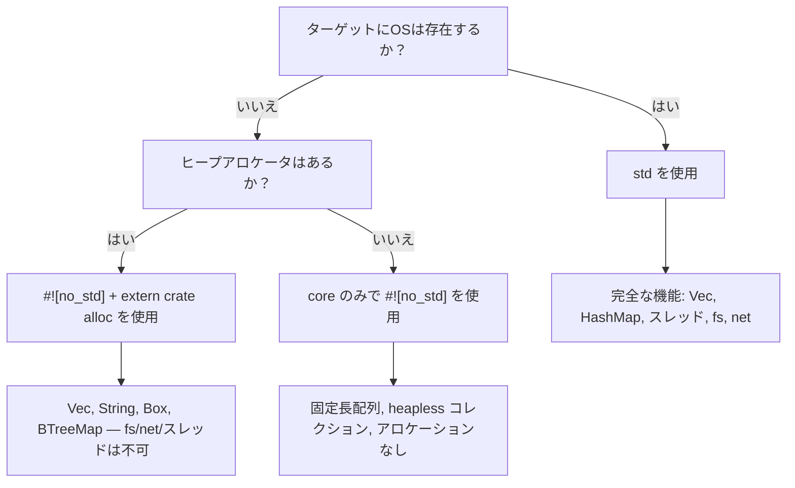

# `no_std` — 標準ライブラリを使わないRust

> **学習目標:** `![no_std]` を使用してベアメタルおよび組み込みターゲット向けにRustコードを記述する方法を学びます — `core` と `alloc` クレートの分離、パニックハンドラ、そして `libc` を持たない組み込みC言語との比較について解説します。

組み込みC言語のバックグラウンドを持つ方であれば、`libc` なし、または最小限のランタイムで開発することに慣れているはずです。Rustにもこれと同等のファーストクラスの仕組みが存在します。それが **`#![no_std]`** 属性です。

## `no_std` とは何か？

クレートルートに `#![no_std]` を追加すると、コンパイラは暗黙的な `extern crate std;` を削除し、**`core`**（および必要に応じて **`alloc`**）のみをリンクします。

| レイヤ | 提供する機能 | OS / ヒープの要件 |
|-------|-----------------|---------------------|
| `core` | プリミティブ型、`Option`、`Result`、`Iterator`、算術演算、`slice`、`str`、アトミック、`fmt` | **不要** — ベアメタルで動作 |
| `alloc` | `Vec`、`String`、`Box`、`Rc`、`Arc`、`BTreeMap` | グローバルアロケータが必要だが、**OSは不要** |
| `std` | `HashMap`、`fs`、`net`、`thread`、`io`、`env`、`process` | **必要** — OSが必要 |

> **組み込み開発者のための目安:** もしC言語プロジェクトが `-lc` をリンクして `malloc` を使用しているなら、おそらく `core` + `alloc` が利用できます。`malloc` を使用せずベアメタル上で動作している場合は、`core` のみを使用してください。

## `no_std` の宣言

```rust
// src/lib.rs（または #![no_main] を持つバイナリの場合は src/main.rs）
#![no_std]

// core に含まれるすべての機能は引き続き利用可能:
use core::fmt;
use core::result::Result;
use core::option::Option;

// アロケータがある場合は、ヒープ型をオプトイン（有効化）可能:
extern crate alloc;
use alloc::vec::Vec;
use alloc::string::String;
```

ベアメタルバイナリの場合は、`#![no_main]` とパニックハンドラも必要になります：

```rust
#![no_std]
#![no_main]

use core::panic::PanicInfo;

#[panic_handler]
fn panic(_info: &PanicInfo) -> ! {
    loop {} // パニック時にハング（無限ループ） — ボードのリセットやLED点滅に置き換えてください
}

// エントリポイントは使用する HAL / リンカスクリプトに依存します
```

## 失われる機能（とその代替手段）

| `std` の機能 | `no_std` での代替手段 |
|---------------|---------------------|
| `println!` | UART への `core::write!` / `defmt` |
| `HashMap` | `heapless::FnvIndexMap`（固定容量）または `BTreeMap`（`alloc` 使用時） |
| `Vec` | `heapless::Vec`（スタック割り当て、固定容量） |
| `String` | `heapless::String` または `&str` |
| `std::io::Read/Write` | `embedded_io::Read/Write` |
| `thread::spawn` | 割り込みハンドラ、RTICタスク |
| `std::time` | ハードウェアタイマーペリフェラル |
| `std::fs` | Flash / EEPROM ドライバ |

## 組み込み向けの代表的な `no_std` クレート

| クレート | 用途 | 備考 |
|-------|---------|-------|
| [`heapless`](https://crates.io/crates/heapless) | 固定容量の `Vec`、`String`、`Queue`、`Map` | アロケータ不要 — すべてスタック上に確保 |
| [`defmt`](https://crates.io/crates/defmt) | プローブ/ITM 経由の高効率ロギング | `printf` に似ているが、フォーマット処理をホスト側で遅延実行 |
| [`embedded-hal`](https://crates.io/crates/embedded-hal) | ハードウェア抽象化トレイト（SPI、I²C、GPIO、UART） | 一度実装すれば任意のMCUで動作 |
| [`cortex-m`](https://crates.io/crates/cortex-m) | ARM Cortex-M の組み込み関数とレジスタアクセス | CMSIS に相当する低レイヤ |
| [`cortex-m-rt`](https://crates.io/crates/cortex-m-rt) | Cortex-M 向けのランタイム / スタートアップコード | `startup.s` を代替 |
| [`rtic`](https://crates.io/crates/rtic) | リアルタイム割り込み駆動型並行性（RTIC） | コンパイル時のタスクスケジューリング、オーバーヘッドゼロ |
| [`embassy`](https://crates.io/crates/embassy-executor) | 組み込み向け非同期（async）エグゼキュータ | ベアメタル上での `async/await` |
| [`postcard`](https://crates.io/crates/postcard) | `no_std` 向け serde シリアライズ（バイナリ） | 文字列のオーバーヘッドを削減したい場合の `serde_json` 代替 |
| [`thiserror`](https://crates.io/crates/thiserror) | `Error` トレイト用の derive マクロ | v2 以降 `no_std` に対応。`anyhow` より推奨 |
| [`smoltcp`](https://crates.io/crates/smoltcp) | `no_std` 向け TCP/IP スタック | OS なしでネットワーク通信を行う場合に使用 |

## C言語 vs Rust: ベアメタルの比較

典型的な組み込みC言語の LED 点滅（blinky）プログラム：

```c
// C言語 — ベアメタル、ベンダーHAL
#include "stm32f4xx_hal.h"

void SysTick_Handler(void) {
    HAL_GPIO_TogglePin(GPIOA, GPIO_PIN_5);
}

int main(void) {
    HAL_Init();
    __HAL_RCC_GPIOA_CLK_ENABLE();
    GPIO_InitTypeDef gpio = { .Pin = GPIO_PIN_5, .Mode = GPIO_MODE_OUTPUT_PP };
    HAL_GPIO_Init(GPIOA, &gpio);
    HAL_SYSTICK_Config(HAL_RCC_GetHCLKFreq() / 1000);
    while (1) {}
}
```

Rustでの同等処理（`embedded-hal` + ボードクレートを使用）:

```rust
#![no_std]
#![no_main]

use cortex_m_rt::entry;
use panic_halt as _; // パニックハンドラ: 無限ループ
use stm32f4xx_hal::{pac, prelude::*};

#[entry]
fn main() -> ! {
    let dp = pac::Peripherals::take().unwrap();
    let gpioa = dp.GPIOA.split();
    let mut led = gpioa.pa5.into_push_pull_output();

    let rcc = dp.RCC.constrain();
    let clocks = rcc.cfgr.freeze();
    let mut delay = dp.TIM2.delay_ms(&clocks);

    loop {
        led.toggle();
        delay.delay_ms(500u32);
    }
}
```

**C言語開発者にとっての主な相違点:**
- `Peripherals::take()` は `Option` を返す — シングルトンパターンをコンパイル時に保証（二重初期化バグの防止）
- `.split()` は各ピンの所有権を移動（ムーブ）する — 2つのモジュールが同じピンを同時に駆動するリスクがない
- すべてのレジスタアクセスが型検査される — 読み取り専用レジスタに誤って書き込むことがない
- ボローチェッカにより、`main` と割り込みハンドラ間のデータ競合が防止される（RTICなどを使用時）

## `no_std` と `std` の使い分け



# 演習: `no_std` リングバッファ

🔴 **チャレンジ課題** — ジェネリクス、`MaybeUninit`、`#[cfg(test)]` を `no_std` コンテキストで組み合わせます

組み込みシステムでは、メモリ割り当て（アロケーション）を一切行わない固定サイズのリングバッファ（循環バッファ）が頻繁に必要になります。`core` のみを使用して（`alloc` も `std` も使用せずに）実装してください。

**要件:**
- 要素型 `T: Copy` に対するジェネリック実装
- 固定容量 `N`（const generics）
- `push(&mut self, item: T)` — バッファ満杯時は最も古い要素を上書き
- `pop(&mut self) -> Option<T>` — 最も古い要素を取得して返す
- `len(&self) -> usize`
- `is_empty(&self) -> bool`
- `#![no_std]` でコンパイル可能であること

```rust
// スターターコード
#![no_std]

use core::mem::MaybeUninit;

pub struct RingBuffer<T: Copy, const N: usize> {
    buf: [MaybeUninit<T>; N],
    head: usize,  // 次の書き込み位置
    tail: usize,  // 次の読み出し位置
    count: usize,
}

impl<T: Copy, const N: usize> RingBuffer<T, N> {
    pub const fn new() -> Self {
        todo!()
    }
    pub fn push(&mut self, item: T) {
        todo!()
    }
    pub fn pop(&mut self) -> Option<T> {
        todo!()
    }
    pub fn len(&self) -> usize {
        todo!()
    }
    pub fn is_empty(&self) -> bool {
        todo!()
    }
}
```

<details>
<summary>解答例（クリックして展開）</summary>

```rust
#![no_std]

use core::mem::MaybeUninit;

pub struct RingBuffer<T: Copy, const N: usize> {
    buf: [MaybeUninit<T>; N],
    head: usize,  // 次の書き込み位置
    tail: usize,  // 次の読み出し位置
    count: usize,
}

impl<T: Copy, const N: usize> RingBuffer<T, N> {
    pub const fn new() -> Self {
        Self {
            // SAFETY: MaybeUninit は初期化を必要としない
            buf: unsafe { MaybeUninit::uninit().assume_init() },
            head: 0,
            tail: 0,
            count: 0,
        }
    }

    pub fn push(&mut self, item: T) {
        self.buf[self.head] = MaybeUninit::new(item);
        self.head = (self.head + 1) % N;
        if self.count == N {
            // バッファが満杯 — 最も古い要素を上書きし、tail を進める
            self.tail = (self.tail + 1) % N;
        } else {
            self.count += 1;
        }
    }

    pub fn pop(&mut self) -> Option<T> {
        if self.count == 0 {
            return None;
        }
        // SAFETY: push() 経由で以前に書き込まれた位置のみを読み出す
        let item = unsafe { self.buf[self.tail].assume_init() };
        self.tail = (self.tail + 1) % N;
        self.count -= 1;
        Some(item)
    }

    pub fn len(&self) -> usize {
        self.count
    }

    pub fn is_empty(&self) -> bool {
        self.count == 0
    }
}

#[cfg(test)]
mod tests {
    use super::*;

    #[test]
    fn basic_push_pop() {
        let mut rb = RingBuffer::<u32, 4>::new();
        assert!(rb.is_empty());

        rb.push(10);
        rb.push(20);
        rb.push(30);
        assert_eq!(rb.len(), 3);

        assert_eq!(rb.pop(), Some(10));
        assert_eq!(rb.pop(), Some(20));
        assert_eq!(rb.pop(), Some(30));
        assert_eq!(rb.pop(), None);
    }

    #[test]
    fn overwrite_on_full() {
        let mut rb = RingBuffer::<u8, 3>::new();
        rb.push(1);
        rb.push(2);
        rb.push(3);
        // バッファ満杯: [1, 2, 3]

        rb.push(4); // 1 を上書き → [4, 2, 3]、tail が進む
        assert_eq!(rb.len(), 3);
        assert_eq!(rb.pop(), Some(2)); // 生き残っている最も古い要素
        assert_eq!(rb.pop(), Some(3));
        assert_eq!(rb.pop(), Some(4));
        assert_eq!(rb.pop(), None);
    }
}
```

**組み込みC言語開発者にとってこれが重要である理由:**
- `MaybeUninit` はRustにおける未初期化メモリの表現です — C言語の `char buf[N];` と同様に、コンパイラはゼロ埋めを行いません
- `unsafe` ブロックは最小限（2行）であり、それぞれに `// SAFETY:` コメントが記載されています
- `const fn new()` により、実行時コンストラクタなしで `static` 変数内にリングバッファを生成できます
- コードが `no_std` であっても、ホストマシン上で `cargo test` を使用してテストを実行できます

</details>
