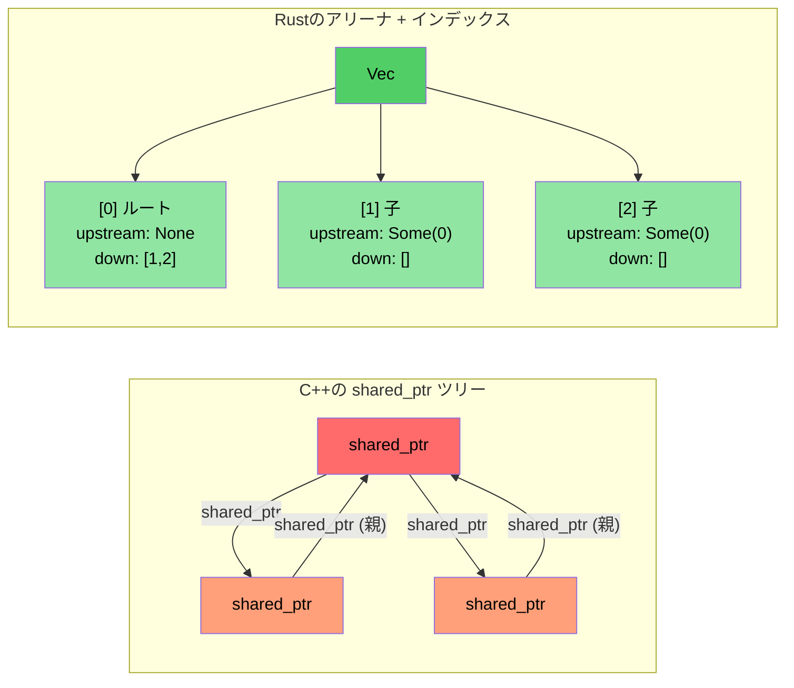

# 事例研究の概要：C++からRustへの移行

> **学習内容:** 約10万行のC++から約20個のクレートに跨る約9万行のRustへの実環境での移行から得られた教訓。5つの主要な変換パターンと、その背後にあるアーキテクチャ上の決定事項。

- 大規模なC++診断システム（約10万行のC++）をRust実装（約20個のRustクレート、約9万行）へと移行しました
- 本セクションでは、トイプログラムではなく、実際のプロダクションコードで使用された**実践的なパターン**を紹介します
- 5つの主要な変換パターン：

| **#** | **C++のパターン** | **Rustのパターン** | **影響・効果** |
|-------|----------------|-----------------|-----------|
| 1 | クラス階層 + `dynamic_cast` | Enumディスパッチ + `match` | `dynamic_cast` が約400箇所 → 0箇所に削減 |
| 2 | `shared_ptr` / `enable_shared_from_this` によるツリー | アリーナ + インデックス参照 | 循環参照の完全な排除 |
| 3 | すべてのモジュールに `Framework*` 生ポインタ | ライフタイム借用を用いた `DiagContext<'a>` | コンパイル時の有効性保証 |
| 4 | 神オブジェクト（God Object） | コンポーザブルな状態構造体 | テスト容易性とモジュール性の向上 |
| 5 | いたる所にある `vector<unique_ptr<Base>>` | **真に必要な箇所にのみ** トレイトオブジェクト（約25箇所） | 静的ディスパッチをデフォルトに |

### 移行前後のメトリクス比較

| **指標** | **C++（移行前）** | **Rust（リライト後）** |
|------------|---------------------|------------------------|
| `dynamic_cast` / 型のダウンキャスト | 約400箇所 | 0 |
| `virtual` / `override` メソッド | 約900箇所 | 約25箇所（`Box<dyn Trait>`） |
| 生の `new` によるメモリ確保 | 約200箇所 | 0（すべて所有型） |
| `shared_ptr` / 参照カウント | 約10箇所（トポロジライブラリ） | 0（FFI境界でのみ `Arc` を使用） |
| `enum class` の定義数 | 約60 | 約190（`pub enum`） |
| パターンマッチング式 | N/A | 約750（`match`） |
| 神オブジェクト（5,000行以上） | 2 | 0 |

----

# ケーススタディ1: 継承階層 → Enumディスパッチ

## C++のパターン: イベントクラス階層
```cpp
// C++の原型: すべてのGPUイベント型がGpuEventBaseを継承するクラス
class GpuEventBase {
public:
    virtual ~GpuEventBase() = default;
    virtual void Process(DiagFramework* fw) = 0;
    uint16_t m_recordId;
    uint8_t  m_sensorType;
    // ... 共通フィールド
};

class GpuPcieDegradeEvent : public GpuEventBase {
public:
    void Process(DiagFramework* fw) override;
    uint8_t m_linkSpeed;
    uint8_t m_linkWidth;
};

class GpuPcieFatalEvent : public GpuEventBase { /* ... */ };
class GpuBootEvent : public GpuEventBase { /* ... */ };
// ... GpuEventBaseを継承する10個以上のイベントクラス

// 処理には dynamic_cast が必要:
void ProcessEvents(std::vector<std::unique_ptr<GpuEventBase>>& events,
                   DiagFramework* fw) {
    for (auto& event : events) {
        if (auto* degrade = dynamic_cast<GpuPcieDegradeEvent*>(event.get())) {
            // degradeイベントを処理...
        } else if (auto* fatal = dynamic_cast<GpuPcieFatalEvent*>(event.get())) {
            // fatalイベントを処理...
        }
        // ... さらに10個以上の分岐
    }
}
```

## Rustの解決策: Enumディスパッチ
```rust
// 実装例: types.rs — 継承なし、vtableなし、dynamic_castなし
#[derive(Debug, Clone, PartialEq, Eq, Serialize, Deserialize)]
pub enum GpuEventKind {
    PcieDegrade,
    PcieFatal,
    PcieUncorr,
    Boot,
    BaseboardState,
    EccError,
    OverTemp,
    PowerRail,
    ErotStatus,
    Unknown,
}
```

```rust
// 実装例: manager.rs — 型ごとに分離されたVec、ダウンキャストは不要
pub struct GpuEventManager {
    sku: SkuVariant,
    degrade_events: Vec<GpuPcieDegradeEvent>,   // Box<dyn> ではなく具象型
    fatal_events: Vec<GpuPcieFatalEvent>,
    uncorr_events: Vec<GpuPcieUncorrEvent>,
    boot_events: Vec<GpuBootEvent>,
    baseboard_events: Vec<GpuBaseboardEvent>,
    ecc_events: Vec<GpuEccEvent>,
    // ... 各イベント型が独自のVecを持つ
}

// アクセサは型付きスライスを返す — 曖昧さはゼロ
impl GpuEventManager {
    pub fn degrade_events(&self) -> &[GpuPcieDegradeEvent] {
        &self.degrade_events
    }
    pub fn fatal_events(&self) -> &[GpuPcieFatalEvent] {
        &self.fatal_events
    }
}
```

### なぜ `Vec<Box<dyn GpuEvent>>` ではないのか？
- **誤ったアプローチ**（直訳的な移行）: すべてのイベントを1つの異種混在コレクション（ヘテロジニアスコレクション）に入れ、後からダウンキャストする — これはC++が `vector<unique_ptr<Base>>` で行っていることです
- **正しいアプローチ**: 型ごとに分離されたVecを用意することで、*すべての* ダウンキャストを排除します。各コンシューマは必要なイベント型のみを正確に要求します
- **パフォーマンス**: 分離されたVecによりキャッシュ局所性が向上します（すべてのdegradeイベントがメモリ上で連続して配置されます）

----

# ケーススタディ2: shared_ptrツリー → アリーナ/インデックスパターン

## C++のパターン: 参照カウントツリー
```cpp
// C++のトポロジライブラリ: 親ノードと子ノードの双方が互いを参照する必要があるため、
// PcieDevice は enable_shared_from_this を使用する
class PcieDevice : public std::enable_shared_from_this<PcieDevice> {
public:
    std::shared_ptr<PcieDevice> m_upstream;
    std::vector<std::shared_ptr<PcieDevice>> m_downstream;
    // ... デバイスデータ
    
    void AddChild(std::shared_ptr<PcieDevice> child) {
        child->m_upstream = shared_from_this();  // 親 ↔ 子の循環参照！
        m_downstream.push_back(child);
    }
};
// 問題点: 親→子および子→親の参照により循環参照が発生する
// 循環を断つには weak_ptr が必要だが、設定を忘れやすい
```

## Rustの解決策: インデックス参照によるアリーナ構造
```rust
// 実装例: components.rs — 平坦なVecがすべてのデバイスを所有する
pub struct PcieDevice {
    pub base: PcieDeviceBase,
    pub kind: PcieDeviceKind,

    // インデックスによるツリー構造のリンク — 参照カウントなし、循環なし
    pub upstream_idx: Option<usize>,      // アリーナVecへのインデックス
    pub downstream_idxs: Vec<usize>,      // アリーナVecへのインデックス群
}

// 「アリーナ」とは、ツリーによって所有される単なる Vec<PcieDevice> です:
pub struct DeviceTree {
    devices: Vec<PcieDevice>,  // 単一の所有権 — 1つのVecがすべてを所有する
}

impl DeviceTree {
    pub fn parent(&self, device_idx: usize) -> Option<&PcieDevice> {
        self.devices[device_idx].upstream_idx
            .map(|idx| &self.devices[idx])
    }
    
    pub fn children(&self, device_idx: usize) -> Vec<&PcieDevice> {
        self.devices[device_idx].downstream_idxs
            .iter()
            .map(|&idx| &self.devices[idx])
            .collect()
    }
}
```

### 重要な知見
- **`shared_ptr`、`weak_ptr`、`enable_shared_from_this` が一切不要**
- **循環参照が発生し得ない** — インデックスは単なる `usize` 値
- **キャッシュパフォーマンスの向上** — すべてのデバイスが連続したメモリ領域に配置
- **理解しやすい所有構造** — 1つの所有者（Vec）と多数の参照者（インデックス）



----
