# C# プログラマのための Rust 入門

C# の経験を持つ開発者を対象に、Rust を学ぶための包括的なガイドです。2つの言語間における概念の転換と実践的な相違点に焦点を当てています。

## 目次

### 1. はじめにと哲学
- [言語哲学の比較](#language-philosophy-comparison)
- [メモリ管理: GC vs RAII](#memory-management-gc-vs-raii)
- [パフォーマンス特性](#performance-characteristics)

### 2. 型システムの相違点
- [Null 安全性: Nullable<T> vs Option<T>](#null-safety-nullablet-vs-optiont)
- [値型 vs 参照型 vs 所有権](#value-types-vs-reference-types-vs-ownership)
- [代数的データ型 vs C# 共用体](#algebraic-data-types-vs-c-unions)
- [網羅的パターンマッチング: コンパイラの保証 vs 実行時エラー](#exhaustive-pattern-matching-compiler-guarantees-vs-runtime-errors)
- [真の不変性 vs レコードの錯覚](#true-immutability-vs-record-illusions)
- [メモリ安全性: 実行時チェック vs コンパイル時証明](#memory-safety-runtime-checks-vs-compile-time-proofs)

### 3. オブジェクト指向 vs 関数型パラダイム
- [継承 vs 合成](#inheritance-vs-composition)
- [インターフェース vs トレイト](#interfaces-vs-traits)
- [仮想メソッド vs 静的ディスパッチ](#virtual-methods-vs-static-dispatch)
- [sealed クラス vs Rust の不変性](#sealed-classes-vs-rust-immutability)

### 4. エラー処理の哲学
- [例外 vs Result<T, E>](#exceptions-vs-resultt-e)
- [try-catch vs パターンマッチング](#try-catch-vs-pattern-matching)
- [エラー伝播パターン](#error-propagation-patterns)

### 5. 並行性と安全性
- [スレッド安全性: 慣例 vs 型システムによる保証](#thread-safety-convention-vs-type-system-guarantees)
- [async/await の比較](#asyncawait-comparison)
- [データ競合の防止](#data-race-prevention)

### 6. コレクションとイテレータ
- [LINQ vs Rust イテレータ](#linq-vs-rust-iterators)
- [コレクションの所有権](#collection-ownership)
- [遅延評価パターン](#lazy-evaluation-patterns)

### 7. ジェネリクスと制約
- [ジェネリック制約: where vs トレイト境界](#generic-constraints-where-vs-trait-bounds)
- [ジェネリクスの変性（Variance）](#variance-in-generics)
- [高カインド型（Higher-Kinded Types）](#higher-kinded-types)

### 8. 実践的な移行パターン
- [段階的な導入戦略](#incremental-adoption-strategy)
- [C# から Rust への概念マッピング](#c-to-rust-concept-mapping)
- [チーム導入のタイムライン](#team-adoption-timeline)
- [Rust における一般的な C# パターン](#common-c-patterns-in-rust)
- [エコシステムの比較](#ecosystem-comparison)
- [テストとドキュメント](#testing-and-documentation)

### 9. パフォーマンスと導入判断
- [パフォーマンス比較: マネージド vs ネイティブ](#performance-comparison-managed-vs-native)
- [各言語の選定基準](#when-to-choose-each-language)

### 10. 高度なトピック
- [Unsafe コード: いつ、なぜ使うのか](#unsafe-code-when-and-why)
- [相互運用の考慮事項](#interop-considerations)
- [パフォーマンス最適化](#performance-optimization)

### 11. C# 開発者のためのベストプラクティス
- [C# 開発者のための慣用的な Rust](#idiomatic-rust-for-c-developers)
- [よくある間違いと解決策](#common-mistakes-and-solutions)
- [C# 開発者に不可欠なクレート](#essential-crates-for-c-developers)

***

## 言語哲学の比較

### C# の哲学
- **生産性第一**: 充実したツール群、広範なフレームワーク、「成功の落とし穴（Pit of success: 自然と正しく安全に書ける設計）」
- **マネージドランタイム**: ガベージコレクション（GC）が自動的にメモリを管理
- **エンタープライズ指向**: リフレクションを備えた強い型付け、広範な標準ライブラリ
- **オブジェクト指向**: 主要な抽象化としてのクラス、継承、インターフェース

### Rust の哲学
- **犠牲のないパフォーマンス**: ゼロコスト抽象化、ランタイムオーバーヘッドなし
- **メモリ安全性**: クラッシュやセキュリティ脆弱性を防ぐコンパイル時保証
- **システムプログラミング**: 高レベルな抽象化を備えつつ直接的なハードウェアアクセスを提供
- **関数型 ＋ システムプログラミング**: デフォルトで不変、所有権に基づくリソース管理

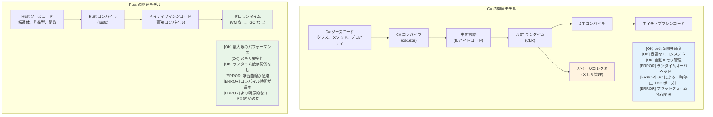

***

## メモリ管理: GC vs RAII

### C# のガベージコレクション
```csharp
// C# - 自動メモリ管理
public class Person
{
    public string Name { get; set; }
    public List<string> Hobbies { get; set; } = new List<string>();
    
    public void AddHobby(string hobby)
    {
        Hobbies.Add(hobby);  // メモリは自動的に確保される
    }
    
    // 明示的なクリーンアップは不要 - GC が処理する
    // ただしリソース管理には IDisposable パターンを使用
}

using var file = new FileStream("data.txt", FileMode.Open);
// 'using' により Dispose() の呼び出しが保証される
```

### Rust の所有権と RAII
```rust
// Rust - コンパイル時のメモリ管理
pub struct Person {
    name: String,
    hobbies: Vec<String>,
}

impl Person {
    pub fn add_hobby(&mut self, hobby: String) {
        self.hobbies.push(hobby);  // メモリ管理はコンパイル時に追跡される
    }
    
    // Drop トレイトが自動実装される - クリーンアップは保証される
}

// RAII - Resource Acquisition Is Initialization (リソース取得は初期化である)
{
    let file = std::fs::File::open("data.txt")?;
    // 'file' がスコープを抜けると自動的にファイルが閉じられる
    // 'using' 文は不要 - 型システムによって処理される
}
```

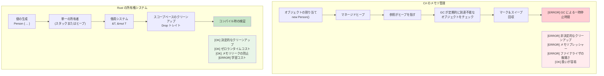

***

## Null 安全性: Nullable<T> vs Option<T>

### C# における Null 処理の進化
```csharp
// C# - 従来の null 処理（エラーが発生しやすい）
public class User
{
    public string Name { get; set; }  // null になり得る！
    public string Email { get; set; } // null になり得る！
}

public string GetUserDisplayName(User user)
{
    if (user?.Name != null)  // null 条件演算子
    {
        return user.Name;
    }
    return "Unknown User";
}

// C# 8+ の Null 許容参照型 (Nullable Reference Types)
public class User
{
    public string Name { get; set; }    // 非 null
    public string? Email { get; set; }  // 明示的に null 許容
}

// 値型に対する C# の Nullable<T>
int? maybeNumber = GetNumber();
if (maybeNumber.HasValue)
{
    Console.WriteLine(maybeNumber.Value);
}
```

### Rust の Option<T> システム
```rust
// Rust - Option<T> による明示的な null 処理
#[derive(Debug)]
pub struct User {
    name: String,           // 決して null にはならない
    email: Option<String>,  // 明示的にオプショナル
}

impl User {
    pub fn get_display_name(&self) -> &str {
        &self.name  // null チェック不要 - 存在することが保証されている
    }
    
    pub fn get_email_or_default(&self) -> String {
        self.email
            .as_ref()
            .map(|e| e.clone())
            .unwrap_or_else(|| "no-email@example.com".to_string())
    }
}

// パターンマッチングにより None ケースの処理が強制される
fn handle_optional_user(user: Option<User>) {
    match user {
        Some(u) => println!("User: {}", u.get_display_name()),
        None => println!("No user found"),
        // None ケースを処理しないとコンパイルエラーになる！
    }
}
```

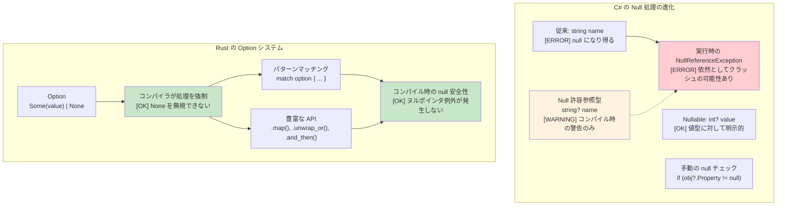

***

## 代数的データ型 vs C# 共用体

### C# の判別共用体（制限付き）
```csharp
// C# - 継承を用いた制限付きの共用体サポート
public abstract class Result
{
    public abstract T Match<T>(Func<Success, T> onSuccess, Func<Error, T> onError);
}

public class Success : Result
{
    public string Value { get; }
    public Success(string value) => Value = value;
    
    public override T Match<T>(Func<Success, T> onSuccess, Func<Error, T> onError)
        => onSuccess(this);
}

public class Error : Result
{
    public string Message { get; }
    public Error(string message) => Message = message;
    
    public override T Match<T>(Func<Success, T> onSuccess, Func<Error, T> onError)
        => onError(this);
}

// C# 9+ パターンマッチングを備えたレコード（改善版）
public abstract record Shape;
public record Circle(double Radius) : Shape;
public record Rectangle(double Width, double Height) : Shape;

public static double Area(Shape shape) => shape switch
{
    Circle(var radius) => Math.PI * radius * radius,
    Rectangle(var width, var height) => width * height,
    _ => throw new ArgumentException("Unknown shape")  // [ERROR] 実行時エラーの可能性
};
```

### Rust の代数的データ型（列挙型）
```rust
// Rust - 網羅的なパターンマッチングを備えた真の代数的データ型
#[derive(Debug, Clone)]
pub enum Result<T, E> {
    Ok(T),
    Err(E),
}

#[derive(Debug, Clone)]
pub enum Shape {
    Circle { radius: f64 },
    Rectangle { width: f64, height: f64 },
    Triangle { base: f64, height: f64 },
}

impl Shape {
    pub fn area(&self) -> f64 {
        match self {
            Shape::Circle { radius } => std::f64::consts::PI * radius * radius,
            Shape::Rectangle { width, height } => width * height,
            Shape::Triangle { base, height } => 0.5 * base * height,
            // [OK] バリアントが1つでも不足していればコンパイルエラー！
        }
    }
}

// 応用: 列挙型は異なる型を保持可能
#[derive(Debug)]
pub enum Value {
    Integer(i64),
    Float(f64),
    Text(String),
    Boolean(bool),
    List(Vec<Value>),  // 再帰的な型！
}

impl Value {
    pub fn type_name(&self) -> &'static str {
        match self {
            Value::Integer(_) => "integer",
            Value::Float(_) => "float",
            Value::Text(_) => "text",
            Value::Boolean(_) => "boolean",
            Value::List(_) => "list",
        }
    }
}
```

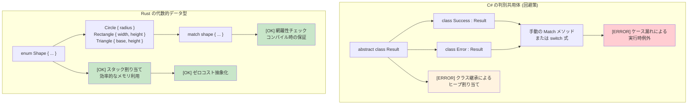

***

## 網羅的パターンマッチング: コンパイラの保証 vs 実行時エラー

### C# の switch 式 - 依然として不完全
```csharp
// C# の switch 式は網羅的に見えますが、完全には保証されません
public enum HttpStatus { Ok, NotFound, ServerError, Unauthorized }

public string HandleResponse(HttpStatus status) => status switch
{
    HttpStatus.Ok => "Success",
    HttpStatus.NotFound => "Resource not found",
    HttpStatus.ServerError => "Internal error",
    // Unauthorized のケースが欠落しているが、問題なくコンパイルできてしまう！
    // 実行時: 実行時に System.InvalidOperationException が発生
};

// null 許容の警告があっても、以下はコンパイルに通ります:
public class User 
{
    public string Name { get; set; }
    public bool IsActive { get; set; }
}

public string ProcessUser(User? user) => user switch
{
    { IsActive: true } => $"Active: {user.Name}",
    { IsActive: false } => $"Inactive: {user.Name}",
    // null のケースが欠落 - 警告のみでエラーにはならない
    // 実行時: NullReferenceException が発生する可能性
};

// enum に値を追加すると既存コードが暗黙的に壊れる
public enum HttpStatus 
{ 
    Ok, 
    NotFound, 
    ServerError, 
    Unauthorized,
    Forbidden  // これを追加しても HandleResponse() のコンパイルは通ってしまう！
}
```

### Rust のパターンマッチング - 真の網羅性
```rust
#[derive(Debug)]
enum HttpStatus {
    Ok,
    NotFound, 
    ServerError,
    Unauthorized,
}

fn handle_response(status: HttpStatus) -> &'static str {
    match status {
        HttpStatus::Ok => "Success",
        HttpStatus::NotFound => "Resource not found", 
        HttpStatus::ServerError => "Internal error",
        HttpStatus::Unauthorized => "Authentication required",
        // ケースが1つでも欠けていればコンパイルエラー！
        // 文字通りコンパイルすら通りません
    }
}

// 新しいバリアントを追加すると、それが使われているすべての箇所でコンパイルが失敗する
#[derive(Debug)]
enum HttpStatus {
    Ok,
    NotFound, 
    ServerError, 
    Unauthorized,
    Forbidden,  // これを追加すると handle_response() でコンパイルエラーが発生
}
// コンパイラが「すべての」ケースを処理するよう強制します

// Option<T> のパターンマッチングも同様に網羅的
fn process_optional_value(value: Option<i32>) -> String {
    match value {
        Some(n) => format!("Got value: {}", n),
        None => "No value".to_string(),
        // どちらか一方でも忘れるとコンパイルエラー
    }
}
```

```mermaid
graph TD
    subgraph "C# のパターンマッチングの限界"
        CS_SWITCH["switch 式"]
        CS_WARNING["⚠️ コンパイル時警告のみ"]
        CS_COMPILE["✅ コンパイルは成功する"]
        CS_RUNTIME["💥 実行時例外"]
        CS_DEPLOY["❌ バグが本番環境へ流出"]
        CS_SILENT["😰 enum 変更時の暗黙の不具合"]
        
        CS_SWITCH --> CS_WARNING
        CS_WARNING --> CS_COMPILE
        CS_COMPILE --> CS_RUNTIME
        CS_RUNTIME --> CS_DEPLOY
        CS_SWITCH --> CS_SILENT
    end
    
    subgraph "Rust の網羅的マッチング"
        RUST_MATCH["match 式"]
        RUST_ERROR["🛑 コンパイル失敗"]
        RUST_FIX["✅ 全ケースの処理が必須"]
        RUST_SAFE["✅ 実行時の不意なクラッシュなし"]
        RUST_EVOLUTION["🔄 enum 変更時にコンパイルエラー検知"]
        RUST_REFACTOR["🛠️ 強制的なリファクタリング誘導"]
        
        RUST_MATCH --> RUST_ERROR
        RUST_ERROR --> RUST_FIX
        RUST_FIX --> RUST_SAFE
        RUST_MATCH --> RUST_EVOLUTION
        RUST_EVOLUTION --> RUST_REFACTOR
    end
    
    style CS_RUNTIME fill:#ffcdd2
    style CS_DEPLOY fill:#ffcdd2
    style CS_SILENT fill:#ffcdd2
    style RUST_SAFE fill:#c8e6c9
    style RUST_REFACTOR fill:#c8e6c9
```

***

## 真の不変性 vs レコードの錯覚

### C# のレコード - 不変性のまやかし
```csharp
// C# のレコードは不変に見えますが、抜け穴が存在します
public record Person(string Name, int Age, List<string> Hobbies);

var person = new Person("John", 30, new List<string> { "reading" });

// これらはすべて新しいインスタンスを生成しているように「見えます」:
var older = person with { Age = 31 };  // 新しいレコード
var renamed = person with { Name = "Jonathan" };  // 新しいレコード

// しかし参照型のフィールドは依然として変更可能です！
person.Hobbies.Add("gaming");  // 元のオブジェクトを変更！
Console.WriteLine(older.Hobbies.Count);  // 2 - older の趣味も影響を受ける！
Console.WriteLine(renamed.Hobbies.Count); // 2 - renamed の趣味も同様に影響を受ける！

// init 専用プロパティであっても、リフレクションを使えば変更可能
typeof(Person).GetProperty("Age")?.SetValue(person, 25);

// コレクション式は役立ちますが、根本的な問題は解決しません
public record BetterPerson(string Name, int Age, IReadOnlyList<string> Hobbies);

var betterPerson = new BetterPerson("Jane", 25, new List<string> { "painting" });
// キャストすることで依然として変更可能:
((List<string>)betterPerson.Hobbies).Add("hacking the system");

// いわゆる「不変」コレクションも、真の不変性を保証するわけではありません
using System.Collections.Immutable;
public record SafePerson(string Name, int Age, ImmutableList<string> Hobbies);
// これは改善されていますが、規律が必要であり、パフォーマンス上のオーバーヘッドも伴います
```

### Rust - デフォルトで真の不変性
```rust
#[derive(Debug, Clone)]
struct Person {
    name: String,
    age: u32,
    hobbies: Vec<String>,
}

let person = Person {
    name: "John".to_string(),
    age: 30,
    hobbies: vec!["reading".to_string()],
};

// これは単純にコンパイルが通りません:
// person.age = 31;  // エラー: 不変フィールドへの代入は不可
// person.hobbies.push("gaming".to_string());  // エラー: 可変として借用不可

// 変更するには、'mut' を付けて明示的に宣言する必要があります:
let mut older_person = person.clone();
older_person.age = 31;  // これにより変更であることが明確になる

// または関数型の更新パターンを使用:
let renamed = Person {
    name: "Jonathan".to_string(),
    ..person  // 他のフィールドをコピー（ムーブセマンティクスが適用される）
};

// 元のオブジェクトは（ムーブされない限り）変更されないことが保証される:
println!("{:?}", person.hobbies);  // 常に ["reading"] - 不変

// 効率的な不変データ構造による構造共有
use std::rc::Rc;

#[derive(Debug, Clone)]
struct EfficientPerson {
    name: String,
    age: u32,
    hobbies: Rc<Vec<String>>,  // 共有される不変の参照
}

// 新しいバージョンを作成する際、データを効率的に共有
let person1 = EfficientPerson {
    name: "Alice".to_string(),
    age: 30,
    hobbies: Rc::new(vec!["reading".to_string(), "cycling".to_string()]),
};

let person2 = EfficientPerson {
    name: "Bob".to_string(),
    age: 25,
    hobbies: Rc::clone(&person1.hobbies),  // 共有参照であり、ディープコピーは不要
};
```

```mermaid
graph TD
    subgraph "C# のレコード - 浅い不変性"
        CS_RECORD["record Person(...)"]
        CS_WITH["with 式"]
        CS_SHALLOW["⚠️ トップレベルのみ不変"]
        CS_REF_MUT["❌ 参照型は依然として可変"]
        CS_REFLECTION["❌ リフレクションで回避可能"]
        CS_RUNTIME["❌ 実行時の予期せぬ挙動"]
        CS_DISCIPLINE["😓 チームの規律に依存"]
        
        CS_RECORD --> CS_WITH
        CS_WITH --> CS_SHALLOW
        CS_SHALLOW --> CS_REF_MUT
        CS_RECORD --> CS_REFLECTION
        CS_REF_MUT --> CS_RUNTIME
        CS_RUNTIME --> CS_DISCIPLINE
    end
    
    subgraph "Rust - 真の不変性"
        RUST_STRUCT["struct Person { ... }"]
        RUST_DEFAULT["✅ デフォルトで不変"]
        RUST_COMPILE["✅ コンパイル時による強制"]
        RUST_MUT["🔒 明示的な 'mut' が必要"]
        RUST_MOVE["🔄 ムーブセマンティクス"]
        RUST_ZERO["⚡ ゼロランタイムオーバーヘッド"]
        RUST_SAFE["🛡️ メモリ安全"]
        
        RUST_STRUCT --> RUST_DEFAULT
        RUST_DEFAULT --> RUST_COMPILE
        RUST_COMPILE --> RUST_MUT
        RUST_MUT --> RUST_MOVE
        RUST_MOVE --> RUST_ZERO
        RUST_ZERO --> RUST_SAFE
    end
    
    style CS_REF_MUT fill:#ffcdd2
    style CS_REFLECTION fill:#ffcdd2
    style CS_RUNTIME fill:#ffcdd2
    style RUST_COMPILE fill:#c8e6c9
    style RUST_ZERO fill:#c8e6c9
    style RUST_SAFE fill:#c8e6c9
```

***

## メモリ安全性: 実行時チェック vs コンパイル時証明

### C# - 実行時セーフティネット
```csharp
// C# は実行時チェックと GC に依存
public class Buffer
{
    private byte[] data;
    
    public Buffer(int size)
    {
        data = new byte[size];
    }
    
    public void ProcessData(int index)
    {
        // 実行時の境界チェック
        if (index >= data.Length)
            throw new IndexOutOfRangeException();
            
        data[index] = 42;  // 安全だが、実行時にチェックされる
    }
    
    // イベントや静的参照によるメモリリークの可能性
    public static event Action<string> GlobalEvent;
    
    public void Subscribe()
    {
        GlobalEvent += HandleEvent;  // メモリリークを引き起こす可能性あり
        // イベント購読の解除を忘れるとオブジェクトが回収されない
    }
    
    private void HandleEvent(string message) { /* ... */ }
    
    // null 参照例外の可能性は依然として存在
    public void ProcessUser(User user)
    {
        Console.WriteLine(user.Name.ToUpper());  // user.Name が null だと NullReferenceException
    }
    
    // 配列アクセスは実行時に失敗する可能性あり
    public int GetValue(int[] array, int index)
    {
        return array[index];  // IndexOutOfRangeException の可能性
    }
}
```

### Rust - コンパイル時の保証
```rust
struct Buffer {
    data: Vec<u8>,
}

impl Buffer {
    fn new(size: usize) -> Self {
        Buffer {
            data: vec![0; size],
        }
    }
    
    fn process_data(&mut self, index: usize) {
        // 安全性が証明された場合、コンパイラによって境界チェックを最適化（省略）可能
        if let Some(item) = self.data.get_mut(index) {
            *item = 42;  // 安全なアクセス、コンパイル時に証明
        }
        // または明示的な境界チェックを伴うインデックスアクセス:
        // self.data[index] = 42;  // デバッグビルドでパニックするが、メモリ安全
    }
    
    // メモリリークは基本的に不可能 - 所有権システムがそれを防ぐ
    fn process_with_closure<F>(&mut self, processor: F) 
    where F: FnOnce(&mut Vec<u8>)
    {
        processor(&mut self.data);
        // processor がスコープを抜けると自動的にクリーンアップされる
        // ダングリング参照やメモリリークを作り出す余地がない
    }
    
    // ヌルポインタの参照外しは不可能 - そもそも null ポインタが存在しない！
    fn process_user(&self, user: &User) {
        println!("{}", user.name.to_uppercase());  // user.name は null になり得ない
    }
    
    // 配列アクセスは境界チェックされるか、明示的な unsafe を要する
    fn get_value(array: &[i32], index: usize) -> Option<i32> {
        array.get(index).copied()  // 範囲外なら None を返す
    }
    
    // 確信がある場合は明示的に unsafe を使用することも可能:
    /// # Safety
    /// `index` は `array.len()` 未満である必要があります。
    unsafe fn get_value_unchecked(array: &[i32], index: usize) -> i32 {
        *array.get_unchecked(index)  // 高速だが手動で境界を証明する必要がある
    }
}

struct User {
    name: String,  // Rust では String が null になることはない
}

// 所有権により解放後使用（Use-after-free）を防止
fn ownership_example() {
    let data = vec![1, 2, 3, 4, 5];
    let reference = &data[0];  // data を借用
    
    // drop(data);  // エラー: 借用中にドロップすることはできない
    println!("{}", reference);  // これは安全であることが保証されている
}

// 借用チェッカによりデータ競合を防止
fn borrowing_example(data: &mut Vec<i32>) {
    let first = &data[0];  // 不変借用
    // data.push(6);  // エラー: 不変借用中に可変借用することはできない
    println!("{}", first);  // データ競合がないことが保証される
}
```

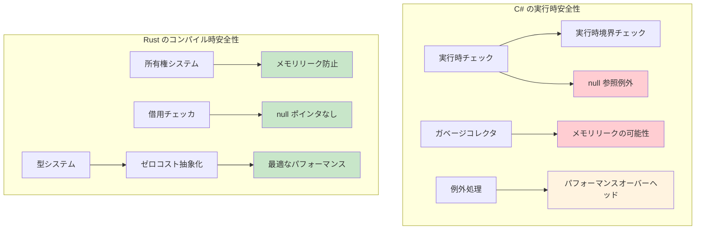

***

## 継承 vs 合成
```csharp
// C# - クラスベースの継承
public abstract class Animal
{
    public string Name { get; protected set; }
    public abstract void MakeSound();
    
    public virtual void Sleep()
    {
        Console.WriteLine($"{Name} is sleeping");
    }
}

public class Dog : Animal
{
    public Dog(string name) { Name = name; }
    
    public override void MakeSound()
    {
        Console.WriteLine("Woof!");
    }
    
    public void Fetch()
    {
        Console.WriteLine($"{Name} is fetching");
    }
}

// インターフェースベースの規約
public interface IFlyable
{
    void Fly();
}

public class Bird : Animal, IFlyable
{
    public Bird(string name) { Name = name; }
    
    public override void MakeSound()
    {
        Console.WriteLine("Tweet!");
    }
    
    public void Fly()
    {
        Console.WriteLine($"{Name} is flying");
    }
}
```

### Rust の合成モデル
```rust
// Rust - トレイトを用いた「継承より合成」
pub trait Animal {
    fn name(&self) -> &str;
    fn make_sound(&self);
    
    // デフォルト実装（C# の virtual メソッドに類似）
    fn sleep(&self) {
        println!("{} is sleeping", self.name());
    }
}

pub trait Flyable {
    fn fly(&self);
}

// データと振る舞いを分離
#[derive(Debug)]
pub struct Dog {
    name: String,
}

#[derive(Debug)]
pub struct Bird {
    name: String,
    wingspan: f64,
}

// 型に対して振る舞いを実装
impl Animal for Dog {
    fn name(&self) -> &str {
        &self.name
    }
    
    fn make_sound(&self) {
        println!("Woof!");
    }
}

impl Dog {
    pub fn new(name: String) -> Self {
        Dog { name }
    }
    
    pub fn fetch(&self) {
        println!("{} is fetching", self.name);
    }
}

impl Animal for Bird {
    fn name(&self) -> &str {
        &self.name
    }
    
    fn make_sound(&self) {
        println!("Tweet!");
    }
}

impl Flyable for Bird {
    fn fly(&self) {
        println!("{} is flying with {:.1}m wingspan", self.name, self.wingspan);
    }
}

// 複数のトレイト境界（複数インターフェースの実装制約に類似）
fn make_flying_animal_sound<T>(animal: &T) 
where 
    T: Animal + Flyable,
{
    animal.make_sound();
    animal.fly();
}
```

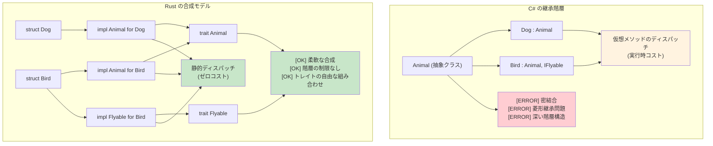

***

## 例外 vs Result<T, E>

### C# の例外ベースのエラー処理
```csharp
// C# - 例外ベースのエラー処理
public class UserService
{
    public User GetUser(int userId)
    {
        if (userId <= 0)
        {
            throw new ArgumentException("User ID must be positive");
        }
        
        var user = database.FindUser(userId);
        if (user == null)
        {
            throw new UserNotFoundException($"User {userId} not found");
        }
        
        return user;
    }
    
    public async Task<string> GetUserEmailAsync(int userId)
    {
        try
        {
            var user = GetUser(userId);
            return user.Email ?? throw new InvalidOperationException("User has no email");
        }
        catch (UserNotFoundException ex)
        {
            logger.Warning("User not found: {UserId}", userId);
            return "noreply@company.com";
        }
        catch (Exception ex)
        {
            logger.Error(ex, "Unexpected error getting user email");
            throw; // 再スロー
        }
    }
}
```

### Rust の Result ベースのエラー処理
```rust
use std::fmt;

#[derive(Debug)]
pub enum UserError {
    InvalidId(i32),
    NotFound(i32),
    NoEmail,
    DatabaseError(String),
}

impl fmt::Display for UserError {
    fn fmt(&self, f: &mut fmt::Formatter<'_>) -> fmt::Result {
        match self {
            UserError::InvalidId(id) => write!(f, "無効なユーザー ID: {}", id),
            UserError::NotFound(id) => write!(f, "ユーザー {} が見つかりません", id),
            UserError::NoEmail => write!(f, "ユーザーにメールアドレスが設定されていません"),
            UserError::DatabaseError(msg) => write!(f, "データベースエラー: {}", msg),
        }
    }
}

impl std::error::Error for UserError {}

#[derive(Debug, Clone)]
pub struct User {
    pub name: String,
    pub email: Option<String>,
}

pub struct UserService {
    users: Vec<User>,  // 模擬データベース
}

impl UserService {
    fn database_find_user(&self, user_id: i32) -> Option<User> {
        self.users.get(user_id as usize).cloned()
    }

    pub fn get_user(&self, user_id: i32) -> Result<User, UserError> {
        if user_id <= 0 {
            return Err(UserError::InvalidId(user_id));
        }
        
        // データベース検索のシミュレーション
        self.database_find_user(user_id)
            .ok_or(UserError::NotFound(user_id))
    }
    
    pub fn get_user_email(&self, user_id: i32) -> Result<String, UserError> {
        let user = self.get_user(user_id)?; // ? 演算子でエラーを伝播
        
        user.email
            .ok_or(UserError::NoEmail)
    }
    
    pub fn get_user_email_or_default(&self, user_id: i32) -> String {
        match self.get_user_email(user_id) {
            Ok(email) => email,
            Err(UserError::NotFound(_)) => {
                log::warn!("ユーザーが見つかりません: {}", user_id);
                "noreply@company.com".to_string()
            }
            Err(err) => {
                log::error!("ユーザーメールの取得エラー: {}", err);
                "error@company.com".to_string()
            }
        }
    }
}
```

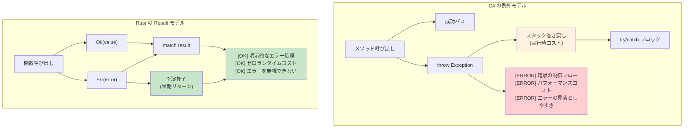

***

## LINQ vs Rust イテレータ

### C# の LINQ (統合言語クエリ)
```csharp
// C# LINQ - 宣言的なデータ処理
var numbers = new[] { 1, 2, 3, 4, 5, 6, 7, 8, 9, 10 };

var result = numbers
    .Where(n => n % 2 == 0)           // 偶数をフィルタリング
    .Select(n => n * n)               // 2乗する
    .Where(n => n > 10)               // 10より大きいものをフィルタリング
    .OrderByDescending(n => n)        // 降順ソート
    .Take(3)                          // 先頭3つを取得
    .ToList();                        // 実体化

// 複雑なオブジェクトに対する LINQ
var users = GetUsers();
var activeAdults = users
    .Where(u => u.IsActive && u.Age >= 18)
    .GroupBy(u => u.Department)
    .Select(g => new {
        Department = g.Key,
        Count = g.Count(),
        AverageAge = g.Average(u => u.Age)
    })
    .OrderBy(x => x.Department)
    .ToList();

// 非同期 LINQ（追加ライブラリ利用時）
var results = await users
    .ToAsyncEnumerable()
    .WhereAwait(async u => await IsActiveAsync(u.Id))
    .SelectAwait(async u => await EnrichUserAsync(u))
    .ToListAsync();
```

### Rust のイテレータ
```rust
// Rust イテレータ - 遅延評価、ゼロコスト抽象化
let numbers = vec![1, 2, 3, 4, 5, 6, 7, 8, 9, 10];

let result: Vec<i32> = numbers
    .iter()
    .filter(|&&n| n % 2 == 0)        // 偶数をフィルタリング
    .map(|&n| n * n)                 // 2乗する
    .filter(|&n| n > 10)             // 10より大きいものをフィルタリング
    .collect::<Vec<_>>()             // Vec に収集
    .into_iter()
    .rev()                           // 逆順（降順ソートに相当）
    .take(3)                         // 先頭3つを取得
    .collect();                      // 実体化

// 複雑なイテレータチェーン
use std::collections::HashMap;

#[derive(Debug, Clone)]
struct User {
    name: String,
    age: u32,
    department: String,
    is_active: bool,
}

fn process_users(users: Vec<User>) -> HashMap<String, (usize, f64)> {
    users
        .into_iter()
        .filter(|u| u.is_active && u.age >= 18)
        .fold(HashMap::new(), |mut acc, user| {
            let entry = acc.entry(user.department.clone()).or_insert((0, 0.0));
            entry.0 += 1;  // 件数カウント
            entry.1 += user.age as f64;  // 年齢の合計
            acc
        })
        .into_iter()
        .map(|(dept, (count, sum))| (dept, (count, sum / count as f64)))  // 平均値の計算
        .collect()
}

// rayon による並列処理
use rayon::prelude::*;

fn parallel_processing(numbers: Vec<i32>) -> Vec<i32> {
    numbers
        .par_iter()                  // 並列イテレータ
        .filter(|&&n| n % 2 == 0)
        .map(|&n| expensive_computation(n))
        .collect()
}

fn expensive_computation(n: i32) -> i32 {
    // 重い計算処理のシミュレーション
    (0..1000).fold(n, |acc, _| acc + 1)
}
```

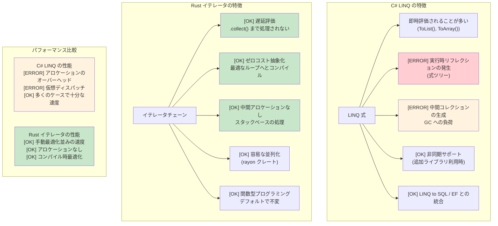

***

## ジェネリック制約: where vs トレイト境界

### C# のジェネリック制約
```csharp
// where 句を用いた C# のジェネリック制約
public class Repository<T> where T : class, IEntity, new()
{
    public T Create()
    {
        return new T();  // new() 制約により引数なしコンストラクタが許可される
    }
    
    public void Save(T entity)
    {
        if (entity.Id == 0)  // IEntity 制約により Id プロパティが提供される
        {
            entity.Id = GenerateId();
        }
        // データベースに保存
    }
}

// 複数の型パラメータと制約
public class Converter<TInput, TOutput> 
    where TInput : IConvertible
    where TOutput : class, new()
{
    public TOutput Convert(TInput input)
    {
        var output = new TOutput();
        // IConvertible を用いた変換ロジック
        return output;
    }
}

// ジェネリクスにおける変性 (Variance)
public interface IRepository<out T> where T : IEntity
{
    IEnumerable<T> GetAll();  // 共変 (Covariant) - より派生した型を返却可能
}

public interface IWriter<in T> where T : IEntity
{
    void Write(T entity);  // 反変 (Contravariant) - より基本の型を受け入れ可能
}
```

### トレイト境界を用いた Rust のジェネリック制約
```rust
use std::fmt::{Debug, Display};
use std::clone::Clone;

// 基本的なトレイト境界
pub struct Repository<T> 
where 
    T: Clone + Debug + Default,
{
    items: Vec<T>,
}

impl<T> Repository<T> 
where 
    T: Clone + Debug + Default,
{
    pub fn new() -> Self {
        Repository { items: Vec::new() }
    }
    
    pub fn create(&self) -> T {
        T::default()  // Default トレイトによりデフォルト値が提供される
    }
    
    pub fn add(&mut self, item: T) {
        println!("アイテムを追加中: {:?}", item);  // 出力用の Debug トレイト
        self.items.push(item);
    }
    
    pub fn get_all(&self) -> Vec<T> {
        self.items.clone()  // 複製用の Clone トレイト
    }
}

// 異なる構文での複数のトレイト境界
pub fn process_data<T, U>(input: T) -> U 
where 
    T: Display + Clone,
    U: From<T> + Debug,
{
    println!("処理中: {}", input);      // Display トレイト
    let cloned = input.clone();         // Clone トレイト
    let output = U::from(cloned);       // 型変換のための From トレイト
    println!("結果: {:?}", output);     // Debug トレイト
    output
}

// 関連型 (C# のジェネリック制約に類似)
pub trait Iterator {
    type Item;  // ジェネリックパラメータの代わりに関連型を使用
    
    fn next(&mut self) -> Option<Self::Item>;
}

pub trait Collect<T> {
    fn collect<I: Iterator<Item = T>>(iter: I) -> Self;
}

// 高階トレイト境界（HRTB: Higher-ranked trait bounds、高度な機能）
fn apply_to_all<F>(items: &[String], f: F) -> Vec<String>
where 
    F: for<'a> Fn(&'a str) -> String,  // 関数が任意のライフタイムで動作する
{
    items.iter().map(|s| f(s)).collect()
}

// 条件付きトレイト実装
impl<T> PartialEq for Repository<T> 
where 
    T: PartialEq + Clone + Debug + Default,
{
    fn eq(&self, other: &Self) -> bool {
        self.items == other.items
    }
}
```

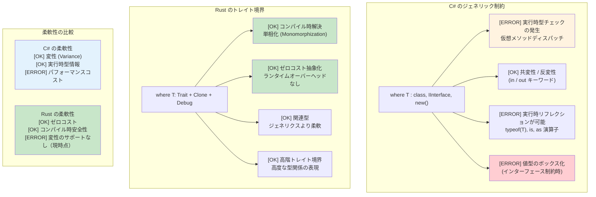

***

## Rust における一般的な C# パターン

### リポジトリパターン (Repository Pattern)
```csharp
// C# のリポジトリパターン
public interface IRepository<T> where T : IEntity
{
    Task<T> GetByIdAsync(int id);
    Task<IEnumerable<T>> GetAllAsync();
    Task<T> AddAsync(T entity);
    Task UpdateAsync(T entity);
    Task DeleteAsync(int id);
}

public class UserRepository : IRepository<User>
{
    private readonly DbContext _context;
    
    public UserRepository(DbContext context)
    {
        _context = context;
    }
    
    public async Task<User> GetByIdAsync(int id)
    {
        return await _context.Users.FindAsync(id);
    }
    
    // ... その他の実装
}
```

```rust
// トレイトとジェネリクスを用いた Rust のリポジトリパターン
use async_trait::async_trait;
use std::fmt::Debug;

#[async_trait]
pub trait Repository<T, E> 
where 
    T: Clone + Debug + Send + Sync,
    E: std::error::Error + Send + Sync,
{
    async fn get_by_id(&self, id: u64) -> Result<Option<T>, E>;
    async fn get_all(&self) -> Result<Vec<T>, E>;
    async fn add(&self, entity: T) -> Result<T, E>;
    async fn update(&self, entity: T) -> Result<T, E>;
    async fn delete(&self, id: u64) -> Result<(), E>;
}

#[derive(Debug, Clone)]
pub struct User {
    pub id: u64,
    pub name: String,
    pub email: String,
}

#[derive(Debug)]
pub enum RepositoryError {
    NotFound(u64),
    DatabaseError(String),
    ValidationError(String),
}

impl std::fmt::Display for RepositoryError {
    fn fmt(&self, f: &mut std::fmt::Formatter<'_>) -> std::fmt::Result {
        match self {
            RepositoryError::NotFound(id) => write!(f, "ID {} のエンティティが見つかりません", id),
            RepositoryError::DatabaseError(msg) => write!(f, "データベースエラー: {}", msg),
            RepositoryError::ValidationError(msg) => write!(f, "バリデーションエラー: {}", msg),
        }
    }
}

impl std::error::Error for RepositoryError {}

pub struct UserRepository {
    // データベース接続プールなど
}

#[async_trait]
impl Repository<User, RepositoryError> for UserRepository {
    async fn get_by_id(&self, id: u64) -> Result<Option<User>, RepositoryError> {
        // データベース検索のシミュレーション
        if id == 0 {
            return Ok(None);
        }
        
        Ok(Some(User {
            id,
            name: format!("User {}", id),
            email: format!("user{}@example.com", id),
        }))
    }
    
    async fn get_all(&self) -> Result<Vec<User>, RepositoryError> {
        // 実装ロジック
        Ok(vec![])
    }
    
    async fn add(&self, entity: User) -> Result<User, RepositoryError> {
        // バリデーションとデータベース挿入
        if entity.name.is_empty() {
            return Err(RepositoryError::ValidationError("名前を空にすることはできません".to_string()));
        }
        Ok(entity)
    }
    
    async fn update(&self, entity: User) -> Result<User, RepositoryError> {
        // 実装ロジック
        Ok(entity)
    }
    
    async fn delete(&self, id: u64) -> Result<(), RepositoryError> {
        // 実装ロジック
        Ok(())
    }
}
```

### ビルダーパターン (Builder Pattern)
```csharp
// C# のビルダーパターン (流れるようなインターフェース: Fluent Interface)
public class HttpClientBuilder
{
    private TimeSpan? _timeout;
    private string _baseAddress;
    private Dictionary<string, string> _headers = new();
    
    public HttpClientBuilder WithTimeout(TimeSpan timeout)
    {
        _timeout = timeout;
        return this;
    }
    
    public HttpClientBuilder WithBaseAddress(string baseAddress)
    {
        _baseAddress = baseAddress;
        return this;
    }
    
    public HttpClientBuilder WithHeader(string name, string value)
    {
        _headers[name] = value;
        return this;
    }
    
    public HttpClient Build()
    {
        var client = new HttpClient();
        if (_timeout.HasValue)
            client.Timeout = _timeout.Value;
        if (!string.IsNullOrEmpty(_baseAddress))
            client.BaseAddress = new Uri(_baseAddress);
        foreach (var header in _headers)
            client.DefaultRequestHeaders.Add(header.Key, header.Value);
        return client;
    }
}

// 使用例
var client = new HttpClientBuilder()
    .WithTimeout(TimeSpan.FromSeconds(30))
    .WithBaseAddress("https://api.example.com")
    .WithHeader("Accept", "application/json")
    .Build();
```

```rust
// Rust のビルダーパターン（所有権を消費するビルダー）
use std::collections::HashMap;
use std::time::Duration;

#[derive(Debug)]
pub struct HttpClient {
    timeout: Duration,
    base_address: String,
    headers: HashMap<String, String>,
}

pub struct HttpClientBuilder {
    timeout: Option<Duration>,
    base_address: Option<String>,
    headers: HashMap<String, String>,
}

impl HttpClientBuilder {
    pub fn new() -> Self {
        HttpClientBuilder {
            timeout: None,
            base_address: None,
            headers: HashMap::new(),
        }
    }
    
    pub fn with_timeout(mut self, timeout: Duration) -> Self {
        self.timeout = Some(timeout);
        self
    }
    
    pub fn with_base_address<S: Into<String>>(mut self, base_address: S) -> Self {
        self.base_address = Some(base_address.into());
        self
    }
    
    pub fn with_header<K: Into<String>, V: Into<String>>(mut self, name: K, value: V) -> Self {
        self.headers.insert(name.into(), value.into());
        self
    }
    
    pub fn build(self) -> Result<HttpClient, String> {
        let base_address = self.base_address.ok_or("ベースアドレスは必須です")?;
        
        Ok(HttpClient {
            timeout: self.timeout.unwrap_or(Duration::from_secs(30)),
            base_address,
            headers: self.headers,
        })
    }
}

// 使用例
let client = HttpClientBuilder::new()
    .with_timeout(Duration::from_secs(30))
    .with_base_address("https://api.example.com")
    .with_header("Accept", "application/json")
    .build()?;

// 別解: 一般的なケース向けに Default トレイトを実装
impl Default for HttpClientBuilder {
    fn default() -> Self {
        Self::new()
    }
}
```

***

## C# 開発者に不可欠なクレート

### コア機能の対応クレート

```rust
// C# 開発者のための Cargo.toml 依存関係
[dependencies]
# シリアライズ（Newtonsoft.Json や System.Text.Json に相当）
serde = { version = "1.0", features = ["derive"] }
serde_json = "1.0"

# HTTP クライアント（HttpClient に相当）
reqwest = { version = "0.11", features = ["json"] }

# 非同期ランタイム（Task.Run, async/await に相当）
tokio = { version = "1.0", features = ["full"] }

# エラー処理（カスタム例外クラスなどに相当）
thiserror = "1.0"
anyhow = "1.0"

# ロギング（ILogger, Serilog に相当）
log = "0.4"
env_logger = "0.10"

# 日時（DateTime に相当）
chrono = { version = "0.4", features = ["serde"] }

# UUID（System.Guid に相当）
uuid = { version = "1.0", features = ["v4", "serde"] }

# コレクション（List<T>, Dictionary<K,V> に相当）
# 標準ライブラリにも含まれますが、高度なコレクション用:
indexmap = "2.0"  # 順序を保持する HashMap

# 設定管理（IConfiguration に相当）
config = "0.13"

# データベース（Entity Framework に相当）
sqlx = { version = "0.7", features = ["runtime-tokio-rustls", "postgres", "uuid", "chrono"] }

# テスト（xUnit, NUnit に相当）
# 標準ライブラリにも含まれますが、より高度な機能用:
rstest = "0.18"  # パラメータ化テスト

# モック（Moq に相当）
mockall = "0.11"

# 並列処理（Parallel.ForEach に相当）
rayon = "1.7"
```

### 使用パターンの例

```rust
use serde::{Deserialize, Serialize};
use reqwest;
use tokio;
use thiserror::Error;
use chrono::{DateTime, Utc};
use uuid::Uuid;

// データモデル（属性付きの C# POCO に相当）
#[derive(Debug, Clone, Serialize, Deserialize)]
pub struct User {
    pub id: Uuid,
    pub name: String,
    pub email: String,
    #[serde(with = "chrono::serde::ts_seconds")]
    pub created_at: DateTime<Utc>,
}

// カスタムエラー型（カスタム例外に相当）
#[derive(Error, Debug)]
pub enum ApiError {
    #[error("HTTP リクエストに失敗しました: {0}")]
    Http(#[from] reqwest::Error),
    
    #[error("シリアライズに失敗しました: {0}")]
    Serialization(#[from] serde_json::Error),
    
    #[error("ユーザーが見つかりません: {id}")]
    UserNotFound { id: Uuid },
    
    #[error("バリデーションに失敗しました: {message}")]
    Validation { message: String },
}

// サービスクラスに相当
pub struct UserService {
    client: reqwest::Client,
    base_url: String,
}

impl UserService {
    pub fn new(base_url: String) -> Self {
        let client = reqwest::Client::builder()
            .timeout(std::time::Duration::from_secs(30))
            .build()
            .expect("HTTP クライアントの作成に失敗しました");
            
        UserService { client, base_url }
    }
    
    // 非同期メソッド（C# の async Task<User> に相当）
    pub async fn get_user(&self, id: Uuid) -> Result<User, ApiError> {
        let url = format!("{}/users/{}", self.base_url, id);
        
        let response = self.client
            .get(&url)
            .send()
            .await?;
        
        if response.status() == 404 {
            return Err(ApiError::UserNotFound { id });
        }
        
        let user = response.json::<User>().await?;
        Ok(user)
    }
    
    // ユーザー作成（C# の async Task<User> に相当）
    pub async fn create_user(&self, name: String, email: String) -> Result<User, ApiError> {
        if name.trim().is_empty() {
            return Err(ApiError::Validation {
                message: "名前を空にすることはできません".to_string(),
            });
        }
        
        let new_user = User {
            id: Uuid::new_v4(),
            name,
            email,
            created_at: Utc::now(),
        };
        
        let response = self.client
            .post(&format!("{}/users", self.base_url))
            .json(&new_user)
            .send()
            .await?;
        
        let created_user = response.json::<User>().await?;
        Ok(created_user)
    }
}

// 使用例（C# の Main メソッドに相当）
#[tokio::main]
async fn main() -> Result<(), ApiError> {
    // ロギングの初期化（ILogger の設定に相当）
    env_logger::init();
    
    let service = UserService::new("https://api.example.com".to_string());
    
    // ユーザー作成
    let user = service.create_user(
        "John Doe".to_string(),
        "john@example.com".to_string(),
    ).await?;
    
    println!("作成されたユーザー: {:?}", user);
    
    // ユーザー取得
    let retrieved_user = service.get_user(user.id).await?;
    println!("取得されたユーザー: {:?}", retrieved_user);
    
    Ok(())
}

#[cfg(test)]
mod tests {
    use super::*;
    
    #[tokio::test]  // C# の [Test] や [Fact] に相当
    async fn test_user_creation() {
        let service = UserService::new("http://localhost:8080".to_string());
        
        let result = service.create_user(
            "Test User".to_string(),
            "test@example.com".to_string(),
        ).await;
        
        assert!(result.is_ok());
        let user = result.unwrap();
        assert_eq!(user.name, "Test User");
        assert_eq!(user.email, "test@example.com");
    }
    
    #[test]
    fn test_validation() {
        // 同期テスト
        let error = ApiError::Validation {
            message: "無効な入力です".to_string(),
        };
        
        assert_eq!(error.to_string(), "バリデーションに失敗しました: 無効な入力です");
    }
}
```

***

## スレッド安全性: 慣例 vs 型システムによる保証

### C# - 慣例によるスレッド安全性
```csharp
// C# のコレクションはデフォルトではスレッドセーフではない
public class UserService
{
    private readonly List<string> items = new();
    private readonly Dictionary<int, User> cache = new();

    // これはデータ競合を引き起こす可能性がある:
    public void AddItem(string item)
    {
        items.Add(item);  // スレッドセーフではない！
    }

    // 手動でロックを使用する必要がある:
    private readonly object lockObject = new();

    public void SafeAddItem(string item)
    {
        lock (lockObject)
        {
            items.Add(item);  // 安全だが実行時オーバーヘッドがある
        }
        // 別の場所でロックの取得を忘れやすい
    }

    // ConcurrentCollection は役立つが機能が限定的:
    private readonly ConcurrentBag<string> safeItems = new();
    
    public void ConcurrentAdd(string item)
    {
        safeItems.Add(item);  // スレッドセーフだが操作が制限される
    }

    // 複雑な共有状態の管理
    private readonly ConcurrentDictionary<int, User> threadSafeCache = new();
    private volatile bool isShutdown = false;
    
    public async Task ProcessUser(int userId)
    {
        if (isShutdown) return;  // 競合状態（Race Condition）の可能性！
        
        var user = await GetUser(userId);
        threadSafeCache.TryAdd(userId, user);  // どのコレクションが安全かを意識し続ける必要がある
    }

    // スレッドローカルストレージには慎重な管理が必要
    private static readonly ThreadLocal<Random> threadLocalRandom = 
        new ThreadLocal<Random>(() => new Random());
        
    public int GetRandomNumber()
    {
        return threadLocalRandom.Value.Next();  // 安全だが手動管理が必要
    }
}

// 競合状態の潜在リスクを持つイベント処理
public class EventProcessor
{
    public event Action<string> DataReceived;
    private readonly List<string> eventLog = new();
    
    public void OnDataReceived(string data)
    {
        // 競合状態 - チェックと呼び出しの間にイベントが null になる可能性がある
        if (DataReceived != null)
        {
            DataReceived(data);
        }
        
        // 別の競合状態 - リストがスレッドセーフではない
        eventLog.Add($"処理完了: {data}");
    }
}
```

### Rust - 型システムによって保証されるスレッド安全性
```rust
use std::sync::{Arc, Mutex, RwLock};
use std::thread;
use std::collections::HashMap;
use tokio::sync::{mpsc, broadcast};

// Rust はコンパイル時にデータ競合を防止する
pub struct UserService {
    items: Arc<Mutex<Vec<String>>>,
    cache: Arc<RwLock<HashMap<i32, User>>>,
}

impl UserService {
    pub fn new() -> Self {
        UserService {
            items: Arc::new(Mutex::new(Vec::new())),
            cache: Arc::new(RwLock::new(HashMap::new())),
        }
    }
    
    pub fn add_item(&self, item: String) {
        let mut items = self.items.lock().unwrap();
        items.push(item);
        // `items` がスコープを抜けるとロックは自動的に解放される
    }
    
    // 複数リーダー / 単一ライター - 自動的に強制される
    pub async fn get_user(&self, user_id: i32) -> Option<User> {
        let cache = self.cache.read().unwrap();
        cache.get(&user_id).cloned()
    }
    
    pub async fn cache_user(&self, user_id: i32, user: User) {
        let mut cache = self.cache.write().unwrap();
        cache.insert(user_id, user);
    }
    
    // スレッド間共有のために Arc をクローン
    pub fn process_in_background(&self) {
        let items = Arc::clone(&self.items);
        
        thread::spawn(move || {
            let items = items.lock().unwrap();
            for item in items.iter() {
                println!("処理中: {}", item);
            }
        });
    }
}

// チャネルベースの通信 - 共有状態を必要としない
pub struct MessageProcessor {
    sender: mpsc::UnboundedSender<String>,
}

impl MessageProcessor {
    pub fn new() -> (Self, mpsc::UnboundedReceiver<String>) {
        let (tx, rx) = mpsc::unbounded_channel();
        (MessageProcessor { sender: tx }, rx)
    }
    
    pub fn send_message(&self, message: String) -> Result<(), mpsc::error::SendError<String>> {
        self.sender.send(message)
    }
}

// これはコンパイルエラーになる - Rust は安全でない可変データの共有を防止する:
fn impossible_data_race() {
    let mut items = vec![1, 2, 3];
    
    // これはコンパイル不可 - `items` を複数のクロージャにムーブできない
    /*
    thread::spawn(move || {
        items.push(4);  // エラー: ムーブされた値の使用
    });
    
    thread::spawn(move || {
        items.push(5);  // エラー: ムーブされた値の使用
    });
    */
}

// 安全な並行データ処理
use rayon::prelude::*;

fn parallel_processing() {
    let data = vec![1, 2, 3, 4, 5];
    
    // 並列イテレーション - スレッド安全性が保証される
    let results: Vec<i32> = data
        .par_iter()
        .map(|&x| x * x)
        .collect();
        
    println!("{:?}", results);
}

// メッセージパッシングによる非同期並行処理
async fn async_message_passing() {
    let (tx, mut rx) = mpsc::channel(100);
    
    // プロデューサータスク
    let producer = tokio::spawn(async move {
        for i in 0..10 {
            if tx.send(i).await.is_err() {
                break;
            }
        }
    });
    
    // コンシューマータスク
    let consumer = tokio::spawn(async move {
        while let Some(value) = rx.recv().await {
            println!("受信: {}", value);
        }
    });
    
    // 両方のタスクを待機
    let (producer_result, consumer_result) = tokio::join!(producer, consumer);
    producer_result.unwrap();
    consumer_result.unwrap();
}

#[derive(Clone)]
struct User {
    id: i32,
    name: String,
}
```

```mermaid
graph TD
    subgraph "C# のスレッド安全性における課題"
        CS_MANUAL["手動の同期処理"]
        CS_LOCKS["lock 文"]
        CS_CONCURRENT["ConcurrentCollections"]
        CS_VOLATILE["volatile フィールド"]
        CS_FORGET["😰 ロックの取得忘れ"]
        CS_DEADLOCK["💀 デッドロックの可能性"]
        CS_RACE["🏃 競合状態（データ競合）"]
        CS_OVERHEAD["⚡ 実行時オーバーヘッド"]
        
        CS_MANUAL --> CS_LOCKS
        CS_MANUAL --> CS_CONCURRENT
        CS_MANUAL --> CS_VOLATILE
        CS_LOCKS --> CS_FORGET
        CS_LOCKS --> CS_DEADLOCK
        CS_FORGET --> CS_RACE
        CS_LOCKS --> CS_OVERHEAD
    end
    
    subgraph "Rust の型システムによる保証"
        RUST_OWNERSHIP["所有権システム"]
        RUST_BORROWING["借用チェッカ"]
        RUST_SEND["Send トレイト"]
        RUST_SYNC["Sync トレイト"]
        RUST_ARC["Arc<Mutex<T>>"]
        RUST_CHANNELS["メッセージパッシング"]
        RUST_SAFE["✅ データ競合の完全排除"]
        RUST_FAST["⚡ ゼロコスト抽象化"]
        
        RUST_OWNERSHIP --> RUST_BORROWING
        RUST_BORROWING --> RUST_SEND
        RUST_SEND --> RUST_SYNC
        RUST_SYNC --> RUST_ARC
        RUST_ARC --> RUST_CHANNELS
        RUST_CHANNELS --> RUST_SAFE
        RUST_SAFE --> RUST_FAST
    end
    
    style CS_FORGET fill:#ffcdd2
    style CS_DEADLOCK fill:#ffcdd2
    style CS_RACE fill:#ffcdd2
    style RUST_SAFE fill:#c8e6c9
    style RUST_FAST fill:#c8e6c9
```

***

## 段階的な導入戦略

### フェーズ 1: 学習と実験（第 1 〜 4 週）
```rust
// コマンドラインツールやユーティリティから始める
// 例: ログファイルアナライザ
use std::fs;
use std::collections::HashMap;
use clap::Parser;

#[derive(Parser)]
#[command(author, version, about)]
struct Args {
    #[arg(short, long)]
    file: String,
    
    #[arg(short, long, default_value = "10")]
    top: usize,
}

fn main() -> Result<(), Box<dyn std::error::Error>> {
    let args = Args::parse();
    
    let content = fs::read_to_string(&args.file)?;
    let mut word_count = HashMap::new();
    
    for line in content.lines() {
        for word in line.split_whitespace() {
            let word = word.to_lowercase();
            *word_count.entry(word).or_insert(0) += 1;
        }
    }
    
    let mut sorted: Vec<_> = word_count.into_iter().collect();
    sorted.sort_by(|a, b| b.1.cmp(&a.1));
    
    for (word, count) in sorted.into_iter().take(args.top) {
        println!("{}: {}", word, count);
    }
    
    Ok(())
}
```

### フェーズ 2: パフォーマンス重要コンポーネントの置き換え（第 5 〜 8 週）
```rust
// CPU 負荷の高いデータ処理部分を置き換える
// 例: 画像処理マイクロサービス
use image::{DynamicImage, ImageBuffer, Rgb};
use serde::{Deserialize, Serialize};
use tokio::io::{AsyncReadExt, AsyncWriteExt};
use warp::Filter;

#[derive(Serialize, Deserialize)]
struct ProcessingRequest {
    image_data: Vec<u8>,
    operation: String,
    parameters: serde_json::Value,
}

#[derive(Serialize)]
struct ProcessingResponse {
    processed_image: Vec<u8>,
    processing_time_ms: u64,
}

async fn process_image(request: ProcessingRequest) -> Result<ProcessingResponse, Box<dyn std::error::Error + Send + Sync>> {
    let start = std::time::Instant::now();
    
    let img = image::load_from_memory(&request.image_data)?;
    
    let processed = match request.operation.as_str() {
        "blur" => {
            let radius = request.parameters["radius"].as_f64().unwrap_or(2.0) as f32;
            img.blur(radius)
        }
        "grayscale" => img.grayscale(),
        "resize" => {
            let width = request.parameters["width"].as_u64().unwrap_or(100) as u32;
            let height = request.parameters["height"].as_u64().unwrap_or(100) as u32;
            img.resize(width, height, image::imageops::FilterType::Lanczos3)
        }
        _ => return Err("未知の操作です".into()),
    };
    
    let mut buffer = Vec::new();
    processed.write_to(&mut std::io::Cursor::new(&mut buffer), image::ImageOutputFormat::Png)?;
    
    Ok(ProcessingResponse {
        processed_image: buffer,
        processing_time_ms: start.elapsed().as_millis() as u64,
    })
}

#[tokio::main]
async fn main() {
    let process_route = warp::path("process")
        .and(warp::post())
        .and(warp::body::json())
        .and_then(|req: ProcessingRequest| async move {
            match process_image(req).await {
                Ok(response) => Ok(warp::reply::json(&response)),
                Err(e) => Err(warp::reject::custom(ProcessingError(e.to_string()))),
            }
        });

    warp::serve(process_route)
        .run(([127, 0, 0, 1], 3030))
        .await;
}

#[derive(Debug)]
struct ProcessingError(String);
impl warp::reject::Reject for ProcessingError {}
```

### フェーズ 3: 新規マイクロサービスの構築（第 9 〜 12 週）
```rust
// 新しいサービスを最初から Rust で構築する
// 例: 認証サービス
use axum::{
    extract::{Query, State},
    http::StatusCode,
    response::Json,
    routing::{get, post},
    Router,
};
use jsonwebtoken::{encode, decode, Header, Validation, EncodingKey, DecodingKey};
use serde::{Deserialize, Serialize};
use sqlx::{Pool, Postgres};
use uuid::Uuid;
use bcrypt::{hash, verify, DEFAULT_COST};

#[derive(Clone)]
struct AppState {
    db: Pool<Postgres>,
    jwt_secret: String,
}

#[derive(Serialize, Deserialize)]
struct Claims {
    sub: String,
    exp: usize,
}

#[derive(Deserialize)]
struct LoginRequest {
    email: String,
    password: String,
}

#[derive(Serialize)]
struct LoginResponse {
    token: String,
    user_id: Uuid,
}

async fn login(
    State(state): State<AppState>,
    Json(request): Json<LoginRequest>,
) -> Result<Json<LoginResponse>, StatusCode> {
    let user = sqlx::query!(
        "SELECT id, password_hash FROM users WHERE email = $1",
        request.email
    )
    .fetch_optional(&state.db)
    .await
    .map_err(|_| StatusCode::INTERNAL_SERVER_ERROR)?;

    let user = user.ok_or(StatusCode::UNAUTHORIZED)?;

    if !verify(&request.password, &user.password_hash)
        .map_err(|_| StatusCode::INTERNAL_SERVER_ERROR)?
    {
        return Err(StatusCode::UNAUTHORIZED);
    }

    let claims = Claims {
        sub: user.id.to_string(),
        exp: (chrono::Utc::now() + chrono::Duration::hours(24)).timestamp() as usize,
    };

    let token = encode(
        &Header::default(),
        &claims,
        &EncodingKey::from_secret(state.jwt_secret.as_ref()),
    )
    .map_err(|_| StatusCode::INTERNAL_SERVER_ERROR)?;

    Ok(Json(LoginResponse {
        token,
        user_id: user.id,
    }))
}

#[tokio::main]
async fn main() -> Result<(), Box<dyn std::error::Error>> {
    let database_url = std::env::var("DATABASE_URL")?;
    let jwt_secret = std::env::var("JWT_SECRET")?;
    
    let pool = sqlx::postgres::PgPoolOptions::new()
        .max_connections(20)
        .connect(&database_url)
        .await?;

    let app_state = AppState {
        db: pool,
        jwt_secret,
    };

    let app = Router::new()
        .route("/login", post(login))
        .with_state(app_state);

    let listener = tokio::net::TcpListener::bind("0.0.0.0:3000").await?;
    axum::serve(listener, app).await?;
    
    Ok(())
}
```

***

## C# から Rust への概念マッピング

### 依存性の注入 (DI) → コンストラクタ注入 ＋ トレイト
```csharp
// DI コンテナを用いた C#
services.AddScoped<IUserRepository, UserRepository>();
services.AddScoped<IUserService, UserService>();

public class UserService
{
    private readonly IUserRepository _repository;
    
    public UserService(IUserRepository repository)
    {
        _repository = repository;
    }
}
```

```rust
// Rust: トレイトを用いたコンストラクタ注入
pub trait UserRepository {
    async fn find_by_id(&self, id: Uuid) -> Result<Option<User>, Error>;
    async fn save(&self, user: &User) -> Result<(), Error>;
}

pub struct UserService<R> 
where 
    R: UserRepository,
{
    repository: R,
}

impl<R> UserService<R> 
where 
    R: UserRepository,
{
    pub fn new(repository: R) -> Self {
        Self { repository }
    }
    
    pub async fn get_user(&self, id: Uuid) -> Result<Option<User>, Error> {
        self.repository.find_by_id(id).await
    }
}

// 使用例
let repository = PostgresUserRepository::new(pool);
let service = UserService::new(repository);
```

### LINQ → イテレータチェーン
```csharp
// C# の LINQ
var result = users
    .Where(u => u.Age > 18)
    .Select(u => u.Name.ToUpper())
    .OrderBy(name => name)
    .Take(10)
    .ToList();
```

```rust
// Rust: イテレータチェーン (ゼロコスト！)
let result: Vec<String> = users
    .iter()
    .filter(|u| u.age > 18)
    .map(|u| u.name.to_uppercase())
    .collect::<Vec<_>>()
    .into_iter()
    .sorted()
    .take(10)
    .collect();

// または itertools クレートを使って、より LINQ に近い操作を行う場合
use itertools::Itertools;

let result: Vec<String> = users
    .iter()
    .filter(|u| u.age > 18)
    .map(|u| u.name.to_uppercase())
    .sorted()
    .take(10)
    .collect();
```

### Entity Framework → SQLx ＋ マイグレーション
```csharp
// C# の Entity Framework
public class ApplicationDbContext : DbContext
{
    public DbSet<User> Users { get; set; }
}

var user = await context.Users
    .Where(u => u.Email == email)
    .FirstOrDefaultAsync();
```

```rust
// Rust: コンパイル時チェック付きクエリを提供する SQLx
use sqlx::{PgPool, FromRow};

#[derive(FromRow)]
struct User {
    id: Uuid,
    email: String,
    name: String,
}

// コンパイル時チェック付きクエリ
let user = sqlx::query_as!(
    User,
    "SELECT id, email, name FROM users WHERE email = $1",
    email
)
.fetch_optional(&pool)
.await?;

// または動的クエリを使用する場合
let user = sqlx::query_as::<_, User>(
    "SELECT id, email, name FROM users WHERE email = $1"
)
.bind(email)
.fetch_optional(&pool)
.await?;
```

### 構成設定 (Configuration) → Config クレート
```csharp
// C# の構成設定
public class AppSettings
{
    public string DatabaseUrl { get; set; }
    public int Port { get; set; }
}

var config = builder.Configuration.Get<AppSettings>();
```

```rust
// Rust: serde と連携する config クレート
use config::{Config, ConfigError, Environment, File};
use serde::Deserialize;

#[derive(Debug, Deserialize)]
struct AppSettings {
    database_url: String,
    port: u16,
}

impl AppSettings {
    pub fn new() -> Result<Self, ConfigError> {
        let s = Config::builder()
            .add_source(File::with_name("config/default"))
            .add_source(Environment::with_prefix("APP"))
            .build()?;

        s.try_deserialize()
    }
}

// 使用例
let settings = AppSettings::new()?;
```

***

## チーム導入のタイムライン

### 1か月目: 基礎の習得
**第 1 〜 2 週: 構文と所有権**
- C# との基本的な構文の違い
- 所有権、借用、ライフタイムの理解
- 小規模な演習: CLI ツール、ファイル処理

**第 3 〜 4 週: エラー処理と型システム**
- `Result<T, E>` vs 例外
- `Option<T>` vs null 許容型
- パターンマッチングと網羅性チェック

**推奨演習課題:**
```rust
// 第 1 〜 2 週: ファイルプロセッサ
fn process_log_file(path: &str) -> Result<Vec<String>, std::io::Error> {
    let content = std::fs::read_to_string(path)?;
    let errors: Vec<String> = content
        .lines()
        .filter(|line| line.contains("ERROR"))
        .map(|line| line.to_string())
        .collect();
    Ok(errors)
}

// 第 3 〜 4 週: エラー処理を伴う JSON プロセッサ
use serde::{Deserialize, Serialize};

#[derive(Deserialize, Serialize, Debug)]
struct LogEntry {
    timestamp: String,
    level: String,
    message: String,
}

fn parse_log_entries(json_str: &str) -> Result<Vec<LogEntry>, Box<dyn std::error::Error>> {
    let entries: Vec<LogEntry> = serde_json::from_str(json_str)?;
    Ok(entries)
}
```

### 2か月目: 実践的な応用
**第 5 〜 6 週: トレイトとジェネリクス**
- トレイトシステム vs インターフェース
- ジェネリック制約とトレイト境界
- 一般的なパターンとイディオム

**第 7 〜 8 週: 非同期プログラミングと並行処理**
- `async`/`await` の共通点と相違点
- 通信用チャネル
- スレッド安全性の保証

**推奨プロジェクト:**
```rust
// 第 5 〜 6 週: ジェネリックなデータプロセッサ
trait DataProcessor<T> {
    type Output;
    type Error;
    
    fn process(&self, data: T) -> Result<Self::Output, Self::Error>;
}

struct JsonProcessor;

impl DataProcessor<&str> for JsonProcessor {
    type Output = serde_json::Value;
    type Error = serde_json::Error;
    
    fn process(&self, data: &str) -> Result<Self::Output, Self::Error> {
        serde_json::from_str(data)
    }
}

// 第 7 〜 8 週: 非同期 Web クライアント
async fn fetch_and_process_data(urls: Vec<&str>) -> Result<(), Box<dyn std::error::Error>> {
    let client = reqwest::Client::new();
    
    let tasks: Vec<_> = urls
        .into_iter()
        .map(|url| {
            let client = client.clone();
            tokio::spawn(async move {
                let response = client.get(url).send().await?;
                let text = response.text().await?;
                println!("{} から {} バイト取得しました", url, text.len());
                Ok::<(), reqwest::Error>(())
            })
        })
        .collect();
    
    for task in tasks {
        task.await??;
    }
    
    Ok(())
}
```

### 3か月目以降: 本番環境への統合
**第 9 〜 12 週: 実プロジェクトでの開発**
- リライト対象として非クリティカルなコンポーネントを選定
- 包括的なエラー処理の実装
- ロギング、メトリクス、テストの追加
- パフォーマンスプロファイリングと最適化

**継続的取り組み: チームレビューとメンタリング**
- Rust のイディオムに焦点を当てたコードレビュー
- ペアプログラミングセッション
- 知見共有ミーティングの実施

***

## パフォーマンス比較: マネージド vs ネイティブ

### 実際の環境におけるパフォーマンス特性

| **観点** | **C# (.NET)** | **Rust** | **パフォーマンスへの影響** |
|------------|---------------|----------|------------------------|
| **起動時間** | 100〜500ms（JIT コンパイル） | 1〜10ms（ネイティブバイナリ） | 🚀 **50〜500倍高速** |
| **メモリ使用量** | +30〜100%（GC オーバーヘッド ＋ メタデータ） | 基準値（最小限のランタイム） | 💾 **RAM 使用量を 30〜50% 削減** |
| **GC による一時停止** | 1〜100ms の定期的な停止 | なし（GC なし） | ⚡ **一貫したレイテンシ** |
| **CPU 使用率** | +10〜20%（GC ＋ JIT のオーバーヘッド） | 基準値（直接実行） | 🔋 **電力・実行効率が 10〜20% 向上** |
| **バイナリサイズ** | 30〜200MB（ランタイム同梱時） | 1〜20MB（静的バイナリ） | 📦 **デプロイサイズが 1/10 に縮小** |
| **メモリ安全性** | 実行時チェック | コンパイル時証明 | 🛡️ **ゼロオーバーヘッドの安全性** |
| **並行処理性能** | 良好（慎重な同期が必要） | 卓越（恐れなき並行性: Fearless Concurrency） | 🏃 **優れたスケーラビリティ** |

### ベンチマークの例

```csharp
// C# - JSON 処理ベンチマーク
public class JsonProcessor
{
    public async Task<List<User>> ProcessJsonFile(string path)
    {
        var json = await File.ReadAllTextAsync(path);
        var users = JsonSerializer.Deserialize<List<User>>(json);
        
        return users.Where(u => u.Age > 18)
                   .OrderBy(u => u.Name)
                   .Take(1000)
                   .ToList();
    }
}

// 典型的なパフォーマンス: 100MB のファイルに対して約 200ms
// メモリ使用量: ピーク時約 500MB (GC オーバーヘッド)
// バイナリサイズ: 約 80MB (自己完結型デプロイ時)
```

```rust
// Rust - 同等の JSON 処理
use serde::{Deserialize, Serialize};
use tokio::fs;

#[derive(Deserialize, Serialize)]
struct User {
    name: String,
    age: u32,
}

pub async fn process_json_file(path: &str) -> Result<Vec<User>, Box<dyn std::error::Error>> {
    let json = fs::read_to_string(path).await?;
    let mut users: Vec<User> = serde_json::from_str(&json)?;
    
    users.retain(|u| u.age > 18);
    users.sort_by(|a, b| a.name.cmp(&b.name));
    users.truncate(1000);
    
    Ok(users)
}

// 典型的なパフォーマンス: 同一の 100MB ファイルに対して約 120ms
// メモリ使用量: ピーク時約 200MB (GC オーバーヘッドなし)
// バイナリサイズ: 約 8MB (静的バイナリ)
```

### CPU バウンドなワークロード

```csharp
// C# - 数学的な計算
public class Mandelbrot
{
    public static int[,] Generate(int width, int height, int maxIterations)
    {
        var result = new int[height, width];
        
        Parallel.For(0, height, y =>
        {
            for (int x = 0; x < width; x++)
            {
                var c = new Complex(
                    (x - width / 2.0) * 4.0 / width,
                    (y - height / 2.0) * 4.0 / height);
                
                result[y, x] = CalculateIterations(c, maxIterations);
            }
        });
        
        return result;
    }
}

// パフォーマンス: 約 2.3 秒 (8 コアマシン)
// メモリ: 約 500MB
```

```rust
// Rust - Rayon を使用した同一の計算
use rayon::prelude::*;
use num_complex::Complex;

pub fn generate_mandelbrot(width: usize, height: usize, max_iterations: u32) -> Vec<Vec<u32>> {
    (0..height)
        .into_par_iter()
        .map(|y| {
            (0..width)
                .map(|x| {
                    let c = Complex::new(
                        (x as f64 - width as f64 / 2.0) * 4.0 / width as f64,
                        (y as f64 - height as f64 / 2.0) * 4.0 / height as f64,
                    );
                    calculate_iterations(c, max_iterations)
                })
                .collect()
        })
        .collect()
}

// パフォーマンス: 約 1.1 秒 (同一の 8 コアマシン)  
// メモリ: 約 200MB
// 2倍高速で、メモリ使用量は 60% 削減
```

### 各言語の選定基準

**C# を選択すべき場合:**
- **迅速な開発が極めて重要な場合** - 充実したツールエコシステム
- **チームに .NET の専門知識がある場合** - 既存の知識とスキルセットの活用
- **エンタープライズ統合** - Microsoft エコシステムの多用
- **適度なパフォーマンス要件** - 一般的なパフォーマンスで十分な場合
- **リッチな UI アプリケーション** - WPF、WinUI、Blazor アプリケーション
- **プロトタイピングおよび MVP 開発** - 市場投入までのスピード重視

**Rust を選択すべき場合:**
- **パフォーマンスが極めて重要な場合** - CPU/メモリ集約型アプリケーション
- **リソース制約が重要である場合** - 組み込み、エッジコンピューティング、サーバーレス
- **長時間稼働するサービス** - Web サーバー、データベース、システムサービス
- **システムレベルプログラミング** - OS コンポーネント、ドライバ、ネットワークツール
- **高信頼性が要求される場合** - 金融システム、安全性重視のクリティカルなアプリケーション
- **並行 / 並列ワークロード** - 高スループットなデータ処理

### 移行戦略の決定木

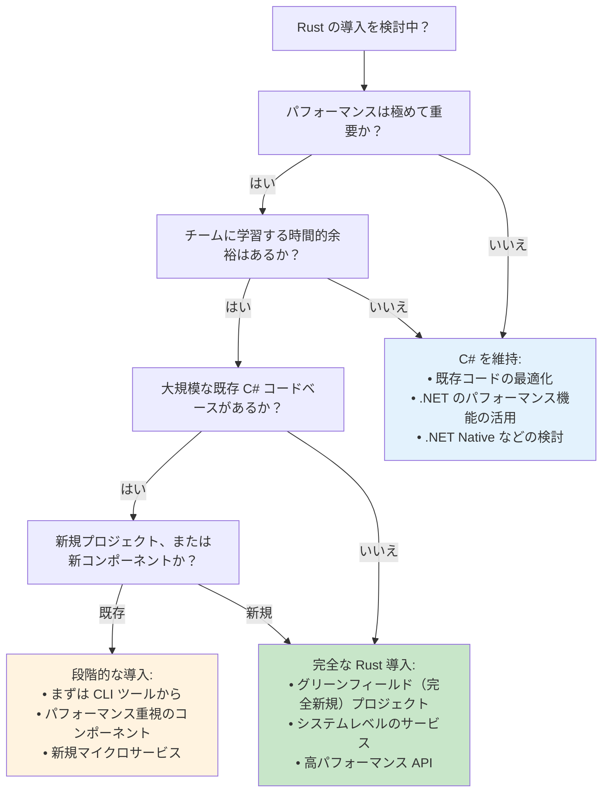

***

## C# 開発者のためのベストプラクティス

### 1. **マインドセットの転換**
- **GC から所有権へ**: 誰がデータを所有し、いつ解放されるかを意識する
- **例外から Result へ**: エラー処理を明示的かつ可視化する
- **継承から合成へ**: トレイトを用いて振る舞いを合成する
- **Null から Option へ**: 値の不在を型システムで明示的に表現する

### 2. **コードの構成方法**
```rust
// C# ソリューションのようにプロジェクトを構造化する
src/
├── main.rs          // Program.cs に相当
├── lib.rs           // ライブラリのエントリポイント
├── models/          // C# の Models/ フォルダに相当
│   ├── mod.rs
│   ├── user.rs
│   └── product.rs
├── services/        // Services/ フォルダに相当
│   ├── mod.rs
│   ├── user_service.rs
│   └── product_service.rs
├── controllers/     // Controllers/ に相当（Web アプリの場合）
├── repositories/    // Repositories/ に相当
└── utils/          // Utilities/ に相当
```

### 3. **エラー処理戦略**
```rust
// アプリケーション共通の Result 型を定義
pub type AppResult<T> = Result<T, AppError>;

#[derive(Error, Debug)]
pub enum AppError {
    #[error("データベースエラー: {0}")]
    Database(#[from] sqlx::Error),
    
    #[error("HTTP エラー: {0}")]
    Http(#[from] reqwest::Error),
    
    #[error("バリデーションエラー: {message}")]
    Validation { message: String },
    
    #[error("ビジネスロジックエラー: {message}")]
    Business { message: String },
}

// アプリケーション全体で使用
pub async fn create_user(data: CreateUserRequest) -> AppResult<User> {
    validate_user_data(&data)?;  // AppError::Validation を返す
    let user = repository.create_user(data).await?;  // AppError::Database を返す
    Ok(user)
}
```

### 4. **テストパターン**
```rust
// C# の単体テストのようにテストを構成
#[cfg(test)]
mod tests {
    use super::*;
    use rstest::*;  // C# の [Theory] のようなパラメータ化テスト用
    
    #[test]
    fn test_basic_functionality() {
        // Arrange (準備)
        let input = "test data";
        
        // Act (実行)
        let result = process_data(input);
        
        // Assert (検証)
        assert_eq!(result, "expected output");
    }
    
    #[rstest]
    #[case(1, 2, 3)]
    #[case(5, 5, 10)]
    #[case(0, 0, 0)]
    fn test_addition(#[case] a: i32, #[case] b: i32, #[case] expected: i32) {
        assert_eq!(add(a, b), expected);
    }
    
    #[tokio::test]  // 非同期テスト用
    async fn test_async_functionality() {
        let result = async_function().await;
        assert!(result.is_ok());
    }
}
```

### 5. **避けるべき一般的な間違い**
```rust
// [ERROR] 継承を実装しようとしない
// 以下のような書き方は避ける:
// struct Manager : Employee  // Rust には存在しない構文

// [OK] トレイトを用いた合成を使用する
trait Employee {
    fn get_salary(&self) -> u32;
}

trait Manager: Employee {
    fn get_team_size(&self) -> usize;
}

// [ERROR] いたるところで unwrap() を使わない（例外を無視するようなもの）
let value = might_fail().unwrap();  // パニックを引き起こす可能性あり！

// [OK] エラーを適切に処理する
let value = match might_fail() {
    Ok(v) => v,
    Err(e) => {
        log::error!("処理に失敗しました: {}", e);
        return Err(e.into());
    }
};

// [ERROR] 何でもかんでも clone() しない（不要にオブジェクトをコピーするようなもの）
let data = expensive_data.clone();  // コストが高い！

// [OK] 可能な限り借用を使用する
let data = &expensive_data;  // 単なる参照

// [ERROR] いたるところで RefCell を使わない（すべてを可変にしようとするようなもの）
struct Data {
    value: RefCell<i32>,  // 内部可変性 - 慎重に使用すること
}

// [OK] 所有または借用されたデータを優先する
struct Data {
    value: i32,  // シンプルで明快
}
```

このガイドは、C# 開発者がこれまでに培った知識をどのように Rust に置き換えて応用できるかについて、包括的な理解を提供することを目的としています。アプローチにおける共通点と根本的な相違点の双方を浮き彫りにしました。最も重要なポイントは、Rust の制約（所有権など）が、最初のうちはある程度の複雑さを伴うものの、C# で起こりうるバグのカテゴリそのものを根絶するために設計されていると理解することです。
