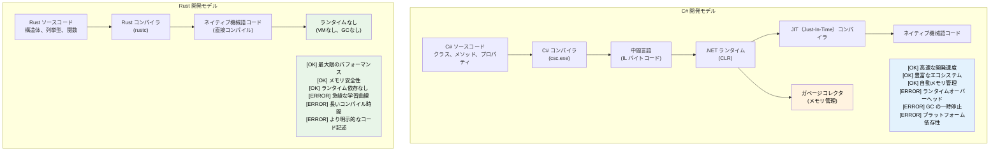

## 講師紹介と全体的な進め方

- 講師紹介
    - Microsoft SCHIE (Silicon and Cloud Hardware Infrastructure Engineering) チームのプリンシパルファームウェアアーキテクト
    - セキュリティ、システムプログラミング（ファームウェア、OS、ハイパーバイザ）、CPU およびプラットフォームアーキテクチャ、C++ システムにおける長年の業界経験
    - 2017年（AWS EC2 在籍時）に Rust でのプログラミングを始め、以来その魅力に惹かれ続けている
- 本コースは可能な限りインタラクティブに進めることを目指しています
    - 前提条件: C# および .NET 開発の知識があること
    - 意図的に C# の概念を Rust の対応する概念にマッピングした具体例を提示します
    - **疑問点があれば、いつでも遠慮なく質問してください**

---

## C# 開発者にとっての Rust の価値

> **学習内容:** C# 開発者にとって Rust が重要である理由 — マネージドコードとネイティブコードの性能差、
> Rust がコンパイル時に null 参照例外や隠れた制御フローを排除する仕組み、
> そして Rust が C# を補完または代替する主要なユースケースについて学びます。
>
> **難易度:** 🟢 初級

### ランタイムのオーバーヘッドを伴わないパフォーマンス
```csharp
// C# - 高い生産性、ランタイムオーバーヘッド
public class DataProcessor
{
    private List<int> data = new List<int>();
    
    public void ProcessLargeDataset()
    {
        // 割り当てによりGCが発生
        for (int i = 0; i < 10_000_000; i++)
        {
            data.Add(i * 2); // GCへの負荷
        }
        // 処理中に予期せぬGCの一時停止が発生する可能性
    }
}
// 実行時間: 変動あり（GCにより50〜200ms）
// メモリ: 約80MB（GCオーバーヘッドを含む）
// 予測可能性: 低（GCの一時停止）
```

```rust
// Rust - 同等の表現力、ゼロランタイムオーバーヘッド
struct DataProcessor {
    data: Vec<i32>,
}

impl DataProcessor {
    fn process_large_dataset(&mut self) {
        // ゼロコスト抽象化
        for i in 0..10_000_000 {
            self.data.push(i * 2); // GCへの負荷なし
        }
        // 決定論的なパフォーマンス
    }
}
// 実行時間: 一貫（約30ms）
// メモリ: 約40MB（必要な分だけの正確な割り当て）
// 予測可能性: 高（GCなし）
```

### ランタイムチェックなしでのメモリ安全性
```csharp
// C# - オーバーヘッドを伴うランタイム安全性
public class RuntimeCheckedOperations
{
    public string? ProcessArray(int[] array)
    {
        // アクセスごとにランタイム境界チェック
        if (array.Length > 0)
        {
            return array[0].ToString(); // 安全 — int は値型であり null にはならない
        }
        return null; // Null 許容の戻り値（C# 8+ の Null 許容参照型 string?）
    }
    
    public void ProcessConcurrently()
    {
        var list = new List<int>();
        
        // データ競合が発生しうるため、慎重なロックが必要
        Parallel.For(0, 1000, i =>
        {
            lock (list) // ランタイムオーバーヘッド
            {
                list.Add(i);
            }
        });
    }
}
```

```rust
// Rust - ランタイムコストゼロのコンパイル時安全性
struct SafeOperations;

impl SafeOperations {
    // コンパイル時の Null 安全性、ランタイムチェックなし
    fn process_array(array: &[i32]) -> Option<String> {
        array.first().map(|x| x.to_string())
        // Null 参照は発生不可能
        // 安全性が証明可能な場合、境界チェックは最適化により除去される
    }
    
    fn process_concurrently() {
        use std::sync::{Arc, Mutex};
        use std::thread;
        
        let data = Arc::new(Mutex::new(Vec::new()));
        
        // データ競合はコンパイル時に防止される
        let handles: Vec<_> = (0..1000).map(|i| {
            let data = Arc::clone(&data);
            thread::spawn(move || {
                data.lock().unwrap().push(i);
            })
        }).collect();
        
        for handle in handles {
            handle.join().unwrap();
        }
    }
}
```

***

## Rust が解決する C# の代表的な課題

### 1. 「10億ドルの間違い」: Null 参照
```csharp
// C# - NullReferenceException は実行時の時限爆弾
public class UserService
{
    public string GetUserDisplayName(User user)
    {
        // これらのどこからでも NullReferenceException がスローされる可能性がある
        return user.Profile.DisplayName.ToUpper();
        //     ^^^^^ ^^^^^^^ ^^^^^^^^^^^ ^^^^^^^
        //     実行時に null になる可能性がある
    }
    
    // Null 許容参照型（C# 8+）は有用だが、依然として null がすり抜けることがある
    public string GetDisplayName(User? user)
    {
        return user?.Profile?.DisplayName?.ToUpper() ?? "Unknown";
        // この行自体は ?. と ?? により Null 安全だが、
        // NRT（Null許容参照型）は警告ベースであり、`!` 演算子でコンパイラを抑制できてしまう
    }
}
```

```rust
// Rust - コンパイル時に保証される Null 安全性
struct UserService;

impl UserService {
    fn get_user_display_name(user: &User) -> Option<String> {
        user.profile.as_ref()?
            .display_name.as_ref()
            .map(|name| name.to_uppercase())
        // コンパイラにより None ケースの処理が強制される
        // ヌルポインタ例外の発生は不可能
    }
    
    fn get_display_name_safe(user: Option<&User>) -> String {
        user.and_then(|u| u.profile.as_ref())
            .and_then(|p| p.display_name.as_ref())
            .map(|name| name.to_uppercase())
            .unwrap_or_else(|| "Unknown".to_string())
        // 明示的な処理、想定外の挙動なし
    }
}
```

### 2. 隠れた例外と制御フロー
```csharp
// C# - 例外はどこからでもスローされうる
public async Task<UserData> GetUserDataAsync(int userId)
{
    // これらはそれぞれ異なる例外をスローする可能性がある
    var user = await userRepository.GetAsync(userId);        // SqlException
    var permissions = await permissionService.GetAsync(user); // HttpRequestException  
    var preferences = await preferenceService.GetAsync(user); // TimeoutException
    
    return new UserData(user, permissions, preferences);
    // 呼び出し側にはどのような例外が飛んでくるか分からない
}
```

```rust
// Rust - すべてのエラーが関数シグネチャに明示される
#[derive(Debug)]
enum UserDataError {
    DatabaseError(String),
    NetworkError(String),
    Timeout,
    UserNotFound(i32),
}

async fn get_user_data(user_id: i32) -> Result<UserData, UserDataError> {
    // すべてのエラーが明示的かつ処理済み
    let user = user_repository.get(user_id).await
        .map_err(UserDataError::DatabaseError)?;
    
    let permissions = permission_service.get(&user).await
        .map_err(UserDataError::NetworkError)?;
    
    let preferences = preference_service.get(&user).await
        .map_err(|_| UserDataError::Timeout)?;
    
    Ok(UserData::new(user, permissions, preferences))
    // 呼び出し側はどのようなエラーが発生しうるか正確に把握できる
}
```

### 3. 正確性: 証明エンジンとしての型システム

Rust の型システムは、C# では実行時にしか検出できない（あるいはまったく検出できない）論理バグのカテゴリ全体を、コンパイル時に捕捉します。

#### 代数的データ型（ADT）vs sealed クラスによる代替策
```csharp
// C# — 判別共用体（Discriminated Union）を模倣するには sealed クラスのボイラープレートが必要
// コンパイラが未処理ケースを警告（CS8524）するのは、`_` の包括パターン（catch-all）がない場合のみ
// 実際の C# コードではデフォルトとして `_` が使われることが多く、警告がもみ消されてしまう
public abstract record Shape;
public sealed record Circle(double Radius)   : Shape;
public sealed record Rectangle(double W, double H) : Shape;
public sealed record Triangle(double A, double B, double C) : Shape;

public static double Area(Shape shape) => shape switch
{
    Circle c    => Math.PI * c.Radius * c.Radius,
    Rectangle r => r.W * r.H,
    // Triangle を忘れていませんか？ `_` の包括パターンによりコンパイラ警告は抑制されてしまう
    _           => throw new ArgumentException("Unknown shape")
};
// 半年後に新しいバリアントを追加しても、`_` パターンが未処理ケースを隠してしまう
// 更新が必要な 47 箇所の switch 式をコンパイラ警告で教えてくれることはない
```

```rust
// Rust — 代数的データ型（ADT）+ 網羅的マッチング = コンパイル時の証明
enum Shape {
    Circle { radius: f64 },
    Rectangle { w: f64, h: f64 },
    Triangle { a: f64, b: f64, c: f64 },
}

fn area(shape: &Shape) -> f64 {
    match shape {
        Shape::Circle { radius }    => std::f64::consts::PI * radius * radius,
        Shape::Rectangle { w, h }   => w * h,
        // Triangle を忘れた場合 → コンパイルエラー: non-exhaustive pattern（非網羅的パターン）
        Shape::Triangle { a, b, c } => {
            let s = (a + b + c) / 2.0;
            (s * (s - a) * (s - b) * (s - c)).sqrt()
        }
    }
}
// 新しいバリアントを追加すると、コンパイラが更新が必要なすべての match を指摘してくれる
```

#### デフォルトの不変性 vs オプトインの不変性
```csharp
// C# — デフォルトですべてが可変
public class Config
{
    public string Host { get; set; }   // デフォルトで可変
    public int Port { get; set; }
}

// "readonly" や "record" は役立つが、ディープな変更（参照先の変更）は防げない:
public record ServerConfig(string Host, int Port, List<string> AllowedOrigins);

var config = new ServerConfig("localhost", 8080, new List<string> { "*.example.com" });
// レコード自体は「不変」だが、参照型のフィールドの中身は不変ではない:
config.AllowedOrigins.Add("*.evil.com"); // コンパイルが通り、変更できてしまう！ ← バグ
// コンパイラは一切警告を出さない
```

```rust
// Rust — デフォルトで不変、変更は明示的かつ可視化される
struct Config {
    host: String,
    port: u16,
    allowed_origins: Vec<String>,
}

let config = Config {
    host: "localhost".into(),
    port: 8080,
    allowed_origins: vec!["*.example.com".into()],
};

// config.allowed_origins.push("*.evil.com".into()); // エラー: 可変として借用できない

// 変更には明示的なオプトイン（mut）が必要:
let mut config = config;
config.allowed_origins.push("*.safe.com".into()); // OK — 明示的に可変

// シグネチャ内の "mut" は読む人すべてに「この関数はデータを変更する」と伝える
fn add_origin(config: &mut Config, origin: String) {
    config.allowed_origins.push(origin);
}
```

#### 関数型プログラミング: 第一級市民 vs 後付けの機能
```csharp
// C# — 関数型機能は後付け。LINQ は表現力豊かだが言語自体の制約と戦うことになる
public IEnumerable<Order> GetHighValueOrders(IEnumerable<Order> orders)
{
    return orders
        .Where(o => o.Total > 1000)   // Func<Order, bool> — ヒープ割り当てされるデリゲート
        .Select(o => new OrderSummary  // 匿名型または追加のクラス
        {
            Id = o.Id,
            Total = o.Total
        })
        .OrderByDescending(o => o.Total);
    // 結果に対する網羅的マッチングはできない
    // パイプラインのどこにでも null が混入する可能性がある
    // 純粋性を強制できない — 任意のラムダが副作用を持つ可能性がある
}
```

```rust
// Rust — 関数型プログラミングは第一級市民
fn get_high_value_orders(orders: &[Order]) -> Vec<OrderSummary> {
    orders.iter()
        .filter(|o| o.total > 1000)      // ゼロコストクロージャ、ヒープ割り当てなし
        .map(|o| OrderSummary {           // 型チェックされる構造体
            id: o.id,
            total: o.total,
        })
        .sorted_by(|a, b| b.total.cmp(&a.total)) // itertools
        .collect()
    // パイプラインのどこにも null は存在しない
    // クロージャは単相化（モノモーフィズム）され、手書きループと同一のゼロオーバーヘッド
    // 純粋性の強制: &[Order] はこの関数が orders を変更できないことを意味する
}
```

#### 継承: 理論上はエレガント、実際には脆弱
```csharp
// C# — 脆弱な基底クラス問題（Fragile Base Class Problem）
public class Animal
{
    public virtual string Speak() => "...";
    public void Greet() => Console.WriteLine($"I say: {Speak()}");
}

public class Dog : Animal
{
    public override string Speak() => "Woof!";
}

public class RobotDog : Dog
{
    // Greet() はどちらの Speak() を呼ぶのか？ Dog が変更されたらどうなるのか？
    // インターフェース + デフォルトメソッドによるダイヤモンド問題
    // 密結合: Animal の変更により RobotDog が気付かぬうちに壊れる可能性
}

// C# でよくあるアンチパターン:
// - 20個もの仮想メソッドを持つ神基底クラス
// - 誰も全貌を把握できない深い継承階層（5階層以上）
// - 隠れた結合を生み出す "protected" フィールド
// - 基底クラスの変更が派生クラスの挙動を意図せず変更してしまう問題
```

```rust
// Rust — 継承よりコンポジション、言語によって強制される設計
trait Speaker {
    fn speak(&self) -> &str;
}

trait Greeter: Speaker {
    fn greet(&self) {
        println!("I say: {}", self.speak());
    }
}

struct Dog;
impl Speaker for Dog {
    fn speak(&self) -> &str { "Woof!" }
}
impl Greeter for Dog {} // デフォルトの greet() を使用

struct RobotDog {
    voice: String, // コンポジション: 自身のデータを所有
}
impl Speaker for RobotDog {
    fn speak(&self) -> &str { &self.voice }
}
impl Greeter for RobotDog {} // 明確で明示的な挙動

// 脆弱な基底クラス問題は皆無 — そもそも基底クラスが存在しない
// 隠れた結合なし — トレイトは明示的な規約（コントラクト）
// ダイヤモンド問題なし — トレイトの一貫性（コヒーレンス）ルールがあいまいさを排除
// Speaker にメソッドを追加した？ コンパイラが実装が必要な箇所をすべて教えてくれる
```

> **重要な洞察**: C# では、正確性は「規律」に依存します — 開発者が慣例に従い、テストを書き、コードレビューでエッジケースを拾ってくれることを期待します。
> 一方 Rust では、正確性は**型システムの特性**です — バグのカテゴリ全体（ヌルポインタ参照、考慮漏れのバリアント、意図しない変更、データ競合）が構造的に発生不可能な仕組みになっています。

***

### 4. GC による予測不能なパフォーマンス
```csharp
// C# - GC はいつでも一時停止を引き起こす可能性がある
public class HighFrequencyTrader
{
    private List<Trade> trades = new List<Trade>();
    
    public void ProcessMarketData(MarketTick tick)
    {
        // メモリ割り当てが最悪のタイミングで GC を誘発する可能性がある
        var analysis = new MarketAnalysis(tick);
        trades.Add(new Trade(analysis.Signal, tick.Price));
        
        // 市場の決定的な瞬間にここで GC の一時停止が発生する可能性がある
        // 一時停止時間: ヒープサイズに応じて 1〜100ms
    }
}
```

```rust
// Rust - 予測可能で決定論的なパフォーマンス
struct HighFrequencyTrader {
    trades: Vec<Trade>,
}

impl HighFrequencyTrader {
    fn process_market_data(&mut self, tick: MarketTick) {
        // `tick` を analysis にムーブする前に Copy フィールドを抽出
        let price = tick.price;

        // メモリ割り当てなし、予測可能なパフォーマンス
        let analysis = MarketAnalysis::from(tick);
        self.trades.push(Trade::new(analysis.signal(), price));
        
        // GC による停止なし、1マイクロ秒未満の一貫したレイテンシ
        // 型システムによって保証されるパフォーマンス
    }
}
```

***

## C# ではなく Rust を選ぶべき場面

### ✅ Rust を選ぶべき場面:
- **正確性が極めて重要な場合**: ステートマシン、プロトコル実装、金融ロジック — ケースの考慮漏れがテストの失敗ではなく本番インシデントに直結する場面
- **パフォーマンスが決定的な場合**: リアルタイムシステム、高頻度取引（HFT）、ゲームエンジン
- **メモリ使用量が重要な場合**: 組込みシステム、クラウドコスト削減、モバイルアプリケーション
- **予測可能性が求められる場合**: 医療機器、自動車、金融システム
- **セキュリティが最重要の場合**: 暗号処理、ネットワークセキュリティ、システムレベルのコード
- **長時間稼働するサービス**: GC の停止が問題となるサービス
- **リソース制約のある環境**: IoT、エッジコンピューティング
- **システムプログラミング**: CLI ツール、データベース、Web サーバー、オペレーティングシステム

### ✅ C# を継続すべき場面:
- **迅速なアプリケーション開発（RAD）**: ビジネスアプリケーション、CRUD アプリケーション
- **大規模な既存コードベース**: 移行コストが見合わない場合
- **チームのスキルセット**: Rust の学習コストがもたらす利益を上回る場合
- **エンタープライズ統合**: .NET Framework や Windows への依存度が高い場合
- **GUI アプリケーション**: WPF、WinUI、Blazor エコシステム
- **Time to Market（市場投入速度）**: パフォーマンスよりも開発速度が優先される場合

### 🔄 両者の併用（ハイブリッドアプローチ）を検討すべき場面:
- **パフォーマンスが重要なコンポーネントを Rust で実装**: P/Invoke 経由で C# から呼び出す
- **ビジネスロジックは C# で記述**: 慣れ親しんだ高い生産性での開発
- **段階的な移行**: 新規サービスから Rust を採用し始める

***

## 実世界でのインパクト: 企業が Rust を選ぶ理由

### Dropbox: ストレージインフラ
- **導入前 (Python)**: 高い CPU 使用率、メモリオーバーヘッド
- **導入後 (Rust)**: パフォーマンスが10倍向上、メモリ使用量が50%削減
- **成果**: 数百万ドル規模のインフラコスト削減

### Discord: 音声/動画バックエンド  
- **導入前 (Go)**: GC の一時停止による音声の途切れ
- **導入後 (Rust)**: 一貫した低レイテンシパフォーマンス
- **成果**: ユーザー体験の向上、サーバーコストの削減

### Microsoft: Windows コンポーネント
- **Windows における Rust**: ファイルシステム、ネットワークスタックの各コンポーネント
- **メリット**: パフォーマンスを犠牲にしないメモリ安全性
- **成果**: パフォーマンスを維持したまま、セキュリティ脆弱性を大幅に削減

### C# 開発者にとってこれが重要である理由:
1. **補完的なスキル**: Rust と C# はそれぞれ異なる課題を解決します
2. **キャリアの成長**: システムプログラミングの専門知識の価値は高まり続けています
3. **パフォーマンスへの深い理解**: ゼロコスト抽象化の仕組みを学べます
4. **安全性へのマインドセット**: 所有権の考え方はあらゆる言語のコーディングに応用できます
5. **クラウドコストの削減**: パフォーマンスはインフラ費用に直結します

***

## 言語設計哲学の比較

### C# の設計哲学
- **生産性最優先**: 充実したツール群、広範なフレームワーク、「成功への落とし穴（Pit of Success）」
- **マネージドランタイム**: ガベージコレクションがメモリを自動管理
- **エンタープライズ重視**: リフレクションを備えた強い型付け、広範な標準ライブラリ
- **オブジェクト指向**: クラス、継承、インターフェースを主要な抽象化として採用

### Rust の設計哲学
- **妥協なきパフォーマンス**: ゼロコスト抽象化、ランタイムオーバーヘッドなし
- **メモリ安全性**: コンパイル時の保証によりクラッシュやセキュリティ脆弱性を防止
- **システムプログラミング**: 高水準な抽象化を保ちつつハードウェアへ直接アクセス
- **関数型 ＋ システム指向**: デフォルトで不変、所有権に基づくリソース管理



***

## クイックリファレンス: Rust vs C#

| **概念** | **C#** | **Rust** | **主な相違点** |
|-------------|--------|----------|-------------------|
| メモリ管理 | ガベージコレクタ | 所有権システム | ゼロコスト、決定論的な解放 |
| Null 参照 | あらゆる箇所に `null` | `Option<T>` | コンパイル時の Null 安全性 |
| エラーハンドリング | 例外 | `Result<T, E>` | 明示的、隠れた制御フローなし |
| 可変性 | デフォルトで可変 | デフォルトで不変 | 変更には明示的なオプトインが必要 |
| 型システム | 参照型 / 値型 | 所有権型 | ムーブセマンティクス、借用 |
| アセンブリ | GAC、AppDomain（.NET Framework）; side-by-side（.NET 5+） | クレート | 静的リンク、ランタイム不要 |
| 名前空間 | `using System.IO` | `use std::fs` | モジュールシステム |
| インターフェース | `interface IFoo` | `trait Foo` | デフォルト実装の提供 |
| ジェネリクス | `List<T>`（`where` による任意制約） | `Vec<T>`（`T: Clone` などのトレイト境界） | ゼロコスト抽象化 |
| スレッド | lock、async/await | 所有権 + Send/Sync | データ競合の防止 |
| パフォーマンス | JIT コンパイル | AOT コンパイル | 予測可能、GC の一時停止なし |

***
