## 真の不変性 vs レコードの錯覚

> **学習内容:** C# の `record` 型がなぜ真の不変ではないのか（可変フィールド、リフレクションによる回避）、Rust がコンパイル時にどのように真の不変性を強制するのか、そして内部可変性パターンをいつ使用すべきかを学びます。
>
> **難易度:** 🟡 中級

### C# のレコード — 「不変性」のまやかし
```csharp
// C# のレコードは不変に見えるが抜け道が存在する
public record Person(string Name, int Age, List<string> Hobbies);

var person = new Person("John", 30, new List<string> { "reading" });

// これらはすべて新しいインスタンスを作成するように「見える」:
var older = person with { Age = 31 };  // 新しいレコード
var renamed = person with { Name = "Jonathan" };  // 新しいレコード

// しかし参照型は依然として可変！
person.Hobbies.Add("gaming");  // 元のインスタンスが変更されてしまう！
Console.WriteLine(older.Hobbies.Count);  // 2 - older も影響を受ける！
Console.WriteLine(renamed.Hobbies.Count); // 2 - renamed も影響を受ける！

// init 専用プロパティであってもリフレクション経由で設定可能
typeof(Person).GetProperty("Age")?.SetValue(person, 25);

// コレクション式は役立つものの、根本的な問題は解決しない
public record BetterPerson(string Name, int Age, IReadOnlyList<string> Hobbies);

var betterPerson = new BetterPerson("Jane", 25, new List<string> { "painting" });
// キャスト経由で依然として変更可能: 
((List<string>)betterPerson.Hobbies).Add("hacking the system");

// 「不変」コレクションであっても完全に不変というわけではない
using System.Collections.Immutable;
public record SafePerson(string Name, int Age, ImmutableList<string> Hobbies);
// こちらの方が安全だが、規律が必要でありパフォーマンスのオーバーヘッドもある
```

### Rust — デフォルトで真の不変性
```rust
#[derive(Debug, Clone)]
struct Person {
    name: String,
    age: u32,
    hobbies: Vec<String>,
}

let person = Person {
    name: "John".to_string(),
    age: 30,
    hobbies: vec!["reading".to_string()],
};

// これはそもそもコンパイルが通らない:
// person.age = 31;  // エラー: 不変フィールドには代入できません
// person.hobbies.push("gaming".to_string());  // エラー: 可変として借用できません

// 変更するには 'mut' で明示的にオプトインする必要がある:
let mut older_person = person.clone();
older_person.age = 31;  // これで変更であることが明確になる

// あるいは関数型スタイルの更新パターンを使用する:
let renamed = Person {
    name: "Jonathan".to_string(),
    ..person  // 他のフィールドをコピー（ムーブセマンティクスが適用される）
};

// 元のデータは変更されないことが保証される（ムーブされるまで）:
println!("{:?}", person.hobbies);  // 常に ["reading"] - 不変

// 効率的な不変データ構造による構造共有
use std::rc::Rc;

#[derive(Debug, Clone)]
struct EfficientPerson {
    name: String,
    age: u32,
    hobbies: Rc<Vec<String>>,  // 共有された不変の参照
}

// 新しいバージョンを作成する際にデータを効率的に共有
let person1 = EfficientPerson {
    name: "Alice".to_string(),
    age: 30,
    hobbies: Rc::new(vec!["reading".to_string(), "cycling".to_string()]),
};

let person2 = EfficientPerson {
    name: "Bob".to_string(),
    age: 25,
    hobbies: Rc::clone(&person1.hobbies),  // 共有参照、ディープコピーなし
};
```



```mermaid
graph TD
    subgraph "C# のレコード — 浅い不変性"
        CS_RECORD["record Person(...)"]
        CS_WITH["with 式"]
        CS_SHALLOW["⚠️ トップレベルのみ不変"]
        CS_REF_MUT["❌ 参照型は依然として可変"]
        CS_REFLECTION["❌ リフレクションで回避可能"]
        CS_RUNTIME["❌ 実行時の予期せぬ挙動"]
        CS_DISCIPLINE["😓 チームの規律に依存"]
        
        CS_RECORD --> CS_WITH
        CS_WITH --> CS_SHALLOW
        CS_SHALLOW --> CS_REF_MUT
        CS_RECORD --> CS_REFLECTION
        CS_REF_MUT --> CS_RUNTIME
        CS_RUNTIME --> CS_DISCIPLINE
    end
    
    subgraph "Rust — 真の不変性"
        RUST_STRUCT["struct Person { ... }"]
        RUST_DEFAULT["✅ デフォルトで不変"]
        RUST_COMPILE["✅ コンパイル時の強制"]
        RUST_MUT["🔒 明示的な 'mut' が必要"]
        RUST_MOVE["🔄 ムーブセマンティクス"]
        RUST_ZERO["⚡ 実行時オーバーヘッドゼロ"]
        RUST_SAFE["🛡️ メモリ安全"]
        
        RUST_STRUCT --> RUST_DEFAULT
        RUST_DEFAULT --> RUST_COMPILE
        RUST_COMPILE --> RUST_MUT
        RUST_MUT --> RUST_MOVE
        RUST_MOVE --> RUST_ZERO
        RUST_ZERO --> RUST_SAFE
    end
    
    style CS_REF_MUT fill:#ffcdd2,color:#000
    style CS_REFLECTION fill:#ffcdd2,color:#000
    style CS_RUNTIME fill:#ffcdd2,color:#000
    style RUST_COMPILE fill:#c8e6c9,color:#000
    style RUST_ZERO fill:#c8e6c9,color:#000
    style RUST_SAFE fill:#c8e6c9,color:#000
```

---

## 演習問題

<details>
<summary><strong>🏋️ 演習: 不変性の証明</strong> (クリックして展開)</summary>

C# の同僚が、自分の作った `record` は不変だと主張しています。この C# コードを Rust に翻訳し、なぜ Rust 版が真に不変であるのかを説明してください:

```csharp
public record Config(string Host, int Port, List<string> AllowedOrigins);

var config = new Config("localhost", 8080, new List<string> { "example.com" });
// 「不変」レコード... しかし:
config.AllowedOrigins.Add("evil.com"); // コンパイルが通ってしまう！List は可変。
```

1. **真に**不変である同等の Rust 構造体を作成する
2. `allowed_origins` を変更しようとすると**コンパイルエラー**になることを示す
3. 変更を伴わずに（新しいホストを持つ）変更されたコピーを作成する関数を書く

<details>
<summary>🔑 解答</summary>

```rust
#[derive(Debug, Clone)]
struct Config {
    host: String,
    port: u16,
    allowed_origins: Vec<String>,
}

impl Config {
    fn with_host(&self, host: impl Into<String>) -> Self {
        Config {
            host: host.into(),
            ..self.clone()
        }
    }
}

fn main() {
    let config = Config {
        host: "localhost".into(),
        port: 8080,
        allowed_origins: vec!["example.com".into()],
    };

    // config.allowed_origins.push("evil.com".into());
    // ❌ エラー: `config.allowed_origins` を可変として借用できません

    let production = config.with_host("prod.example.com");
    println!("開発環境: {:?}", config);       // 元のデータは不変
    println!("本番環境: {:?}", production);  // 異なるホストを持つ新しいコピー
}
```

**重要な洞察**: Rust では、`let config = ...`（`mut` なし）と宣言すると、ネストされた `Vec` を含む*値ツリー全体*が不変になります。一方、C# のレコードは*参照そのもの*を不変にするだけで、中身のコンテンツまでは不変にしません。

</details>
</details>

***
