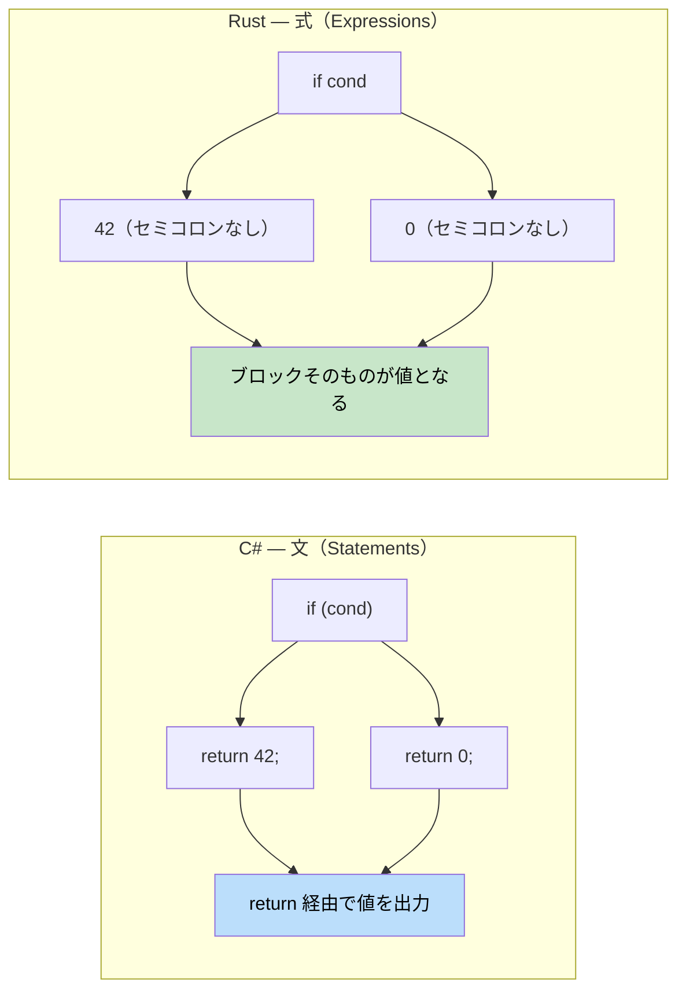

## 関数 vs メソッド

> **学習内容:** Rust と C# における関数とメソッド、式（expression）と文（statement）の決定的な違い、`if`/`match`/`loop`/`while`/`for` の構文、そして Rust の式指向設計が三項演算子を不要にする理由を学びます。
>
> **難易度:** 🟢 初級

### C# の関数宣言
```csharp
// C# - クラス内のメソッド
public class Calculator
{
    // インスタンスメソッド
    public int Add(int a, int b)
    {
        return a + b;
    }
    
    // 静的メソッド
    public static int Multiply(int a, int b)
    {
        return a * b;
    }
    
    // ref パラメータを持つメソッド
    public void Increment(ref int value)
    {
        value++;
    }
}
```

### Rust の関数宣言
```rust
// Rust - スタンドアロンの関数
fn add(a: i32, b: i32) -> i32 {
    a + b  // 最後の式には 'return' は不要
}

fn multiply(a: i32, b: i32) -> i32 {
    return a * b;  // 明示的な return を書いても問題ない
}

// 可変参照を受け取る関数
fn increment(value: &mut i32) {
    *value += 1;
}

fn main() {
    let result = add(5, 3);
    println!("5 + 3 = {}", result);
    
    let mut x = 10;
    increment(&mut x);
    println!("インクリメント後: {}", x);
}
```

### 式 vs 文（重要！）



```csharp
// C# - 文 vs 式
public int GetValue()
{
    if (condition)
    {
        return 42;  // 文
    }
    return 0;       // 文
}
```

```rust
// Rust - すべてが式になり得る
fn get_value(condition: bool) -> i32 {
    if condition {
        42  // 式（セミコロンなし）
    } else {
        0   // 式（セミコロンなし）
    }
    // if-else ブロック自体が値を返す式となる
}

// さらにシンプルに書く場合
fn get_value_ternary(condition: bool) -> i32 {
    if condition { 42 } else { 0 }
}
```

### 関数のパラメータと戻り値の型
```rust
// パラメータなし、戻り値なし（ユニット型 () を返す）
fn say_hello() {
    println!("こんにちは！");
}

// 複数のパラメータ
fn greet(name: &str, age: u32) {
    println!("{} は {} 歳です", name, age);
}

// タプルを使用した複数の戻り値
fn divide_and_remainder(dividend: i32, divisor: i32) -> (i32, i32) {
    (dividend / divisor, dividend % divisor)
}

fn main() {
    let (quotient, remainder) = divide_and_remainder(10, 3);
    println!("10 ÷ 3 = {} 余り {}", quotient, remainder);
}
```

***

## 制御フローの基本

### 条件分岐
```csharp
// C# の if 文
int x = 5;
if (x > 10)
{
    Console.WriteLine("大きな数値");
}
else if (x > 5)
{
    Console.WriteLine("中くらいの数値");
}
else
{
    Console.WriteLine("小さな数値");
}

// C# の三項演算子
string message = x > 10 ? "Big" : "Small";
```

```rust
// Rust の if 式
let x = 5;
if x > 10 {
    println!("大きな数値");
} else if x > 5 {
    println!("中くらいの数値");
} else {
    println!("小さな数値");
}

// 式としての if（三項演算子に相当）
let message = if x > 10 { "Big" } else { "Small" };

// 複数条件の式
let message = if x > 10 {
    "Big"
} else if x > 5 {
    "Medium"
} else {
    "Small"
};
```

### ループ
```csharp
// C# のループ
// For ループ
for (int i = 0; i < 5; i++)
{
    Console.WriteLine(i);
}

// Foreach ループ
var numbers = new[] { 1, 2, 3, 4, 5 };
foreach (var num in numbers)
{
    Console.WriteLine(num);
}

// While ループ
int count = 0;
while (count < 3)
{
    Console.WriteLine(count);
    count++;
}
```

```rust
// Rust のループ
// 範囲指定の for ループ
for i in 0..5 {  // 0 から 4 まで（終端を含まない）
    println!("{}", i);
}

// コレクションに対する反復処理
let numbers = vec![1, 2, 3, 4, 5];
for num in numbers {  // 所有権を取得する
    println!("{}", num);
}

// 参照に対する反復処理（こちらが一般的）
let numbers = vec![1, 2, 3, 4, 5];
for num in &numbers {  // 要素を借用する
    println!("{}", num);
}

// While ループ
let mut count = 0;
while count < 3 {
    println!("{}", count);
    count += 1;
}

// break を伴う無限ループ
let mut counter = 0;
loop {
    if counter >= 3 {
        break;
    }
    println!("{}", counter);
    counter += 1;
}
```

### ループ制御
```csharp
// C# のループ制御
for (int i = 0; i < 10; i++)
{
    if (i == 3) continue;
    if (i == 7) break;
    Console.WriteLine(i);
}
```

```rust
// Rust のループ制御
for i in 0..10 {
    if i == 3 { continue; }
    if i == 7 { break; }
    println!("{}", i);
}

// ルーフラベル（ネストされたループ用）
'outer: for i in 0..3 {
    'inner: for j in 0..3 {
        if i == 1 && j == 1 {
            break 'outer;  // 外側のループから脱出する
        }
        println!("i: {}, j: {}", i, j);
    }
}
```

***


<details>
<summary><strong>🏋️ 演習: 温度変換器</strong> (クリックして展開)</summary>

**課題**: この C# プログラムを慣用的な Rust に変換してください。式、パターンマッチング、適切なエラーハンドリングを活用しましょう。

```csharp
// C# — これを Rust に変換してください
public static double Convert(double value, string from, string to)
{
    double celsius = from switch
    {
        "F" => (value - 32.0) * 5.0 / 9.0,
        "K" => value - 273.15,
        "C" => value,
        _ => throw new ArgumentException($"Unknown unit: {from}")
    };
    return to switch
    {
        "F" => celsius * 9.0 / 5.0 + 32.0,
        "K" => celsius + 273.15,
        "C" => celsius,
        _ => throw new ArgumentException($"Unknown unit: {to}")
    };
}
```

<details>
<summary>🔑 解答</summary>

```rust
#[derive(Debug, Clone, Copy)]
enum TempUnit { Celsius, Fahrenheit, Kelvin }

fn parse_unit(s: &str) -> Result<TempUnit, String> {
    match s {
        "C" => Ok(TempUnit::Celsius),
        "F" => Ok(TempUnit::Fahrenheit),
        "K" => Ok(TempUnit::Kelvin),
        _   => Err(format!("Unknown unit: {s}")),
    }
}

fn convert(value: f64, from: TempUnit, to: TempUnit) -> f64 {
    let celsius = match from {
        TempUnit::Fahrenheit => (value - 32.0) * 5.0 / 9.0,
        TempUnit::Kelvin     => value - 273.15,
        TempUnit::Celsius    => value,
    };
    match to {
        TempUnit::Fahrenheit => celsius * 9.0 / 5.0 + 32.0,
        TempUnit::Kelvin     => celsius + 273.15,
        TempUnit::Celsius    => celsius,
    }
}

fn main() -> Result<(), String> {
    let from = parse_unit("F")?;
    let to   = parse_unit("C")?;
    println!("212°F = {:.1}°C", convert(212.0, from, to));
    Ok(())
}
```

**重要なポイント**:
- マジックストリングの代わりに列挙型（enum）を使用 — 網羅的マッチングにより、処理漏れの単位をコンパイル時に検知できる
- 例外の代わりに `Result<T, E>` を使用 — 呼び出し側がシグネチャから失敗の可能性を把握できる
- `match` は値を返す式である — `return` 文は不要

</details>
</details>
