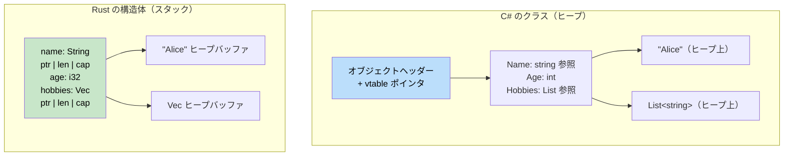

## タプルと分配束縛

> **学習内容:** Rust のタプル vs C# の `ValueTuple`、配列とスライス、構造体 vs クラス、ゼロコストの型安全性を実現するドメインモデリングのための Newtype パターン、そして分配束縛（デストラクチャリング）の構文を学びます。
>
> **難易度:** 🟢 初級

C# には（C# 7 以降）`ValueTuple` が導入されています。Rust のタプルも似ていますが、言語により深く統合されています。

### C# のタプル
```csharp
// C# ValueTuple (C# 7+)
var point = (10, 20);                         // (int, int)
var named = (X: 10, Y: 20);                   // 名前付き要素
Console.WriteLine($"{named.X}, {named.Y}");

// 戻り値の型としてのタプル
public (int Quotient, int Remainder) Divide(int a, int b)
{
    return (a / b, a % b);
}

var (q, r) = Divide(10, 3);    // 分解（Deconstruction）
Console.WriteLine($"{q} 余り {r}");

// 破棄（Discards）
var (_, remainder) = Divide(10, 3);  // 商を無視する
```

### Rust のタプル
```rust
// Rust のタプル — デフォルトで不変、名前付き要素はなし
let point = (10, 20);                // (i32, i32)
let point3d: (f64, f64, f64) = (1.0, 2.0, 3.0);

// インデックスによるアクセス（0始まり）
println!("x={}, y={}", point.0, point.1);

// 戻り値の型としてのタプル
fn divide(a: i32, b: i32) -> (i32, i32) {
    (a / b, a % b)
}

let (q, r) = divide(10, 3);       // 分配束縛（Destructuring）
println!("{q} 余り {r}");

// _ による破棄
let (_, remainder) = divide(10, 3);

// ユニット型 () — 「空のタプル」（C# の void に相当）
fn greet() {          // 暗黙の戻り値の型は ()
    println!("hi");
}
```

### 主な違い

| 機能 | C# `ValueTuple` | Rust のタプル |
|---------|-----------------|------------|
| 名前付き要素 | `(int X, int Y)` | 非対応 — 構造体を使用 |
| 最大要素数 | 約8（それ以上はネスト） | 無制限（実用的な制限は約12） |
| 比較 | 自動 | 12要素以下のタプルで自動 |
| 辞書のキーとしての使用 | 可能 | 可能（要素が `Hash` を実装している場合） |
| 関数からの戻り値 | 一般的 | 一般的 |
| 要素の可変性 | 常に可変 | `let mut` の場合のみ可変 |

### タプル構造体（Newtype）
```rust
// 単なるタプルでは表現力が不足している場合、タプル構造体を使用します:
struct Meters(f64);     // 単一フィールドの "newtype" ラッパー
struct Celsius(f64);
struct Fahrenheit(f64);

// コンパイラはこれらを「異なる型」として扱います:
let distance = Meters(100.0);
let temp = Celsius(36.6);
// distance == temp;  // ❌ エラー: Meters と Celsius は比較できません

// Newtype パターンは単位の混同によるバグをコンパイル時に防ぎます！
// C# で同様の安全性を得るには、完全な class や struct を定義する必要があります。
```

```csharp
// C# で同等のことを行うには、より多くのボイラープレートが必要です:
public readonly record struct Meters(double Value);
public readonly record struct Celsius(double Value);
// 相互に代入はできませんが、Rust のゼロコスト newtype と比較すると records にはオーバーヘッドが伴います
```

### Newtype パターンの詳細: ゼロコストでのドメインモデリング

Newtype は単位の混同を防ぐだけに留まりません。C# で一般的な「ガード節」や「バリデーションクラス」のパターンを置き換え、**ビジネスルールを型システムにエンコードする**ための Rust の主要な道具です。

#### C# のバリデーションアプローチ: 実行時ガード
```csharp
// C# — 検証は毎回実行時に行われる
public class UserService
{
    public User CreateUser(string email, int age)
    {
        if (string.IsNullOrWhiteSpace(email) || !email.Contains('@'))
            throw new ArgumentException("無効なメールアドレスです");
        if (age < 0 || age > 150)
            throw new ArgumentException("無効な年齢です");

        return new User { Email = email, Age = age };
    }

    public void SendEmail(string email)
    {
        // 再検証が必要 — それとも呼び出し元を信用する？
        if (!email.Contains('@')) throw new ArgumentException("無効なメールアドレスです");
        // ...
    }
}
```

#### Rust の Newtype アプローチ: コンパイル時の証明
```rust
/// 検証済みのメールアドレス — 型そのものが正当性の「証明」となります。
#[derive(Debug, Clone, PartialEq, Eq, Hash)]
pub struct Email(String);

impl Email {
    /// Email を作成する「唯一」の方法 — 生成時に一度だけ検証が行われます。
    pub fn new(raw: &str) -> Result<Self, &'static str> {
        if raw.contains('@') && raw.len() > 3 {
            Ok(Email(raw.to_lowercase()))
        } else {
            Err("無効なメールアドレス形式です")
        }
    }

    /// 内部の値への安全なアクセス
    pub fn as_str(&self) -> &str { &self.0 }
}

/// 検証済みの年齢 — 不正な値を作成することは不可能です。
#[derive(Debug, Clone, Copy, PartialEq, Eq, PartialOrd, Ord)]
pub struct Age(u8);

impl Age {
    pub fn new(raw: u8) -> Result<Self, &'static str> {
        if raw <= 150 { Ok(Age(raw)) } else { Err("年齢が範囲外です") }
    }
    pub fn value(&self) -> u8 { self.0 }
}

// 関数は「証明済みの型」を受け取る — 再検証は不要！
fn create_user(email: Email, age: Age) -> User {
    // email は正当であることが保証されている — これは型の不変条件です
    User { email, age }
}

fn send_email(to: &Email) {
    // 検証不要 — Email 型が正当性を証明している
    println!("送信先: {}", to.as_str());
}
```

#### C# 開発者のための一般的な Newtype の用途

| C# のパターン | Rust の Newtype | 防げる問題 |
|------------|-------------|------------------|
| UserId や Email などに `string` を使用 | `struct UserId(Uuid)` | 誤ったパラメータに誤った文字列を渡すミス |
| Port、Count、Index などに `int` を使用 | `struct Port(u16)` | Port と Count の取り違えを防止 |
| あらゆる場所でのガード節 | コンストラクタで1度だけ検証 | 再検証の重複、検証漏れ |
| USD、EUR などに `decimal` を使用 | `struct Usd(Decimal)` | 誤って USD と EUR を加算するバグ |
| 異なるセマンティクスに `TimeSpan` を使用 | `struct Timeout(Duration)` | 接続タイムアウトをリクエストタイムアウトとして渡すミス |

```rust
// ゼロコスト: Newtype は内部の型とまったく同じアセンブリにコンパイルされます。
// 以下の Rust コード:
struct UserId(u64);
fn lookup(id: UserId) -> Option<User> { /* ... */ }

// これは以下と「同じ」機械語コードを生成します:
fn lookup(id: u64) -> Option<User> { /* ... */ }
// それでありながら、コンパイル時の完全な型安全性が得られます！
```

***

## 配列とスライス

配列、スライス、ベクタの違いを理解することは非常に重要です。

### C# の配列
```csharp
// C# の配列
int[] numbers = new int[5];         // 固定サイズ、ヒープ割り当て
int[] initialized = { 1, 2, 3, 4, 5 }; // 配列リテラル

// アクセス
numbers[0] = 10;
int first = numbers[0];

// 長さ
int length = numbers.Length;

// パラメータとしての配列（参照型）
void ProcessArray(int[] array)
{
    array[0] = 99;  // 元の配列を変更する
}
```

### Rust の配列、スライス、ベクタ
```rust
// 1. 配列 - 固定サイズ、スタック割り当て
let numbers: [i32; 5] = [1, 2, 3, 4, 5];  // 型: [i32; 5]
let zeros = [0; 10];                       // 10個の0

// アクセス
let first = numbers[0];
// numbers[0] = 10;  // ❌ エラー: 配列はデフォルトで不変

let mut mut_array = [1, 2, 3, 4, 5];
mut_array[0] = 10;  // ✅ mut を付ければ動作する

// 2. スライス - 配列やベクタへのビュー（参照）
let slice: &[i32] = &numbers[1..4];  // 要素 1, 2, 3
let all_slice: &[i32] = &numbers;    // 配列全体をスライスとして参照

// 3. ベクタ - 動的サイズ、ヒープ割り当て
let mut vec = vec![1, 2, 3, 4, 5];
vec.push(6);  // 要素を追加して拡張可能
```

### 関数のパラメータとしてのスライス
```csharp
// C# - 配列のみを受け取るメソッド
public void ProcessNumbers(int[] numbers)
{
    for (int i = 0; i < numbers.Length; i++)
    {
        Console.WriteLine(numbers[i]);
    }
}

// 配列のみで動作する
ProcessNumbers(new int[] { 1, 2, 3 });
```

```rust
// Rust - 任意のシーケンスを受け取れる関数
fn process_numbers(numbers: &[i32]) {  // スライスパラメータ
    for (i, num) in numbers.iter().enumerate() {
        println!("インデックス {}: {}", i, num);
    }
}

fn main() {
    let array = [1, 2, 3, 4, 5];
    let vec = vec![1, 2, 3, 4, 5];
    
    // 同じ関数が配列にもベクタにも動作する！
    process_numbers(&array);      // 配列をスライスとして渡す
    process_numbers(&vec);        // ベクタをスライスとして渡す
    process_numbers(&vec[1..4]);  // 部分スライスを渡す
}
```

### 文字列スライス（&str）の再確認
```rust
// String と &str の関係
fn string_slice_example() {
    let owned = String::from("Hello, World!");
    let slice: &str = &owned[0..5];      // "Hello"
    let slice2: &str = &owned[7..];      // "World!"
    
    println!("{}", slice);   // "Hello"
    println!("{}", slice2);  // "World!"
    
    // 任意の文字列型を受け取る関数
    print_string("文字列リテラル");       // &str
    print_string(&owned);               // String を &str として渡す
    print_string(slice);                // &str スライス
}

fn print_string(s: &str) {
    println!("{}", s);
}
```

### 現代の C#: Span\<T\> と Inline Arrays

C# は従来の配列から進化してきました。`Span<T>` はスタック上に配置できる型安全な連続メモリビューを提供し、Inline Arrays（C# 12）は固定サイズのスタックバッファを提供します。

```csharp
// C# Span<T> - 連続したメモリへのビュー
Span<int> span = stackalloc int[] { 1, 2, 3, 4, 5 };
span[0] = 10;

ReadOnlySpan<char> text = "Hello".AsSpan();

// 任意の連続メモリビューを受け取るメソッド
void ProcessSpan(ReadOnlySpan<int> data)
{
    for (int i = 0; i < data.Length; i++)
        Console.WriteLine(data[i]);
}

// Inline Arrays (C# 12) - 固定サイズスタックバッファ
[InlineArray(5)]
struct IntBuffer
{
    private int _element;
}
```

```rust
// Rust &[T] / &mut [T] - 連続したメモリへの借用ビュー
let mut array = [1, 2, 3, 4, 5];
let slice: &mut [i32] = &mut array;
slice[0] = 10;

let slice: &[i32] = &array;
let text: &str = "Hello";

// 任意のシーケンシャルデータを受け取る関数
fn process_slice(data: &[i32]) {
    for (i, num) in data.iter().enumerate() {
        println!("インデックス {}: {}", i, num);
    }
}

// 固定長配列（スタック割り当て）
let buffer: [i32; 5] = [0; 5];
```

| C# | Rust |
|----|------|
| `Span<T>`（ref struct、スタック専用） | `&mut [T]` / `&[T]`（借用スライス） |
| `ReadOnlySpan<T>` | `&[T]`（不変スライス） |
| `ReadOnlySpan<char>` / `string.AsSpan()` | `&str`（文字列スライス） |
| `[InlineArray(N)]` struct (C# 12) | `[T; N]`（固定長配列） |
| `Span<T>` を伴う `stackalloc T[]` | `let arr: [T; N] = ...`（ローカル配列） |

> **重要な洞察:** Rust の `&[T]` は、C# における `ArraySegment<T>`、`Span<T>`、`ReadOnlySpan<T>` の役割を兼ね備えています。これは fat ポインタ（ポインタ + 長さ）であり、配列、ベクタ、部分スライスのすべてに対して機能します。C# の Inline Arrays は、デフォルトでスタック割り当てされる Rust の `[T; N]` 配列に自然に対応します。

***

## 構造体 vs クラス

Rust の構造体（struct）は C# のクラスに似ていますが、所有権やメソッドの扱いに関して重要な違いがあります。



> **重要な洞察**: C# のクラスは常に参照を介してヒープ上に配置されます。Rust の構造体はデフォルトでスタック上に配置され、動的サイズを持つデータ（`String` の内容など）のみがヒープに送られます。これにより、小さく頻繁に生成されるオブジェクトに対する GC オーバーヘッドが排除されます。

### C# のクラス定義
```csharp
// プロパティとメソッドを持つ C# クラス
public class Person
{
    public string Name { get; set; }
    public int Age { get; set; }
    public List<string> Hobbies { get; set; }
    
    public Person(string name, int age)
    {
        Name = name;
        Age = age;
        Hobbies = new List<string>();
    }
    
    public void AddHobby(string hobby)
    {
        Hobbies.Add(hobby);
    }
    
    public string GetInfo()
    {
        return $"{Name} is {Age} years old";
    }
}
```

### Rust の構造体定義
```rust
// 関連関数とメソッドを持つ Rust 構造体
#[derive(Debug)]  // Debug トレイトを自動実装
pub struct Person {
    pub name: String,    // パブリックフィールド
    pub age: u32,        // パブリックフィールド
    hobbies: Vec<String>, // プライベートフィールド（pub なし）
}

impl Person {
    // 関連関数（静的メソッドに相当）
    pub fn new(name: String, age: u32) -> Person {
        Person {
            name,
            age,
            hobbies: Vec::new(),
        }
    }
    
    // メソッド（&self, &mut self, または self を受け取る）
    pub fn add_hobby(&mut self, hobby: String) {
        self.hobbies.push(hobby);
    }
    
    // 不変借用するメソッド
    pub fn get_info(&self) -> String {
        format!("{} is {} years old", self.name, self.age)
    }
    
    // プライベートフィールドのゲッター
    pub fn hobbies(&self) -> &Vec<String> {
        &self.hobbies
    }
}
```

### インスタンスの生成と使用
```csharp
// C# でのオブジェクト生成と使用
var person = new Person("Alice", 30);
person.AddHobby("Reading");
person.AddHobby("Swimming");

Console.WriteLine(person.GetInfo());
Console.WriteLine($"趣味: {string.Join(", ", person.Hobbies)}");

// プロパティを直接変更
person.Age = 31;
```

```rust
// Rust での構造体生成と使用
let mut person = Person::new("Alice".to_string(), 30);
person.add_hobby("Reading".to_string());
person.add_hobby("Swimming".to_string());

println!("{}", person.get_info());
println!("趣味: {:?}", person.hobbies());

// パブリックフィールドを直接変更
person.age = 31;

// 構造体全体をデバッグ出力
println!("{:?}", person);
```

### 構造体の初期化パターン
```csharp
// C# のオブジェクト初期化子
var person = new Person("Bob", 25)
{
    Hobbies = new List<string> { "Gaming", "Coding" }
};

// 匿名型
var anonymous = new { Name = "Charlie", Age = 35 };
```

```rust
// Rust の構造体初期化
let person = Person {
    name: "Bob".to_string(),
    age: 25,
    hobbies: vec!["Gaming".to_string(), "Coding".to_string()],
};

// 構造体更新構文（オブジェクトスプレッドに類似）
let older_person = Person {
    age: 26,
    ..person  // person の残りのフィールドを使用（person はムーブされます！）
};

// タプル構造体
#[derive(Debug)]
struct Point(i32, i32);

let point = Point(10, 20);
println!("Point: ({}, {})", point.0, point.1);
```

***

## メソッドと関連関数

メソッドと関連関数の違いを理解することが重要です。

### C# のメソッド種別
```csharp
public class Calculator
{
    private int memory = 0;
    
    // インスタンスメソッド
    public int Add(int a, int b)
    {
        return a + b;
    }
    
    // 状態を使用するインスタンスメソッド
    public void StoreInMemory(int value)
    {
        memory = value;
    }
    
    // 静的メソッド
    public static int Multiply(int a, int b)
    {
        return a * b;
    }
    
    // 静的ファクトリメソッド
    public static Calculator CreateWithMemory(int initialMemory)
    {
        var calc = new Calculator();
        calc.memory = initialMemory;
        return calc;
    }
}
```

### Rust のメソッド種別
```rust
#[derive(Debug)]
pub struct Calculator {
    memory: i32,
}

impl Calculator {
    // 関連関数（静的メソッドに相当） - self パラメータなし
    pub fn new() -> Calculator {
        Calculator { memory: 0 }
    }
    
    // パラメータ付きの関連関数
    pub fn with_memory(initial_memory: i32) -> Calculator {
        Calculator { memory: initial_memory }
    }
    
    // 不変借用するメソッド (&self)
    pub fn add(&self, a: i32, b: i32) -> i32 {
        a + b
    }
    
    // 可変借用するメソッド (&mut self)
    pub fn store_in_memory(&mut self, value: i32) {
        self.memory = value;
    }
    
    // 所有権を取得するメソッド (self)
    pub fn into_memory(self) -> i32 {
        self.memory  // Calculator は消費（ムーブ）される
    }
    
    // ゲッターメソッド
    pub fn memory(&self) -> i32 {
        self.memory
    }
}

fn main() {
    // 関連関数は :: で呼び出す
    let mut calc = Calculator::new();
    let calc2 = Calculator::with_memory(42);
    
    // メソッドは . で呼び出す
    let result = calc.add(5, 3);
    calc.store_in_memory(result);
    
    println!("メモリ: {}", calc.memory());
    
    // インスタンスを消費するメソッド
    let memory_value = calc.into_memory();  // calc はこれ以降使用不可
    println!("最終メモリ値: {}", memory_value);
}
```

### メソッドレシーバの型の解説
```rust
impl Person {
    // &self - 不変借用（最も一般的）
    // データの読み取りのみが必要な場合に使用
    pub fn get_name(&self) -> &str {
        &self.name
    }
    
    // &mut self - 可変借用
    // データの変更が必要な場合に使用
    pub fn set_name(&mut self, name: String) {
        self.name = name;
    }
    
    // self - 所有権の取得（消費）（使用頻度は低め）
    // 構造体を消費（破棄・変換）したい場合に使用
    pub fn consume(self) -> String {
        self.name  // Person はムーブされ、以降アクセス不可
    }
}

fn method_examples() {
    let mut person = Person::new("Alice".to_string(), 30);
    
    // 不変借用
    let name = person.get_name();  // person はその後も使用可能
    println!("名前: {}", name);
    
    // 可変借用
    person.set_name("Alice Smith".to_string());  // person はその後も使用可能
    
    // 所有権の取得
    let final_name = person.consume();  // person はこれ以降使用不可
    println!("最終的な名前: {}", final_name);
}
```

---

## 演習問題

<details>
<summary><strong>🏋️ 演習: スライスの移動平均</strong> (クリックして展開)</summary>

**課題**: `f64` 値のスライスとウィンドウサイズを受け取り、移動平均の `Vec<f64>` を返す関数を作成してください。例えば、`[1.0, 2.0, 3.0, 4.0, 5.0]` に対してウィンドウサイズ 3 を指定すると、`[2.0, 3.0, 4.0]` が返されます。

```rust
fn rolling_average(data: &[f64], window: usize) -> Vec<f64> {
    // ここに実装を記述
    todo!()
}

fn main() {
    let data = vec![1.0, 2.0, 3.0, 4.0, 5.0];
    let avgs = rolling_average(&data, 3);
    println!("{avgs:?}"); // [2.0, 3.0, 4.0]
}
```

<details>
<summary>🔑 解答</summary>

```rust
fn rolling_average(data: &[f64], window: usize) -> Vec<f64> {
    data.windows(window)
        .map(|w| w.iter().sum::<f64>() / w.len() as f64)
        .collect()
}

fn main() {
    let data = vec![1.0, 2.0, 3.0, 4.0, 5.0];
    let avgs = rolling_average(&data, 3);
    assert_eq!(avgs, vec![2.0, 3.0, 4.0]);
    println!("{avgs:?}");
}
```

**重要なポイント**: スライスには `.windows()`、`.chunks()`、`.split()` といった強力な組み込みメソッドがあり、インデックスの手動計算が不要になります。C# では `Enumerable.Range` や LINQ の `.Skip().Take()` を使用するところです。

</details>
</details>

<details>
<summary><strong>🏋️ 演習: ミニ連絡先帳</strong> (クリックして展開)</summary>

構造体、列挙型、メソッドを使用して小さな連絡先帳を作成してください:

1. 列挙型 `PhoneType { Mobile, Home, Work }` を定義する
2. `name: String` と `phones: Vec<(PhoneType, String)>` を持つ構造体 `Contact` を定義する
3. `Contact::new(name: impl Into<String>) -> Self` を実装する
4. `Contact::add_phone(&mut self, kind: PhoneType, number: impl Into<String>)` を実装する
5. 携帯電話番号のみを返す `Contact::mobile_numbers(&self) -> Vec<&str>` を実装する
6. `main` で連絡先を作成し、2つの電話番号を追加して、携帯電話番号を出力する

<details>
<summary>🔑 解答</summary>

```rust
#[derive(Debug, PartialEq)]
enum PhoneType { Mobile, Home, Work }

#[derive(Debug)]
struct Contact {
    name: String,
    phones: Vec<(PhoneType, String)>,
}

impl Contact {
    fn new(name: impl Into<String>) -> Self {
        Contact { name: name.into(), phones: Vec::new() }
    }

    fn add_phone(&mut self, kind: PhoneType, number: impl Into<String>) {
        self.phones.push((kind, number.into()));
    }

    fn mobile_numbers(&self) -> Vec<&str> {
        self.phones
            .iter()
            .filter(|(kind, _)| *kind == PhoneType::Mobile)
            .map(|(_, num)| num.as_str())
            .collect()
    }
}

fn main() {
    let mut alice = Contact::new("Alice");
    alice.add_phone(PhoneType::Mobile, "+1-555-0100");
    alice.add_phone(PhoneType::Work, "+1-555-0200");
    alice.add_phone(PhoneType::Mobile, "+1-555-0101");

    println!("{} の携帯電話番号: {:?}", alice.name, alice.mobile_numbers());
}
```

</details>
</details>

***
