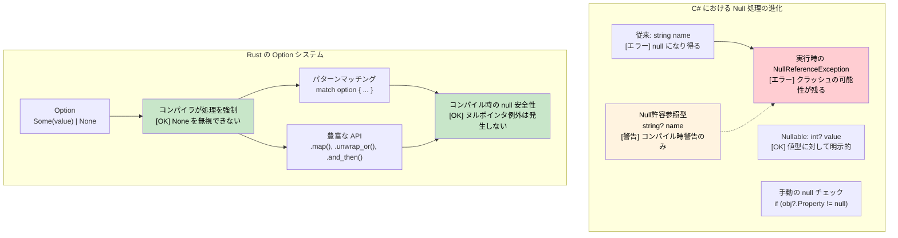

```mermaid
graph TD
    subgraph "C# のパターンマッチングの限界"
        CS_SWITCH["switch 式"]
        CS_WARNING["⚠️ コンパイラ警告のみ"]
        CS_COMPILE["✅ コンパイルは成功"]
        CS_RUNTIME["💥 ランタイム例外"]
        CS_DEPLOY["❌ 本番環境にバグが混入"]
        CS_SILENT["😰 enum変更時のサイレントな障害"]
        
        CS_SWITCH --> CS_WARNING
        CS_WARNING --> CS_COMPILE
        CS_COMPILE --> CS_RUNTIME
        CS_RUNTIME --> CS_DEPLOY
        CS_SWITCH --> CS_SILENT
    end
    
    subgraph "Rust の網羅的マッチング"
        RUST_MATCH["match 式"]
        RUST_ERROR["🛑 コンパイル失敗"]
        RUST_FIX["✅ すべてのケースの処理が必須"]
        RUST_SAFE["✅ 実行時の予期せぬ挙動はゼロ"]
        RUST_EVOLUTION["🔄 enum変更時にコンパイルエラー発生"]
        RUST_REFACTOR["🛠️ 強制的なリファクタリング"]
        
        RUST_MATCH --> RUST_ERROR
        RUST_ERROR --> RUST_FIX
        RUST_FIX --> RUST_SAFE
        RUST_MATCH --> RUST_EVOLUTION
        RUST_EVOLUTION --> RUST_REFACTOR
    end
    
    style CS_RUNTIME fill:#ffcdd2,color:#000
    style CS_DEPLOY fill:#ffcdd2,color:#000
    style CS_SILENT fill:#ffcdd2,color:#000
    style RUST_SAFE fill:#c8e6c9,color:#000
    style RUST_REFACTOR fill:#c8e6c9,color:#000
```

## 網羅的パターンマッチング：コンパイラの保証 vs ランタイムエラー

> **学習内容:** C# の `switch` 式がケースを見落とすことがあるのに対し、Rust の `match` はコンパイル時にそれを検出する理由、null安全のための `Option<T>` と `Nullable<T>` の比較、そして `Result<T, E>` を使ったカスタムエラー型について学びます。
>
> **難易度:** 🟡 中級

### C# の Switch 式 - まだ不完全
```csharp
// C# の switch 式は網羅的に見えますが、保証されていません
public enum HttpStatus { Ok, NotFound, ServerError, Unauthorized }

public string HandleResponse(HttpStatus status) => status switch
{
    HttpStatus.Ok => "Success",
    HttpStatus.NotFound => "Resource not found",
    HttpStatus.ServerError => "Internal error",
    // Unauthorized のケースが不足 — 警告 CS8524 が出ますが、エラーにはなりません！
    // 実行時: status が Unauthorized の場合は SwitchExpressionException がスローされます
};

// null 許容警告があっても、これはコンパイルが通ってしまいます:
public class User 
{
    public string Name { get; set; }
    public bool IsActive { get; set; }
}

public string ProcessUser(User? user) => user switch
{
    { IsActive: true } => $"Active: {user.Name}",
    { IsActive: false } => $"Inactive: {user.Name}",
    // null のケースが不足 — コンパイラ警告 CS8655 が出ますが、エラーにはなりません！
    // 実行時: user が null の場合に SwitchExpressionException がスローされます
};
```

```csharp
// 後から enum のバリアントを追加しても、既存の switch のコンパイルは壊れません
public enum HttpStatus 
{ 
    Ok, 
    NotFound, 
    ServerError, 
    Unauthorized,
    Forbidden  // これを追加すると別の CS8524 警告が出ますが、コンパイルは成功してしまいます！
}
```

### Rust のパターンマッチング - 真の網羅性
```rust
#[derive(Debug)]
enum HttpStatus {
    Ok,
    NotFound, 
    ServerError,
    Unauthorized,
}

fn handle_response(status: HttpStatus) -> &'static str {
    match status {
        HttpStatus::Ok => "Success",
        HttpStatus::NotFound => "Resource not found", 
        HttpStatus::ServerError => "Internal error",
        HttpStatus::Unauthorized => "Authentication required",
        // いずれかのケースが不足しているとコンパイルエラー！
        // これは文字通りコンパイルすら通りません
    }
}

// 新しいバリアントを追加すると、それが使われているすべての箇所でコンパイルが失敗します
#[derive(Debug)]
enum HttpStatus {
    Ok,
    NotFound,
    ServerError, 
    Unauthorized,
    Forbidden,  // これを追加すると handle_response() のコンパイルが失敗します
}
// コンパイラはすべてのケースを処理することを強制します

// Option<T> のパターンマッチングも網羅的です
fn process_optional_value(value: Option<i32>) -> String {
    match value {
        Some(n) => format!("Got value: {}", n),
        None => "No value".to_string(),
        // いずれかのケースを忘れるとコンパイルエラーになります
    }
}
```



***

## Null安全性：`Nullable<T>` vs `Option<T>`

### C# における Null 処理の進化
```csharp
// C# - 従来の null 処理（エラーが発生しやすい）
public class User
{
    public string Name { get; set; }  // null になり得る！
    public string Email { get; set; } // null になり得る！
}

public string GetUserDisplayName(User user)
{
    if (user?.Name != null)  // null 条件演算子
    {
        return user.Name;
    }
    return "Unknown User";
}
```

```csharp
// C# 8以降の Null 許容参照型
public class User
{
    public string Name { get; set; }    // 非 null 許容
    public string? Email { get; set; }  // 明示的に null 許容
}

// 値型に対する C# の Nullable<T>
int? maybeNumber = GetNumber();
if (maybeNumber.HasValue)
{
    Console.WriteLine(maybeNumber.Value);
}
```

### Rust の `Option<T>` システム
```rust
// Rust - Option<T> による明示的な null 処理
#[derive(Debug)]
pub struct User {
    name: String,           // 決して null にならない
    email: Option<String>,  // 明示的にオプショナル
}

impl User {
    pub fn get_display_name(&self) -> &str {
        &self.name  // null チェックは不要 - 存在することが保証されている
    }
    
    pub fn get_email_or_default(&self) -> String {
        self.email
            .as_ref()
            .map(|e| e.clone())
            .unwrap_or_else(|| "no-email@example.com".to_string())
    }
}

// パターンマッチングにより None ケースの処理が強制される
fn handle_optional_user(user: Option<User>) {
    match user {
        Some(u) => println!("User: {}", u.get_display_name()),
        None => println!("No user found"),
        // None ケースが処理されていない場合はコンパイルエラー！
    }
}
```



***

```rust
#[derive(Debug)]
struct Point {
    x: i32,
    y: i32,
}

fn describe_point(point: Point) -> String {
    match point {
        Point { x: 0, y: 0 } => "origin".to_string(),
        Point { x: 0, y } => format!("on y-axis at y={}", y),
        Point { x, y: 0 } => format!("on x-axis at x={}", x),
        Point { x, y } if x == y => format!("on diagonal at ({}, {})", x, y),
        Point { x, y } => format!("point at ({}, {})", x, y),
    }
}
```

### Option 型と Result 型
```csharp
// C# の null 許容参照型 (C# 8+)
public class PersonService
{
    private Dictionary<int, string> people = new();
    
    public string? FindPerson(int id)
    {
        return people.TryGetValue(id, out string? name) ? name : null;
    }
    
    public string GetPersonOrDefault(int id)
    {
        return FindPerson(id) ?? "Unknown";
    }
    
    // 例外ベースのエラーハンドリング
    public void SavePerson(int id, string name)
    {
        if (string.IsNullOrEmpty(name))
            throw new ArgumentException("Name cannot be empty");
        
        people[id] = name;
    }
}
```

```rust
use std::collections::HashMap;

// Rust では null の代わりに Option<T> を使用
struct PersonService {
    people: HashMap<i32, String>,
}

impl PersonService {
    fn new() -> Self {
        PersonService {
            people: HashMap::new(),
        }
    }
    
    // Option<T> を返す - null は存在しない！
    fn find_person(&self, id: i32) -> Option<&String> {
        self.people.get(&id)
    }
    
    // Option に対するパターンマッチング
    fn get_person_or_default(&self, id: i32) -> String {
        match self.find_person(id) {
            Some(name) => name.clone(),
            None => "Unknown".to_string(),
        }
    }
    
    // Option のメソッドを使用（より関数型のスタイル）
    fn get_person_or_default_functional(&self, id: i32) -> String {
        self.find_person(id)
            .map(|name| name.clone())
            .unwrap_or_else(|| "Unknown".to_string())
    }
    
    // エラーハンドリングのための Result<T, E>
    fn save_person(&mut self, id: i32, name: String) -> Result<(), String> {
        if name.is_empty() {
            return Err("Name cannot be empty".to_string());
        }
        
        self.people.insert(id, name);
        Ok(())
    }
    
    // 操作のチェーン
    fn get_person_length(&self, id: i32) -> Option<usize> {
        self.find_person(id).map(|name| name.len())
    }
}

fn main() {
    let mut service = PersonService::new();
    
    // Result を処理
    match service.save_person(1, "Alice".to_string()) {
        Ok(()) => println!("Person saved successfully"),
        Err(error) => println!("Error: {}", error),
    }
    
    // Option を処理
    match service.find_person(1) {
        Some(name) => println!("Found: {}", name),
        None => println!("Person not found"),
    }
    
    // Option を使った関数型スタイル
    let name_length = service.get_person_length(1)
        .unwrap_or(0);
    println!("Name length: {}", name_length);
    
    // 早期リターンのための ? 演算子
    fn try_operation(service: &mut PersonService) -> Result<String, String> {
        service.save_person(2, "Bob".to_string())?; // エラーの場合は早期リターン
        let name = service.find_person(2).ok_or("Person not found")?; // Option を Result に変換
        Ok(format!("Hello, {}", name))
    }
    
    match try_operation(&mut service) {
        Ok(message) => println!("{}", message),
        Err(error) => println!("Operation failed: {}", error),
    }
}
```

### カスタムエラー型
```rust
// カスタムエラー enum の定義
#[derive(Debug)]
enum PersonError {
    NotFound(i32),
    InvalidName(String),
    DatabaseError(String),
}

impl std::fmt::Display for PersonError {
    fn fmt(&self, f: &mut std::fmt::Formatter<'_>) -> std::fmt::Result {
        match self {
            PersonError::NotFound(id) => write!(f, "Person with ID {} not found", id),
            PersonError::InvalidName(name) => write!(f, "Invalid name: '{}'", name),
            PersonError::DatabaseError(msg) => write!(f, "Database error: {}", msg),
        }
    }
}

impl std::error::Error for PersonError {}

// カスタムエラーを備えた強化版 PersonService
impl PersonService {
    fn save_person_enhanced(&mut self, id: i32, name: String) -> Result<(), PersonError> {
        if name.is_empty() || name.len() > 50 {
            return Err(PersonError::InvalidName(name));
        }
        
        // 失敗する可能性のあるデータベース操作のシミュレーション
        if id < 0 {
            return Err(PersonError::DatabaseError("Negative IDs not allowed".to_string()));
        }
        
        self.people.insert(id, name);
        Ok(())
    }
    
    fn find_person_enhanced(&self, id: i32) -> Result<&String, PersonError> {
        self.people.get(&id).ok_or(PersonError::NotFound(id))
    }
}

fn demo_error_handling() {
    let mut service = PersonService::new();
    
    // さまざまなエラー型を処理
    match service.save_person_enhanced(-1, "Invalid".to_string()) {
        Ok(()) => println!("Success"),
        Err(PersonError::NotFound(id)) => println!("Not found: {}", id),
        Err(PersonError::InvalidName(name)) => println!("Invalid name: {}", name),
        Err(PersonError::DatabaseError(msg)) => println!("DB Error: {}", msg),
    }
}
```

---

## 演習

<details>
<summary><strong>🏋️ 演習: Option コンビネータ</strong> (クリックして展開)</summary>

`Option` コンビネータ（`and_then`、`map`、`unwrap_or`）を使って、深くネストされた以下の C# の null チェックコードを Rust で書き換えてください：

```csharp
string GetCityName(User? user)
{
    if (user != null)
        if (user.Address != null)
            if (user.Address.City != null)
                return user.Address.City.ToUpper();
    return "UNKNOWN";
}
```

次の Rust 型を使用してください：
```rust
struct User { address: Option<Address> }
struct Address { city: Option<String> }
```

`if let` や `match` を使わず、**単一の式**として記述してください。

<details>
<summary>🔑 解答例</summary>

```rust
struct User { address: Option<Address> }
struct Address { city: Option<String> }

fn get_city_name(user: Option<&User>) -> String {
    user.and_then(|u| u.address.as_ref())
        .and_then(|a| a.city.as_ref())
        .map(|c| c.to_uppercase())
        .unwrap_or_else(|| "UNKNOWN".to_string())
}

fn main() {
    let user = User {
        address: Some(Address { city: Some("seattle".to_string()) }),
    };
    assert_eq!(get_city_name(Some(&user)), "SEATTLE");
    assert_eq!(get_city_name(None), "UNKNOWN");

    let no_city = User { address: Some(Address { city: None }) };
    assert_eq!(get_city_name(Some(&no_city)), "UNKNOWN");
}
```

**重要なポイント**: `and_then` は `Option` に対する Rust の `?.` 演算子に相当します。各ステップで `Option` を返し、`None` の時点でチェーンが短絡（ショートサーキット）します。これは C# の null 条件演算子 `?.` と全く同様に動作しますが、明示的かつ型安全です。

</details>
</details>

***
