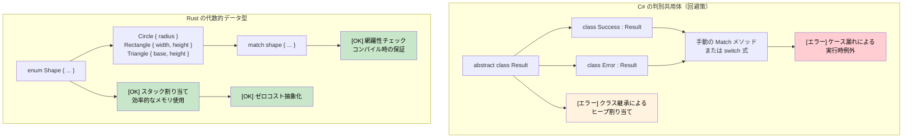

## 代数的データ型 vs C# の直和型

> **学習内容:** Rust の代数的データ型（データを持つ enum）vs C# の限定的な判別共用体（直和型）、網羅的チェックを備えた `match` 式、ガード節、そしてネストしたパターンの分解（分配束縛）について学びます。
>
> **難易度:** 🟡 中級

### C# の判別共用体（制限付き）
```csharp
// C# - 継承を用いた限定的な直和型サポート
public abstract class Result
{
    public abstract T Match<T>(Func<Success, T> onSuccess, Func<Error, T> onError);
}

public class Success : Result
{
    public string Value { get; }
    public Success(string value) => Value = value;
    
    public override T Match<T>(Func<Success, T> onSuccess, Func<Error, T> onError)
        => onSuccess(this);
}

public class Error : Result
{
    public string Message { get; }
    public Error(string message) => Message = message;
    
    public override T Match<T>(Func<Success, T> onSuccess, Func<Error, T> onError)
        => onError(this);
}

// C# 9+ のレコードとパターンマッチング（改善版）
public abstract record Shape;
public record Circle(double Radius) : Shape;
public record Rectangle(double Width, double Height) : Shape;

public static double Area(Shape shape) => shape switch
{
    Circle(var radius) => Math.PI * radius * radius,
    Rectangle(var width, var height) => width * height,
    _ => throw new ArgumentException("Unknown shape")  // [エラー] 実行時エラーの可能性あり
};
```

### Rust の代数的データ型（列挙型）
```rust
// Rust - 網羅的なパターンマッチングを備えた真の代数的データ型
#[derive(Debug, Clone)]
pub enum Result<T, E> {
    Ok(T),
    Err(E),
}

#[derive(Debug, Clone)]
pub enum Shape {
    Circle { radius: f64 },
    Rectangle { width: f64, height: f64 },
    Triangle { base: f64, height: f64 },
}

impl Shape {
    pub fn area(&self) -> f64 {
        match self {
            Shape::Circle { radius } => std::f64::consts::PI * radius * radius,
            Shape::Rectangle { width, height } => width * height,
            Shape::Triangle { base, height } => 0.5 * base * height,
            // [OK] バリアントの漏れがあればコンパイラエラー！
        }
    }
}

// 応用: 列挙型は異なる型を保持可能
#[derive(Debug)]
pub enum Value {
    Integer(i64),
    Float(f64),
    Text(String),
    Boolean(bool),
    List(Vec<Value>),  // 再帰型！
}

impl Value {
    pub fn type_name(&self) -> &'static str {
        match self {
            Value::Integer(_) => "integer",
            Value::Float(_) => "float",
            Value::Text(_) => "text",
            Value::Boolean(_) => "boolean",
            Value::List(_) => "list",
        }
    }
}
```



***

## 列挙型とパターンマッチング

Rust の列挙型（enum）は C# の enum よりはるかに強力です — データを保持でき、型安全なプログラミングの基礎となります。

### C# の enum の制限事項
```csharp
// C# enum - 単なる名前付き定数
public enum Status
{
    Pending,
    Approved,
    Rejected
}

// バッキング値を持つ C# enum
public enum HttpStatusCode
{
    OK = 200,
    NotFound = 404,
    InternalServerError = 500
}

// 複雑なデータには個別のクラスが必要
public abstract class Result
{
    public abstract bool IsSuccess { get; }
}

public class Success : Result
{
    public string Value { get; }
    public override bool IsSuccess => true;
    
    public Success(string value)
    {
        Value = value;
    }
}

public class Error : Result
{
    public string Message { get; }
    public override bool IsSuccess => false;
    
    public Error(string message)
    {
        Message = message;
    }
}
```

### Rust の enum の真価
```rust
// 単純な enum（C# の enum に類似）
#[derive(Debug, PartialEq)]
enum Status {
    Pending,
    Approved,
    Rejected,
}

// データを持つ enum（ここが Rust の真骨頂！）
#[derive(Debug)]
enum Result<T, E> {
    Ok(T),      // 型 T の値を保持する成功バリアント
    Err(E),     // 型 E のエラーを保持するエラーバリアント
}

// 異なるデータ型を持つ複雑な enum
#[derive(Debug)]
enum Message {
    Quit,                       // データなし
    Move { x: i32, y: i32 },   // 構造体風のバリアント
    Write(String),             // タプル風のバリアント
    ChangeColor(i32, i32, i32), // 複数の値
}

// 実世界の例: HTTP レスポンス
#[derive(Debug)]
enum HttpResponse {
    Ok { body: String, headers: Vec<String> },
    NotFound { path: String },
    InternalError { message: String, code: u16 },
    Redirect { location: String },
}
```

### Match によるパターンマッチング
```csharp
// C# switch 文（機能制限あり）
public string HandleStatus(Status status)
{
    switch (status)
    {
        case Status.Pending:
            return "Waiting for approval";
        case Status.Approved:
            return "Request approved";
        case Status.Rejected:
            return "Request rejected";
        default:
            return "Unknown status"; // 常に default が必要
    }
}

// C# パターンマッチング（C# 8+）
public string HandleResult(Result result)
{
    return result switch
    {
        Success success => $"Success: {success.Value}",
        Error error => $"Error: {error.Message}",
        _ => "Unknown result" // やはりキャッチオールが必要
    };
}
```

```rust
// Rust の match - 網羅的で強力
fn handle_status(status: Status) -> String {
    match status {
        Status::Pending => "Waiting for approval".to_string(),
        Status::Approved => "Request approved".to_string(),
        Status::Rejected => "Request rejected".to_string(),
        // default は不要 — コンパイラが網羅性を保証
    }
}

// データ抽出を伴うパターンマッチング
fn handle_result<T, E>(result: Result<T, E>) -> String 
where 
    T: std::fmt::Debug,
    E: std::fmt::Debug,
{
    match result {
        Result::Ok(value) => format!("Success: {:?}", value),
        Result::Err(error) => format!("Error: {:?}", error),
        // 網羅的 — default は不要
    }
}

// 複雑なパターンマッチング
fn handle_message(msg: Message) -> String {
    match msg {
        Message::Quit => "Goodbye!".to_string(),
        Message::Move { x, y } => format!("Move to ({}, {})", x, y),
        Message::Write(text) => format!("Write: {}", text),
        Message::ChangeColor(r, g, b) => format!("Change color to RGB({}, {}, {})", r, g, b),
    }
}

// HTTP レスポンスの処理
fn handle_http_response(response: HttpResponse) -> String {
    match response {
        HttpResponse::Ok { body, headers } => {
            format!("Success! Body: {}, Headers: {:?}", body, headers)
        },
        HttpResponse::NotFound { path } => {
            format!("404: Path '{}' not found", path)
        },
        HttpResponse::InternalError { message, code } => {
            format!("Error {}: {}", code, message)
        },
        HttpResponse::Redirect { location } => {
            format!("Redirect to: {}", location)
        },
    }
}
```

### ガードと高度なパターン
```rust
// ガード付きパターンマッチング
fn describe_number(x: i32) -> String {
    match x {
        n if n < 0 => "negative".to_string(),
        0 => "zero".to_string(),
        n if n < 10 => "single digit".to_string(),
        n if n < 100 => "double digit".to_string(),
        _ => "large number".to_string(),
    }
}

// 範囲マッチング
fn describe_age(age: u32) -> String {
    match age {
        0..=12 => "child".to_string(),
        13..=19 => "teenager".to_string(),
        20..=64 => "adult".to_string(),
        65.. => "senior".to_string(),
    }
}

// 構造体やタプルの分配束縛
```

<details>
<summary><strong>🏋️ 演習: コマンドパーサー</strong> (クリックして展開)</summary>

**課題**: Rust の enum を使用して CLI コマンドシステムをモデル化してください。文字列入力を `Command` 列挙型にパースし、各バリアントを実行します。未知のコマンドは適切なエラーハンドリングで処理してください。

```rust
// スターターコード — 空欄を埋めてください
#[derive(Debug)]
enum Command {
    // TODO: Quit, Echo(String), Move { x: i32, y: i32 }, Count(u32) の各バリアントを追加
}

fn parse_command(input: &str) -> Result<Command, String> {
    let parts: Vec<&str> = input.splitn(2, ' ').collect();
    // TODO: parts[0] でマッチングを行い引数をパースする
    todo!()
}

fn execute(cmd: &Command) -> String {
    // TODO: 各バリアントにマッチングして説明文字列を返す
    todo!()
}
```

<details>
<summary>🔑 解答</summary>

```rust
#[derive(Debug)]
enum Command {
    Quit,
    Echo(String),
    Move { x: i32, y: i32 },
    Count(u32),
}

fn parse_command(input: &str) -> Result<Command, String> {
    let parts: Vec<&str> = input.splitn(2, ' ').collect();
    match parts[0] {
        "quit" => Ok(Command::Quit),
        "echo" => {
            let msg = parts.get(1).unwrap_or(&"").to_string();
            Ok(Command::Echo(msg))
        }
        "move" => {
            let args = parts.get(1).ok_or("move には 'x y' が必要です")?;
            let coords: Vec<&str> = args.split_whitespace().collect();
            let x = coords.get(0).ok_or("x が不足しています")?.parse::<i32>().map_err(|e| e.to_string())?;
            let y = coords.get(1).ok_or("y が不足しています")?.parse::<i32>().map_err(|e| e.to_string())?;
            Ok(Command::Move { x, y })
        }
        "count" => {
            let n = parts.get(1).ok_or("count には数値が必要です")?
                .parse::<u32>().map_err(|e| e.to_string())?;
            Ok(Command::Count(n))
        }
        other => Err(format!("未知のコマンド: {other}")),
    }
}

fn execute(cmd: &Command) -> String {
    match cmd {
        Command::Quit           => "さようなら！".to_string(),
        Command::Echo(msg)      => msg.clone(),
        Command::Move { x, y }  => format!("({x}, {y}) へ移動中"),
        Command::Count(n)       => format!("{n} までカウントしました"),
    }
}
```

**重要なポイント**:
- 各 enum バリアントは異なるデータを保持できる — クラス階層は不要
- `match` はすべてのバリアントの処理を強制するため、考慮漏れを防げる
- `?` 演算子によりエラー伝播をすっきりとチェーンできる — ネストした try-catch は不要

</details>
</details>
