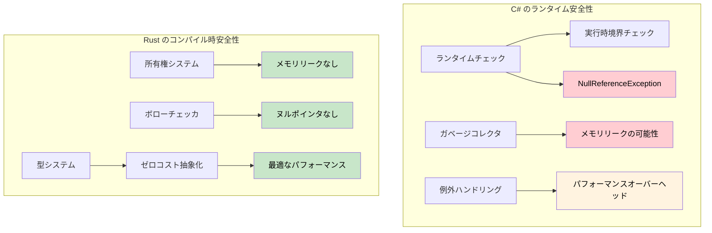

## 参照 vs ポインタ

> **学習内容:** Rust の参照と C# のポインタおよび unsafe コンテキストの比較、ライフタイムの基礎、そしてコンパイル時の安全性証明がなぜ C# のランタイムチェック（境界チェック、null ガード）よりも強力なのかを学びます。
>
> **難易度:** 🟡 中級

### C# のポインタ（unsafe コンテキスト）
```csharp
// C# の unsafe ポインタ（滅多に使われない）
unsafe void UnsafeExample()
{
    int value = 42;
    int* ptr = &value;  // 値へのポインタ
    *ptr = 100;         // 参照を外して（デリファレンスして）変更
    Console.WriteLine(value);  // 100
}
```

### Rust の参照（デフォルトで安全）
```rust
// Rust の参照（常に安全）
fn safe_example() {
    let mut value = 42;
    let ptr = &mut value;  // 可変参照
    *ptr = 100;           // 参照を外して（デリファレンスして）変更
    println!("{}", value); // 100
}

// "unsafe" キーワードは不要 - ボローチェッカが安全性を保証する
```

### C# 開発者のためのライフタイムの基礎
```csharp
// C# - 無効になる可能性のある参照を返すことができてしまう
public class LifetimeIssues
{
    public string GetFirstWord(string input)
    {
        return input.Split(' ')[0];  // 新しい文字列を返す（安全）
    }
    
    public unsafe char* GetFirstChar(string input)
    {
        // これは危険 — マネージドメモリへのポインタを返している
        fixed (char* ptr = input)
            return ptr;  // ❌ 危険: メソッド終了後に ptr は無効になる
    }
}
```

```rust
// Rust - ライフタイムチェックによりダングリング参照を防止
fn get_first_word(input: &str) -> &str {
    input.split_whitespace().next().unwrap_or("")
    // ✅ 安全: 返される参照は input と同じライフタイムを持つ
}

fn invalid_reference() -> &str {
    let temp = String::from("hello");
    &temp  // ❌ コンパイルエラー: temp の生存期間が短すぎる
    // temp は関数の最後でドロップされてしまう
}

fn valid_reference() -> String {
    let temp = String::from("hello");
    temp  // ✅ 動作する: 所有権が呼び出し側にムーブされる
}
```

***

## メモリ安全性：ランタイムチェック vs コンパイル時証明

### C# - ランタイムのセーフティネット
```csharp
// C# はランタイムチェックと GC に依存している
public class Buffer
{
    private byte[] data;
    
    public Buffer(int size)
    {
        data = new byte[size];
    }
    
    public void ProcessData(int index)
    {
        // 実行時の境界チェック
        if (index >= data.Length)
            throw new IndexOutOfRangeException();
            
        data[index] = 42;  // 安全だが、実行時にチェックされる
    }
    
    // イベントや静的参照によるメモリリークは依然として起こり得る
    public static event Action<string> GlobalEvent;
    
    public void Subscribe()
    {
        GlobalEvent += HandleEvent;  // メモリリークを引き起こす可能性がある
        // 購読解除を忘れた場合 - オブジェクトは回収されない
    }
    
    private void HandleEvent(string message) { /* ... */ }
    
    // NullReferenceException は依然として発生し得る
    public void ProcessUser(User user)
    {
        Console.WriteLine(user.Name.ToUpper());  // user.Name が null の場合 NullReferenceException
    }
    
    // 配列アクセスが実行時に失敗する可能性がある
    public int GetValue(int[] array, int index)
    {
        return array[index];  // IndexOutOfRangeException の可能性がある
    }
}
```

### Rust - コンパイル時の保証
```rust
struct Buffer {
    data: Vec<u8>,
}

impl Buffer {
    fn new(size: usize) -> Self {
        Buffer {
            data: vec![0; size],
        }
    }
    
    fn process_data(&mut self, index: usize) {
        // 境界チェックは、安全性が証明されればコンパイラによって最適化で削除可能
        if let Some(item) = self.data.get_mut(index) {
            *item = 42;  // 安全なアクセス、コンパイル時に証明される
        }
        // または明示的な境界チェックを伴うインデックスアクセスを使用:
        // self.data[index] = 42;  // デバッグ時はパニックするが、メモリ安全
    }
    
    // メモリリークは起こり得ない - 所有権システムがそれを防ぐ
    fn process_with_closure<F>(&mut self, processor: F) 
    where F: FnOnce(&mut Vec<u8>)
    {
        processor(&mut self.data);
        // processor がスコープを抜けると、自動的にクリーンアップされる
        // ダングリング参照やメモリリークを作成する方法はない
    }
    
    // ヌルポインタのデリファレンスは不可能 - ヌルポインタが存在しない！
    fn process_user(&self, user: &User) {
        println!("{}", user.name.to_uppercase());  // user.name が null になることはない
    }
    
    // 配列アクセスは境界チェックされるか、明示的に unsafe である
    fn get_value(array: &[i32], index: usize) -> Option<i32> {
        array.get(index).copied()  // 範囲外の場合は None を返す
    }
    
    // 確信がある場合は明示的に unsafe を使用:
    /// # Safety
    /// `index` は `array.len()` 未満でなければならない。
    unsafe fn get_value_unchecked(array: &[i32], index: usize) -> i32 {
        *array.get_unchecked(index)  // 高速だが手動で境界を証明する必要がある
    }
}

struct User {
    name: String,  // Rust では String が null になることはない
}

// 所有権により解放後使用（use-after-free）を防ぐ
fn ownership_example() {
    let data = vec![1, 2, 3, 4, 5];
    let reference = &data[0];  // データを借用
    
    // drop(data);  // エラー: 借用されている間はドロップできない
    println!("{}", reference);  // これは安全であることが保証されている
}

// 借用によりデータ競合を防ぐ
fn borrowing_example(data: &mut Vec<i32>) {
    let first = &data[0];  // 不変の借用
    // data.push(6);  // エラー: 不変借用中に可変で借用することはできない
    println!("{}", first);  // データ競合がないことが保証されている
}
```



---

## 演習

<details>
<summary><strong>🏋️ 演習: 安全性のバグを見つける</strong> (クリックして展開)</summary>

この C# コードには微妙な安全性のバグがあります。それを特定し、同等の Rust コードを書いて、なぜ Rust 版が**コンパイルできない**のかを説明してください：

```csharp
public List<int> GetEvenNumbers(List<int> numbers)
{
    var result = new List<int>();
    foreach (var n in numbers)
    {
        if (n % 2 == 0)
        {
            result.Add(n);
            numbers.Remove(n);  // バグ: イテレーション中にコレクションを変更している
        }
    }
    return result;
}
```

<details>
<summary>🔑 解答例</summary>

**C# のバグ**: イテレーション中に `numbers` を変更すると、*実行時*に `InvalidOperationException` がスローされます。コードレビューで見落とされがちです。

```rust
fn get_even_numbers(numbers: &mut Vec<i32>) -> Vec<i32> {
    let mut result = Vec::new();
    for &n in numbers.iter() {
        if n % 2 == 0 {
            result.push(n);
            // numbers.retain(|&x| x != n);
            // ❌ エラー: *numbers はイテレータによって不変借用されているため、
            //    可変として借用することはできない
        }
    }
    result
}

// イディオマティックな Rust: partition または retain を使用する
fn get_even_numbers_idiomatic(numbers: &mut Vec<i32>) -> Vec<i32> {
    let evens: Vec<i32> = numbers.iter().copied().filter(|n| n % 2 == 0).collect();
    numbers.retain(|n| n % 2 != 0); // イテレーション後に偶数を削除
    evens
}

fn main() {
    let mut nums = vec![1, 2, 3, 4, 5, 6];
    let evens = get_even_numbers_idiomatic(&mut nums);
    assert_eq!(evens, vec![2, 4, 6]);
    assert_eq!(nums, vec![1, 3, 5]);
}
```

**重要なポイント**: Rust のボローチェッカは、「イテレーション中の変更」というバグの*カテゴリ全体*をコンパイル時に防止します。C# はこれを実行時に検出しますが、多くの言語では全く検出されません。

</details>
</details>

***
