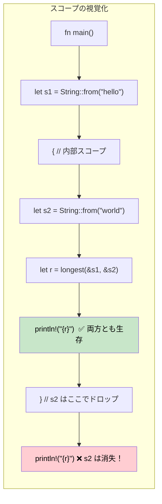

## ライフタイム：参照の生存期間をコンパイラに伝える

> **学習内容:** ライフタイムが存在する理由（GCがないためコンパイラは証明を必要とする）、ライフタイム注釈の構文、省略規則（エリジョンルール）、構造体のライフタイム、`'static` ライフタイム、そしてよくあるボローチェッカのエラーとその修正方法を学びます。
>
> **難易度:** 🔴 上級

C# 開発者は参照のライフタイムを意識することがありません — ガベージコレクタが到達可能性を管理してくれるからです。Rust では、すべての参照が使用されている間ずっと有効であることをコンパイラが*証明*できなければなりません。ライフタイムはその証明を行うための仕組みです。

### ライフタイムが存在する理由
```rust
// これはコンパイルできません — コンパイラが戻り値の参照が有効であることを証明できないためです
fn longest(a: &str, b: &str) -> &str {
    if a.len() > b.len() { a } else { b }
}
// エラー: ライフタイム指定子が不足しています — コンパイラには戻り値が
// `a` と `b` のどちらから借用しているのかがわかりません
```

### ライフタイム注釈
```rust
// ライフタイム 'a は「戻り値は両方の入力と少なくとも同じ期間生きる」ことを示します
fn longest<'a>(a: &'a str, b: &'a str) -> &'a str {
    if a.len() > b.len() { a } else { b }
}

fn main() {
    let result;
    let string1 = String::from("long string");
    {
        let string2 = String::from("xyz");
        result = longest(&string1, &string2);
        println!("Longest: {result}"); // ✅ 両方の参照がここではまだ有効
    }
    // println!("{result}"); // ❌ エラー: string2 の生存期間が短すぎる
}
```

### C# との比較
```csharp
// C# — GC が参照の存在する限りオブジェクトを生かし続ける
string Longest(string a, string b) => a.Length > b.Length ? a : b;

// ライフタイムの問題はなし — GC が到達可能性を自動追跡
// しかし: GC ポーズ、予測不能なメモリ使用量、コンパイル時証明の欠如
```

### ライフタイム省略規則（エリジョンルール）

普段は**ライフタイム注釈を書く必要がほとんどありません**。コンパイラが以下の3つのルールを自動的に適用します：

| ルール | 説明 | 例 |
|------|-------------|---------|
| **ルール 1** | 各参照パラメータはそれぞれ独自のライフタイムを取得する | `fn foo(x: &str, y: &str)` → `fn foo<'a, 'b>(x: &'a str, y: &'b str)` |
| **ルール 2** | 入力ライフタイムが1つだけの場合、それがすべての出力ライフタイムに割り当てられる | `fn first(s: &str) -> &str` → `fn first<'a>(s: &'a str) -> &'a str` |
| **ルール 3** | 入力の1つが `&self` または `&mut self` の場合、そのライフタイムがすべての出力に割り当てられる | `fn name(&self) -> &str` → `&self` のおかげで機能する |

```rust
// これらは等価です — コンパイラが自動的にライフタイムを追加します:
fn first_word(s: &str) -> &str { /* ... */ }           // 省略形
fn first_word<'a>(s: &'a str) -> &'a str { /* ... */ } // 明示形

// しかしこれは明示的な注釈が「必要」です — 入力が2つあり、出力がどちらから借用するかが不明なため:
fn longest<'a>(a: &'a str, b: &'a str) -> &'a str { /* ... */ }
```

### 構造体のライフタイム
```rust
// データを（所有するのではなく）借用する構造体
struct Excerpt<'a> {
    text: &'a str,  // この構造体よりも長く生きる必要がある何らかの String から借用
}

impl<'a> Excerpt<'a> {
    fn new(text: &'a str) -> Self {
        Excerpt { text }
    }

    fn first_sentence(&self) -> &str {
        self.text.split('.').next().unwrap_or(self.text)
    }
}

fn main() {
    let novel = String::from("Call me Ishmael. Some years ago...");
    let excerpt = Excerpt::new(&novel); // excerpt は novel から借用している
    println!("First sentence: {}", excerpt.first_sentence());
    // novel は excerpt が存在する限り生存し続けなければならない
}
```

```csharp
// C# の同等コード — ライフタイムの懸念はないが、コンパイル時の保証もない
class Excerpt
{
    public string Text { get; }
    public Excerpt(string text) => Text = text;
    public string FirstSentence() => Text.Split('.')[0];
}
// 文字列が別の場所で変更されたらどうなるか？ 実行時に予期せぬ挙動が発生する。
```

### `'static` ライフタイム
```rust
// 'static は「プログラムの全期間にわたって生きる」ことを意味する
let s: &'static str = "I'm a string literal"; // バイナリ内に保存され、常に有効

// 'static が見られる代表的な場所:
// 1. 文字列リテラル
// 2. グローバル定数
// 3. Thread::spawn には 'static が必要（スレッドが呼び出し元より長生きする可能性があるため）
std::thread::spawn(move || {
    // スレッドに送信されるクロージャは、データを所有するか、'static 参照を使用する必要がある
    println!("{s}"); // OK: &'static str
});

// 'static は「不滅」を意味するのではなく、「必要に応じて永遠に生きることができる」ことを意味する
let owned = String::from("hello");
// owned は 'static ではないが、スレッド内にムーブできる（所有権の移転）
```

### よくあるボローチェッカのエラーと修正方法

| エラー | 原因 | 修正方法 |
|-------|-------|-----|
| `missing lifetime specifier` | 複数の入力参照があり、出力の対応が曖昧 | 出力を正しい入力に結びつける `<'a>` 注釈を追加する |
| `does not live long enough` | 参照がそれが指すデータよりも長生きしている | データのスコープを拡張するか、代わりに所有されたデータを返す |
| `cannot borrow as mutable` | 不変借用がまだアクティブ | 変更する前に不変参照を使用し終えるか、構造を見直す |
| `cannot move out of borrowed content` | 借用されたデータの所有権を取得しようとしている | `.clone()` を使用するか、ムーブを避けるように再構成する |
| `lifetime may not live long enough` | 構造体の借用が借用元より長生きしている | 借用元データのスコープが構造体の使用範囲をカバーしていることを確認する |

### ライフタイムスコープの視覚化



### 複数のライフタイムパラメータ

参照が異なるライフタイムを持つ異なるソースから来る場合があります：

```rust
// 2つの独立したライフタイム: 戻り値は 'b からではなく 'a からのみ借用する
fn first_with_context<'a, 'b>(data: &'a str, _context: &'b str) -> &'a str {
    // 戻り値は 'data' からのみ借用する — 'context' はより短いライフタイムを持つことができる
    data.split(',').next().unwrap_or(data)
}

fn main() {
    let data = String::from("alice,bob,charlie");
    let result;
    {
        let context = String::from("user lookup"); // より短いライフタイム
        result = first_with_context(&data, &context);
    } // context はドロップされる — しかし result は context ではなく data から借用しているため OK ✅
    println!("{result}");
}
```

```csharp
// C# — ライフタイムの追跡がないため、「A からは借用するが B からは借用しない」を表現できない
string FirstWithContext(string data, string context) => data.Split(',')[0];
// GC 言語では問題ないが、Rust は GC なしで安全性を証明できる
```

### 実世界のライフタイムパターン

**パターン 1: 参照を返すイテレータ**
```rust
// 入力から借用したスライスを生成するパーサー
struct CsvRow<'a> {
    fields: Vec<&'a str>,
}

fn parse_csv_line(line: &str) -> CsvRow<'_> {
    // '_ はコンパイラに「入力からライフタイムを推論する」よう指示する
    CsvRow {
        fields: line.split(',').collect(),
    }
}
```

**パターン 2: 「迷ったら所有されたデータを返す」**
```rust
// ライフタイムが複雑になった場合、所有されたデータを返すのが現実的な解決策
fn format_greeting(first: &str, last: &str) -> String {
    // 所有された String を返す — ライフタイム注釈は不要
    format!("Hello, {first} {last}!")
}

// 次の場合にのみ借用する:
// 1. パフォーマンスが重要（メモリ割り当てを回避）
// 2. 入力と出力のライフタイムの関係が明確
```

**パターン 3: ジェネリクスに対するライフタイム境界**
```rust
// 「T は少なくとも 'a と同じ期間生きなければならない」
fn store_reference<'a, T: 'a>(cache: &mut Vec<&'a T>, item: &'a T) {
    cache.push(item);
}

// トレイトオブジェクトで一般的: Box<dyn Display + 'a>
fn make_printer<'a>(text: &'a str) -> Box<dyn std::fmt::Display + 'a> {
    Box::new(text)
}
```

### `'static` を使用すべきタイミング

| シナリオ | `'static` を使用するか？ | 代替案 |
|----------|:-----------:|-------------|
| 文字列リテラル | ✅ はい — 常に `'static` | — |
| `thread::spawn` クロージャ | よくある — スレッドが呼び出し元より長生きするため | 借用データには `thread::scope` を使用 |
| グローバル設定 | ✅ `lazy_static!` または `OnceLock` | パラメータ経由で参照を渡す |
| 長期保存されるトレイトオブジェクト | よくある — `Box<dyn Trait + 'static>` | コンテナを `'a` でパラメータ化する |
| 一時的な借用 | ❌ 決して使用しない — 制約が強すぎる | 実際のライフタイムを使用する |

<details>
<summary><strong>🏋️ 演習: ライフタイム注釈</strong> (クリックして展開)</summary>

**課題**: コンパイルが通るように適切なライフタイム注釈を追加してください：

```rust
struct Config {
    db_url: String,
    api_key: String,
}

// TODO: ライフタイム注釈を追加する
fn get_connection_info(config: &Config) -> (&str, &str) {
    (&config.db_url, &config.api_key)
}

// TODO: この構造体は Config から借用している — ライフタイムパラメータを追加する
struct ConnectionInfo {
    db_url: &str,
    api_key: &str,
}
```

<details>
<summary>🔑 解答例</summary>

```rust
struct Config {
    db_url: String,
    api_key: String,
}

// ルール3は適用されず（&self なし）、ルール2が適用される（1つの入力 → 出力）
// したがってコンパイラはこれを自動的に処理する — 注釈は不要！
fn get_connection_info(config: &Config) -> (&str, &str) {
    (&config.db_url, &config.api_key)
}

// 構造体のライフタイム注釈が必要:
struct ConnectionInfo<'a> {
    db_url: &'a str,
    api_key: &'a str,
}

fn make_info<'a>(config: &'a Config) -> ConnectionInfo<'a> {
    ConnectionInfo {
        db_url: &config.db_url,
        api_key: &config.api_key,
    }
}
```

**重要なポイント**: ライフタイムの省略規則により関数に注釈を書かずに済むことが多いですが、データを借用する構造体には常に明示的な `<'a>` が必要です。

</details>
</details>

***
