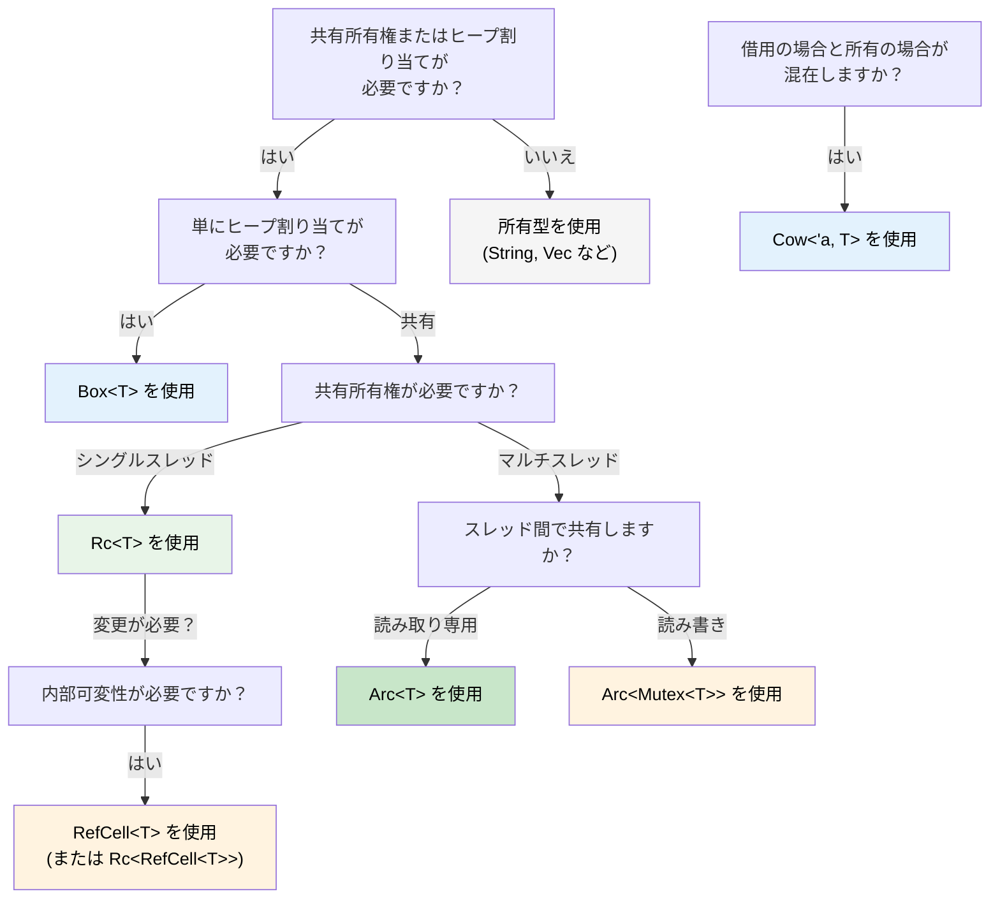

## スマートポインタ：単一所有権では不十分なとき

> **学習内容:** `Box<T>`、`Rc<T>`、`Arc<T>`、`Cell<T>`、`RefCell<T>`、および `Cow<'a, T>` —
> それぞれをいつ使うべきか、C# の GC 管理参照との比較、Rust の `IDisposable` としての `Drop`、
> `Deref` 強制（Deref coercion）、そして適切なスマートポインタを選択するための決定木を学びます。
>
> **難易度:** 🔴 上級

C# では、すべてのオブジェクトは本質的に GC によって参照カウント（到達可能性管理）されています。Rust では単一所有権がデフォルトですが、共有所有権、ヒープ割り当て、または内部可変性が必要になる場合があります。そこで登場するのがスマートポインタです。

### Box&lt;T&gt; — 単純なヒープ割り当て
```rust
// スタック割り当て（Rust のデフォルト）
let x = 42;           // スタック上

// Box によるヒープ割り当て
let y = Box::new(42); // ヒープ上、C# の `new int(42)`（ボックス化）に似ている
println!("{}", y);     // 自動デリファレンス: 42 を出力

// よくある用途: 再帰型（コンパイル時にサイズを決定できない）
#[derive(Debug)]
enum List {
    Cons(i32, Box<List>),  // Box により既知のポインタサイズが得られる
    Nil,
}

let list = List::Cons(1, Box::new(List::Cons(2, Box::new(List::Nil))));
```

```csharp
// C# — すべてがすでにヒープ上に配置される（参照型）
// Rust ではスタックがデフォルトであるため、Box<T> が必要なだけ
var list = new LinkedListNode<int>(1);  // 常にヒープ割り当てされる
```

### Rc&lt;T&gt; — 共有所有権（シングルスレッド）
```rust
use std::rc::Rc;

// 同じデータに対する複数の所有者 — C# の複数の参照に似ている
let shared = Rc::new(vec![1, 2, 3]);
let clone1 = Rc::clone(&shared); // 参照カウント: 2
let clone2 = Rc::clone(&shared); // 参照カウント: 3

println!("Count: {}", Rc::strong_count(&shared)); // 3
// 最後の Rc がスコープを抜けるとデータはドロップされる

// よくある用途: 共有設定、グラフのノード、ツリー構造
```

### Arc&lt;T&gt; — 共有所有権（スレッドセーフ）
```rust
use std::sync::Arc;
use std::thread;

// Arc = Atomic Reference Counting（原子的な参照カウント） — スレッド間での安全な共有が可能
let data = Arc::new(vec![1, 2, 3]);

let handles: Vec<_> = (0..3).map(|i| {
    let data = Arc::clone(&data);
    thread::spawn(move || {
        println!("Thread {i}: {:?}", data);
    })
}).collect();

for h in handles { h.join().unwrap(); }
```

```csharp
// C# — すべての参照はデフォルトでスレッドセーフ（GC が処理する）
var data = new List<int> { 1, 2, 3 };
// スレッド間で自由に共有可能（ただし変更は依然として安全ではない！）
```

### Cell&lt;T&gt; と RefCell&lt;T&gt; — 内部可変性
```rust
use std::cell::RefCell;

// 共有参照の背後にあるデータを変更する必要がある場合があります。
// RefCell は借用チェックをコンパイル時から実行時に移動します。
struct Logger {
    entries: RefCell<Vec<String>>,
}

impl Logger {
    fn new() -> Self {
        Logger { entries: RefCell::new(Vec::new()) }
    }

    fn log(&self, msg: &str) { // &mut self ではなく &self！
        self.entries.borrow_mut().push(msg.to_string());
    }

    fn dump(&self) {
        for entry in self.entries.borrow().iter() {
            println!("{entry}");
        }
    }
}
// ⚠️ RefCell は借用ルールに違反した場合、実行時にパニックします
// 使用は控えめに — 可能な限りコンパイル時のチェックを優先してください
```

### Cow&lt;'a, str&gt; — Copy-on-Write (Clone-on-Write)
```rust
use std::borrow::Cow;

// String に変換する「かもしれない」&str を扱う場合があります
fn normalize(input: &str) -> Cow<'_, str> {
    if input.contains('\t') {
        // 変更が必要な場合にのみメモリを割り当てる
        Cow::Owned(input.replace('\t', "    "))
    } else {
        // 元の文字列を借用 — メモリ割り当てゼロ
        Cow::Borrowed(input)
    }
}

let clean = normalize("hello");           // Cow::Borrowed — メモリ割り当てなし
let dirty = normalize("hello\tworld");    // Cow::Owned — メモリ割り当てあり
// どちらも Deref 経由で &str として使用可能
println!("{clean} / {dirty}");
```

### Drop：Rust の `IDisposable`

C# では、`IDisposable` + `using` がリソースのクリーンアップを処理します。Rust の同等の仕組みは `Drop` トレイトですが、オプトイン（明示的指定）ではなく**自動的**に行われます：

```csharp
// C# — 'using' を使うか Dispose() を呼び出すことを覚えておく必要がある
using var file = File.OpenRead("data.bin");
// スコープの最後で Dispose() が呼び出される

// 'using' を忘れるとリソースリークになる！
var file2 = File.OpenRead("data.bin");
// GC が「最終的に」ファイナライズするが、タイミングは予測不能
```

```rust
// Rust — 値がスコープを抜けると Drop が自動的に実行される
{
    let file = File::open("data.bin")?;
    // file を使用...
}   // file.drop() が「ここで」決定論的に呼び出される — 'using' は不要

// カスタム Drop（IDisposable の実装に相当）
struct TempFile {
    path: std::path::PathBuf,
}

impl Drop for TempFile {
    fn drop(&mut self) {
        // TempFile がスコープを抜けたときに確実に実行される
        let _ = std::fs::remove_file(&self.path);
        println!("Cleaned up {:?}", self.path);
    }
}

fn main() {
    let tmp = TempFile { path: "scratch.tmp".into() };
    // ... tmp を使用 ...
}   // scratch.tmp はここで自動的に削除される
```

**C# との主な違い:** Rust では、*すべての*型で決定論的なクリーンアップが可能です。忘れる対象が存在しないため、`using` を忘れる心配はありません — 所有者がスコープを抜けると `Drop` が実行されます。このパターンは **RAII**（Resource Acquisition Is Initialization: リソース取得は初期化である）と呼ばれます。

> **ルール**: 型がリソース（ファイルハンドル、ネットワーク接続、ロックガード、一時ファイルなど）を保持している場合は、`Drop` を実装してください。所有権システムにより、それが正確に1回実行されることが保証されます。

### Deref 強制（Deref Coercion）：スマートポインタの自動アンラップ

Rust は、メソッドを呼び出したり関数に渡したりする際に、スマートポインタを自動的に「アンラップ」します。これは **Deref 強制（Deref coercion）** と呼ばれます：

```rust
let boxed: Box<String> = Box::new(String::from("hello"));

// Deref 強制の連鎖: Box<String> → String → str
println!("Length: {}", boxed.len());   // str::len() を呼び出し — 自動デリファレンス！

fn greet(name: &str) {
    println!("Hello, {name}");
}

let s = String::from("Alice");
greet(&s);       // Deref 強制により &String → &str
greet(&boxed);   // &Box<String> → &String → &str — 2段階！
```

```csharp
// C# には同等の仕組みがない — 明示的なキャストまたは .ToString() が必要
// 最も近いもの: ユーザー定義の暗黙の型変換演算子だが、明示的な定義が必要
```

**なぜこれが重要なのか:** `&str` が期待される場所に `&String` を、`&[T]` が期待される場所に `&Vec<T>` を、`&T` が期待される場所に `&Box<T>` を渡すことができます — これらはすべて明示的な変換なしで行えます。そのため、Rust の API は通常、`&String` や `&Vec<T>` ではなく `&str` や `&[T]` を受け取るように設計されます。

### Rc vs Arc：どちらをいつ使うべきか

| | `Rc<T>` | `Arc<T>` |
|---|---|---|
| **スレッド安全性** | ❌ シングルスレッドのみ | ✅ スレッドセーフ（アトミック操作） |
| **オーバーヘッド** | 低い（非アトミックな参照カウント） | 高い（アトミックな参照カウント） |
| **コンパイラによる強制** | `thread::spawn` をまたぐコードはコンパイル不可 | どこでも動作 |
| **組み合わせ** | 変更には `RefCell<T>` | 変更には `Mutex<T>` または `RwLock<T>` |

**経験則:** まずは `Rc` から始めましょう。`Arc` が必要な場合はコンパイラが教えてくれます。

### 決定木：どのスマートポインタを使うべきか？



<details>
<summary><strong>🏋️ 演習: 適切なスマートポインタを選択する</strong> (クリックして展開)</summary>

**課題**: 以下の各シナリオに対して、適切なスマートポインタを選択し、その理由を説明してください。

1. 再帰的なツリーデータ構造
2. 複数のコンポーネントによって読み取られる共有設定オブジェクト（シングルスレッド）
3. HTTP ハンドラスレッド間で共有されるリクエストカウンタ
4. 借用した文字列または所有した文字列を返す可能性のあるキャッシュ
5. 共有参照を通じて変更が必要なロギングバッファ

<details>
<summary>🔑 解答例</summary>

1. **`Box<T>`** — 再帰型はコンパイル時に既知のサイズを持つために間接参照を必要とします
2. **`Rc<T>`** — 共有の読み取り専用アクセス、シングルスレッド、`Arc` のオーバーヘッドは不要
3. **`Arc<Mutex<u64>>`** — スレッド間での共有（`Arc`）と変更（`Mutex`）
4. **`Cow<'a, str>`** — `&str` を返す場合（キャッシュヒット）と `String` を返す場合（キャッシュミス）がある
5. **`RefCell<Vec<String>>`** — `&self` の背後での内部可変性（シングルスレッド）

**経験則**: まずは所有型から始めます。間接参照が必要な場合は `Box`、共有が必要な場合は `Rc`/`Arc`、内部可変性が必要な場合は `RefCell`/`Mutex`、一般的なケースでゼロコピーを実現したい場合は `Cow` を選びます。

</details>
</details>

***
