```mermaid
graph TD
    subgraph "C# のメモリ管理"
        CS_ALLOC["オブジェクト割り当て<br/>new Person()"]
        CS_HEAP["マネージドヒープ"]
        CS_REF["参照がヒープを指す"]
        CS_GC_CHECK["GC が到達不能オブジェクトを<br/>定期的にチェック"]
        CS_SWEEP["マーク＆スイープ<br/>コレクション"]
        CS_PAUSE["[エラー] GC による一時停止（ポーズ時間）"]
        
        CS_ALLOC --> CS_HEAP
        CS_HEAP --> CS_REF
        CS_REF --> CS_GC_CHECK
        CS_GC_CHECK --> CS_SWEEP
        CS_SWEEP --> CS_PAUSE
        
        CS_ISSUES["[エラー] 非決定論的なクリーンアップ<br/>[エラー] メモリ圧力<br/>[エラー] ファイナライザの複雑さ<br/>[OK] 使いやすさ"]
    end
    
    subgraph "Rust の所有権システム"
        RUST_ALLOC["値の作成<br/>Person { ... }"]
        RUST_OWNER["スタックまたはヒープ上の<br/>単一の所有者"]
        RUST_BORROW["借用システム<br/>&T, &mut T"]
        RUST_SCOPE["スコープベースのクリーンアップ<br/>Drop トレイト"]
        RUST_COMPILE["コンパイル時の検証"]
        
        RUST_ALLOC --> RUST_OWNER
        RUST_OWNER --> RUST_BORROW
        RUST_BORROW --> RUST_SCOPE
        RUST_SCOPE --> RUST_COMPILE
        
        RUST_BENEFITS["[OK] 決定論的なクリーンアップ<br/>[OK] 実行時コストゼロ<br/>[OK] メモリリークなし<br/>[エラー] 学習曲線"]
    end
    
    style CS_ISSUES fill:#ffebee,color:#000
    style RUST_BENEFITS fill:#e8f5e8,color:#000
    style CS_PAUSE fill:#ffcdd2,color:#000
    style RUST_COMPILE fill:#c8e6c9,color:#000
```

## 所有権の理解

> **学習内容:** Rust の所有権システム — C# の参照コピーとは異なり、なぜ `let s2 = s1` で `s1` が無効化されるのか、所有権の3つのルール、`Copy` 型 vs `Move` 型、`&` と `&mut` による借用、そしてボローチェッカがどのようにガベージコレクションを代替するのかを学びます。
>
> **難易度:** 🟡 中級

所有権は Rust の最もユニークな機能であり、C# 開発者にとって最大の概念的シフトです。段階を追って理解していきましょう。

### C# のメモリモデル（復習）
```csharp
// C# - 自動メモリ管理
public void ProcessData()
{
    var data = new List<int> { 1, 2, 3, 4, 5 };
    ProcessList(data);
    // data はここでもアクセス可能
    Console.WriteLine(data.Count);  // 問題なく動作する
    
    // 参照が残っていなくなると GC が解放する
}

public void ProcessList(List<int> list)
{
    list.Add(6);  // 元のリストを変更する
}
```

### Rust の所有権ルール
1. **各値には正確に1つの所有者が存在する**（`Rc<T>` / `Arc<T>` による共有所有権を選択した場合を除く — [スマートポインタ](ch07-3-smart-pointers-beyond-single-ownership.md)を参照）
2. **所有者がスコープを抜けると、値は破棄（drop）される**（決定論的なクリーンアップ — [Drop](ch07-3-smart-pointers-beyond-single-ownership.md#drop-rusts-idisposable)を参照）
3. **所有権は移動（ムーブ）できる**

```rust
// Rust - 明示的な所有権管理
fn process_data() {
    let data = vec![1, 2, 3, 4, 5];  // data がベクタを所有する
    process_list(data);              // 所有権が関数にムーブされる
    // println!("{:?}", data);       // ❌ エラー: data はここではもう所有されていない
}

fn process_list(mut list: Vec<i32>) {  // list がベクタを所有するようになる
    list.push(6);
    // 関数終了時に list はここでドロップされる
}
```

### C# 開発者のための「ムーブ」の理解
```csharp
// C# - 参照がコピーされ、オブジェクト自体はその場に留まる
// （参照型（クラス）のみがこのように動作します。
//  struct などの C# の値型は異なる振る舞いをします）
var original = new List<int> { 1, 2, 3 };
var reference = original;  // 両方の変数が同じオブジェクトを指す
original.Add(4);
Console.WriteLine(reference.Count);  // 4 - 同じオブジェクト
```

```rust
// Rust - 所有権が移動（ムーブ）する
let original = vec![1, 2, 3];
let moved = original;       // 所有権が移動
// println!("{:?}", original);  // ❌ エラー: original はもはやデータを所有していない
println!("{:?}", moved);    // ✅ 動作する: moved がデータを所有している
```

### Copy 型 vs Move 型
```rust
// Copy 型（C# の値型に類似） - ムーブされず、コピーされる
let x = 5;        // i32 は Copy を実装している
let y = x;        // x が y にコピーされる
println!("{}", x); // ✅ 動作する: x はまだ有効

// Move 型（C# の参照型に類似） - コピーされず、ムーブされる
let s1 = String::from("hello");  // String は Copy を実装していない
let s2 = s1;                     // s1 が s2 にムーブされる
// println!("{}", s1);           // ❌ エラー: s1 はもう有効ではない
```

### 実践的な例：値のスワップ
```csharp
// C# - 単純な参照のスワップ
public void SwapLists(ref List<int> a, ref List<int> b)
{
    var temp = a;
    a = b;
    b = temp;
}
```

```rust
// Rust - 所有権を意識したスワップ
fn swap_vectors(a: &mut Vec<i32>, b: &mut Vec<i32>) {
    std::mem::swap(a, b);  // 組み込みのスワップ関数
}

// または手動でのアプローチ
fn manual_swap() {
    let mut a = vec![1, 2, 3];
    let mut b = vec![4, 5, 6];
    
    let temp = a;  // a を temp にムーブ
    a = b;         // b を a にムーブ
    b = temp;      // temp を b にムーブ
    
    println!("a: {:?}, b: {:?}", a, b);
}
```

***

## 借用の基本

借用は C# で参照を取得することに似ていますが、コンパイル時の安全性保証が伴います。

### C# の参照パラメータ
```csharp
// C# - ref と out パラメータ
public void ModifyValue(ref int value)
{
    value += 10;
}

public void ReadValue(in int value)  // 読み取り専用参照
{
    Console.WriteLine(value);
}

public bool TryParse(string input, out int result)
{
    return int.TryParse(input, out result);
}
```

### Rust の借用
```rust
// Rust - & と &mut による借用
fn modify_value(value: &mut i32) {  // 可変の借用
    *value += 10;
}

fn read_value(value: &i32) {        // 不変の借用
    println!("{}", value);
}

fn main() {
    let mut x = 5;
    
    read_value(&x);      // 不変で借用
    modify_value(&mut x); // 可変で借用
    
    println!("{}", x);   // x はここでも所有されたまま
}
```

### 借用ルール（コンパイル時に強制！）
```rust
fn borrowing_rules() {
    let mut data = vec![1, 2, 3];
    
    // ルール1: 複数の不変の借用はOK
    let r1 = &data;
    let r2 = &data;
    println!("{:?} {:?}", r1, r2);  // ✅ 動作する
    
    // ルール2: 同時に存在できる可変の借用は1つだけ
    let r3 = &mut data;
    // let r4 = &mut data;  // ❌ エラー: 2回可変で借用することはできない
    // let r5 = &data;      // ❌ エラー: 可変借用中に不変で借用することはできない
    
    r3.push(4);  // 可変借用を使用
    // r3 はここでスコープを抜ける
    
    // ルール3: 以前の借用が終了した後は再び借用できる
    let r6 = &data;  // ✅ 今度は動作する
    println!("{:?}", r6);
}
```

### C# vs Rust：参照の安全性
```csharp
// C# - 実行時エラーの潜在的リスク
public class ReferenceSafety
{
    private List<int> data = new List<int>();
    
    public List<int> GetData() => data;  // 内部データへの参照を返す
    
    public void UnsafeExample()
    {
        var reference = GetData();
        
        // 別のスレッドがここでデータを変更する可能性がある！
        Thread.Sleep(1000);
        
        // reference が無効化されているか変更されている可能性がある
        reference.Add(42);  // 潜在的な競合状態（データ競合）
    }
}
```

```rust
// Rust - コンパイル時の安全性
pub struct SafeContainer {
    data: Vec<i32>,
}

impl SafeContainer {
    // 不変の借用を返す - 呼び出し側は変更できない
    // &Vec<i32> よりも &[i32] を推奨 — 最も広い型を受け入れる
    pub fn get_data(&self) -> &[i32] {
        &self.data
    }
    
    // 可変の借用を返す - 排他的アクセスが保証される
    pub fn get_data_mut(&mut self) -> &mut Vec<i32> {
        &mut self.data
    }
}

fn safe_example() {
    let mut container = SafeContainer { data: vec![1, 2, 3] };
    
    let reference = container.get_data();
    // container.get_data_mut();  // ❌ エラー: 不変借用中に可変で借用することはできない
    
    println!("{:?}", reference);  // 不変参照を使用
    // reference はここでスコープを抜ける
    
    let mut_reference = container.get_data_mut();  // ✅ 今度はOK
    mut_reference.push(4);
}
```

***

## ムーブセマンティクス

### C# の値型 vs 参照型
```csharp
// C# - 値型はコピーされる
struct Point
{
    public int X { get; set; }
    public int Y { get; set; }
}

var p1 = new Point { X = 1, Y = 2 };
var p2 = p1;  // コピー
p2.X = 10;
Console.WriteLine(p1.X);  // まだ 1

// C# - 参照型はオブジェクトを共有する
var list1 = new List<int> { 1, 2, 3 };
var list2 = list1;  // 参照コピー
list2.Add(4);
Console.WriteLine(list1.Count);  // 4 - 同じオブジェクト
```

### Rust のムーブセマンティクス
```rust
// Rust - Copy 以外の型はデフォルトでムーブ
#[derive(Debug)]
struct Point {
    x: i32,
    y: i32,
}

fn move_example() {
    let p1 = Point { x: 1, y: 2 };
    let p2 = p1;  // ムーブ（コピーではない）
    // println!("{:?}", p1);  // ❌ エラー: p1 はムーブされた
    println!("{:?}", p2);    // ✅ 動作する
}

// コピーを有効にするには Copy トレイトを実装する
#[derive(Debug, Copy, Clone)]
struct CopyablePoint {
    x: i32,
    y: i32,
}

fn copy_example() {
    let p1 = CopyablePoint { x: 1, y: 2 };
    let p2 = p1;  // コピー（Copy を実装しているため）
    println!("{:?}", p1);  // ✅ 動作する
    println!("{:?}", p2);  // ✅ 動作する
}
```

### 値がムーブされるタイミング
```rust
fn demonstrate_moves() {
    let s = String::from("hello");
    
    // 1. 代入によるムーブ
    let s2 = s;  // s が s2 にムーブされる
    
    // 2. 関数呼び出しによるムーブ
    take_ownership(s2);  // s2 が関数内にムーブされる
    
    // 3. 関数からのリターンによるムーブ
    let s3 = give_ownership();  // 戻り値が s3 にムーブされる
    
    println!("{}", s3);  // s3 は有効
}

fn take_ownership(s: String) {
    println!("{}", s);
    // s はここでドロップされる
}

fn give_ownership() -> String {
    String::from("yours")  // 所有権が呼び出し側にムーブされる
}
```

### 借用によるムーブの回避
```rust
fn demonstrate_borrowing() {
    let s = String::from("hello");
    
    // ムーブの代わりに借用する
    let len = calculate_length(&s);  // s が借用される
    println!("'{}' has length {}", s, len);  // s はまだ有効
}

fn calculate_length(s: &String) -> usize {
    s.len()  // s は所有されていないためドロップされない
}
```

***

## メモリ管理：GC vs RAII

### C# のガベージコレクション
```csharp
// C# - 自動メモリ管理
public class Person
{
    public string Name { get; set; }
    public List<string> Hobbies { get; set; } = new List<string>();
    
    public void AddHobby(string hobby)
    {
        Hobbies.Add(hobby);  // メモリは自動的に割り当てられる
    }
    
    // 明示的なクリーンアップは不要 - GC が処理
    // ただしリソースには IDisposable パターンを使用
}

using var file = new FileStream("data.txt", FileMode.Open);
// 'using' により Dispose() の呼び出しが保証される
```

### Rust の所有権と RAII
```rust
// Rust - コンパイル時のメモリ管理
pub struct Person {
    name: String,
    hobbies: Vec<String>,
}

impl Person {
    pub fn add_hobby(&mut self, hobby: String) {
        self.hobbies.push(hobby);  // メモリ管理はコンパイル時に追跡される
    }
    
    // Drop トレイトが自動的に実装される - クリーンアップが保証される
    // C# の IDisposable との比較:
    //   C#:   using var file = new FileStream(...)    // using ブロックの末尾で Dispose() が呼び出される
    //   Rust: let file = File::open(...)?             // スコープの末尾で drop() が呼び出される — 'using' は不要
}

// RAII - Resource Acquisition Is Initialization（リソース取得は初期化である）
{
    let file = std::fs::File::open("data.txt")?;
    // 'file' がスコープを抜けるとファイルは自動的にクローズされる
    // 型システムによって処理されるため 'using' 文は不要
}
```



***


<details>
<summary><strong>🏋️ 演習: ボローチェッカのエラーを修正する</strong> (クリックして展開)</summary>

**課題**: 以下の各スニペットにはボローチェッカのエラーがあります。出力を変更せずに修正してください。

```rust
// 1. 使用後のムーブ
fn problem_1() {
    let name = String::from("Alice");
    let greeting = format!("Hello, {name}!");
    let upper = name.to_uppercase();  // ヒント: ムーブの代わりに借用する
    println!("{greeting} — {upper}");
}

// 2. 可変借用と不変借用の重複
fn problem_2() {
    let mut numbers = vec![1, 2, 3];
    let first = &numbers[0];
    numbers.push(4);            // ヒント: 操作の順序を入れ替える
    println!("first = {first}");
}

// 3. ローカル変数への参照を返す
fn problem_3() -> String {
    let s = String::from("hello");
    s   // ヒント: &str ではなく所有された値を返す
}
```

<details>
<summary>🔑 解答例</summary>

```rust
// 1. format! はすでに借用している — 修正点は format! が参照を取ること。
//    元のコードは実際にはコンパイルが通ります！しかし、もし `let greeting = name;`
//    となっていた場合は &name を使って修正します:
fn solution_1() {
    let name = String::from("Alice");
    let greeting = format!("Hello, {}!", &name); // 借用
    let upper = name.to_uppercase();             // name はまだ有効
    println!("{greeting} — {upper}");
}

// 2. 可変操作の前に不変借用を使用する:
fn solution_2() {
    let mut numbers = vec![1, 2, 3];
    let first = numbers[0]; // i32 の値をコピー（i32 は Copy）
    numbers.push(4);
    println!("first = {first}");
}

// 3. 所有された String を返す（すでに正しい — 初心者が混乱しやすいポイント）:
fn solution_3() -> String {
    let s = String::from("hello");
    s // 所有権が呼び出し側に移動する — これが正しいパターン
}
```

**重要なポイント**:
- `format!()` は引数を借用し、ムーブしません
- `i32` のようなプリミティブ型は `Copy` を実装しているため、インデックスアクセスは値をコピーします
- 所有された値を返すと呼び出し側に所有権が移動するため、ライフタイムの問題は発生しません

</details>
</details>
