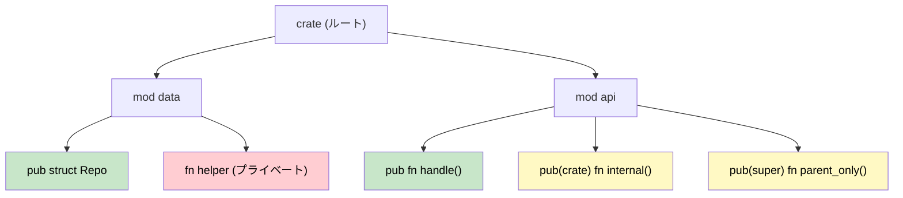

## モジュールとクレート：コードの構成

> **学習内容:** Rust のモジュールシステムと C# の名前空間・アセンブリの比較、`pub` / `pub(crate)` / `pub(super)` による可視性、ファイルベースのモジュール構成、そしてクレートと .NET アセンブリの対応関係を学びます。
>
> **難易度:** 🟢 初級

Rust のモジュールシステムを理解することは、コードの整理や依存関係の管理において不可欠です。C# 開発者にとっては、名前空間、アセンブリ、および NuGet パッケージを理解することに相当します。

### Rust のモジュール vs C# の名前空間

#### C# の名前空間構成
```csharp
// ファイル: Models/User.cs
namespace MyApp.Models
{
    public class User
    {
        public string Name { get; set; }
        public int Age { get; set; }
    }
}

// ファイル: Services/UserService.cs
using MyApp.Models;

namespace MyApp.Services
{
    public class UserService
    {
        public User CreateUser(string name, int age)
        {
            return new User { Name = name, Age = age };
        }
    }
}

// ファイル: Program.cs
using MyApp.Models;
using MyApp.Services;

namespace MyApp
{
    class Program
    {
        static void Main(string[] args)
        {
            var service = new UserService();
            var user = service.CreateUser("Alice", 30);
        }
    }
}
```

#### Rust のモジュール構成
```rust
// ファイル: src/models.rs
pub struct User {
    pub name: String,
    pub age: u32,
}

impl User {
    pub fn new(name: String, age: u32) -> User {
        User { name, age }
    }
}

// ファイル: src/services.rs
use crate::models::User;

pub struct UserService;

impl UserService {
    pub fn create_user(name: String, age: u32) -> User {
        User::new(name, age)
    }
}

// ファイル: src/lib.rs (または main.rs)
pub mod models;
pub mod services;

use models::User;
use services::UserService;

fn main() {
    let service = UserService;
    let user = UserService::create_user("Alice".to_string(), 30);
}
```

### モジュール階層と可視性



> 🟢 緑 = どこからでも公開（public） &nbsp;|&nbsp; 🟡 黄 = 制限付き可視性 &nbsp;|&nbsp; 🔴 赤 = 非公開（private）

#### C# のアクセス修飾子
```csharp
namespace MyApp.Data
{
    // public - どこからでもアクセス可能
    public class Repository
    {
        // private - このクラス内でのみ
        private string connectionString;
        
        // internal - このアセンブリ内でのみ
        internal void Connect() { }
        
        // protected - このクラスとサブクラス
        protected virtual void Initialize() { }
        
        // public - どこからでもアクセス可能
        public void Save(object data) { }
    }
}
```

#### Rust の可視性ルール
```rust
// Rust ではデフォルトですべてが非公開（private）
mod data {
    struct Repository {  // 非公開構造体
        connection_string: String,  // 非公開フィールド
    }
    
    impl Repository {
        fn new() -> Repository {  // 非公開関数
            Repository {
                connection_string: "localhost".to_string(),
            }
        }
        
        pub fn connect(&self) {  // 公開メソッド
            // このモジュールとその子モジュール内でのみアクセス可能
        }
        
        pub(crate) fn initialize(&self) {  // クレートレベルで公開
            // このクレート内のどこからでもアクセス可能
        }
        
        pub(super) fn internal_method(&self) {  // 親モジュールに対して公開
            // 親モジュール内でアクセス可能
        }
    }
    
    // 公開構造体 - モジュール外からアクセス可能
    pub struct PublicRepository {
        pub data: String,  // 公開フィールド
        private_data: String,  // 非公開フィールド（pub なし）
    }
}

pub use data::PublicRepository;  // 外部で使用できるように再エクスポート
```

### モジュールファイルの構成

#### C# のプロジェクト構造
```text
MyApp/
├── MyApp.csproj
├── Models/
│   ├── User.cs
│   └── Product.cs
├── Services/
│   ├── UserService.cs
│   └── ProductService.cs
├── Controllers/
│   └── ApiController.cs
└── Program.cs
```

#### Rust のモジュールファイル構造
```text
my_app/
├── Cargo.toml
└── src/
    ├── main.rs (または lib.rs)
    ├── models/
    │   ├── mod.rs        // モジュール宣言
    │   ├── user.rs
    │   └── product.rs
    ├── services/
    │   ├── mod.rs        // モジュール宣言
    │   ├── user_service.rs
    │   └── product_service.rs
    └── controllers/
        ├── mod.rs
        └── api_controller.rs
```

#### モジュール宣言パターン
```rust
// src/models/mod.rs
pub mod user;      // user.rs をサブモジュールとして宣言
pub mod product;   // product.rs をサブモジュールとして宣言

// よく使われる型を再エクスポート
pub use user::User;
pub use product::Product;

// src/main.rs
mod models;     // models/ をモジュールとして宣言
mod services;   // services/ をモジュールとして宣言

// 特定のアイテムをインポート
use models::{User, Product};
use services::UserService;

// またはモジュール全体をインポート
use models::user::*;  // user モジュールからすべての公開アイテムをインポート
```

***

## クレート vs .NET アセンブリ

### クレートの理解
Rust では、**クレート（crate）** がコンパイルとコード配布の基本単位であり、.NET における **アセンブリ（assembly）** の働きと類似しています。

#### C# のアセンブリモデル
```csharp
// MyLibrary.dll - コンパイルされたアセンブリ
namespace MyLibrary
{
    public class Calculator
    {
        public int Add(int a, int b) => a + b;
    }
}

// MyApp.exe - MyLibrary.dll を参照する実行可能アセンブリ
using MyLibrary;

class Program
{
    static void Main()
    {
        var calc = new Calculator();
        Console.WriteLine(calc.Add(2, 3));
    }
}
```

#### Rust のクレートモデル
```toml
# ライブラリクレート用の Cargo.toml
[package]
name = "my_calculator"
version = "0.1.0"
edition = "2021"

[lib]
name = "my_calculator"
```

```rust
// src/lib.rs - ライブラリクレート
pub struct Calculator;

impl Calculator {
    pub fn add(&self, a: i32, b: i32) -> i32 {
        a + b
    }
}
```

```toml
# ライブラリを使用するバイナリクレート用の Cargo.toml
[package]
name = "my_app"
version = "0.1.0"
edition = "2021"

[dependencies]
my_calculator = { path = "../my_calculator" }
```

```rust
// src/main.rs - バイナリクレート
use my_calculator::Calculator;

fn main() {
    let calc = Calculator;
    println!("{}", calc.add(2, 3));
}
```

### クレート種類の比較

| C# の概念 | Rust の同等機能 | 用途 |
|------------|----------------|---------|
| クラスライブラリ (.dll) | ライブラリクレート | 再利用可能なコード |
| コンソールアプリ (.exe) | バイナリクレート | 実行可能プログラム |
| NuGet パッケージ | 公開されたクレート | 配布単位 |
| アセンブリ (.dll/.exe) | コンパイルされたクレート | コンパイル単位 |
| ソリューション (.sln) | ワークスペース | 複数プロジェクトの管理 |

### ワークスペース vs ソリューション

#### C# のソリューション構造
```xml
<!-- MySolution.sln の構造 -->
<Solution>
    <Project Include="WebApi/WebApi.csproj" />
    <Project Include="Business/Business.csproj" />
    <Project Include="DataAccess/DataAccess.csproj" />
    <Project Include="Tests/Tests.csproj" />
</Solution>
```

#### Rust のワークスペース構造
```toml
# ワークスペースルートの Cargo.toml
[workspace]
members = [
    "web_api",
    "business",
    "data_access",
    "tests"
]

[workspace.dependencies]
serde = "1.0"           # 共通の依存関係バージョン
tokio = "1.0"
```

```toml
# web_api/Cargo.toml
[package]
name = "web_api"
version = "0.1.0"
edition = "2021"

[dependencies]
business = { path = "../business" }
serde = { workspace = true }    # ワークスペースのバージョンを使用
tokio = { workspace = true }
```

---

## 演習

<details>
<summary><strong>🏋️ 演習: モジュールツリーの設計</strong> (クリックして展開)</summary>

次の C# プロジェクト構成が与えられたとき、同等の Rust モジュールツリーを設計してください：

```csharp
// C#
namespace MyApp.Services { public class AuthService { } }
namespace MyApp.Services { internal class TokenStore { } }
namespace MyApp.Models { public class User { } }
namespace MyApp.Models { public class Session { } }
```

要件:
1. `AuthService` と両方のモデルは公開（public）でなければならない
2. `TokenStore` は `services` モジュールに対して非公開でなければならない
3. ファイル構成**および** `lib.rs` 内の `mod` / `pub` 宣言を提示すること

<details>
<summary>🔑 解答例</summary>

ファイル構成:
```
src/
├── lib.rs
├── services/
│   ├── mod.rs
│   ├── auth_service.rs
│   └── token_store.rs
└── models/
    ├── mod.rs
    ├── user.rs
    └── session.rs
```

```rust,ignore
// src/lib.rs
pub mod services;
pub mod models;

// src/services/mod.rs
mod token_store;          // 非公開 — C# の internal に類似
pub mod auth_service;     // 公開

// src/services/auth_service.rs
use super::token_store::TokenStore; // モジュール内で可視

pub struct AuthService;

impl AuthService {
    pub fn login(&self) { /* 内部で TokenStore を使用 */ }
}

// src/services/token_store.rs
pub(super) struct TokenStore; // 親（services）に対してのみ可視

// src/models/mod.rs
pub mod user;
pub mod session;

// src/models/user.rs
pub struct User {
    pub name: String,
}

// src/models/session.rs
pub struct Session {
    pub user_id: u64,
}
```

</details>
</details>

***
