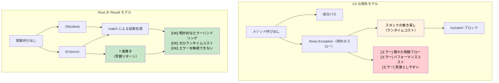

## 例外 vs `Result<T, E>`

> **学べること:** Rust が例外の代わりに `Result<T, E>` や `Option<T>` を採用している理由、簡潔なエラー伝播のための `?` 演算子、そして明示的なエラーハンドリングによって C# の `try`/`catch` コードに潜む隠れた制御フローがどのように排除されるかについて学びます。
>
> **難易度:** 🟡 中級
>
> **関連項目**: `thiserror` や `anyhow` を使った本番環境向けエラーパターンについては [クレートレベルのエラー型](ch09-1-crate-level-error-types-and-result-alias.md) を、エラー処理関連のクレートエコシステムについては [主要クレート](ch15-1-essential-crates-for-c-developers.md) を参照してください。

### C# の例外ベースのエラーハンドリング
```csharp
// C# - 例外ベースのエラーハンドリング
public class UserService
{
    public User GetUser(int userId)
    {
        if (userId <= 0)
        {
            throw new ArgumentException("ユーザーIDは正の数である必要があります");
        }
        
        var user = database.FindUser(userId);
        if (user == null)
        {
            throw new UserNotFoundException($"ユーザー {userId} が見つかりません");
        }
        
        return user;
    }
    
    public async Task<string> GetUserEmailAsync(int userId)
    {
        try
        {
            var user = GetUser(userId);
            return user.Email ?? throw new InvalidOperationException("ユーザーにメールアドレスが設定されていません");
        }
        catch (UserNotFoundException ex)
        {
            logger.Warning("ユーザーが見つかりません: {UserId}", userId);
            return "noreply@company.com";
        }
        catch (Exception ex)
        {
            logger.Error(ex, "ユーザーメールの取得中に予期しないエラーが発生しました");
            throw; // 再スロー
        }
    }
}
```

### Rust の Result ベースのエラーハンドリング
```rust
use std::fmt;

#[derive(Debug)]
pub enum UserError {
    InvalidId(i32),
    NotFound(i32),
    NoEmail,
    DatabaseError(String),
}

impl fmt::Display for UserError {
    fn fmt(&self, f: &mut fmt::Formatter<'_>) -> fmt::Result {
        match self {
            UserError::InvalidId(id) => write!(f, "無効なユーザーID: {}", id),
            UserError::NotFound(id) => write!(f, "ユーザー {} が見つかりません", id),
            UserError::NoEmail => write!(f, "ユーザーにメールアドレスが設定されていません"),
            UserError::DatabaseError(msg) => write!(f, "データベースエラー: {}", msg),
        }
    }
}

impl std::error::Error for UserError {}

#[derive(Debug, Clone)]
pub struct User {
    pub name: String,
    pub email: Option<String>,
}

pub struct UserService {
    users: Vec<User>,  // 模擬データベース
}

impl UserService {
    fn database_find_user(&self, user_id: i32) -> Option<User> {
        self.users.get(user_id as usize).cloned()
    }

    pub fn get_user(&self, user_id: i32) -> Result<User, UserError> {
        if user_id <= 0 {
            return Err(UserError::InvalidId(user_id));
        }
        
        // データベース検索のシミュレーション
        self.database_find_user(user_id)
            .ok_or(UserError::NotFound(user_id))
    }
    
    pub fn get_user_email(&self, user_id: i32) -> Result<String, UserError> {
        let user = self.get_user(user_id)?; // ? 演算子でエラーを伝播
        
        user.email
            .ok_or(UserError::NoEmail)
    }
    
    pub fn get_user_email_or_default(&self, user_id: i32) -> String {
        match self.get_user_email(user_id) {
            Ok(email) => email,
            Err(UserError::NotFound(_)) => {
                log::warn!("ユーザーが見つかりません: {}", user_id);
                "noreply@company.com".to_string()
            }
            Err(err) => {
                log::error!("ユーザーメールの取得エラー: {}", err);
                "error@company.com".to_string()
            }
        }
    }
}
```



***

### ? 演算子：簡潔なエラー伝播
```csharp
// C# - 例外の伝播（暗黙的）
public async Task<string> ProcessFileAsync(string path)
{
    var content = await File.ReadAllTextAsync(path);  // エラー時にスローされる
    var processed = ProcessContent(content);          // エラー時にスローされる
    return processed;
}
```

```rust
// Rust - ? によるエラー伝播
fn process_file(path: &str) -> Result<String, ConfigError> {
    let content = read_config(path)?;  // Err の場合、? がエラーを早期リターン（伝播）
    let processed = process_content(&content)?;  // Err の場合、? がエラーを早期リターン（伝播）
    Ok(processed)  // 成功値を Ok でラップ
}

fn process_content(content: &str) -> Result<String, ConfigError> {
    if content.is_empty() {
        Err(ConfigError::InvalidFormat)
    } else {
        Ok(content.to_uppercase())
    }
}
```

### null 許容値に対する `Option<T>`
```csharp
// C# - null 許容参照型
public string? FindUserName(int userId)
{
    var user = database.FindUser(userId);
    return user?.Name;  // ユーザーが見つからない場合は null を返す
}

public void ProcessUser(int userId)
{
    string? name = FindUserName(userId);
    if (name != null)
    {
        Console.WriteLine($"User: {name}");
    }
    else
    {
        Console.WriteLine("User not found");
    }
}
```

```rust
// Rust - オプショナル値のための Option<T>
fn find_user_name(user_id: u32) -> Option<String> {
    // データベース検索のシミュレーション
    if user_id == 1 {
        Some("Alice".to_string())
    } else {
        None
    }
}

fn process_user(user_id: u32) {
    match find_user_name(user_id) {
        Some(name) => println!("ユーザー: {}", name),
        None => println!("ユーザーが見つかりません"),
    }
    
    // または if let（パターンマッチングの省略記法）を使用
    if let Some(name) = find_user_name(user_id) {
        println!("ユーザー: {}", name);
    } else {
        println!("ユーザーが見つかりません");
    }
}
```

### Option と Result の組み合わせ
```rust
fn safe_divide(a: f64, b: f64) -> Option<f64> {
    if b != 0.0 {
        Some(a / b)
    } else {
        None
    }
}

fn parse_and_divide(a_str: &str, b_str: &str) -> Result<Option<f64>, ParseFloatError> {
    let a: f64 = a_str.parse()?;  // 不正な場合はパースエラーを返す
    let b: f64 = b_str.parse()?;  // 不正な場合はパースエラーを返す
    Ok(safe_divide(a, b))         // Ok(Some(result)) または Ok(None) を返す
}

use std::num::ParseFloatError;

fn main() {
    match parse_and_divide("10.0", "2.0") {
        Ok(Some(result)) => println!("計算結果: {}", result),
        Ok(None) => println!("ゼロ除算"),
        Err(error) => println!("パースエラー: {}", error),
    }
}
```

***


<details>
<summary><strong>🏋️ 演習：クレートレベルのエラー型の構築</strong>（クリックして展開）</summary>

**課題**: I/O エラー、JSON パースエラー、バリデーションエラーによって失敗する可能性のあるファイル処理アプリケーション用の `AppError` 列挙型を作成してください。自動的な `?` 伝播のための `From` 変換を実装します。

```rust
// スターターコード
use std::io;

// TODO: 以下のバリアントを持つ AppError を定義:
//   Io(io::Error), Json(serde_json::Error), Validation(String)
// TODO: Display トレイトと Error トレイトを実装
// TODO: From<io::Error> と From<serde_json::Error> を実装
// TODO: 型エイリアスを定義: type Result<T> = std::result::Result<T, AppError>;

fn load_config(path: &str) -> Result<Config> {
    let content = std::fs::read_to_string(path)?;  // io::Error → AppError
    let config: Config = serde_json::from_str(&content)?;  // serde エラー → AppError
    if config.name.is_empty() {
        return Err(AppError::Validation("名前を空にすることはできません".into()));
    }
    Ok(config)
}
```

<details>
<summary>🔑 解答例</summary>

```rust
use std::io;
use thiserror::Error;

#[derive(Error, Debug)]
pub enum AppError {
    #[error("I/O エラー: {0}")]
    Io(#[from] io::Error),

    #[error("JSON エラー: {0}")]
    Json(#[from] serde_json::Error),

    #[error("バリデーション: {0}")]
    Validation(String),
}

pub type Result<T> = std::result::Result<T, AppError>;

#[derive(serde::Deserialize)]
struct Config {
    name: String,
    port: u16,
}

fn load_config(path: &str) -> Result<Config> {
    let content = std::fs::read_to_string(path)?;
    let config: Config = serde_json::from_str(&content)?;
    if config.name.is_empty() {
        return Err(AppError::Validation("名前を空にすることはできません".into()));
    }
    Ok(config)
}
```

**要点**:
- `thiserror` は属性から `Display` および `Error` の実装を生成します
- `#[from]` は `From<T>` の実装を生成し、`?` による自動変換を可能にします
- `Result<T>` エイリアスにより、クレート全体でボイラープレートを排除できます
- C# の例外とは異なり、エラー型はすべての関数シグネチャで明示されます

</details>
</details>
