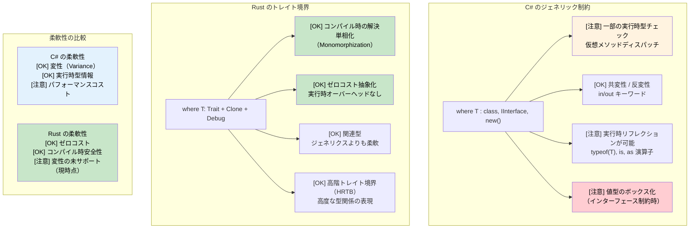

## ジェネリック制約：where 句 vs トレイト境界

> **学べること:** Rust のトレイト境界と C# の `where` 制約の比較、`where` 句の構文、条件付きトレイト実装、関連型、および高階トレイト境界（HRTB: Higher-Ranked Trait Bounds）。
>
> **難易度:** 🔴 上級

### C# のジェネリック制約
```csharp
// where 句を用いた C# のジェネリック制約
public class Repository<T> where T : class, IEntity, new()
{
    public T Create()
    {
        return new T();  // new() 制約により引数なしコンストラクタが許可される
    }
    
    public void Save(T entity)
    {
        if (entity.Id == 0)  // IEntity 制約により Id プロパティが提供される
        {
            entity.Id = GenerateId();
        }
        // データベースに保存
    }
}

// 制約を持つ複数の型パラメータ
public class Converter<TInput, TOutput> 
    where TInput : IConvertible
    where TOutput : class, new()
{
    public TOutput Convert(TInput input)
    {
        var output = new TOutput();
        // IConvertible を使用した変換ロジック
        return output;
    }
}

// ジェネリクスにおける変性（Variance）
public interface IRepository<out T> where T : IEntity
{
    IEnumerable<T> GetAll();  // 共変（Covariant）- より派生した型を返却可能
}

public interface IWriter<in T> where T : IEntity
{
    void Write(T entity);  // 反変（Contravariant）- より基底の型を受け入れ可能
}
```

### トレイト境界を用いた Rust のジェネリック制約
```rust
use std::fmt::{Debug, Display};
use std::clone::Clone;

// 基本的なトレイト境界
pub struct Repository<T> 
where 
    T: Clone + Debug + Default,
{
    items: Vec<T>,
}

impl<T> Repository<T> 
where 
    T: Clone + Debug + Default,
{
    pub fn new() -> Self {
        Repository { items: Vec::new() }
    }
    
    pub fn create(&self) -> T {
        T::default()  // Default トレイトによりデフォルト値が提供される
    }
    
    pub fn add(&mut self, item: T) {
        println!("アイテムを追加中: {:?}", item);  // 出力用の Debug トレイト
        self.items.push(item);
    }
    
    pub fn get_all(&self) -> Vec<T> {
        self.items.clone()  // 複製用の Clone トレイト
    }
}

// 異なる構文による複数のトレイト境界
pub fn process_data<T, U>(input: T) -> U 
where 
    T: Display + Clone,
    U: From<T> + Debug,
{
    println!("処理中: {}", input);      // Display トレイト
    let cloned = input.clone();         // Clone トレイト
    let output = U::from(cloned);       // 型変換のための From トレイト
    println!("結果: {:?}", output);      // Debug トレイト
    output
}

// 関連型（C# のジェネリック制約に類似）
pub trait Iterator {
    type Item;  // ジェネリックパラメータの代わりに関連型を使用
    
    fn next(&mut self) -> Option<Self::Item>;
}

pub trait Collect<T> {
    fn collect<I: Iterator<Item = T>>(iter: I) -> Self;
}

// 高階トレイト境界（HRTB: 発展的）
fn apply_to_all<F>(items: &[String], f: F) -> Vec<String>
where 
    F: for<'a> Fn(&'a str) -> String,  // 任意のライフタイムで動作する関数
{
    items.iter().map(|s| f(s)).collect()
}

// 条件付きトレイト実装
impl<T> PartialEq for Repository<T> 
where 
    T: PartialEq + Clone + Debug + Default,
{
    fn eq(&self, other: &Self) -> bool {
        self.items == other.items
    }
}
```



---

## 演習

<details>
<summary><strong>🏋️ 演習：ジェネリックリポジトリ</strong>（クリックして展開）</summary>

以下の C# ジェネリックリポジトリインターフェースを Rust のトレイトに変換してください：

```csharp
public interface IRepository<T> where T : IEntity, new()
{
    T GetById(int id);
    IEnumerable<T> Find(Func<T, bool> predicate);
    void Save(T entity);
}
```

要件:
1. `fn id(&self) -> u64` を持つ `Entity` トレイトを定義する
2. `T: Entity + Clone` を満たす `Repository<T>` トレイトを定義する
3. アイテムを `Vec<T>` に格納する `InMemoryRepository<T>` を実装する
4. `find` メソッドは `impl Fn(&T) -> bool` を受け入れるようにする

<details>
<summary>🔑 解答例</summary>

```rust
trait Entity: Clone {
    fn id(&self) -> u64;
}

trait Repository<T: Entity> {
    fn get_by_id(&self, id: u64) -> Option<&T>;
    fn find(&self, predicate: impl Fn(&T) -> bool) -> Vec<&T>;
    fn save(&mut self, entity: T);
}

struct InMemoryRepository<T> {
    items: Vec<T>,
}

impl<T: Entity> InMemoryRepository<T> {
    fn new() -> Self { Self { items: Vec::new() } }
}

impl<T: Entity> Repository<T> for InMemoryRepository<T> {
    fn get_by_id(&self, id: u64) -> Option<&T> {
        self.items.iter().find(|item| item.id() == id)
    }
    fn find(&self, predicate: impl Fn(&T) -> bool) -> Vec<&T> {
        self.items.iter().filter(|item| predicate(item)).collect()
    }
    fn save(&mut self, entity: T) {
        if let Some(pos) = self.items.iter().position(|e| e.id() == entity.id()) {
            self.items[pos] = entity;
        } else {
            self.items.push(entity);
        }
    }
}

#[derive(Clone, Debug)]
struct User { user_id: u64, name: String }

impl Entity for User {
    fn id(&self) -> u64 { self.user_id }
}

fn main() {
    let mut repo = InMemoryRepository::new();
    repo.save(User { user_id: 1, name: "Alice".into() });
    repo.save(User { user_id: 2, name: "Bob".into() });

    let found = repo.find(|u| u.name.starts_with('A'));
    assert_eq!(found.len(), 1);
}
```

**C# との主な相違点**: `new()` 制約はありません（代わりに `Default` トレイトを使用）。`Func<T, bool>` の代わりに `Fn(&T) -> bool` を使用します。例外をスローする代わりに `Option` を返します。

</details>
</details>

***
