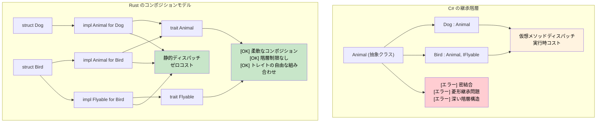

## 継承 vs コンポジション

> **学べること:** Rust にクラス継承が存在しない理由、トレイトと構造体がどのように深いクラス階層を代替するか、およびコンポジション（合成）を通じて多相性（ポリモーフィズム）を実現するための実践的パターン。
>
> **難易度:** 🟡 中級

```csharp
// C# - クラスベースの継承
public abstract class Animal
{
    public string Name { get; protected set; }
    public abstract void MakeSound();
    
    public virtual void Sleep()
    {
        Console.WriteLine($"{Name} is sleeping");
    }
}

public class Dog : Animal
{
    public Dog(string name) { Name = name; }
    
    public override void MakeSound()
    {
        Console.WriteLine("Woof!");
    }
    
    public void Fetch()
    {
        Console.WriteLine($"{Name} is fetching");
    }
}

// インターフェースベースの契約
public interface IFlyable
{
    void Fly();
}

public class Bird : Animal, IFlyable
{
    public Bird(string name) { Name = name; }
    
    public override void MakeSound()
    {
        Console.WriteLine("Tweet!");
    }
    
    public void Fly()
    {
        Console.WriteLine($"{Name} is flying");
    }
}
```

### Rust のコンポジションモデル
```rust
// Rust - トレイトを用いた継承よりもコンポジション（合成）を重視するアプローチ
pub trait Animal {
    fn name(&self) -> &str;
    fn make_sound(&self);
    
    // デフォルト実装（C# の仮想メソッドに類似）
    fn sleep(&self) {
        println!("{} は眠っています", self.name());
    }
}

pub trait Flyable {
    fn fly(&self);
}

// データと振る舞いの分離
#[derive(Debug)]
pub struct Dog {
    name: String,
}

#[derive(Debug)]
pub struct Bird {
    name: String,
    wingspan: f64,
}

// 各型に対する振る舞いの実装
impl Animal for Dog {
    fn name(&self) -> &str {
        &self.name
    }
    
    fn make_sound(&self) {
        println!("Woof!");
    }
}

impl Dog {
    pub fn new(name: String) -> Self {
        Dog { name }
    }
    
    pub fn fetch(&self) {
        println!("{} は取ってこようとしています", self.name);
    }
}

impl Animal for Bird {
    fn name(&self) -> &str {
        &self.name
    }
    
    fn make_sound(&self) {
        println!("Tweet!");
    }
}

impl Flyable for Bird {
    fn fly(&self) {
        println!("{} は翼長 {:.1}m で飛んでいます", self.name, self.wingspan);
    }
}

// 複数のトレイト境界（複数のインターフェース実装に類似）
fn make_flying_animal_sound<T>(animal: &T) 
where 
    T: Animal + Flyable,
{
    animal.make_sound();
    animal.fly();
}
```



---

## 演習

<details>
<summary><strong>🏋️ 演習：継承をトレイトに置き換える</strong>（クリックして展開）</summary>

この C# コードは継承を使用しています。トレイトのコンポジション（合成）を用いて Rust で書き直してください：

```csharp
public abstract class Shape { public abstract double Area(); }
public abstract class Shape3D : Shape { public abstract double Volume(); }
public class Cylinder : Shape3D
{
    public double Radius { get; }
    public double Height { get; }
    public Cylinder(double r, double h) { Radius = r; Height = h; }
    public override double Area() => 2.0 * Math.PI * Radius * (Radius + Height);
    public override double Volume() => Math.PI * Radius * Radius * Height;
}
```

要件:
1. `fn area(&self) -> f64` を持つ `HasArea` トレイト
2. `fn volume(&self) -> f64` を持つ `HasVolume` トレイト
3. 両方を実装する `Cylinder` 構造体
4. 関数 `fn print_shape_info(shape: &(impl HasArea + HasVolume))` — トレイト境界の合成に注目してください（継承は不要です）

<details>
<summary>🔑 解答例</summary>

```rust
use std::f64::consts::PI;

trait HasArea {
    fn area(&self) -> f64;
}

trait HasVolume {
    fn volume(&self) -> f64;
}

struct Cylinder {
    radius: f64,
    height: f64,
}

impl HasArea for Cylinder {
    fn area(&self) -> f64 {
        2.0 * PI * self.radius * (self.radius + self.height)
    }
}

impl HasVolume for Cylinder {
    fn volume(&self) -> f64 {
        PI * self.radius * self.radius * self.height
    }
}

fn print_shape_info(shape: &(impl HasArea + HasVolume)) {
    println!("面積:   {:.2}", shape.area());
    println!("体積:   {:.2}", shape.volume());
}

fn main() {
    let c = Cylinder { radius: 3.0, height: 5.0 };
    print_shape_info(&c);
}
```

**重要な洞察**: C# では 3 段階の階層構造（Shape → Shape3D → Cylinder）が必要でした。一方 Rust ではフラットなトレイトのコンポジションを採用しており、`impl HasArea + HasVolume` によって継承の深さを作ることなく機能を組み合わせることができます。

</details>
</details>

***
