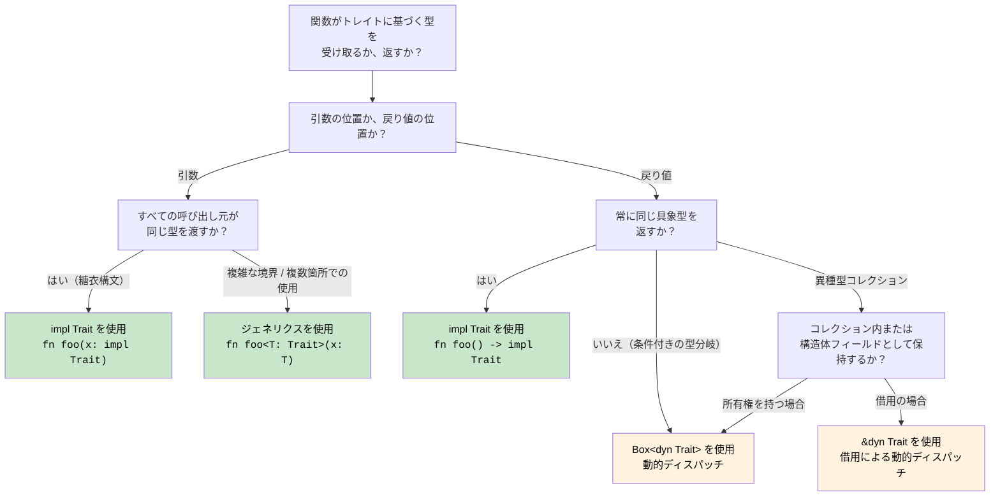

## トレイト — Rust のインターフェース

> **学べること:** トレイトと C# インターフェースの比較、デフォルトメソッド実装、トレイトオブジェクト（`dyn Trait`）とジェネリクス境界（`impl Trait`）、derive 可能なトレイト、主要な標準ライブラリトレイト、関連型、およびトレイトによる演算子オーバーロード。
>
> **難易度:** 🟡 中級

トレイトは、Rust において共通の振る舞いを定義するための仕組みです。C# のインターフェースに似ていますが、より強力です。

### C# インターフェースとの比較
```csharp
// C# のインターフェース定義
public interface IAnimal
{
    string Name { get; }
    void MakeSound();
    
    // デフォルト実装（C# 8 以降）
    string Describe()
    {
        return $"{Name} makes a sound";
    }
}

// C# のインターフェース実装
public class Dog : IAnimal
{
    public string Name { get; }
    
    public Dog(string name)
    {
        Name = name;
    }
    
    public void MakeSound()
    {
        Console.WriteLine("Woof!");
    }
    
    // デフォルト実装をオーバーライド可能
    public string Describe()
    {
        return $"{Name} is a loyal dog";
    }
}

// ジェネリック制約
public void ProcessAnimal<T>(T animal) where T : IAnimal
{
    animal.MakeSound();
    Console.WriteLine(animal.Describe());
}
```

### Rust のトレイト定義と実装
```rust
// トレイト定義
trait Animal {
    fn name(&self) -> &str;
    fn make_sound(&self);
    
    // デフォルト実装
    fn describe(&self) -> String {
        format!("{} makes a sound", self.name())
    }
    
    // 他のトレイトメソッドを利用するデフォルト実装
    fn introduce(&self) {
        println!("こんにちは、私は {} です", self.name());
        self.make_sound();
    }
}

// 構造体定義
#[derive(Debug)]
struct Dog {
    name: String,
    breed: String,
}

impl Dog {
    fn new(name: String, breed: String) -> Dog {
        Dog { name, breed }
    }
}

// トレイト実装
impl Animal for Dog {
    fn name(&self) -> &str {
        &self.name
    }
    
    fn make_sound(&self) {
        println!("Woof!");
    }
    
    // デフォルト実装をオーバーライド
    fn describe(&self) -> String {
        format!("{} is a loyal {} dog", self.name, self.breed)
    }
}

// 別の構造体での実装
#[derive(Debug)]
struct Cat {
    name: String,
    indoor: bool,
}

impl Animal for Cat {
    fn name(&self) -> &str {
        &self.name
    }
    
    fn make_sound(&self) {
        println!("Meow!");
    }
    
    // デフォルトの describe() 実装を使用
}

// トレイト境界を持つジェネリック関数
fn process_animal<T: Animal>(animal: &T) {
    animal.make_sound();
    println!("{}", animal.describe());
    animal.introduce();
}

// 複数のトレイト境界
fn process_animal_debug<T: Animal + std::fmt::Debug>(animal: &T) {
    println!("デバッグ: {:?}", animal);
    process_animal(animal);
}

fn main() {
    let dog = Dog::new("Buddy".to_string(), "Golden Retriever".to_string());
    let cat = Cat { name: "Whiskers".to_string(), indoor: true };
    
    process_animal(&dog);
    process_animal(&cat);
    
    process_animal_debug(&dog);
}
```

### トレイトオブジェクトと動的ディスパッチ
```csharp
// C# の動的多相性（ポリモーフィズム）
public void ProcessAnimals(List<IAnimal> animals)
{
    foreach (var animal in animals)
    {
        animal.MakeSound(); // 動的ディスパッチ
        Console.WriteLine(animal.Describe());
    }
}

// 使用例
var animals = new List<IAnimal>
{
    new Dog("Buddy"),
    new Cat("Whiskers"),
    new Dog("Rex")
};

ProcessAnimals(animals);
```

```rust
// 動的ディスパッチのための Rust トレイトオブジェクト
fn process_animals(animals: &[Box<dyn Animal>]) {
    for animal in animals {
        animal.make_sound(); // 動的ディスパッチ
        println!("{}", animal.describe());
    }
}

// 代替案: 参照を使用
fn process_animal_refs(animals: &[&dyn Animal]) {
    for animal in animals {
        animal.make_sound();
        println!("{}", animal.describe());
    }
}

fn main() {
    // Box<dyn Trait> を使用
    let animals: Vec<Box<dyn Animal>> = vec![
        Box::new(Dog::new("Buddy".to_string(), "Golden Retriever".to_string())),
        Box::new(Cat { name: "Whiskers".to_string(), indoor: true }),
        Box::new(Dog::new("Rex".to_string(), "German Shepherd".to_string())),
    ];
    
    process_animals(&animals);
    
    // 参照を使用
    let dog = Dog::new("Buddy".to_string(), "Golden Retriever".to_string());
    let cat = Cat { name: "Whiskers".to_string(), indoor: true };
    
    let animal_refs: Vec<&dyn Animal> = vec![&dog, &cat];
    process_animal_refs(&animal_refs);
}
```

### 導出可能なトレイト（Derived Traits）
```rust
// 一般的なトレイトを自動導出
#[derive(Debug, Clone, PartialEq, Eq, Hash)]
struct Person {
    name: String,
    age: u32,
}

// 生成されるコード（簡略化版）:
impl std::fmt::Debug for Person {
    fn fmt(&self, f: &mut std::fmt::Formatter<'_>) -> std::fmt::Result {
        f.debug_struct("Person")
            .field("name", &self.name)
            .field("age", &self.age)
            .finish()
    }
}

impl Clone for Person {
    fn clone(&self) -> Self {
        Person {
            name: self.name.clone(),
            age: self.age,
        }
    }
}

impl PartialEq for Person {
    fn eq(&self, other: &Self) -> bool {
        self.name == other.name && self.age == other.age
    }
}

// 使用例
fn main() {
    let person1 = Person {
        name: "Alice".to_string(),
        age: 30,
    };
    
    let person2 = person1.clone(); // Clone トレイト
    
    println!("{:?}", person1); // Debug トレイト
    println!("一致: {}", person1 == person2); // PartialEq トレイト
}
```

### 主要な標準ライブラリトレイト
```rust
use std::collections::HashMap;

// ユーザー向けの表示用 Display トレイト
impl std::fmt::Display for Person {
    fn fmt(&self, f: &mut std::fmt::Formatter<'_>) -> std::fmt::Result {
        write!(f, "{} (age {})", self.name, self.age)
    }
}

// 型変換のための From トレイト
impl From<(String, u32)> for Person {
    fn from((name, age): (String, u32)) -> Self {
        Person { name, age }
    }
}

// From を実装すると Into トレイトも自動的に実装される
fn create_person() {
    let person: Person = ("Alice".to_string(), 30).into();
    println!("{}", person);
}

// Iterator トレイトの実装
struct PersonIterator {
    people: Vec<Person>,
    index: usize,
}

impl Iterator for PersonIterator {
    type Item = Person;
    
    fn next(&mut self) -> Option<Self::Item> {
        if self.index < self.people.len() {
            let person = self.people[self.index].clone();
            self.index += 1;
            Some(person)
        } else {
            None
        }
    }
}

impl Person {
    fn iterator(people: Vec<Person>) -> PersonIterator {
        PersonIterator { people, index: 0 }
    }
}

fn main() {
    let people = vec![
        Person::from(("Alice".to_string(), 30)),
        Person::from(("Bob".to_string(), 25)),
        Person::from(("Charlie".to_string(), 35)),
    ];
    
    // カスタムイテレータを使用
    for person in Person::iterator(people.clone()) {
        println!("{}", person); // Display トレイトを使用
    }
}
```

***


<details>
<summary><strong>🏋️ 演習：トレイトベースの描画システム</strong>（クリックして展開）</summary>

**課題**: `area()` メソッドと `draw()` デフォルトメソッドを持つ `Drawable` トレイトを実装してください。`Circle` 構造体と `Rect` 構造体を作成します。`&[Box<dyn Drawable>]` を受け取り、合計面積を出力する関数を作成してください。

<details>
<summary>🔑 解答例</summary>

```rust
use std::f64::consts::PI;

trait Drawable {
    fn area(&self) -> f64;

    fn draw(&self) {
        println!("面積 {:.2} の図形を描画中", self.area());
    }
}

struct Circle { radius: f64 }
struct Rect   { w: f64, h: f64 }

impl Drawable for Circle {
    fn area(&self) -> f64 { PI * self.radius * self.radius }
}

impl Drawable for Rect {
    fn area(&self) -> f64 { self.w * self.h }
}

fn total_area(shapes: &[Box<dyn Drawable>]) -> f64 {
    shapes.iter().map(|s| s.area()).sum()
}

fn main() {
    let shapes: Vec<Box<dyn Drawable>> = vec![
        Box::new(Circle { radius: 5.0 }),
        Box::new(Rect { w: 4.0, h: 6.0 }),
        Box::new(Circle { radius: 2.0 }),
    ];
    for s in &shapes { s.draw(); }
    println!("合計面積: {:.2}", total_area(&shapes));
}
```

**要点**:
- `dyn Trait` は実行時多相性（C# の `IDrawable` に相当）を提供します
- `Box<dyn Trait>` はヒープに確保され、異種型のコレクション（heterogeneous collections）を扱う際に必要です
- デフォルトメソッドは、C# 8 以降のインターフェースのデフォルト実装とまったく同様に機能します

</details>
</details>

### 関連型：型メンバーを持つトレイト

C# のインターフェースには関連型がありませんが、Rust のトレイトには存在します。`Iterator` はまさにこの仕組みで動作しています：

```rust
// Iterator トレイトは関連型 'Item' を持ちます
trait Iterator {
    type Item;                         // 各実装者が Item の具体的な型を定義します
    fn next(&mut self) -> Option<Self::Item>;
}

struct Counter { max: u32, current: u32 }

impl Iterator for Counter {
    type Item = u32;                   // この Counter は u32 値を生成します
    fn next(&mut self) -> Option<u32> {
        if self.current < self.max {
            self.current += 1;
            Some(self.current)
        } else {
            None
        }
    }
}
```

C# では、`IEnumerator<T>` がこの目的のためにジェネリックパラメータ（`T`）を使用します。Rust の関連型はそれとは異なり、`Iterator` はトレイトレベルでのジェネリックパラメータではなく、実装ごとに*単一の* `Item` 型を持ちます。これにより、トレイト境界の記述が簡潔になります（例：`impl Iterator<Item = u32>` と C# の `IEnumerable<int>` の対比）。

### トレイトによる演算子オーバーロード

C# では `public static MyType operator+(MyType a, MyType b)` を定義します。Rust では、すべての演算子が `std::ops` のトレイトに対応付けられています：

```rust
use std::ops::Add;

#[derive(Debug, Clone, Copy)]
struct Vec2 { x: f64, y: f64 }

impl Add for Vec2 {
    type Output = Vec2;
    fn add(self, rhs: Vec2) -> Vec2 {
        Vec2 { x: self.x + rhs.x, y: self.y + rhs.y }
    }
}

let a = Vec2 { x: 1.0, y: 2.0 };
let b = Vec2 { x: 3.0, y: 4.0 };
let c = a + b;  // <Vec2 as Add>::add(a, b) が呼び出される
```

| C# | Rust | 備考 |
|----|------|-------|
| `operator+` | `impl Add` | 値渡しの `self` — `Copy` ではない型の場合は所有権を消費 |
| `operator==` | `impl PartialEq` | 通常は `#[derive(PartialEq)]` |
| `operator<` | `impl PartialOrd` | 通常は `#[derive(PartialOrd)]` |
| `ToString()` | `impl fmt::Display` | `println!("{}", x)` で使用される |
| 暗黙の型変換 | 該当なし | Rust には暗黙の型変換はありません — `From`/`Into` を使用 |

### コヒーレンス（一貫性）：孤児のルール（Orphan Rule）

トレイトを実装できるのは、その「トレイト」または「型」のどちらか一方を自身が所有（定義）している場合のみです。これにより、クレート間での実装の衝突を防ぎます：

```rust
// ✅ OK — 自身が MyType を所有している
impl Display for MyType { ... }

// ✅ OK — 自身が MyTrait を所有している
impl MyTrait for String { ... }

// ❌ エラー — Display も String も所有していない
impl Display for String { ... }
```

C# には同等の制限はありません。どのようなコードでも任意の型に対して拡張メソッドを追加できるため、名前の曖昧さが発生する可能性があります。

<!-- ch10.0a: impl Trait and Dispatch Strategies -->
## `impl Trait`：ボクシングなしでトレイトを返す

C# のインターフェースは常に戻り値の型として使用できます。Rust では、トレイトを返す際に静的ディスパッチ（`impl Trait`）か動的ディスパッチ（`dyn Trait`）かの判断が必要です。

### 引数の位置での `impl Trait`（ジェネリクスの糖衣構文）
```rust
// これら 2 つは等価です:
fn print_animal(animal: &impl Animal) { animal.make_sound(); }
fn print_animal<T: Animal>(animal: &T)  { animal.make_sound(); }

// impl Trait はジェネリックパラメータの単なる糖衣構文（シンタックスシュガー）です
// コンパイラは各具象型ごとに特殊化されたコピーを生成します（単相化: monomorphization）
```

### 戻り値の位置での `impl Trait`（決定的な違い）
```rust
// 具象型を公開せずにイテレータを返す
fn even_squares(limit: u32) -> impl Iterator<Item = u32> {
    (0..limit)
        .filter(|n| n % 2 == 0)
        .map(|n| n * n)
}
// 呼び出し側には「Iterator<Item = u32> を実装する何らかの型」として見える
// 実際の型（Filter<Map<Range<u32>, ...>>）は名前を付けるのが困難ですが、impl Trait がこれを解決します。

fn main() {
    for n in even_squares(20) {
        print!("{n} ");
    }
    // 出力: 0 4 16 36 64 100 144 196 256 324
}
```

```csharp
// C# — インターフェースを返す（常に動的ディスパッチ、ヒープ確保されるイテレータオブジェクト）
public IEnumerable<int> EvenSquares(int limit) =>
    Enumerable.Range(0, limit)
        .Where(n => n % 2 == 0)
        .Select(n => n * n);
// 戻り値の型は IEnumerable インターフェースの背後に具象イテレータを隠蔽する
// Rust の Box<dyn Trait> とは異なり、C# では明示的なボックス化は行わず、ランタイムがメモリ確保を処理する
```

### クロージャの返却：`impl Fn` vs `Box<dyn Fn>`
```rust
// クロージャを返す — クロージャの型は直接名付けることができないため、impl Fn が不可欠です
fn make_adder(x: i32) -> impl Fn(i32) -> i32 {
    move |y| x + y
}

let add5 = make_adder(5);
println!("{}", add5(3)); // 8

// 条件に応じて異なるクロージャを返す必要がある場合は Box が必要です:
fn choose_op(add: bool) -> Box<dyn Fn(i32, i32) -> i32> {
    if add {
        Box::new(|a, b| a + b)
    } else {
        Box::new(|a, b| a * b)
    }
}
// impl Trait は単一の具象型を必要とします。異なるクロージャはそれぞれ異なる型です
```

```csharp
// C# — デリゲートがこれを自然に処理する（常にヒープ確保される）
Func<int, int> MakeAdder(int x) => y => x + y;
Func<int, int, int> ChooseOp(bool add) => add ? (a, b) => a + b : (a, b) => a * b;
```

### ディスパッチ方式の決定：`impl Trait` vs `dyn Trait` vs ジェネリクス

これは C# 開発者が Rust で直面する最初の設計上の意思決定です。以下に完全なガイドを示します：



| アプローチ | ディスパッチ | メモリ確保 | 使い分けの基準 |
|----------|----------|------------|-------------|
| `fn foo<T: Trait>(x: T)` | 静的（単相化） | スタック | 複数のトレイト境界、turbofish 構文が必要、同じ型の再利用 |
| `fn foo(x: impl Trait)` | 静的（単相化） | スタック | 単純な境界、簡潔な構文、使い切りのパラメータ |
| `fn foo() -> impl Trait` | 静的 | スタック | 単一の具象型の返却、イテレータ、クロージャ |
| `fn foo() -> Box<dyn Trait>` | 動的（vtable） | **ヒープ** | 異なる戻り値の型、コレクション内のトレイトオブジェクト |
| `&dyn Trait` / `&mut dyn Trait` | 動的（vtable） | 確保なし | 借用された異種型の参照、関数パラメータ |

```rust
// まとめ: 最速から最も柔軟な方式まで
fn static_dispatch(x: impl Display)             { /* 最速、メモリ確保なし */ }
fn generic_dispatch<T: Display + Clone>(x: T)    { /* 最速、複数の境界に対応 */ }
fn dynamic_dispatch(x: &dyn Display)             { /* vtable ルックアップ、メモリ確保なし */ }
fn boxed_dispatch(x: Box<dyn Display>)           { /* vtable ルックアップ + ヒープ確保 */ }
```

***
