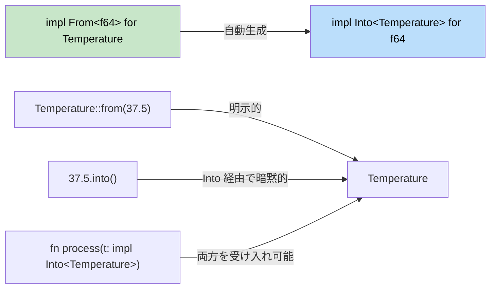

## Rustにおける型変換

> **学習内容:** C# の暗黙的/明示的演算子に対する `From`/`Into` トレイト、失敗する可能性のある変換のための `TryFrom`/`TryInto`、パースのための `FromStr`、および慣用的な文字列変換パターン。
>
> **難易度:** 🟡 中級

C# では暗黙的/明示的な型変換とキャスト演算子を使用します。Rust では安全で明示的な型変換のために `From` および `Into` トレイトを使用します。

### C#の変換パターン
```csharp
// C# の暗黙的/明示的な型変換
public class Temperature
{
    public double Celsius { get; }
    
    public Temperature(double celsius) { Celsius = celsius; }
    
    // 暗黙的変換
    public static implicit operator double(Temperature t) => t.Celsius;
    
    // 明示的変換
    public static explicit operator Temperature(double d) => new Temperature(d);
}

double temp = new Temperature(100.0);  // 暗黙的
Temperature t = (Temperature)37.5;     // 明示的
```

### RustのFromとInto
```rust
#[derive(Debug)]
struct Temperature {
    celsius: f64,
}

impl From<f64> for Temperature {
    fn from(celsius: f64) -> Self {
        Temperature { celsius }
    }
}

impl From<Temperature> for f64 {
    fn from(temp: Temperature) -> f64 {
        temp.celsius
    }
}

fn main() {
    // From
    let temp = Temperature::from(100.0);
    
    // Into（From を実装すると自動的に利用可能になります）
    let temp2: Temperature = 37.5.into();
    
    // 関数の引数でも機能します
    fn process_temp(temp: impl Into<Temperature>) {
        let t: Temperature = temp.into();
        println!("温度: {:.1}°C", t.celsius);
    }
    
    process_temp(98.6);
    process_temp(Temperature { celsius: 0.0 });
}
```



> **経験則（Rule of thumb）**: `From` を実装すれば、`Into` は自動的に付いてきます。呼び出し側はコードとして読みやすい方を自由に選択できます。

### 失敗する可能性のある変換のためのTryFrom
```rust
use std::convert::TryFrom;

impl TryFrom<i32> for Temperature {
    type Error = String;
    
    fn try_from(value: i32) -> Result<Self, Self::Error> {
        if value < -273 {
            Err(format!("温度 {}°C は絶対零度を下回っています", value))
        } else {
            Ok(Temperature { celsius: value as f64 })
        }
    }
}

fn main() {
    match Temperature::try_from(-300) {
        Ok(t) => println!("有効: {:?}", t),
        Err(e) => println!("エラー: {}", e),
    }
}
```

### 文字列の変換
```rust
// Display トレイト経由の ToString
impl std::fmt::Display for Temperature {
    fn fmt(&self, f: &mut std::fmt::Formatter<'_>) -> std::fmt::Result {
        write!(f, "{:.1}°C", self.celsius)
    }
}

// これで .to_string() が自動的に機能します
let s = Temperature::from(100.0).to_string(); // "100.0°C"

// パース用の FromStr
use std::str::FromStr;

impl FromStr for Temperature {
    type Err = String;
    
    fn from_str(s: &str) -> Result<Self, Self::Err> {
        let s = s.trim_end_matches("°C").trim();
        let celsius: f64 = s.parse().map_err(|e| format!("無効な温度です: {}", e))?;
        Ok(Temperature { celsius })
    }
}

let t: Temperature = "100.0°C".parse().unwrap();
```

---

## 演習問題

<details>
<summary><strong>🏋️ 演習問題: 通貨コンバータ</strong> (クリックして展開)</summary>

変換エコシステム全体を実践する `Money` 構造体を作成してください:

1. `Money { cents: i64 }`（浮動小数点数の問題を回避するため、値をセント単位で保持します）
2. `From<i64>` を実装する（入力をドル単位として扱い、`cents = dollars * 100` とする）
3. `TryFrom<f64>` を実装する — 負の金額を拒否し、最も近いセントに四捨五入する
4. `Display` を実装して `"$1.50"` の形式で表示する
5. `FromStr` を実装して `"$1.50"` または `"1.50"` をパースして `Money` に戻す
6. 値を合計する関数 `fn total(items: &[impl Into<Money> + Copy]) -> Money` を作成する

<details>
<summary>🔑 解答例</summary>

```rust
use std::fmt;
use std::str::FromStr;

#[derive(Debug, Clone, Copy)]
struct Money { cents: i64 }

impl From<i64> for Money {
    fn from(dollars: i64) -> Self {
        Money { cents: dollars * 100 }
    }
}

impl TryFrom<f64> for Money {
    type Error = String;
    fn try_from(value: f64) -> Result<Self, Self::Error> {
        if value < 0.0 {
            Err(format!("負の金額です: {value}"))
        } else {
            Ok(Money { cents: (value * 100.0).round() as i64 })
        }
    }
}

impl fmt::Display for Money {
    fn fmt(&self, f: &mut fmt::Formatter<'_>) -> fmt::Result {
        write!(f, "${}.{:02}", self.cents / 100, self.cents.abs() % 100)
    }
}

impl FromStr for Money {
    type Err = String;
    fn from_str(s: &str) -> Result<Self, Self::Err> {
        let s = s.trim_start_matches('$');
        let val: f64 = s.parse().map_err(|e| format!("{e}"))?;
        Money::try_from(val)
    }
}

fn main() {
    let a = Money::from(10);                       // $10.00
    let b = Money::try_from(3.50).unwrap();         // $3.50
    let c: Money = "$7.25".parse().unwrap();        // $7.25
    println!("{a} + {b} + {c}");
}
```

</details>
</details>

***
