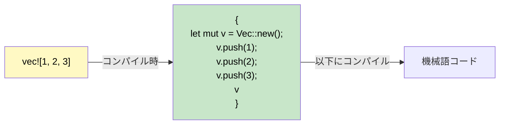

## マクロ: コードを書くコード

> **学習内容:** Rust にマクロが必要な理由（オーバーロードや可変長引数の不在）、`macro_rules!` の基本、`!` 接尾辞の慣例、一般的な derive マクロ、および迅速なデバッグのための `dbg!()`。
>
> **難易度:** 🟡 中級

C# には Rust のマクロに直接相当するものはありません。マクロが存在する理由とその仕組みを理解することで、C# 開発者が抱きがちな大きな疑問を解消できます。

### なぜRustにマクロが存在するのか



```csharp
// C# にはマクロを不要にする言語機能があります:
Console.WriteLine("Hello");           // メソッドオーバーロード (1〜16個のパラメータ)
Console.WriteLine("{0}, {1}", a, b);  // params 配列による可変長引数
var list = new List<int> { 1, 2, 3 }; // コレクション初期化子構文
```

```rust
// Rust には関数のオーバーロードも、可変長引数も、特別なリテラル構文もありません。
// マクロがこれらの隙間を埋めます:
println!("Hello");                    // マクロ — 0個以上の引数をコンパイル時に処理
println!("{}, {}", a, b);             // マクロ — コンパイル時に型チェックされる
let list = vec![1, 2, 3];            // マクロ — Vec::new() + push() に展開される
```

### マクロの見分け方: 「!」接尾辞

すべてのマクロ呼び出しの末尾には `!` が付きます。`!` を見かけたら、それは関数ではなくマクロです:

```rust
println!("hello");     // マクロ — コンパイル時にフォーマット文字列コードを生成
format!("{x}");        // マクロ — String を返し、コンパイル時にフォーマットをチェック
vec![1, 2, 3];         // マクロ — Vec を作成して要素を格納
todo!();               // マクロ — "not yet implemented" でパニック
dbg!(expression);      // マクロ — ファイル名:行番号 + 式 + 値を出力し、値を返す
assert_eq!(a, b);      // マクロ — a ≠ b の場合に差分を表示してパニック
cfg!(target_os = "linux"); // マクロ — コンパイル時のプラットフォーム検出
```

### macro_rules! によるシンプルなマクロの作成
```rust
// キーと値のペアから HashMap を作成するマクロを定義
macro_rules! hashmap {
    // パターン: カンマ区切りの key => value ペア
    ( $( $key:expr => $value:expr ),* $(,)? ) => {{
        let mut map = std::collections::HashMap::new();
        $( map.insert($key, $value); )*
        map
    }};
}

fn main() {
    let scores = hashmap! {
        "Alice" => 100,
        "Bob"   => 85,
        "Carol" => 92,
    };
    println!("{scores:?}");
}
```

### Derive マクロ: トレイトの自動実装
```rust
// #[derive] はトレイトの実装を自動生成する手続き型マクロです
#[derive(Debug, Clone, PartialEq, Eq, Hash)]
struct User {
    name: String,
    age: u32,
}
// コンパイラは構造体のフィールドを検査することで、
// Debug::fmt, Clone::clone, PartialEq::eq などを自動生成します。
```

```csharp
// C# における同等機能: 直接のものはなし — IEquatable や ICloneable などを手動で実装します。
// または record を使用します: public record User(string Name, int Age);
// record は Equals, GetHashCode, ToString を自動生成します — 発想としては似ています！
```

### 一般的な Derive マクロ

| Derive | 用途 | C# の同等機能 |
|--------|------|---------------|
| `Debug` | `{:?}` によるフォーマット文字列出力 | `ToString()` のオーバーライド |
| `Clone` | `.clone()` によるディープコピー | `ICloneable` |
| `Copy` | 暗黙的なビット単位のコピー（`.clone()` は不要） | 値型（`struct`）のセマンティクス |
| `PartialEq`, `Eq` | `==` による等価性比較 | `IEquatable<T>` |
| `PartialOrd`, `Ord` | `<`, `>` による大小比較とソート | `IComparable<T>` |
| `Hash` | `HashMap` のキー用のハッシュ計算 | `GetHashCode()` |
| `Default` | `Default::default()` によるデフォルト値の提供 | 引数なしコンストラクタ |
| `Serialize`, `Deserialize` | JSON / TOML などのシリアライズ（serde） | `[JsonProperty]` 属性 |

> **経験則（Rule of thumb）:** まずすべての型に `#[derive(Debug)]` を付与することから始めましょう。必要に応じて `Clone` や `PartialEq` を追加します。境界（API、ファイル、データベースなど）を越える型には `Serialize, Deserialize` を追加します。

### 手続き型マクロと属性マクロ（基礎知識）

Derive マクロは、コンパイル時に実行されてコードを生成する**手続き型マクロ（procedural macro）**の一種です。この他に以下の2つの形態をよく目にします:

**属性マクロ（Attribute macros）** — `#[...]` でアイテムに付与されます:
```rust
#[tokio::main]          // main() を非同期ランタイムのエントリポイントに変換
async fn main() { }

#[test]                 // 関数を単体テストとしてマーク
fn it_works() { assert_eq!(2 + 2, 4); }

#[cfg(test)]            // テスト時のみこのモジュールを条件付きコンパイル
mod tests { /* ... */ }
```

**関数風マクロ（Function-like macros）** — 関数呼び出しのように見えます:
```rust
// sqlx::query! はコンパイル時にデータベースに対して SQL を検証します
let users = sqlx::query!("SELECT id, name FROM users WHERE active = $1", true)
    .fetch_all(&pool)
    .await?;
```

> **C# 開発者向けの重要な洞察:** 自分で手続き型マクロを*書く*ことは滅多にありません — それは高度なライブラリ作成者向けのツールです。しかし、日常的に*利用する*ことになります（`#[derive(...)]`、`#[tokio::main]`、`#[test]` など）。C# のソースジェネレーター（Source Generators）のようなものと考えてください。自分で実装しなくても、その恩恵を大いに享受できます。

### #[cfg] による条件付きコンパイル

Rust の `#[cfg]` 属性は C# の `#if DEBUG` プリプロセッサディレクティブに似ていますが、型チェックが行われる点が優れています:

```rust
// この関数を Linux でのみコンパイル
#[cfg(target_os = "linux")]
fn platform_specific() {
    println!("Linux で実行中");
}

// デバッグ時のみのアサーション（C# の Debug.Assert に相当）
#[cfg(debug_assertions)]
fn expensive_check(data: &[u8]) {
    assert!(data.len() < 1_000_000, "データが想定外に大きすぎます");
}

// 機能フラグ（C# の #if FEATURE_X に似ていますが、Cargo.toml で宣言します）
#[cfg(feature = "json")]
pub fn to_json<T: Serialize>(val: &T) -> String {
    serde_json::to_string(val).unwrap()
}
```

```csharp
// C# の同等機能
#if DEBUG
    Debug.Assert(data.Length < 1_000_000);
#endif
```

### dbg!() — デバッグの頼れる相棒
```rust
fn calculate(x: i32) -> i32 {
    let intermediate = dbg!(x * 2);     // 出力例: [src/main.rs:3] x * 2 = 10
    let result = dbg!(intermediate + 1); // 出力例: [src/main.rs:4] intermediate + 1 = 11
    result
}
// dbg! は標準エラー出力に出力し、ファイル名:行番号を含み、式自体の値をそのまま返します
// デバッグ目的では Console.WriteLine よりもはるかに便利です！
```

<details>
<summary><strong>🏋️ 演習問題: min! マクロの作成</strong> (クリックして展開)</summary>

**課題**: 2つ以上の引数を受け取り、その中で最小の値を返す `min!` マクロを作成してください。

```rust
// 以下のように動作する必要があります:
let smallest = min!(5, 3, 8, 1, 4); // → 1
let pair = min!(10, 20);             // → 10
```

<details>
<summary>🔑 解答例</summary>

```rust
macro_rules! min {
    // 基本ケース: 単一の値
    ($x:expr) => ($x);
    // 再帰ケース: 最初の値と残りの最小値を比較
    ($x:expr, $($rest:expr),+) => {{
        let first = $x;
        let rest = min!($($rest),+);
        if first < rest { first } else { rest }
    }};
}

fn main() {
    assert_eq!(min!(5, 3, 8, 1, 4), 1);
    assert_eq!(min!(10, 20), 10);
    assert_eq!(min!(42), 42);
    println!("すべてのアサーションに合格しました！");
}
```

**重要なポイント**: `macro_rules!` はトークンツリーに対するパターンマッチングを行います — 値ではなくコードの構造に対して `match` を行うようなものです。

</details>
</details>

***
