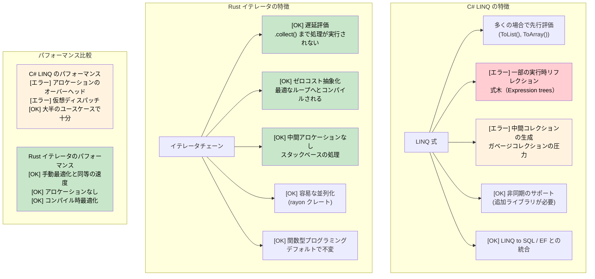

## Rustのクロージャ

> **学習内容:** C# のラムダに対する所有権を意識したキャプチャ（`Fn`/`FnMut`/`FnOnce`）を持つクロージャ、LINQ に代わるゼロコスト抽象化としての Rust イテレータ、遅延評価と先行評価（Lazy vs Eager）、および `rayon` を用いた並列イテレーション。
>
> **難易度:** 🟡 中級

Rust のクロージャは C# のラムダ式やデリゲートに似ていますが、所有権を意識したキャプチャを行う点が異なります。

### C#のラムダとデリゲート
```csharp
// C# - ラムダは参照によってキャプチャします
Func<int, int> doubler = x => x * 2;
Action<string> printer = msg => Console.WriteLine(msg);

// 外部の変数をキャプチャするクロージャ
int multiplier = 3;
Func<int, int> multiply = x => x * multiplier;
Console.WriteLine(multiply(5)); // 15

// LINQ ではラムダを多用します
var evens = numbers.Where(n => n % 2 == 0).ToList();
```

### Rustのクロージャ
```rust
// Rust のクロージャ - 所有権を意識したキャプチャ
let doubler = |x: i32| x * 2;
let printer = |msg: &str| println!("{}", msg);

// 参照によるキャプチャ（不変アクセスのデフォルト）
let multiplier = 3;
let multiply = |x: i32| x * multiplier; // multiplier を借用
println!("{}", multiply(5)); // 15
println!("{}", multiplier); // 引き続きアクセス可能

// ムーブによるキャプチャ
let data = vec![1, 2, 3];
let owns_data = move || {
    println!("{:?}", data); // data がクロージャ内にムーブされる
};
owns_data();
// println!("{:?}", data); // エラー: data はムーブ済み

// イテレータでクロージャを使用
let numbers = vec![1, 2, 3, 4, 5];
let evens: Vec<&i32> = numbers.iter().filter(|&&n| n % 2 == 0).collect();
```

### クロージャの型（トレイト）
```rust
// Fn - キャプチャした値を不変借用する
fn apply_fn(f: impl Fn(i32) -> i32, x: i32) -> i32 {
    f(x)
}

// FnMut - キャプチャした値を可変借用する
fn apply_fn_mut(mut f: impl FnMut(i32), values: &[i32]) {
    for &v in values {
        f(v);
    }
}

// FnOnce - キャプチャした値の所有権を奪う
fn apply_fn_once(f: impl FnOnce() -> Vec<i32>) -> Vec<i32> {
    f() // 1回しか呼び出せない
}

fn main() {
    // Fn の例
    let multiplier = 3;
    let result = apply_fn(|x| x * multiplier, 5);
    
    // FnMut の例
    let mut sum = 0;
    apply_fn_mut(|x| sum += x, &[1, 2, 3, 4, 5]);
    println!("合計: {}", sum); // 15
    
    // FnOnce の例
    let data = vec![1, 2, 3];
    let result = apply_fn_once(move || data); // data をムーブする
}
```

***

## LINQ vs Rustイテレータ

### C# LINQ（統合言語クエリ）
```csharp
// C# LINQ - 宣言的なデータ処理
var numbers = new[] { 1, 2, 3, 4, 5, 6, 7, 8, 9, 10 };

var result = numbers
    .Where(n => n % 2 == 0)           // 偶数をフィルタリング
    .Select(n => n * n)               // 2乗する
    .Where(n => n > 10)               // 10より大きいものをフィルタリング
    .OrderByDescending(n => n)        // 降順にソート
    .Take(3)                          // 最初の3つを取得
    .ToList();                        // 具体化（リスト化）

// 複雑なオブジェクトに対する LINQ
var users = GetUsers();
var activeAdults = users
    .Where(u => u.IsActive && u.Age >= 18)
    .GroupBy(u => u.Department)
    .Select(g => new {
        Department = g.Key,
        Count = g.Count(),
        AverageAge = g.Average(u => u.Age)
    })
    .OrderBy(x => x.Department)
    .ToList();

// 非同期 LINQ（追加ライブラリを使用）
var results = await users
    .ToAsyncEnumerable()
    .WhereAwait(async u => await IsActiveAsync(u.Id))
    .SelectAwait(async u => await EnrichUserAsync(u))
    .ToListAsync();
```

### Rustのイテレータ
```rust
// Rust のイテレータ - 遅延評価、ゼロコスト抽象化
let numbers = vec![1, 2, 3, 4, 5, 6, 7, 8, 9, 10];

let result: Vec<i32> = numbers
    .iter()
    .filter(|&&n| n % 2 == 0)        // 偶数をフィルタリング
    .map(|&n| n * n)                 // 2乗する
    .filter(|&n| n > 10)             // 10より大きいものをフィルタリング
    .collect::<Vec<_>>()             // Vec に収集
    .into_iter()
    .rev()                           // イテレーション順序を反転
    .take(3)                         // 最初の3つを取得
    .collect();                      // 具体化（コレクションに収集）

// 複雑なイテレータチェーン
use std::collections::HashMap;

#[derive(Debug, Clone)]
struct User {
    name: String,
    age: u32,
    department: String,
    is_active: bool,
}

fn process_users(users: Vec<User>) -> HashMap<String, (usize, f64)> {
    users
        .into_iter()
        .filter(|u| u.is_active && u.age >= 18)
        .fold(HashMap::new(), |mut acc, user| {
            let entry = acc.entry(user.department.clone()).or_insert((0, 0.0));
            entry.0 += 1;  // カウント
            entry.1 += user.age as f64;  // 年齢の合計
            acc
        })
        .into_iter()
        .map(|(dept, (count, sum))| (dept, (count, sum / count as f64)))  // 平均
        .collect()
}

// rayon を使用した並列処理
use rayon::prelude::*;

fn parallel_processing(numbers: Vec<i32>) -> Vec<i32> {
    numbers
        .par_iter()                  // 並列イテレータ
        .filter(|&&n| n % 2 == 0)
        .map(|&n| expensive_computation(n))
        .collect()
}

fn expensive_computation(n: i32) -> i32 {
    // 重い計算をシミュレート
    (0..1000).fold(n, |acc, _| acc + 1)
}
```



***


<details>
<summary><strong>🏋️ 演習問題: LINQからイテレータへの変換</strong> (クリックして展開)</summary>

**課題**: 以下の C# LINQ パイプラインを慣用的な Rust のイテレータコードに変換してください。

```csharp
// C# — Rust に変換してください
record Employee(string Name, string Dept, int Salary);

var result = employees
    .Where(e => e.Salary > 50_000)
    .GroupBy(e => e.Dept)
    .Select(g => new {
        Department = g.Key,
        Count = g.Count(),
        AvgSalary = g.Average(e => e.Salary)
    })
    .OrderByDescending(x => x.AvgSalary)
    .ToList();
```

<details>
<summary>🔑 解答例</summary>

```rust
use std::collections::HashMap;

struct Employee { name: String, dept: String, salary: u32 }

#[derive(Debug)]
struct DeptStats { department: String, count: usize, avg_salary: f64 }

fn department_stats(employees: &[Employee]) -> Vec<DeptStats> {
    let mut by_dept: HashMap<&str, Vec<u32>> = HashMap::new();
    for e in employees.iter().filter(|e| e.salary > 50_000) {
        by_dept.entry(&e.dept).or_default().push(e.salary);
    }

    let mut stats: Vec<DeptStats> = by_dept
        .into_iter()
        .map(|(dept, salaries)| {
            let count = salaries.len();
            let avg = salaries.iter().sum::<u32>() as f64 / count as f64;
            DeptStats { department: dept.to_string(), count, avg_salary: avg }
        })
        .collect();

    stats.sort_by(|a, b| b.avg_salary.partial_cmp(&a.avg_salary).unwrap());
    stats
}
```

**重要なポイント**:
- Rust のイテレータには標準で `group_by` が組み込まれていません — `HashMap` + `fold` / `for` が慣用的なパターンです
- `itertools` クレートを使用すると、より LINQ に近い構文の `.group_by()` が追加されます
- イテレータチェーンはゼロコストです — コンパイラが単純なループへと最適化します

</details>
</details>


<!-- ch12.0a: itertools — LINQ Power Tools -->
## itertools: 不足しているLINQ操作

Rust 標準のイテレータは `map`、`filter`、`fold`、`take`、`collect` などをカバーしています。しかし、`GroupBy`、`Zip`、`Chunk`、`SelectMany`、`Distinct` などを使い慣れた C# 開発者は、機能の不足にすぐ気づくでしょう。**`itertools`** クレートがそれらの隙間を埋めてくれます。

```toml
# Cargo.toml
[dependencies]
itertools = "0.12"
```

### 比較: LINQ vs itertools

```csharp
// C# — GroupBy
var byDept = employees.GroupBy(e => e.Department)
    .Select(g => new { Dept = g.Key, Count = g.Count() });

// C# — Chunk（バッチ処理）
var batches = items.Chunk(100);  // IEnumerable<T[]>

// C# — Distinct / DistinctBy
var unique = users.DistinctBy(u => u.Email);

// C# — SelectMany（平坦化）
var allTags = posts.SelectMany(p => p.Tags);

// C# — Zip
var pairs = names.Zip(scores, (n, s) => new { Name = n, Score = s });

// C# — スライディングウィンドウ
var windows = data.Zip(data.Skip(1), data.Skip(2))
    .Select(triple => (triple.First + triple.Second + triple.Third) / 3.0);
```

```rust
use itertools::Itertools;

// Rust — group_by（入力がソートされている必要があります）
let by_dept = employees.iter()
    .sorted_by_key(|e| &e.department)
    .group_by(|e| &e.department);
for (dept, group) in &by_dept {
    println!("{}: {} 人の従業員", dept, group.count());
}

// Rust — chunks（バッチ処理）
let batches = items.iter().chunks(100);
for batch in &batches {
    process_batch(batch.collect::<Vec<_>>());
}

// Rust — unique / unique_by
let unique: Vec<_> = users.iter().unique_by(|u| &u.email).collect();

// Rust — flat_map（SelectMany 相当 — 標準で組み込み済み！）
let all_tags: Vec<&str> = posts.iter().flat_map(|p| &p.tags).collect();

// Rust — zip（標準で組み込み済み！）
let pairs: Vec<_> = names.iter().zip(scores.iter()).collect();

// Rust — tuple_windows（スライディングウィンドウ）
let moving_avg: Vec<f64> = data.iter()
    .tuple_windows::<(_, _, _)>()
    .map(|(a, b, c)| (*a + *b + *c) as f64 / 3.0)
    .collect();
```

### itertools クイックリファレンス

| LINQ メソッド | itertools の同等機能 | 備考 |
|------------|---------------------|-------|
| `GroupBy(key)` | `.sorted_by_key().group_by()` | ソートされた入力が必要（LINQ とは異なります） |
| `Chunk(n)` | `.chunks(n)` | イテレータのイテレータを返す |
| `Distinct()` | `.unique()` | `Eq + Hash` が必要 |
| `DistinctBy(key)` | `.unique_by(key)` | |
| `SelectMany()` | `.flat_map()` | 標準ライブラリ（std）に組み込み済み — クレート不要 |
| `Zip()` | `.zip()` | 標準ライブラリ（std）に組み込み済み |
| `Aggregate()` | `.fold()` | 標準ライブラリ（std）に組み込み済み |
| `Any()` / `All()` | `.any()` / `.all()` | 標準ライブラリ（std）に組み込み済み |
| `First()` / `Last()` | `.next()` / `.last()` | 標準ライブラリ（std）に組み込み済み |
| `Skip(n)` / `Take(n)` | `.skip(n)` / `.take(n)` | 標準ライブラリ（std）に組み込み済み |
| `OrderBy()` | `.sorted()` / `.sorted_by()` | `itertools`（std には存在しません） |
| `ThenBy()` | `.sorted_by(\|a,b\| a.x.cmp(&b.x).then(a.y.cmp(&b.y)))` | `Ordering::then` のチェーン |
| `Intersect()` | `HashSet` の積集合 | 直接のイテレータメソッドなし |
| `Concat()` | `.chain()` | 標準ライブラリ（std）に組み込み済み |
| スライディングウィンドウ | `.tuple_windows()` | 固定サイズのタプル |
| 直積（デカルト積） | `.cartesian_product()` | `itertools` |
| インターリーブ（交互配置） | `.interleave()` | `itertools` |
| 順列 | `.permutations(k)` | `itertools` |

### 実践例: ログ分析パイプライン

```rust
use itertools::Itertools;
use std::collections::HashMap;

#[derive(Debug)]
struct LogEntry { level: String, module: String, message: String }

fn analyze_logs(entries: &[LogEntry]) {
    // 最もログ出力の多い上位5モジュール（LINQ の GroupBy + OrderByDescending + Take に相当）
    let noisy: Vec<_> = entries.iter()
        .into_group_map_by(|e| &e.module) // itertools: 直接 HashMap へグループ化
        .into_iter()
        .sorted_by(|a, b| b.1.len().cmp(&a.1.len()))
        .take(5)
        .collect();

    for (module, entries) in &noisy {
        println!("{}: {} 件のエントリ", module, entries.len());
    }

    // 100エントリごとのウィンドウにおけるエラー率（スライディングウィンドウ）
    let error_rates: Vec<f64> = entries.iter()
        .map(|e| if e.level == "ERROR" { 1.0 } else { 0.0 })
        .collect::<Vec<_>>()
        .windows(100)  // std のスライスメソッド
        .map(|w| w.iter().sum::<f64>() / 100.0)
        .collect();

    // 連続する同一メッセージを重複排除
    let deduped: Vec<_> = entries.iter().dedup_by(|a, b| a.message == b.message).collect();
    println!("重複排除: {} → {} 件のエントリ", entries.len(), deduped.len());
}
```

***
