## スレッドセーフ性: 規約 vs 型システムによる保証

> **学習内容:** C# の規約ベースのアプローチに対する Rust のコンパイル時スレッドセーフ保証、`lock` に対する `Arc<Mutex<T>>`、`ConcurrentQueue` に対するチャネル、`Send`/`Sync` トレイト、スコープ付きスレッド（scoped threads）、および async/await への橋渡し。
>
> **難易度:** 🔴 上級

> **詳細解説**: 本番環境向けの非同期パターン（ストリーム処理、グレースフルシャットダウン、コネクションプーリング、キャンセル安全性）については、姉妹編の [Async Rust Training](../../async-book/src/summary.md) ガイドを参照してください。
>
> **前提知識**: [所有権と借用](ch07-ownership-and-borrowing.md) および [スマートポインタ](ch07-3-smart-pointers-beyond-single-ownership.md)（Rc vs Arc の判断基準）。

### C# - 規約によるスレッドセーフ性
```csharp
// C# のコレクションはデフォルトではスレッドセーフではありません
public class UserService
{
    private readonly List<string> items = new();
    private readonly Dictionary<int, User> cache = new();

    // これはデータ競合を引き起こす可能性があります:
    public void AddItem(string item)
    {
        items.Add(item);  // スレッドセーフではない！
    }

    // 手動でロックを使用する必要があります:
    private readonly object lockObject = new();

    public void SafeAddItem(string item)
    {
        lock (lockObject)
        {
            items.Add(item);  // 安全ですが、実行時オーバーヘッドが発生します
        }
        // 他の場所でロックを忘れるリスクがあります
    }

    // ConcurrentCollection は役立ちますが制限があります:
    private readonly ConcurrentBag<string> safeItems = new();
    
    public void ConcurrentAdd(string item)
    {
        safeItems.Add(item);  // スレッドセーフですが行える操作が限られます
    }

    // 複雑な共有状態の管理
    private readonly ConcurrentDictionary<int, User> threadSafeCache = new();
    private volatile bool isShutdown = false;
    
    public async Task ProcessUser(int userId)
    {
        if (isShutdown) return;  // 競合状態（レイスコンディション）が発生する可能性があります！
        
        var user = await GetUser(userId);
        threadSafeCache.TryAdd(userId, user);  // どのコレクションが安全かをプログラマが覚えておく必要があります
    }

    // スレッドローカルストレージは慎重な管理が必要です
    private static readonly ThreadLocal<Random> threadLocalRandom = 
        new ThreadLocal<Random>(() => new Random());
        
    public int GetRandomNumber()
    {
        return threadLocalRandom.Value.Next();  // 安全ですが手動管理が必要です
    }
}

// 競合状態の可能性があるイベント処理
public class EventProcessor
{
    public event Action<string> DataReceived;
    private readonly List<string> eventLog = new();
    
    public void OnDataReceived(string data)
    {
        // 競合状態 - チェックと呼び出しの間にイベントが null になる可能性があります
        if (DataReceived != null)
        {
            DataReceived(data);
        }
        // 現代の C# (6+) では DataReceived?.Invoke(data); により null 競合を軽減できますが、
        // 基盤となるイベント・デリゲートモデルでは下記のリストに対する競合が依然として発生し得ます
        
        // もう一つの競合状態 - リストがスレッドセーフではありません
        eventLog.Add($"Processed: {data}");
    }
}
```

### Rust - 型システムによって保証されるスレッドセーフ性
```rust
use std::sync::{Arc, Mutex, RwLock};
use std::thread;
use std::collections::HashMap;
use tokio::sync::{mpsc, broadcast};

// Rust はコンパイル時にデータ競合を防止します
pub struct UserService {
    items: Arc<Mutex<Vec<String>>>,
    cache: Arc<RwLock<HashMap<i32, User>>>,
}

impl UserService {
    pub fn new() -> Self {
        UserService {
            items: Arc::new(Mutex::new(Vec::new())),
            cache: Arc::new(RwLock::new(HashMap::new())),
        }
    }
    
    pub fn add_item(&self, item: String) {
        let mut items = self.items.lock().unwrap();
        items.push(item);
        // items がスコープを抜けるとロックは自動的に解放されます
    }
    
    // 複数の読み取り、単一の書き込み — 自動的に強制されます
    pub async fn get_user(&self, user_id: i32) -> Option<User> {
        let cache = self.cache.read().unwrap();
        cache.get(&user_id).cloned()
    }
    
    pub async fn cache_user(&self, user_id: i32, user: User) {
        let mut cache = self.cache.write().unwrap();
        cache.insert(user_id, user);
    }
    
    // スレッド間で共有するために Arc をクローンします
    pub fn process_in_background(&self) {
        let items = Arc::clone(&self.items);
        
        thread::spawn(move || {
            let items = items.lock().unwrap();
            for item in items.iter() {
                println!("Processing: {}", item);
            }
        });
    }
}

// チャネルベースの通信 — 共有状態は不要です
pub struct MessageProcessor {
    sender: mpsc::UnboundedSender<String>,
}

impl MessageProcessor {
    pub fn new() -> (Self, mpsc::UnboundedReceiver<String>) {
        let (tx, rx) = mpsc::unbounded_channel();
        (MessageProcessor { sender: tx }, rx)
    }
    
    pub fn send_message(&self, message: String) -> Result<(), mpsc::error::SendError<String>> {
        self.sender.send(message)
    }
}

// これはコンパイルされません — Rust は可変データを危険に共有することを防止します:
fn impossible_data_race() {
    let mut items = vec![1, 2, 3];
    
    // これはコンパイルされません — items を複数のクロージャにムーブすることはできません
    /*
    thread::spawn(move || {
        items.push(4);  // エラー: ムーブ済みの値の使用
    });
    
    thread::spawn(move || {
        items.push(5);  // エラー: ムーブ済みの値の使用  
    });
    */
}

// 安全な並行・並列データ処理
use rayon::prelude::*;

fn parallel_processing() {
    let data = vec![1, 2, 3, 4, 5];
    
    // 並列イテレーション — スレッドセーフが保証されます
    let results: Vec<i32> = data
        .par_iter()
        .map(|&x| x * x)
        .collect();
        
    println!("{:?}", results);
}

// メッセージパッシングによる非同期並行処理
async fn async_message_passing() {
    let (tx, mut rx) = mpsc::channel(100);
    
    // プロデューサタスク
    let producer = tokio::spawn(async move {
        for i in 0..10 {
            if tx.send(i).await.is_err() {
                break;
            }
        }
    });
    
    // コンシューマタスク  
    let consumer = tokio::spawn(async move {
        while let Some(value) = rx.recv().await {
            println!("受信: {}", value);
        }
    });
    
    // 両方のタスクを待機
    let (producer_result, consumer_result) = tokio::join!(producer, consumer);
    producer_result.unwrap();
    consumer_result.unwrap();
}

#[derive(Clone)]
struct User {
    id: i32,
    name: String,
}
```



```mermaid
graph TD
    subgraph "C# におけるスレッドセーフの課題"
        CS_MANUAL["手動による同期"]
        CS_LOCKS["lock 文"]
        CS_CONCURRENT["ConcurrentCollections"]
        CS_VOLATILE["volatile フィールド"]
        CS_FORGET["😰 ロックの掛け忘れが発生しやすい"]
        CS_DEADLOCK["💀 デッドロックの可能性"]
        CS_RACE["🏃 競合状態（レイスコンディション）"]
        CS_OVERHEAD["⚡ 実行時オーバーヘッド"]
        
        CS_MANUAL --> CS_LOCKS
        CS_MANUAL --> CS_CONCURRENT
        CS_MANUAL --> CS_VOLATILE
        CS_LOCKS --> CS_FORGET
        CS_LOCKS --> CS_DEADLOCK
        CS_FORGET --> CS_RACE
        CS_LOCKS --> CS_OVERHEAD
    end
    
    subgraph "Rust の型システムによる保証"
        RUST_OWNERSHIP["所有権システム"]
        RUST_BORROWING["借用チェッカー"]
        RUST_SEND["Send トレイト"]
        RUST_SYNC["Sync トレイト"]
        RUST_ARC["Arc<Mutex<T>>"]
        RUST_CHANNELS["メッセージパッシング"]
        RUST_SAFE["✅ データ競合が原理的に不可能"]
        RUST_FAST["⚡ ゼロコスト抽象化"]
        
        RUST_OWNERSHIP --> RUST_BORROWING
        RUST_BORROWING --> RUST_SEND
        RUST_SEND --> RUST_SYNC
        RUST_SYNC --> RUST_ARC
        RUST_ARC --> RUST_CHANNELS
        RUST_CHANNELS --> RUST_SAFE
        RUST_SAFE --> RUST_FAST
    end
    
    style CS_FORGET fill:#ffcdd2,color:#000
    style CS_DEADLOCK fill:#ffcdd2,color:#000
    style CS_RACE fill:#ffcdd2,color:#000
    style RUST_SAFE fill:#c8e6c9,color:#000
    style RUST_FAST fill:#c8e6c9,color:#000
```

***


<details>
<summary><strong>🏋️ 演習問題: スレッドセーフなカウンタ</strong> (クリックして展開)</summary>

**課題**: 10個のスレッドから同時にインクリメントできるスレッドセーフなカウンタを実装してください。各スレッドは1000回インクリメントします。最終的なカウントは正確に 10,000 になる必要があります。

<details>
<summary>🔑 解答例</summary>

```rust
use std::sync::{Arc, Mutex};
use std::thread;

fn main() {
    let counter = Arc::new(Mutex::new(0u64));
    let mut handles = vec![];

    for _ in 0..10 {
        let counter = Arc::clone(&counter);
        handles.push(thread::spawn(move || {
            for _ in 0..1000 {
                let mut count = counter.lock().unwrap();
                *count += 1;
            }
        }));
    }

    for h in handles { h.join().unwrap(); }
    assert_eq!(*counter.lock().unwrap(), 10_000);
    println!("最終カウント: {}", counter.lock().unwrap());
}
```

**アトミック操作を使用する場合（より高速、ロック不要）:**
```rust
use std::sync::atomic::{AtomicU64, Ordering};
use std::sync::Arc;
use std::thread;

fn main() {
    let counter = Arc::new(AtomicU64::new(0));
    let handles: Vec<_> = (0..10).map(|_| {
        let counter = Arc::clone(&counter);
        thread::spawn(move || {
            for _ in 0..1000 {
                counter.fetch_add(1, Ordering::Relaxed);
            }
        })
    }).collect();

    for h in handles { h.join().unwrap(); }
    assert_eq!(counter.load(Ordering::SeqCst), 10_000);
}
```

**重要なポイント**: `Arc<Mutex<T>>` は汎用的なパターンです。単純なカウンタの場合は、`AtomicU64` を使用することでロックのオーバーヘッドを完全に回避できます。

</details>
</details>

### なぜRustはデータ競合を防げるのか: SendとSync

Rust は **コンパイル時に** スレッドセーフ性を強制するために2つのマーカートレイトを使用します — C# にこれに相当するものはありません:

- `Send`: その型が安全に別のスレッドへ **転送（ムーブ）** できることを示します（例: `thread::spawn` に渡すクロージャ内にムーブするなど）
- `Sync`: その型がスレッド間で（`&T` を通じて）安全に **共有** できることを示します

大半の型は自動的に `Send + Sync` になります。主な例外は以下のとおりです:
- `Rc<T>` は Send でも Sync でも **ありません** — コンパイラはこれを `thread::spawn` に渡すことを拒絶します（代わりに `Arc<T>` を使用してください）
- `Cell<T>` および `RefCell<T>` は Sync **ではありません** — スレッドセーフな内部可変性には `Mutex<T>` または `RwLock<T>` を使用してください
- 生ポインタ（`*const T`, `*mut T`）は Send でも Sync でも **ありません**

C# では `List<T>` はスレッドセーフではありませんが、コンパイラはそれをスレッド間で共有することを止めません。Rust では、同様の間違いは実行時の競合状態ではなく、**コンパイルエラー** になります。

### スコープ付きスレッド: スタックからの借用

`thread::scope()` を使用すると、生成されたスレッドがローカル変数を借用できます — `Arc` は不要です:

```rust
use std::thread;

fn main() {
    let data = vec![1, 2, 3, 4, 5];
    
    // スコープ付きスレッドは 'data' を借用できます — スコープはすべてのスレッドが完了するのを待機します
    thread::scope(|s| {
        s.spawn(|| println!("スレッド 1: {data:?}"));
        s.spawn(|| println!("スレッド 2: 合計 = {}", data.iter().sum::<i32>()));
    });
    // ここでも 'data' は有効です — スレッドが完了していることが保証されています
}
```

これは呼び出し側のコードが完了を待機するという点で C# の `Parallel.ForEach` に似ていますが、Rust の借用チェッカーはコンパイル時にデータ競合が存在しないことを **証明** します。

### async/await への橋渡し

C# 開発者は生のスレッドよりも `Task` や `async/await` を好んで使用する傾向があります。Rust にも両方のパラダイムが存在します:

| C# | Rust | 使い分けの目安 |
|----|------|-------------|
| `Thread` | `std::thread::spawn` | CPU バウンドな処理、タスクごとの OS スレッド |
| `Task.Run` | `tokio::spawn` | ランタイム上の非同期タスク |
| `async/await` | `async/await` | I/O バウンドな並行処理 |
| `lock` | `Mutex<T>` | 同期的な相互排他 |
| `SemaphoreSlim` | `tokio::sync::Semaphore` | 非同期の同時実行数制限 |
| `Interlocked` | `std::sync::atomic` | ロックフリーなアトミック操作 |
| `CancellationToken` | `tokio_util::sync::CancellationToken` | 協調的キャンセル |

> 次章（[非同期（Async/Await）の詳細](ch13-1-asyncawait-deep-dive.md)）では、C# の `Task` ベースのモデルとの違いを含め、Rust の非同期モデルについて詳しく解説します。
