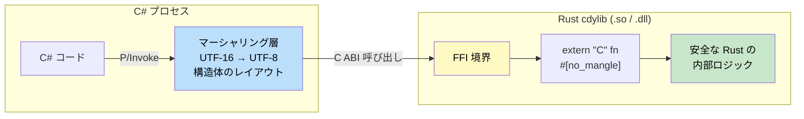

## Unsafe Rust

> **学習内容:** `unsafe` が許可する操作（生ポインタ、FFI、チェックなしキャスト）、安全なラッパーパターン、ネイティブコード呼び出しにおける C# P/Invoke vs Rust FFI、および `unsafe` ブロックの安全性チェックリスト。
>
> **難易度:** 🔴 上級

Unsafe Rust では、借用チェッカーが検証できない操作を実行できます。使用は最小限にとどめ、明確なドキュメント（安全性理由）を添えてください。

> **より高度な内容**: unsafe コードに対する安全な抽象化パターン（アリーナアロケータ、ロックフリーデータ構造、カスタム仮想関数テーブル等）については、[Rust Patterns](../../rust-patterns-book/src/summary.md) を参照してください。

### Unsafeが必要になる場面

```rust
// 1. 生ポインタの参照解決（逆参照）
let mut value = 42;
let ptr = &mut value as *mut i32;
// SAFETY: ptr は有効で生存しているローカル変数を指しています。
unsafe {
    *ptr = 100; // unsafe ブロック内である必要があります
}

// 2. unsafe な関数の呼び出し
unsafe fn dangerous() {
    // 呼び出し元が不変条件を維持することを要求する内部実装
}

// SAFETY: このサンプル関数には維持すべき不変条件はありません。
unsafe {
    dangerous(); // 呼び出し元が責任を負います
}

// 3. 可変静的変数のアクセス・変更
static mut COUNTER: u32 = 0;
// SAFETY: シングルスレッドのコンテキストであり、COUNTER への並行アクセスはありません。
unsafe {
    COUNTER += 1; // スレッドセーフではありません — 呼び出し元が同期を保証する必要があります
}

// 4. unsafe なトレイトの実装
unsafe trait UnsafeTrait {
    fn do_something(&self);
}
```

### C#との比較: unsafe キーワード

```csharp
// C# の unsafe - 概念は似ていますが、スコープが異なります
unsafe void UnsafeExample()
{
    int value = 42;
    int* ptr = &value;
    *ptr = 100;
    
    // C# の unsafe は主にポインタ演算を対象とします
    // Rust の unsafe は所有権・借用ルールの緩和を対象とします
}

// C# の fixed - マネージドオブジェクトの Pin留め（固定）
unsafe void PinnedExample()
{
    byte[] buffer = new byte[100];
    fixed (byte* ptr = buffer)
    {
        // ptr はこのブロック内でのみ有効です
    }
}
```

### 安全なラッパー

```rust
/// 重要なパターン: unsafe コードを安全な API でラップする
pub struct SafeBuffer {
    data: Vec<u8>,
}

impl SafeBuffer {
    pub fn new(size: usize) -> Self {
        SafeBuffer { data: vec![0; size] }
    }
    
    /// 安全な API — 境界チェック付きのアクセス
    pub fn get(&self, index: usize) -> Option<u8> {
        self.data.get(index).copied()
    }
    
    /// 高速なチェックなしアクセス — unsafe ですが境界チェックにより安全にラップされています
    pub fn get_unchecked_safe(&self, index: usize) -> Option<u8> {
        if index < self.data.len() {
            // SAFETY: index が境界内にあることを直前で確認済みです
            Some(unsafe { *self.data.get_unchecked(index) })
        } else {
            None
        }
    }
}
```

***

## FFIを介したC#との相互運用

Rust は、C# から P/Invoke を介して呼び出せる C 互換の関数を公開できます。



### Rustライブラリ（cdylib としてコンパイル）

```rust
// src/lib.rs
#[no_mangle]
pub extern "C" fn add_numbers(a: i32, b: i32) -> i32 {
    a + b
}

#[no_mangle]
pub extern "C" fn process_string(input: *const std::os::raw::c_char) -> i32 {
    // SAFETY: input は非 null であり（内部でチェック済み）、呼び出し元によって null 終端されていると仮定します。
    let c_str = unsafe {
        if input.is_null() {
            return -1;
        }
        std::ffi::CStr::from_ptr(input)
    };
    
    match c_str.to_str() {
        Ok(s) => s.len() as i32,
        Err(_) => -1,
    }
}
```

```toml
# Cargo.toml
[lib]
crate-type = ["cdylib"]
```

### C#側の利用コード（P/Invoke）

```csharp
using System.Runtime.InteropServices;

public static class RustInterop
{
    [DllImport("my_rust_lib", CallingConvention = CallingConvention.Cdecl)]
    public static extern int add_numbers(int a, int b);
    
    [DllImport("my_rust_lib", CallingConvention = CallingConvention.Cdecl)]
    public static extern int process_string(
        [MarshalAs(UnmanagedType.LPUTF8Str)] string input);
}

// 使用例
int sum = RustInterop.add_numbers(5, 3);  // 8
int len = RustInterop.process_string("Hello from C#!");  // 15
```

### FFI 安全性チェックリスト

Rust の関数を C# に公開する場合、以下のルールを守ることで最も一般的なバグを防ぐことができます:

1. **常に `extern "C"` を使用する** — これを指定しないと、Rust は独自の（不安定な）呼び出し規約を使用します。C# の P/Invoke は C ABI を前提としています。

2. **`#[no_mangle]`** — Rust コンパイラによる関数名のマングリング（名前修飾）を防ぎます。これがないと、C# からシンボルを見つけることができません。

3. **パニックを FFI 境界を越えて伝播させない** — Rust のパニックが C# へと巻き戻る（アンワインドする）動作は **未定義動作（Undefined Behavior）** です。FFI のエントリポイントでパニックをキャッチしてください:

    ```rust
    #[no_mangle]
    pub extern "C" fn safe_ffi_function() -> i32 {
        match std::panic::catch_unwind(|| {
            // 実際のロジックをここに記述
            42
        }) {
            Ok(result) => result,
            Err(_) => -1,  // C# にパニックを波及させる代わりにエラーコードを返す
        }
    }
    ```

4. **不透明構造体（Opaque） vs 透過構造体（Transparent）** — C# 側がポインタ（不透明ハンドル）のみを保持する場合、`#[repr(C)]` は不要です。C# 側が `StructLayout` を介して構造体のフィールドを直接読み取る場合は、**必ず** `#[repr(C)]` を使用してください:

    ```rust
    // 不透明（Opaque） — C# は IntPtr のみを保持。#[repr(C)] は不要。
    pub struct Connection { /* Rust 専用フィールド */ }

    // 透過（Transparent） — C# がフィールドを直接マーシャリング。#[repr(C)] が必須。
    #[repr(C)]
    pub struct Point { pub x: f64, pub y: f64 }
    ```

5. **null ポインタのチェック** — 逆参照する前に必ずポインタを検証してください。C# から `IntPtr.Zero` が渡される可能性があります。

6. **文字列のエンコーディング** — C# は内部で UTF-16 を使用します。`MarshalAs(UnmanagedType.LPUTF8Str)` により、Rust の `CStr` 用に UTF-8 へ変換されます。この契約事項を明示的にドキュメント化してください。

### エンドツーエンドの例: ライフサイクル管理を伴う不透明ハンドル

本番環境でよく見られるパターンです: Rust がオブジェクトを所有し、C# は不透明ハンドルを保持し、明示的な生成・破棄関数がライフサイクルを管理します。

**Rust 側** (`src/lib.rs`):

```rust
use std::ffi::{c_char, CStr};

pub struct ImageProcessor {
    width: u32,
    height: u32,
    pixels: Vec<u8>,
}

/// 新しいプロセッサを作成する。無効なサイズの場合は null を返す。
#[no_mangle]
pub extern "C" fn processor_new(width: u32, height: u32) -> *mut ImageProcessor {
    if width == 0 || height == 0 {
        return std::ptr::null_mut();
    }
    let proc = ImageProcessor {
        width,
        height,
        pixels: vec![0u8; (width * height * 4) as usize],
    };
    Box::into_raw(Box::new(proc)) // ヒープ上に確保し、生ポインタを返す
}

/// グレースケールフィルタを適用する。成功時は 0、null ポインタ時は -1 を返す。
#[no_mangle]
pub extern "C" fn processor_grayscale(ptr: *mut ImageProcessor) -> i32 {
    // SAFETY: ptr は Box::into_raw によって作成され（非 null）、依然として有効です。
    let proc = match unsafe { ptr.as_mut() } {
        Some(p) => p,
        None => return -1,
    };
    for chunk in proc.pixels.chunks_exact_mut(4) {
        let gray = (0.299 * chunk[0] as f64
                  + 0.587 * chunk[1] as f64
                  + 0.114 * chunk[2] as f64) as u8;
        chunk[0] = gray;
        chunk[1] = gray;
        chunk[2] = gray;
    }
    0
}

/// プロセッサを破棄する。null を渡して呼び出しても安全。
#[no_mangle]
pub extern "C" fn processor_free(ptr: *mut ImageProcessor) {
    if !ptr.is_null() {
        // SAFETY: ptr は processor_new の Box::into_raw によって作成されたものです
        unsafe { drop(Box::from_raw(ptr)); }
    }
}
```

**C# 側**:

```csharp
using System.Runtime.InteropServices;

public sealed class ImageProcessor : IDisposable
{
    [DllImport("image_rust", CallingConvention = CallingConvention.Cdecl)]
    private static extern IntPtr processor_new(uint width, uint height);

    [DllImport("image_rust", CallingConvention = CallingConvention.Cdecl)]
    private static extern int processor_grayscale(IntPtr ptr);

    [DllImport("image_rust", CallingConvention = CallingConvention.Cdecl)]
    private static extern void processor_free(IntPtr ptr);

    private IntPtr _handle;

    public ImageProcessor(uint width, uint height)
    {
        _handle = processor_new(width, height);
        if (_handle == IntPtr.Zero)
            throw new ArgumentException("Invalid dimensions");
    }

    public void Grayscale()
    {
        if (processor_grayscale(_handle) != 0)
            throw new InvalidOperationException("Processor is null");
    }

    public void Dispose()
    {
        if (_handle != IntPtr.Zero)
        {
            processor_free(_handle);
            _handle = IntPtr.Zero;
        }
    }
}

// 使用例 — IDisposable により Rust 側のメモリ解放が保証される
using var proc = new ImageProcessor(1920, 1080);
proc.Grayscale();
// proc.Dispose() が自動的に呼び出される → processor_free() → Rust 側で Vec が破棄（Drop）される
```

> **重要な洞察**: これは C# の `SafeHandle` パターンに相当する Rust のアプローチです。Rust の `Box::into_raw` / `Box::from_raw` が FFI 境界を越えて所有権を受け渡し、C# の `IDisposable` ラッパーが確実なクリーンアップを保証します。

---

## 演習問題

<details>
<summary><strong>🏋️ 演習問題: 生ポインタの安全なラッパー</strong> (クリックして展開)</summary>

C ライブラリから生ポインタを受け取るとします。安全な Rust ラッパーを作成してください:

```rust
// 疑似的な C API
extern "C" {
    fn lib_create_buffer(size: usize) -> *mut u8;
    fn lib_free_buffer(ptr: *mut u8);
}
```

要件:

1. 生ポインタをラップする `SafeBuffer` 構造体を作成する
2. `lib_free_buffer` を呼び出す `Drop` を実装する
3. `as_slice()` 経由で安全な `&[u8]` ビューを提供する
4. ポインタが null の場合、`SafeBuffer::new()` が `None` を返すようにする

<details>
<summary>🔑 解答例</summary>

```rust,ignore
struct SafeBuffer {
    ptr: *mut u8,
    len: usize,
}

impl SafeBuffer {
    fn new(size: usize) -> Option<Self> {
        // SAFETY: lib_create_buffer は有効なポインタまたは null を返します（以下でチェック済み）。
        let ptr = unsafe { lib_create_buffer(size) };
        if ptr.is_null() {
            None
        } else {
            Some(SafeBuffer { ptr, len: size })
        }
    }

    fn as_slice(&self) -> &[u8] {
        // SAFETY: ptr は非 null であり（new() でチェック済み）、len は確保されたサイズであり、排他的所有権を保持しています。
        unsafe { std::slice::from_raw_parts(self.ptr, self.len) }
    }
}

impl Drop for SafeBuffer {
    fn drop(&mut self) {
        // SAFETY: ptr は lib_create_buffer によって確保されたものです
        unsafe { lib_free_buffer(self.ptr); }
    }
}

// 使用例: すべての unsafe は SafeBuffer 内にカプセル化されています
fn process(buf: &SafeBuffer) {
    let data = buf.as_slice(); // 完全に安全な API
    println!("先頭バイト: {}", data[0]);
}
```

**重要なパターン**: `unsafe` は `// SAFETY:` コメントを添えて小さなモジュール内にカプセル化し、外部には 100% 安全な公開 API を提供します。これは Rust 標準ライブラリが採用している設計そのものです — `Vec`、`String`、`HashMap` も内部には unsafe を含んでいますが、安全なインターフェースを提供しています。

</details>
</details>

***
