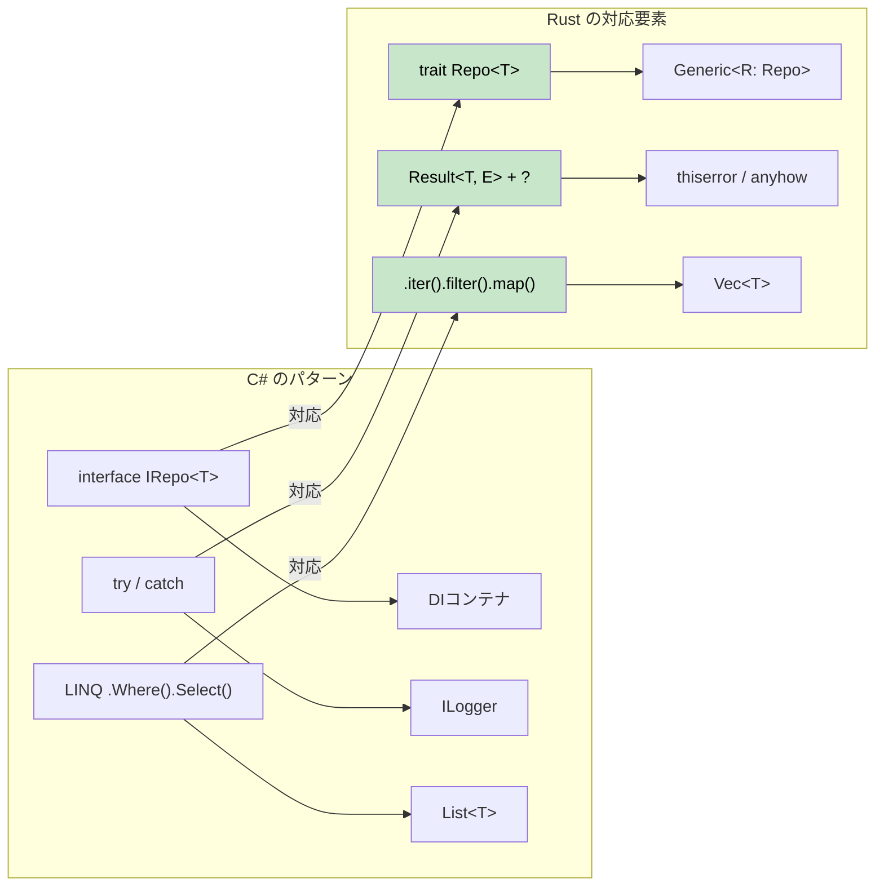

## Rustにおける一般的なC#の設計パターン

> **ここで学ぶこと:** リポジトリパターン、Builder パターン、依存性の注入（DI）、LINQ チェーン、Entity Framework クエリ、設定パターンなどを、C# からイディオマティックな Rust へと移植・適用する方法。
>
> **難易度:** 🟡 中級



### リポジトリパターン（Repository Pattern）

```csharp
// C# のリポジトリパターン
public interface IRepository<T> where T : IEntity
{
    Task<T> GetByIdAsync(int id);
    Task<IEnumerable<T>> GetAllAsync();
    Task<T> AddAsync(T entity);
    Task UpdateAsync(T entity);
    Task DeleteAsync(int id);
}

public class UserRepository : IRepository<User>
{
    private readonly DbContext _context;
    
    public UserRepository(DbContext context)
    {
        _context = context;
    }
    
    public async Task<User> GetByIdAsync(int id)
    {
        return await _context.Users.FindAsync(id);
    }
    
    // ... その他の実装
}
```

```rust
// トレイトとジェネリクスによる Rust のリポジトリパターン
use async_trait::async_trait;
use std::fmt::Debug;

#[async_trait]
pub trait Repository<T, E> 
where 
    T: Clone + Debug + Send + Sync,
    E: std::error::Error + Send + Sync,
{
    async fn get_by_id(&self, id: u64) -> Result<Option<T>, E>;
    async fn get_all(&self) -> Result<Vec<T>, E>;
    async fn add(&self, entity: T) -> Result<T, E>;
    async fn update(&self, entity: T) -> Result<T, E>;
    async fn delete(&self, id: u64) -> Result<(), E>;
}

#[derive(Debug, Clone)]
pub struct User {
    pub id: u64,
    pub name: String,
    pub email: String,
}

#[derive(Debug)]
pub enum RepositoryError {
    NotFound(u64),
    DatabaseError(String),
    ValidationError(String),
}

impl std::fmt::Display for RepositoryError {
    fn fmt(&self, f: &mut std::fmt::Formatter<'_>) -> std::fmt::Result {
        match self {
            RepositoryError::NotFound(id) => write!(f, "Entity with id {} not found", id),
            RepositoryError::DatabaseError(msg) => write!(f, "Database error: {}", msg),
            RepositoryError::ValidationError(msg) => write!(f, "Validation error: {}", msg),
        }
    }
}

impl std::error::Error for RepositoryError {}

pub struct UserRepository {
    // データベースのコネクションプールなど
}

#[async_trait]
impl Repository<User, RepositoryError> for UserRepository {
    async fn get_by_id(&self, id: u64) -> Result<Option<User>, RepositoryError> {
        // データベース検索のシミュレーション
        if id == 0 {
            return Ok(None);
        }
        
        Ok(Some(User {
            id,
            name: format!("User {}", id),
            email: format!("user{}@example.com", id),
        }))
    }
    
    async fn get_all(&self) -> Result<Vec<User>, RepositoryError> {
        // ここに実装を記述
        Ok(vec![])
    }
    
    async fn add(&self, entity: User) -> Result<User, RepositoryError> {
        // バリデーションとデータベースへの挿入
        if entity.name.is_empty() {
            return Err(RepositoryError::ValidationError("Name cannot be empty".to_string()));
        }
        Ok(entity)
    }
    
    async fn update(&self, entity: User) -> Result<User, RepositoryError> {
        // ここに実装を記述
        Ok(entity)
    }
    
    async fn delete(&self, id: u64) -> Result<(), RepositoryError> {
        // ここに実装を記述
        Ok(())
    }
}
```

### Builder パターン

```csharp
// C# の Builder パターン（流れるようなインターフェース）
public class HttpClientBuilder
{
    private TimeSpan? _timeout;
    private string _baseAddress;
    private Dictionary<string, string> _headers = new();
    
    public HttpClientBuilder WithTimeout(TimeSpan timeout)
    {
        _timeout = timeout;
        return this;
    }
    
    public HttpClientBuilder WithBaseAddress(string baseAddress)
    {
        _baseAddress = baseAddress;
        return this;
    }
    
    public HttpClientBuilder WithHeader(string name, string value)
    {
        _headers[name] = value;
        return this;
    }
    
    public HttpClient Build()
    {
        var client = new HttpClient();
        if (_timeout.HasValue)
            client.Timeout = _timeout.Value;
        if (!string.IsNullOrEmpty(_baseAddress))
            client.BaseAddress = new Uri(_baseAddress);
        foreach (var header in _headers)
            client.DefaultRequestHeaders.Add(header.Key, header.Value);
        return client;
    }
}

// 使用例
var client = new HttpClientBuilder()
    .WithTimeout(TimeSpan.FromSeconds(30))
    .WithBaseAddress("https://api.example.com")
    .WithHeader("Accept", "application/json")
    .Build();
```

```rust
// Rust の Builder パターン（所有権を消費するビルダー）
use std::collections::HashMap;
use std::time::Duration;

#[derive(Debug)]
pub struct HttpClient {
    timeout: Duration,
    base_address: String,
    headers: HashMap<String, String>,
}

pub struct HttpClientBuilder {
    timeout: Option<Duration>,
    base_address: Option<String>,
    headers: HashMap<String, String>,
}

impl HttpClientBuilder {
    pub fn new() -> Self {
        HttpClientBuilder {
            timeout: None,
            base_address: None,
            headers: HashMap::new(),
        }
    }
    
    pub fn with_timeout(mut self, timeout: Duration) -> Self {
        self.timeout = Some(timeout);
        self
    }
    
    pub fn with_base_address<S: Into<String>>(mut self, base_address: S) -> Self {
        self.base_address = Some(base_address.into());
        self
    }
    
    pub fn with_header<K: Into<String>, V: Into<String>>(mut self, name: K, value: V) -> Self {
        self.headers.insert(name.into(), value.into());
        self
    }
    
    pub fn build(self) -> Result<HttpClient, String> {
        let base_address = self.base_address.ok_or("Base address is required")?;
        
        Ok(HttpClient {
            timeout: self.timeout.unwrap_or(Duration::from_secs(30)),
            base_address,
            headers: self.headers,
        })
    }
}

// 使用例
let client = HttpClientBuilder::new()
    .with_timeout(Duration::from_secs(30))
    .with_base_address("https://api.example.com")
    .with_header("Accept", "application/json")
    .build()?;

// 別解: 一般的なケース向けに Default トレイトを実装
impl Default for HttpClientBuilder {
    fn default() -> Self {
        Self::new()
    }
}
```

***

## C# から Rust へのコンセプトマッピング

### 依存性の注入（DI） → コンストラクタインジェクション + トレイト

```csharp
// C#（DIコンテナを使用）
services.AddScoped<IUserRepository, UserRepository>();
services.AddScoped<IUserService, UserService>();

public class UserService
{
    private readonly IUserRepository _repository;
    
    public UserService(IUserRepository repository)
    {
        _repository = repository;
    }
}
```

```rust
// Rust: トレイトを用いたコンストラクタインジェクション
pub trait UserRepository {
    async fn find_by_id(&self, id: Uuid) -> Result<Option<User>, Error>;
    async fn save(&self, user: &User) -> Result<(), Error>;
}

pub struct UserService<R> 
where 
    R: UserRepository,
{
    repository: R,
}

impl<R> UserService<R> 
where 
    R: UserRepository,
{
    pub fn new(repository: R) -> Self {
        Self { repository }
    }
    
    pub async fn get_user(&self, id: Uuid) -> Result<Option<User>, Error> {
        self.repository.find_by_id(id).await
    }
}

// 使用例
let repository = PostgresUserRepository::new(pool);
let service = UserService::new(repository);
```

### LINQ → イテレータチェーン

```csharp
// C# の LINQ
var result = users
    .Where(u => u.Age > 18)
    .Select(u => u.Name.ToUpper())
    .OrderBy(name => name)
    .Take(10)
    .ToList();
```

```rust
// Rust: イテレータチェーン（ゼロコスト！）
let mut result: Vec<String> = users
    .iter()
    .filter(|u| u.age > 18)
    .map(|u| u.name.to_uppercase())
    .collect();
result.sort();
result.truncate(10);

// または itertools クレートを使ってより LINQ に近いチェーンを記述
use itertools::Itertools;

let result: Vec<String> = users
    .iter()
    .filter(|u| u.age > 18)
    .map(|u| u.name.to_uppercase())
    .sorted()
    .take(10)
    .collect();
```

### Entity Framework → SQLx + マイグレーション

```csharp
// C# の Entity Framework
public class ApplicationDbContext : DbContext
{
    public DbSet<User> Users { get; set; }
}

var user = await context.Users
    .Where(u => u.Email == email)
    .FirstOrDefaultAsync();
```

```rust
// Rust: コンパイル時に検証されるクエリを備えた SQLx
use sqlx::{PgPool, FromRow};

#[derive(FromRow)]
struct User {
    id: Uuid,
    email: String,
    name: String,
}

// コンパイル時に検証されるクエリ
let user = sqlx::query_as!(
    User,
    "SELECT id, email, name FROM users WHERE email = $1",
    email
)
.fetch_optional(&pool)
.await?;

// または動的クエリを使用
let user = sqlx::query_as::<_, User>(
    "SELECT id, email, name FROM users WHERE email = $1"
)
.bind(email)
.fetch_optional(&pool)
.await?;
```

### 設定（Configuration） → Config クレート群

```csharp
// C# の Configuration
public class AppSettings
{
    public string DatabaseUrl { get; set; }
    public int Port { get; set; }
}

var config = builder.Configuration.Get<AppSettings>();
```

```rust
// Rust: serde を組み合わせた Config
use config::{Config, ConfigError, Environment, File};
use serde::Deserialize;

#[derive(Debug, Deserialize)]
struct AppSettings {
    database_url: String,
    port: u16,
}

impl AppSettings {
    pub fn new() -> Result<Self, ConfigError> {
        let s = Config::builder()
            .add_source(File::with_name("config/default"))
            .add_source(Environment::with_prefix("APP"))
            .build()?;

        s.try_deserialize()
    }
}

// 使用例
let settings = AppSettings::new()?;
```

---

## 事例研究（ケーススタディ）

### ケーススタディ 1: CLI ツールの移行（csvtool）

**背景**: あるチームが、大容量の CSV ファイルを読み込み、変換処理を適用して結果を出力する C# コンソールアプリ（`CsvProcessor`）を保守していました。ファイルサイズが 500 MB に達するとメモリ使用量が 4 GB に急増し、GC の一時停止によって 30 秒もの停止が発生していました。

**移行アプローチ**: 2週間かけてモジュールごとに順次 Rust で書き直しました。

| ステップ | 変更内容 | C# → Rust |
|------|-------------|-----------|
| 1 | CSV のパース | `CsvHelper` → `csv` クレート（ストリーミング `Reader`） |
| 2 | データモデル | `class Record` → `struct Record`（スタック割り当て、`#[derive(Deserialize)]`） |
| 3 | 変換処理 | LINQ `.Select().Where()` → `.iter().map().filter()` |
| 4 | ファイル I/O | `StreamReader` → `?` エラー伝播を伴う `BufReader<File>` |
| 5 | CLI 引数処理 | `System.CommandLine` → derive マクロを用いた `clap` |
| 6 | 並列処理 | `Parallel.ForEach` → `rayon` の `.par_iter()` |

**結果**:
- メモリ使用量: 4 GB → 12 MB（ファイル全体の一括読み込みからストリーミング処理へ変更）
- 処理速度: 500 MB のファイルで 45秒 → 3秒
- バイナリサイズ: 単一の 2 MB 実行可能ファイル、ランタイムの依存なし

**得られた重要な教訓**: 最大の成果は Rust そのものというよりも、Rust の所有権モデルによってストリーミング設計が**強制された**ことにありました。C# では、安易にすべてを `.ToList()` でメモリに載せてしまいがちでした。一方 Rust では、借用チェッカーによって自然と `Iterator` ベースの処理へと導かれたのです。

### ケーススタディ 2: マイクロサービスの置き換え（auth-gateway）

**背景**: C# ASP.NET Core で作成された認証ゲートウェイが、50 以上のバックエンドサービスに対する JWT 検証とレート制限を担っていました。10,000 req/s の負荷下で、GC のスパイクにより p99 レイテンシが 200ms に達していました。

**移行アプローチ**: API の契約仕様は完全に維持したまま、`axum` + `tower` を用いた Rust サービスへと置き換えました。

```rust
// 移行前 (C#):  services.AddAuthentication().AddJwtBearer(...)
// 移行後 (Rust): tower ミドルウェアレイヤー

use axum::{Router, middleware};
use tower::ServiceBuilder;

let app = Router::new()
    .route("/api/*path", any(proxy_handler))
    .layer(
        ServiceBuilder::new()
            .layer(middleware::from_fn(validate_jwt))
            .layer(middleware::from_fn(rate_limit))
    );
```

| 指標 | C# (ASP.NET Core) | Rust (axum) |
|--------|-------------------|-------------|
| p50 レイテンシ | 5ms | 0.8ms |
| p99 レイテンシ | 200ms (GC スパイク) | 4ms |
| メモリ使用量 | 300 MB | 8 MB |
| Docker イメージサイズ | 210 MB (.NET ランタイム) | 12 MB (静的バイナリ) |
| コールドスタート時間 | 2.1s | 0.05s |

**得られた重要な教訓**:
1. **同一の API 契約を維持する**: クライアント側の変更は一切不要でした。Rust サービスは完全なドロップイン置換として機能しました。
2. **ホットパスから着手する**: ボトルネックとなっていたのは JWT 検証でした。そのミドルウェア 1 つを移行するだけでも、成果の 80% を得られたはずです。
3. **`tower` ミドルウェアを活用する**: ASP.NET Core のミドルウェアパイプラインパターンとよく似ており、C# 開発者にとっても馴染みやすい Rust アーキテクチャでした。
4. **p99 レイテンシの改善**: 単にコードが高速になったことではなく、GC の一時停止が排除されたことによってもたらされました。定常状態のスループットは Rust の方が約 2 倍高速という程度でしたが、GC がないことでテールレイテンシが極めて予測可能になりました。

---

## 演習問題

<details>
<summary><strong>🏋️ 演習: C# サービスの移行</strong> (クリックして展開)</summary>

以下の C# サービスをイディオマティックな Rust に移植してください。

```csharp
public interface IUserService
{
    Task<User?> GetByIdAsync(int id);
    Task<List<User>> SearchAsync(string query);
}

public class UserService : IUserService
{
    private readonly IDatabase _db;
    public UserService(IDatabase db) { _db = db; }

    public async Task<User?> GetByIdAsync(int id)
    {
        try { return await _db.QuerySingleAsync<User>(id); }
        catch (NotFoundException) { return null; }
    }

    public async Task<List<User>> SearchAsync(string query)
    {
        return await _db.QueryAsync<User>($"SELECT * WHERE name LIKE '%{query}%'");
    }
}
```

**ヒント**: トレイトを使用し、null の代わりに `Option<User>`、try/catch の代わりに `Result` を使い、SQL インジェクションの脆弱性を修正してください。

<details>
<summary>🔑 解答例</summary>

```rust
use async_trait::async_trait;

#[derive(Debug, Clone)]
struct User { id: i64, name: String }

#[async_trait]
trait Database: Send + Sync {
    async fn get_user(&self, id: i64) -> Result<Option<User>, sqlx::Error>;
    async fn search_users(&self, query: &str) -> Result<Vec<User>, sqlx::Error>;
}

#[async_trait]
trait UserService: Send + Sync {
    async fn get_by_id(&self, id: i64) -> Result<Option<User>, AppError>;
    async fn search(&self, query: &str) -> Result<Vec<User>, AppError>;
}

struct UserServiceImpl<D: Database> {
    db: D,  // Arc は不要 — Rust の所有権が適切に処理する
}

#[async_trait]
impl<D: Database> UserService for UserServiceImpl<D> {
    async fn get_by_id(&self, id: i64) -> Result<Option<User>, AppError> {
        // null の代わりに Option、try/catch の代わりに Result を使用
        Ok(self.db.get_user(id).await?)
    }

    async fn search(&self, query: &str) -> Result<Vec<User>, AppError> {
        // パラメータ化クエリ — SQLインジェクションを防止！
        // (sqlx は文字列補間ではなく $1 プレースホルダを使用)
        self.db.search_users(query).await.map_err(Into::into)
    }
}
```

**C# からの主な変更点**:
- `null` → `Option<User>`（コンパイル時の null 安全性）
- `try/catch` → `Result` + `?`（明示的なエラー伝播）
- SQL インジェクションの修正: 文字列補間ではなくパラメータ化クエリを使用
- `IDatabase _db` → ジェネリクス `D: Database`（静的ディスパッチ、ボクシングなし）

</details>
</details>

***
