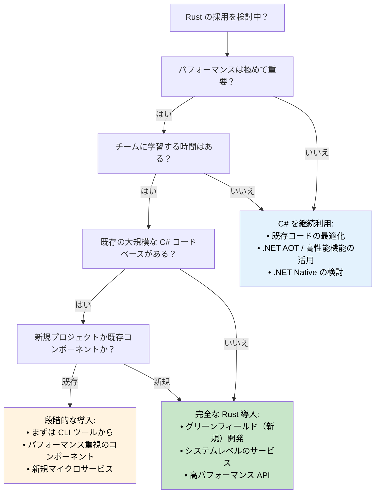

## パフォーマンス比較: マネージド vs ネイティブ

> **ここで学ぶこと:** C# と Rust の実環境におけるパフォーマンスの違い — 起動時間、メモリ使用量、スループットのベンチマーク、CPU 集約型ワークロード、そして Rust への移行と C# の継続利用を判断するための意思決定ツリー。
>
> **難易度:** 🟡 中級

### 実環境におけるパフォーマンス特性

| **観点** | **C# (.NET)** | **Rust** | **パフォーマンスへの影響** |
|------------|---------------|----------|------------------------|
| **起動時間** | 100〜500ms（JIT）; 5〜30ms（.NET 8 AOT） | 1〜10ms（ネイティブバイナリ） | 🚀 **10〜50倍高速**（対 JIT 比） |
| **メモリ使用量** | +30〜100%（GC オーバーヘッド + メタデータ） | 最小限（ランタイム最小） | 💾 **RAM を 30〜50% 削減** |
| **GC 一時停止** | 1〜100ms の周期的な停止 | なし（GC 自体が存在しない） | ⚡ **安定した予測可能レイテンシ** |
| **CPU 使用率** | +10〜20%（GC + JIT オーバーヘッド） | 最小限（直接実行） | 🔋 **効率が 10〜20% 向上** |
| **バイナリサイズ** | 30〜200MB（ランタイム同梱）; 10〜30MB（AOT トリム） | 1〜20MB（静的バイナリ） | 📦 **デプロイサイズの縮小** |
| **メモリ安全性** | 実行時チェック | コンパイル時証明 | 🛡️ **ゼロオーバーヘッドの安全性** |
| **並行性能** | 良好（注意深い同期制御が必要） | 極めて優秀（恐れなき並行性） | 🏃 **優れたスケーラビリティ** |

> **.NET 8+ AOT に関する補足**: ネイティブ AOT コンパイルにより、起動時間の差は大幅に縮まりました（5〜30ms）。ただし、スループットやメモリに関しては、依然として GC のオーバーヘッドや一時停止が存在します。移行を評価する際は、必ず**実際の固有ワークロード**でベンチマークを実施してください。一般的な見出しの数値だけで判断すると誤解を招く恐れがあります。

### ベンチマーク例

```csharp
// C# - JSON 処理ベンチマーク
public class JsonProcessor
{
    public async Task<List<User>> ProcessJsonFile(string path)
    {
        var json = await File.ReadAllTextAsync(path);
        var users = JsonSerializer.Deserialize<List<User>>(json);
        
        return users.Where(u => u.Age > 18)
                   .OrderBy(u => u.Name)
                   .Take(1000)
                   .ToList();
    }
}

// 一般的なパフォーマンス: 100MB のファイルで約 200ms
// メモリ使用量: ピーク時約 500MB（GC オーバーヘッド）
// バイナリサイズ: 約 80MB（自己完結型）
```

```rust
// Rust - 同等の JSON 処理
use serde::{Deserialize, Serialize};
use tokio::fs;

#[derive(Deserialize, Serialize)]
struct User {
    name: String,
    age: u32,
}

pub async fn process_json_file(path: &str) -> Result<Vec<User>, Box<dyn std::error::Error>> {
    let json = fs::read_to_string(path).await?;
    let mut users: Vec<User> = serde_json::from_str(&json)?;
    
    users.retain(|u| u.age > 18);
    users.sort_by(|a, b| a.name.cmp(&b.name));
    users.truncate(1000);
    
    Ok(users)
}

// 一般的なパフォーマンス: 同一の 100MB ファイルで約 120ms
// メモリ使用量: ピーク時約 200MB（GC オーバーヘッドなし）
// バイナリサイズ: 約 8MB（静的バイナリ）
```

### CPU集約型のワークロード

```csharp
// C# - 数学計算処理
public class Mandelbrot
{
    public static int[,] Generate(int width, int height, int maxIterations)
    {
        var result = new int[height, width];
        
        Parallel.For(0, height, y =>
        {
            for (int x = 0; x < width; x++)
            {
                var c = new Complex(
                    (x - width / 2.0) * 4.0 / width,
                    (y - height / 2.0) * 4.0 / height);
                
                result[y, x] = CalculateIterations(c, maxIterations);
            }
        });
        
        return result;
    }
}

// パフォーマンス: 約 2.3秒（8コアマシン）
// メモリ: 約 500MB
```

```rust
// Rust - Rayon を用いた同一計算処理
use rayon::prelude::*;
use num_complex::Complex;

pub fn generate_mandelbrot(width: usize, height: usize, max_iterations: u32) -> Vec<Vec<u32>> {
    (0..height)
        .into_par_iter()
        .map(|y| {
            (0..width)
                .map(|x| {
                    let c = Complex::new(
                        (x as f64 - width as f64 / 2.0) * 4.0 / width as f64,
                        (y as f64 - height as f64 / 2.0) * 4.0 / height as f64,
                    );
                    calculate_iterations(c, max_iterations)
                })
                .collect()
        })
        .collect()
}

// パフォーマンス: 約 1.1秒（同一の8コアマシン）  
// メモリ: 約 200MB
// メモリ使用量を 60% 削減しながら 2倍高速
```

### 言語の選定基準

**C# を選択すべき場合:**
- **迅速な開発が極めて重要** - 豊富なツールエコシステム
- **チームが .NET に習熟している** - 既存の知識やスキル資産の活用
- **エンタープライズ統合** - Microsoft エコシステムへの強い依存
- **要求されるパフォーマンスが標準的** - C# の性能で十分に要件を満たせる
- **リッチな UI アプリケーション** - WPF、WinUI、Blazor などのアプリ
- **プロトタイピングと MVP** - 市場投入スピード（Time to market）の重視

**Rust を選択すべき場合:**
- **極めて高いパフォーマンスが求められる** - CPU / メモリ集約型のアプリケーション
- **リソースの制約が厳しい** - 組み込み、エッジコンピューティング、サーバーレス
- **長期間稼働し続けるサービス** - Web サーバー、データベース、システムデーモン
- **システムレベルのプログラミング** - OS コンポーネント、ドライバ、ネットワークツール
- **極めて高い信頼性が求められる** - 金融システム、セーフティクリティカルな用途
- **並行 / 並列処理ワークロード** - 高スループットなデータストリーミング処理

### 移行戦略の決定ツリー



***
