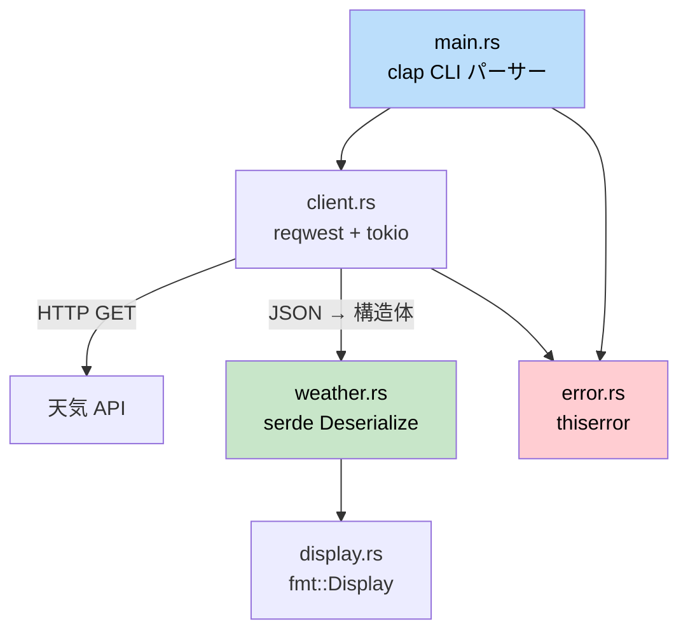

## 総合演習プロジェクト: CLI 天気予報ツールの構築

> **学習内容:** 構造体、トレイト、エラー処理、非同期処理、モジュール、serde、CLI 引数パースなど、これまで学んだすべての要素を組み合わせて、実際に動作する Rust アプリケーションを構築します。これは C# 開発者が `HttpClient`、`System.Text.Json`、`System.CommandLine` を使って構築するツールに相当します。
>
> **難易度:** 🟡 中級

この総合演習では、本書のあらゆる部分で学んだ概念を統合します。API から気象データを取得して表示するコマンドラインツール `weather-cli` を構築します。このプロジェクトは、適切なモジュール構成、エラー型、テストを備えたミニクレートとして設計されています。

### プロジェクトの概要



**構築するツール:**
```
$ weather-cli --city "Seattle"
🌧  Seattle: 12°C, Overcast clouds
    Humidity: 82%  Wind: 5.4 m/s
```

**実践する概念:**
| 本書の章 | 使用する概念 |
|---|---|
| 第5章（構造体） | `WeatherReport`, `Config` データ型 |
| 第8章（モジュール） | `src/lib.rs`, `src/client.rs`, `src/display.rs` |
| 第9章（エラー処理） | `thiserror` によるカスタム `WeatherError` |
| 第10章（トレイト） | 整形出力のための `Display` 実装 |
| 第11章（From/Into） | `serde` による JSON デシリアライズ |
| 第12章（イテレータ） | API レスポンス配列の処理 |
| 第13章（非同期） | HTTP 呼び出しのための `reqwest` + `tokio` |
| 第14章-1（テスト） | ユニットテスト ＋ 統合テスト |

---

### ステップ 1: プロジェクトのセットアップ

```bash
cargo new weather-cli
cd weather-cli
```

`Cargo.toml` に依存関係を追加します:
```toml
[package]
name = "weather-cli"
version = "0.1.0"
edition = "2021"

[dependencies]
clap = { version = "4", features = ["derive"] }   # CLI 引数（System.CommandLine に類似）
reqwest = { version = "0.12", features = ["json"] } # HTTP クライアント（HttpClient に類似）
serde = { version = "1", features = ["derive"] }    # シリアライズ（System.Text.Json に類似）
serde_json = "1"
thiserror = "2"                                      # エラー型
tokio = { version = "1", features = ["full"] }       # 非同期ランタイム
```

```csharp
// C# の同等な依存関係:
// dotnet add package System.CommandLine
// dotnet add package System.Net.Http.Json
// （System.Text.Json と HttpClient は標準組み込み）
```

### ステップ 2: データ型の定義

`src/weather.rs` を作成します:
```rust
use serde::Deserialize;

/// API の生レスポンス（JSON の形状に対応）
#[derive(Deserialize, Debug)]
pub struct ApiResponse {
    pub main: MainData,
    pub weather: Vec<WeatherCondition>,
    pub wind: WindData,
    pub name: String,
}

#[derive(Deserialize, Debug)]
pub struct MainData {
    pub temp: f64,
    pub humidity: u32,
}

#[derive(Deserialize, Debug)]
pub struct WeatherCondition {
    pub description: String,
    pub icon: String,
}

#[derive(Deserialize, Debug)]
pub struct WindData {
    pub speed: f64,
}

/// ドメイン型（クリーンで API から疎結合）
#[derive(Debug, Clone)]
pub struct WeatherReport {
    pub city: String,
    pub temp_celsius: f64,
    pub description: String,
    pub humidity: u32,
    pub wind_speed: f64,
}

impl From<ApiResponse> for WeatherReport {
    fn from(api: ApiResponse) -> Self {
        let description = api.weather
            .first()
            .map(|w| w.description.clone())
            .unwrap_or_else(|| "Unknown".to_string());

        WeatherReport {
            city: api.name,
            temp_celsius: api.main.temp,
            description,
            humidity: api.main.humidity,
            wind_speed: api.wind.speed,
        }
    }
}
```

```csharp
// C# の同等コード:
// public record ApiResponse(MainData Main, List<WeatherCondition> Weather, ...);
// public record WeatherReport(string City, double TempCelsius, ...);
// 手動マッピングまたは AutoMapper
```

**主な違い:** Rust の `#[derive(Deserialize)]` と `From` 実装は、C# の `JsonSerializer.Deserialize<T>()` と AutoMapper の組み合わせを置き換えます。Rust ではリフレクションを使わず、いずれもコンパイル時に解決されます。

### ステップ 3: エラー型

`src/error.rs` を作成します:
```rust
use thiserror::Error;

#[derive(Error, Debug)]
pub enum WeatherError {
    #[error("HTTP request failed: {0}")]
    Http(#[from] reqwest::Error),

    #[error("City not found: {0}")]
    CityNotFound(String),

    #[error("API key not set — export WEATHER_API_KEY")]
    MissingApiKey,
}

pub type Result<T> = std::result::Result<T, WeatherError>;
```

### ステップ 4: HTTP クライアント

`src/client.rs` を作成します:
```rust
use crate::error::{WeatherError, Result};
use crate::weather::{ApiResponse, WeatherReport};

pub struct WeatherClient {
    api_key: String,
    http: reqwest::Client,
}

impl WeatherClient {
    pub fn new(api_key: String) -> Self {
        WeatherClient {
            api_key,
            http: reqwest::Client::new(),
        }
    }

    pub async fn get_weather(&self, city: &str) -> Result<WeatherReport> {
        let url = format!(
            "https://api.openweathermap.org/data/2.5/weather?q={}&appid={}&units=metric",
            city, self.api_key
        );

        let response = self.http.get(&url).send().await?;

        if response.status() == reqwest::StatusCode::NOT_FOUND {
            return Err(WeatherError::CityNotFound(city.to_string()));
        }

        let api_data: ApiResponse = response.json().await?;
        Ok(WeatherReport::from(api_data))
    }
}
```

```csharp
// C# の同等コード:
// var response = await _httpClient.GetAsync(url);
// if (response.StatusCode == HttpStatusCode.NotFound)
//     throw new CityNotFoundException(city);
// var data = await response.Content.ReadFromJsonAsync<ApiResponse>();
```

**主な違い:**
- `?` 演算子が `try/catch` を置き換えます — エラーは `Result` 経由で自動的に伝播します
- `WeatherReport::from(api_data)` は AutoMapper の代わりに `From` トレイトを使用します
- `IHttpClientFactory` は不要です — `reqwest::Client` が内部で接続プーリングを処理します

### ステップ 5: 表示フォーマットの実装

`src/display.rs` を作成します:
```rust
use std::fmt;
use crate::weather::WeatherReport;

impl fmt::Display for WeatherReport {
    fn fmt(&self, f: &mut fmt::Formatter<'_>) -> fmt::Result {
        let icon = weather_icon(&self.description);
        writeln!(f, "{}  {}: {:.0}°C, {}",
            icon, self.city, self.temp_celsius, self.description)?;
        write!(f, "    Humidity: {}%  Wind: {:.1} m/s",
            self.humidity, self.wind_speed)
    }
}

fn weather_icon(description: &str) -> &str {
    let desc = description.to_lowercase();
    if desc.contains("clear") { "☀️" }
    else if desc.contains("cloud") { "☁️" }
    else if desc.contains("rain") || desc.contains("drizzle") { "🌧" }
    else if desc.contains("snow") { "❄️" }
    else if desc.contains("thunder") { "⛈" }
    else { "🌡" }
}
```

### ステップ 6: すべてを組み合わせる

`src/lib.rs`:
```rust
pub mod client;
pub mod display;
pub mod error;
pub mod weather;
```

`src/main.rs`:
```rust
use clap::Parser;
use weather_cli::{client::WeatherClient, error::WeatherError};

#[derive(Parser)]
#[command(name = "weather-cli", about = "Fetch weather from the command line")]
struct Cli {
    /// 検索する都市名
    #[arg(short, long)]
    city: String,
}

#[tokio::main]
async fn main() {
    let cli = Cli::parse();

    let api_key = match std::env::var("WEATHER_API_KEY") {
        Ok(key) => key,
        Err(_) => {
            eprintln!("Error: {}", WeatherError::MissingApiKey);
            std::process::exit(1);
        }
    };

    let client = WeatherClient::new(api_key);

    match client.get_weather(&cli.city).await {
        Ok(report) => println!("{report}"),
        Err(WeatherError::CityNotFound(city)) => {
            eprintln!("City not found: {city}");
            std::process::exit(1);
        }
        Err(e) => {
            eprintln!("Error: {e}");
            std::process::exit(1);
        }
    }
}
```

### ステップ 7: テスト

```rust
// src/weather.rs または tests/weather_test.rs 内
#[cfg(test)]
mod tests {
    use super::*;

    fn sample_api_response() -> ApiResponse {
        serde_json::from_str(r#"{
            "main": {"temp": 12.3, "humidity": 82},
            "weather": [{"description": "overcast clouds", "icon": "04d"}],
            "wind": {"speed": 5.4},
            "name": "Seattle"
        }"#).unwrap()
    }

    #[test]
    fn api_response_to_weather_report() {
        let report = WeatherReport::from(sample_api_response());
        assert_eq!(report.city, "Seattle");
        assert!((report.temp_celsius - 12.3).abs() < 0.01);
        assert_eq!(report.description, "overcast clouds");
    }

    #[test]
    fn display_format_includes_icon() {
        let report = WeatherReport {
            city: "Test".into(),
            temp_celsius: 20.0,
            description: "clear sky".into(),
            humidity: 50,
            wind_speed: 3.0,
        };
        let output = format!("{report}");
        assert!(output.contains("☀️"));
        assert!(output.contains("20°C"));
    }

    #[test]
    fn empty_weather_array_defaults_to_unknown() {
        let json = r#"{
            "main": {"temp": 0.0, "humidity": 0},
            "weather": [],
            "wind": {"speed": 0.0},
            "name": "Nowhere"
        }"#;
        let api: ApiResponse = serde_json::from_str(json).unwrap();
        let report = WeatherReport::from(api);
        assert_eq!(report.description, "Unknown");
    }
}
```

---

### 最終的なファイル構成

```
weather-cli/
├── Cargo.toml
├── src/
│   ├── main.rs        # CLI エントリポイント (clap)
│   ├── lib.rs         # モジュール宣言
│   ├── client.rs      # HTTP クライアント (reqwest + tokio)
│   ├── weather.rs     # データ型 ＋ From 実装 ＋ テスト
│   ├── display.rs     # 表示用フォーマット
│   └── error.rs       # WeatherError ＋ Result エイリアス
└── tests/
    └── integration.rs # 統合テスト
```

C# の同等構成との比較:
```
WeatherCli/
├── WeatherCli.csproj
├── Program.cs
├── Services/
│   └── WeatherClient.cs
├── Models/
│   ├── ApiResponse.cs
│   └── WeatherReport.cs
└── Tests/
    └── WeatherTests.cs
```

**Rust バージョンの構造は C# と驚くほどよく似ています。** 主な違いは以下の通りです:
- 名前空間の代わりに `mod` 宣言を使用
- 例外の代わりに `Result<T, E>` を使用
- AutoMapper の代わりに `From` トレイトを使用
- 組み込みの非同期ランタイムではなく明示的な `#[tokio::main]` を使用

### 発展: 統合テストのスタブ

実際のサーバーにアクセスせずに公開 API をテストするために、`tests/integration.rs` を作成します:

```rust
// tests/integration.rs
use weather_cli::weather::WeatherReport;

#[test]
fn weather_report_display_roundtrip() {
    let report = WeatherReport {
        city: "Seattle".into(),
        temp_celsius: 12.3,
        description: "overcast clouds".into(),
        humidity: 82,
        wind_speed: 5.4,
    };

    let output = format!("{report}");
    assert!(output.contains("Seattle"));
    assert!(output.contains("12°C"));
    assert!(output.contains("82%"));
}
```

`cargo test` を実行すると、Rust は `src/` 内（`#[cfg(test)]` モジュール）と `tests/` 内（統合テスト）の両方のテストを自動的に検出して実行します。テストフレームワークの設定は一切不要です — C# で xUnit や NUnit を設定する手間と比較してみてください。

---

### チャレンジ課題

動作するようになったら、スキルをさらに深めるために以下の課題に挑戦してみましょう:

1. **キャッシュ機能の追加** — 最後の API レスポンスをファイルに保存します。起動時に 10 分以内のデータか確認し、有効であれば HTTP リクエストをスキップします。これにより `std::fs`、`serde_json::to_writer`、`SystemTime` の練習になります。

2. **複数都市の対応** — `--city "Seattle,Portland,Vancouver"` のような引数を受け入れ、`tokio::join!` を使って並行して取得します。並行非同期処理の練習になります。

3. **`--format json` フラグの追加** — 人間向けテキストの代わりに `serde_json::to_string_pretty` を使ってレポートを JSON 形式で出力します。条件付きフォーマットと `Serialize` の練習になります。

4. **統合テストの充実** — `wiremock` クレートによるモック HTTP サーバーを使用して、一連のフロー全体をテストする `tests/integration.rs` を作成します。第14章-1で学んだ `tests/` ディレクトリのパターンを実践できます。

***
